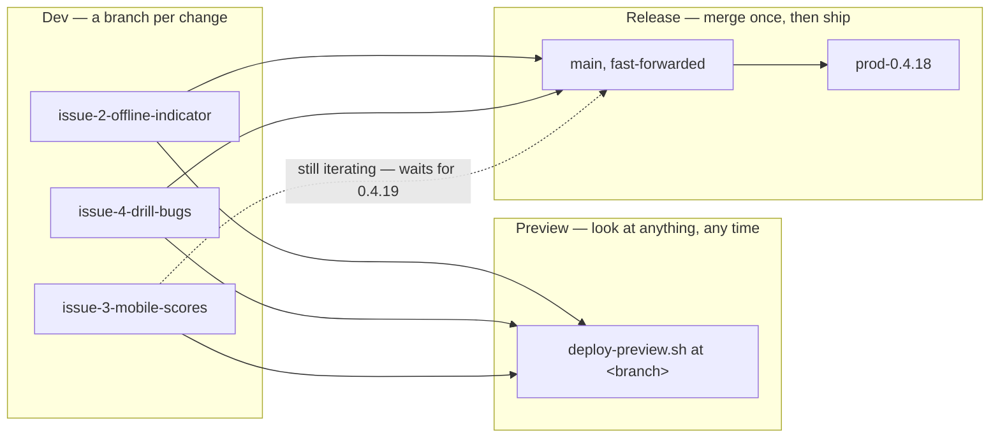

# Testing, CI & Release

Verifying a change and shipping it, end to end: automated tests and CI, a full
containerized rehearsal in the local preview environment, then the release to
production — the whole pipeline in one place, with the ordered command runbook
and a single sequence diagram below. Part of the lifecycle series — see
[docs/README.md](README.md) for the full sequence. Follows
[Development](3.2-development.md). Once a version is live,
[Production Environment & Operations](3.4-production-environment.md) covers the
running system this pipeline ships onto (container topology, secrets,
inspecting and maintaining it) — the steady state, not the release procedure.

## Running Tests

```bash
cargo test --workspace
```

Runs every crate's tests, including the `old-crates/*` prototypes (harmless — see [1.4 Roadmap](1.4-roadmap.md)'s "CLI Prototype" step). To run just one crate:

```bash
cargo test -p rules-shared    # rules/scoring/validation unit tests
cargo test -p server-game     # HTTP-level integration tests against the real Axum router
cargo test -p tile-lite-elite-ui     # move-composer logic, game-creation seat presets
cargo test -p engine-core     # engine tests
```

No test coverage for `admin-cli` (it's a thin HTTP client with no logic of its own to test in isolation) or for the WASM target specifically — `cargo test` always runs against the host target, not `wasm32-unknown-unknown`; see [Development](3.2-development.md#manual-web-client) for how to sanity-check a WASM build compiles.

## Continuous Integration

`.github/workflows/ci.yml` runs on GitHub Actions — on every push (any branch),
on pull requests, and on demand from the Actions tab. Two jobs:

**`check`** (runs on every trigger) — four steps, in order:

1. **Format** — `cargo fmt --check` on this repo's crates.
2. **Clippy** — `cargo clippy --workspace --exclude first-try --all-targets -- -D warnings`. Any clippy or compiler warning fails the build. The lint gate covers this repo's crates only; the `old-crates/*` archive is excluded (it carries pre-existing warnings that aren't maintained).
3. **Test** — `cargo test --workspace` (includes `old-crates/*`, whose tests still pass).
4. **Commit stamp** — `./scripts/check-commit-stamp.sh`, over the commits the push added. Fails a subject that doesn't carry `app <X.Y.Z> api <M.N>:`, or whose numbers disagree with that commit's own `Cargo.toml`/`API_VERSION`. It also *warns* — without failing — when a commit touches the wire surface (`crates/api/src/`, the edition registry) while leaving `API_VERSION` alone, which is the shape of a missed minor bump. Run it yourself before pushing: `./scripts/check-commit-stamp.sh origin/main..HEAD`.
5. **Wasm build** — `cargo build -p tile-lite-elite-ui --target wasm32-unknown-unknown`, so wasm-only breakage is caught even though the host-target steps above can't see it. This is a plain cargo compile of the default `web` feature, not the full `dx`/`wasm-bindgen` packaging the Docker release build runs.

**`e2e`** (Playwright, the regression pass CI owns — see [runbook step 1.c](#shipping-a-change-the-full-sequence)) — builds and starts the **preview Docker stack** (so the `dx`/`wasm-bindgen` packaging happens inside the `Dockerfile`, not on the runner), waits for `:8081/health`, then runs the `e2e/` suite against it with `PLAYWRIGHT_BASE_URL=http://localhost:8081`; the HTML report is uploaded as an artifact whenever the job wasn't cancelled — on a pass as well as a failure, since a green run's traces and timings are worth having too. Because it does a full image build, it's **gated** — only on pushes to `main`, pull requests, and manual runs — and only **after `check` passes** (`needs: check`), so a lint/test failure never burns a Docker build. On every-branch pushes, only `check` runs. Test data lives in the stack's throwaway volume (torn down with `down -v`), so no cleanup is needed on the ephemeral runner.

Notes:

- The job sets `RUSTC_WRAPPER=""` to disable the sccache wrapper that `.cargo/config.toml` configures for local dev (sccache isn't on the runner and is incompatible with wasm) while keeping that file's wasm32 rustflags.
- CI resolves the `srm-utils` git dependency (used only by `old-crates`) from the public `github.com/SteveStyle/utils` repo — no token needed as long as that repo stays public.
- CI **is** a deploy gate, not just a signal. It runs after a push, in parallel with the preview build below, and `scripts/deploy.sh` refuses any commit it hasn't passed — via `scripts/ci-status.sh`, so the check you make by hand and the one the release enforces are the same code. Its other pre-flight checks (the commit is on `origin/main`, the rehearsal host is running that same commit) guard the things CI can't see.

## Preview Environment

`docker-compose.preview.yml`, `Caddyfile.preview`, and `scripts/deploy-preview.sh` run the exact same images `scripts/deploy.sh` would ship to production, but locally (e.g. inside WSL), against their own persistent volume — the point being to catch "does this migration actually apply, does the server boot" before either ever reaches the real VM. It's a standalone compose file rather than a `docker-compose.yml` *override*: Compose's list-field merge (concatenate, not replace) makes an override an easy way to silently end up binding host ports 80/443 anyway, and the preview shape (no TLS, no domain, different host port, no cert volumes) already diverges enough from production that a full copy is clearer. See [4.1 Configuration](4.1-configuration.md#environments) for preview's place alongside the other two environments.

```bash
./scripts/deploy-preview.sh              # build + (re)start the preview stack
./scripts/deploy-preview.sh down         # stop it, keep its data
./scripts/deploy-preview.sh reset        # stop it and wipe its data
./scripts/deploy-preview.sh at <git-ref> # wipe + deploy a specific commit/tag/branch
./scripts/deploy-preview.sh at prod      # wipe + deploy whatever commit production is running
./scripts/deploy-preview.sh verify       # confirm preview is running the same version as production
```

Preview is reachable at `http://localhost:8081` — deliberately not `8080` (the local dev web server's port), so the two can run side by side. Plain HTTP, no domain, since there's nothing to provision a Let's Encrypt certificate against locally (`Caddyfile.preview` is `Caddyfile`'s same routing on a bare `:80` block instead). Its database lives on its own volume (`tile-lite-elite-preview-data`), entirely separate from production's.

**Why the volume persists across runs**: re-running `deploy-preview.sh` against an already-seeded preview DB is what actually exercises "does a new migration apply cleanly to an *existing* database" — a fresh volume would only ever apply every migration to nothing, proving much less ([4.2 Database Schema](4.2-database-schema.md)'s "Schema migrations" note has the incident history this guards against). `reset` wipes it deliberately, for when a clean slate actually is wanted. To test against a realistic copy of production data rather than whatever preview has organically accumulated, restore a production backup into `tile-lite-elite-preview-data` first, using the same backup/restore approach as [3.4 Production Environment & Operations](3.4-production-environment.md#backups) above, naming the preview volume instead.

**Every mode builds a fresh checkout of a commit** — see [Deployments build a commit, never the working tree](#deployments-build-a-commit-never-the-working-tree) below. Plain `deploy-preview.sh` builds `HEAD`; `at <ref>` builds that ref. Both go through a throwaway `git worktree` (`mktemp -d` + `git worktree add --detach`, always removed on exit — the real checkout, branch and uncommitted changes are never touched), so uncommitted work is not what gets tested. Commit first; a WIP commit is fine, since nothing here is pushed.

**`at <git-ref>`** additionally wipes the preview volume before building. Since `sqlx::migrate!("./migrations")` is a compile-time macro, the resulting image only knows about whichever migrations existed in the repo at that exact commit — a genuine "start empty, replay migrations up to here," useful for checking an old release's actual behavior or bisecting a migration chain.

**`at prod`** does the same but finds the ref itself, by reading `app_version` off `https://tileliteelite.com/health` and extracting its `+<short-sha>` suffix (override the URL with `PROD_URL`); **`verify`** does the read-only half alone, diffing preview's and production's live `app_version` with no side effects — run it before trusting preview as a stand-in for prod, in case it's quietly drifted since the last `at prod`. Both fail loudly, not silently, if production's `/health` has no `app_version` (a build made outside the deploy scripts, so it never got a commit tag).

This is also the practical answer to "can a bad migration be reverted": not in place — `sqlx::migrate!` only applies pending "up" migrations, and per the migrations `README.md`'s own rule, editing or deleting an already-applied migration file makes the server **refuse to boot** rather than undo anything. The real revert is at the volume level: wipe and redeploy at the last known-good ref, or restore a pre-migration volume snapshot.

### Why the process is shaped this way

The steps below are easy to follow and easy to "optimise" wrongly, because
each one looks individually skippable. The reasoning, so that a future
tidy-up removes the right thing:

**The seven steps are three stages, and they run at different rates.** The
runbook reads as one pass because that is how you follow it, but the stages
it groups repeat independently:

| Stage | Steps | What ends it | How often |
| --- | --- | --- | --- |
| **A — record a change** | 1.a–1.e | One atomic change, committed, pushed, and CI's verdict on it | Many times |
| **B — rehearse and judge it** | 2–5 | A build in preview that a person has actually used | Every so often — when enough functional change has accumulated to be worth looking at |
| **C — release** | 6–7 | A version live in production | Least often |

A repeats until there is something worth looking at; B repeats until there
is something worth shipping. So a production release usually carries
several preview rounds, and each of those several commits.

The consequence that matters: **B and C need not choose the same commit.**
Stage two commits, Andy then Brian; user testing likes Andy but wants more
work on Brian; C ships Andy. Nothing about that is a recovery procedure —
it is the ordinary shape of the process, and it is why `deploy.sh` takes a
ref. See [Deployments build a commit, never the working
tree](#deployments-build-a-commit-never-the-working-tree).

**CI answers "is this commit good?". The scripts answer "is the system
ready to move to this commit, and move it."** Those are different
questions, and only the second needs to know anything beyond the commit —
which is why `deploy.sh` sits above CI and consults its verdict rather than
re-running the suites. Things the scripts can do that CI structurally
cannot:

- reach the production VM at all (CI holds no credentials to it, deliberately)
- compile the workspace somewhere with enough RAM — the 1 GB VM cannot, which
  is why images are built locally and shipped rather than built in place
- find out what production is *currently* running (`deploy-preview.sh at prod`
  reads live `/health` and seeds preview from it)
- compare two running environments (`deploy-preview.sh verify`)
- write to git history (the version bump `deploy.sh` makes after a deploy)

#### Deployments build a commit, never the working tree

Both deploy scripts build a **fresh checkout of the commit they were asked
for**, in a throwaway `git worktree` that is removed on exit. Nothing on
your disk — the branch you have checked out, staged changes, a
half-finished edit — is part of a build. `deploy.sh` also ships *that
checkout's* `docker-compose.yml`, so the runtime configuration the VM gets
belongs to the code being shipped rather than to whatever your tree
currently says.

The property this buys is that **what runs in an environment is always
answerable from source control alone**. Before, "preview is running commit
X" was true only by coincidence: the build took whatever was on disk, and X
was just the label stamped on it. Both scripts patched over that by
refusing to run on a dirty tree — which made the label honest, at the cost
of forcing a WIP commit before every preview test, and still left the build
depending on the tree being in the right state at the right moment.

Building the commit directly makes the label true by construction, and a
dirty tree stops being anyone's problem. Both scripts now just say so and
carry on:

```text
==> Note: your working tree has uncommitted changes. They are NOT part of
    this deploy — 3064f4c is built from a clean checkout of that commit.
```

**This is what makes roll-forward and rollback the same operation.**
`./scripts/deploy.sh <ref>` deploys any commit; with no argument it deploys
`HEAD`. Rolling back to the previous release is `./scripts/deploy.sh
prod-0.4.12` — no branch to check out, no stash, nothing to put back
afterwards, and safe to do in the middle of unrelated work. See
[Rolling back](#rolling-back) for the two things that behave differently on
the way back.

**Preview is always in the sequence, even when the change plainly doesn't
need it.** Not because every change requires the rehearsal, but because the
alternative is a decision point — "does *this* change need preview?" — and
the failure mode of getting that wrong is silent: you skip the rehearsal
exactly when you were wrong about needing it.

It buys a second thing that is easy to miss. `deploy.sh` requires preview to
be running the **exact commit** being deployed, so any commit made after you
tested invalidates preview and forces a rebuild. That makes "just one small
fix after testing" impossible to do without noticing. The step is a ratchet,
not only a check.

The cost is two or three minutes of a machine's time. The thing it protects
is attention, which is scarcer.

**Preview runs on your machine, never on the production VM.** Sharing a host
would put a bursty workload — image loads, container starts, migrations, a
Playwright run — alongside production on 954 MB and two burstable vCPUs, and
production is already memory-bound enough that it swaps. But the deciding
argument is independence: preview exists to be somewhere things can break,
and an environment sharing production's fate cannot validate a deploy *to*
production, because one failure invalidates both readings at once. It would
stop being a check and become a correlated one.

**User testing could happen in dev**, and often does. It is listed against
preview because that is the last point where what you are looking at is
certain to be what ships.

### The four environments, and what each one is for

| | runs | for | reached by |
| --- | --- | --- | --- |
| **dev** | `cargo run` + `dx serve` on the laptop | building; fast feedback | `./scripts/services.sh` |
| **preview** | the real images, in Docker, on the laptop | *looking at it* — user testing, phone screenshots | `./scripts/deploy-preview.sh` |
| **rehearsal** | the real images, on an Oracle VM matching production | *proving the release mechanism* | `./scripts/deploy-rehearsal.sh` |
| **production** | the same, on the live VM | users | `./scripts/deploy.sh` |

Preview and rehearsal were one environment until 2026-08-02, and splitting
them is what issue #13 was for. They want opposite things. Preview must be
**fast**, because a layout change takes six rounds of feedback and each one
is a rebuild. Rehearsal must be **faithful** — remote, ssh'd to, images
shipped by `docker save`/`scp`/`docker load`, its own volume — and is
therefore slow, which does not matter because releases are far rarer than
layout tweaks. One environment optimised for the first cannot serve the
second, which is why the deploy mechanism went untested until the
2026-08-01 drill found two bugs in it.

**Only rehearsal gates a release.** `deploy.sh` refuses a production deploy
unless the rehearsal host is running that exact commit. Preview is
deliberately not a gate: a gate can check that the bits were present
somewhere, never that you looked at them and were happy, so gating on
preview adds friction while proving nothing rehearsal does not prove better.

**Why dev is not enough for user testing.** Not accessibility — dev could be
exposed too. Fidelity. Dev runs `dx serve` with a debug wasm build and the
API base URL baked in; preview and production run **Caddy** with a release
build served same-origin. There is no Caddy in dev at all, so the SPA
fallback, the compression, and the `/version.txt` bundle-hash update
mechanism — all of which are built on Caddy's behaviour — simply do not
exist there.

The files follow the names: `scripts/deploy-preview.sh`,
`docker-compose.preview.yml`, `Caddyfile.preview`, and the
`tile-lite-elite-preview-data` volume. Anything still saying "staging" is
either a pre-rendered diagram awaiting re-render, or genuinely means the
rehearsal host — the two were one environment until 2026-08-02, so old text
that says "staging" about a *release gate* means rehearsal, not preview.

### The environments, and the steps between them

Where the code lives and runs, and the runbook steps below as the arrows
between those places. Arrow labels are the command you actually type. An
arrow from a box back to itself is a step carried out there without
anything moving.


*Source: [`diagrams/release-flow.mmd`](diagrams/release-flow.mmd) — edit
that and re-render, per [`diagrams/README.md`](diagrams/README.md). It is a
pre-rendered image rather than an inline ```` ```mermaid ```` block because
it needs a layout engine GitHub's mermaid doesn't carry.*

Reading the diagram — every line means one of three things:

- **Solid arrow: code moves**, in the direction it moves. `$` marks a
  command you type; anything else happens without you.
- **Dotted arrow: an answer comes back.** A question was asked and nothing
  shipped — `curl /health`, `ci-status.sh`, `verify`.
- **The diamond is a decision on the action**, not a place. `deploy.sh`
  reaches this point and stops until both checks hold: CI green for this
  commit, and preview running this commit. That is why it belongs on the
  arrow rather than pointing at Production — the gate happens inside the
  command, before anything ships.

**Blue boxes run code; sand boxes store it.** The working tree sits in Dev,
which is why `git add`/`git commit` is a flow *out of* it into the commit
history, while building and testing act on Dev's own files and so loop back
on themselves.

**Both deployment arrows start at local git, not at Dev** — steps 3 and 6.a
leave the commit history, not the working tree. That is literal, not a
simplification: each script checks the commit out into a throwaway
`git worktree` and builds that, so Dev's current state cannot reach either
environment. It is also why deploying an older commit needs no special
handling — the arrow starts from the same place either way. See
[Deployments build a commit, never the working
tree](#deployments-build-a-commit-never-the-working-tree).

What the picture is for:

- **Only step 6 reaches production, and only from your machine.** GitHub
  never deploys: it holds no credentials to the VM. That is why the
  deployment scripts sit above CI and consult its verdict, rather than CI
  driving the release.
- **Preview is on your machine, not beside production.** The only lines
  between them carry production's version number into preview (step 2) and
  compare the two afterwards (step 7). So a preview failure cannot take
  production with it, and preview judges a release independently rather
  than sharing its fate.
- **Steps 1–5 are a loop**, run as often as the change needs. Only the pass
  that reaches step 6 is unusual, and the two gates are why: an edit after
  preview invalidates preview, so you go round again whether or not you
  meant to.

### Version numbers: which to bump, and when

Three separate checks, easy to conflate and each with a different rule.
Run through them before every commit — the third is the one that has
actually been missed in practice.

#### Check the commit subject carries both versions

Every commit subject starts `app <X.Y.Z> api <M.N>:` — the same `app`/`api`
words `GET /health` reports, so a commit and a running server speak one
vocabulary. Read both straight out of the tree rather than from memory:

```bash
grep -m1 '^version' Cargo.toml                        # app — the workspace version
grep -m1 'API_VERSION: ApiVersion' crates/api/src/lib.rs   # api — major/minor
```

Both are the *working tree's* values, which is what you are about to
commit — not what production is currently running. The app version leads
production by one — `deploy.sh` moves it there itself, at step 6.

#### Decide whether the app version moves

Usually it doesn't. The app version is bumped **once per production
release**, and `deploy.sh` does it for you the moment a deploy succeeds —
not per commit, and not at the start of a change. That is what keeps the
working tree permanently one ahead of production, so no commit is ever
built carrying a version number that is already live.

The automatic bump is a patch. For a release that deserves a **minor**
bump — new functionality rather than fixes — edit the root `Cargo.toml`
yourself afterwards; it is a single line, since the version is
workspace-inherited.

#### Decide whether the API version moves

Bump it in the same commit as the change it describes, never afterwards.

**The API version describes the wire contract. It does not deliver client
updates** — a hash of the built bundle does that, see [How a client learns
there is a new build](#how-a-client-learns-there-is-a-new-build) below.

| change | bump |
| --- | --- |
| breaking route/DTO change — an old client cannot continue | **major** |
| additive, non-breaking — old clients still work, without the new thing | **minor** |
| anything a client cannot observe on the wire | none |

**"Additive" includes a new accepted *value*.** Adding an edition to the
registry means `variant` accepts something an older client has never heard
of, which is a capability that client can now use. That is the case that has
been missed: 0.4.13 shipped the `spicy` edition at api 2.5 unchanged.

**A change to `crates/ui` alone moves nothing.** A client bug fix is not a
contract change, and until 0.4.17 it had to pretend to be one, because api
skew was the only thing that made a tab reload. That is what the bundle hash
replaced.

Record the reasoning in the comment block above `API_VERSION` while it is
fresh. Those comments are the only place the judgement calls survive.

The name is worth reading past. It was introduced on the assumption that a
client update implied an API behaviour change, and that turned out to be
false — which is why the two signals are now separate. Renaming
`API_VERSION` / `HealthDto.api_version` / the `api M.N` in commit subjects
is a wire change, so it is left alone deliberately.

#### How a client learns there is a new build

The web image writes `/version.txt` containing a **hash of the bundle's
contents** (see the Dockerfile). A tab records that id when it loads, and
after every reconnect asks again: a different id means different code is
being served, so it reloads. `watch_for_new_bundle` in `crates/ui/src/app.rs`.

Contents rather than a version number, so it changes when the client changes
and not otherwise:

- a server-only release leaves it alone, and nobody reloads for it — 0.4.16
  changed `games.rs` and nothing else, and no tab needed new code
- a client-only fix changes it, and every open tab picks the fix up without
  the api version having to lie about a contract change

A reconnect is the trigger because a deploy always drops the WebSocket, so
that is exactly when new code appears. The id is validated as plain hex
before use: Caddy's SPA fallback answers a missing `/version.txt` with
**index.html and a 200**, and treating that as an id would reload forever.

Desktop is unaffected — it has no bundle to re-fetch, so the api version
still drives its mandatory/optional update prompts.

### The change lifecycle: branch, look, merge, release

The runbook below ships *a release*. This is how changes get to it.

**A branch per separate change**, named for its issue. Not a judgement call
each time — the judgement is only whether two pieces of work are the same
change.



Three things follow, and the third is the one that costs time when missed.

**Preview is not a step towards production.** It is where you look at
something. `./scripts/deploy-preview.sh at <branch>` builds any ref with no
merge, so "show me this on my phone" and "rehearse the release" are separate
acts that happen to use the same environment. Most preview deploys are the
first kind.

**Merge once, when you decide to release.** Not to test, not to share.
Branches stay apart until there is a reason to bring them together, and that
reason is a release.

#### When to merge, and what to hold back

Testing does not require merging — `./scripts/deploy-preview.sh at <branch>`
builds any ref. Merging is only needed to test changes *together*. So there
are two questions, with two deploys:

| | asks |
| --- | --- |
| `deploy-preview.sh at <branch>` | does this one change work? |
| `deploy-preview.sh` (i.e. `main`) | does the release candidate hold together? |

> Preview a **branch** to test a change. Preview **main** to test the release
> candidate. Merge when you have decided a change ships — not to look at it.

**Small, uncontroversial changes** merge as they are finished, ready for the
next release. **Larger or controversial ones are held back** — where
*controversial* means **the change might change following review**, not that
it is risky. That is the sharper test: it is about likely rework, not
severity.

The reason the bar sits there is asymmetry. Before merge, removing a change
is `git branch -D` and `main` never saw it. After merge it is a revert —
history keeps both, which is correct but permanent. Merge is the point of no
easy return, so the bar is "confident this ships", not "want to look at it".

On 2026-08-03 six changes merged as they were finished: a tile-return fix, an
admin CLI argument, and four documentation changes — all small and
independent, so holding any back would have bought nothing. #9 and #26 are
the opposite: substantial, and likely to change following review, so they
belong on branches and previewed alone until settled.

**Merge by rebase and fast-forward, never a merge commit.** `deploy.sh`
requires preview to be running the *exact* commit being deployed. A merge
commit is a new commit that preview has never run, so it forces a rebuild
before you can ship. Fast-forward keeps the commit you tested and the commit
you release identical.

Then stage the merged result and follow the runbook. The gate enforces that
last step whether or not you remember it.

#### When to branch

> Branch when something **else** is ready to ship, or when a change looks
> likely to need more than one round of feedback.

On 2026-08-01 five finished issues sat unreleased for hours while a sixth —
the mobile scores row — iterated on top of them on `main`. Six rounds of
feedback from a phone, each a fresh commit, each invalidating preview and
re-running CI for five changes that were already done. That change met both
halves of the trigger within ten minutes of starting.

A doc typo does not need a branch. Anything you would want user-tested does.

#### Tracking a change to production

`Refs #N` in the commit, never `Closes #N`. `Closes` fires when a commit
reaches the default branch — which, committing straight to `main`, is the
moment the code is *written*. Issues went green while still unreleased,
which is the one thing this tracking exists to distinguish.

| | means |
| --- | --- |
| **issue** open/closed | is the work done |
| **milestone** open/closed | has it reached production |

Issues are assigned to a milestone named for the release. `deploy.sh` closes
that milestone and its issues on a successful deploy, and opens the next
one, so a closed issue means live rather than merged. `git tag --contains
<sha>` answers the same question at commit level.

Version-bump commits need no issue.

**Removing a change that fails**: before merge, delete the branch — main
never saw it, and there is nothing to undo. After release, `git revert`;
history keeps both, which is correct, because production ran that code.

#### The six types of change

Every issue carries exactly one type label. The type is descriptive, so a
change classifies itself rather than needing a test applied to it, and it
says what the change *owes* before it can ship.

**The first three do not change the app; the last three do.** That single
line settles the awkward cases: fixing a bug in `deploy.sh` is a tooling
change, not a defect fix, because the app is untouched.

| type | label | how it ships |
| --- | --- | --- |
| documentation | `documentation` | merge — no deployment exists for `docs/**` |
| non-production tooling | `non-prod-tooling` | deploy to the non-production environments, smoke-test them |
| production tooling | `prod-tooling` | the full release path — see below |
| defect fix | `bug` | the full release path |
| minor functional change | `minor-function` | the full release path |
| major functional change | `major-function` | a design note in `docs/2.x` *first*, then the full release path |

#### Evidence follows what the change does, not its type

The type decides **how a change ships** — which environments, which gates,
whether a design note comes first. It does not decide **what would convince
you the change works**. Name that in the issue when you raise it.

| a change that… | owes |
| --- | --- |
| alters a layout | eyes on it, at the sizes that matter |
| alters concurrency or capacity | load, in the rehearsal environment |
| fixes a defect | a test that fails before the fix and passes after |
| changes the schema | a migration applied to production's data, not an empty volume |
| changes the wire contract | a client built against the old version, still working |

The table above used to say a `minor-function` change owes "user testing on
the real artifact", and #11 showed why that is wrong. It bounded password
hashing and moved it off the async runtime — a person clicking through the UI
sees **identical behaviour whether it works or not**, because the difference
only appears under concurrency. User testing there would have produced a tick
against a box while proving nothing. What it actually owed was load: sixty
simultaneous logins against the rehearsal host, checking that `/health` kept
answering and that a refusal arrived as `503` with `Retry-After` rather than
a stalled connection.

Inheriting evidence from a label is how a change gets verified in a way that
cannot fail. Naming it per change is how it gets verified in a way that can.

GitHub's own `documentation` and `bug` are reused rather than duplicated,
with their descriptions amended. Its `enhancement` is deliberately *not*
used: it occupies the same slot as `minor-function` and `major-function` and
collapses the distinction between them, which is the one that decides
whether a design note is owed. The remaining defaults — `good first issue`,
`help wanted`, `question` — are collaboration signals rather than types, so
they coexist with a type label instead of competing with one.

**Why production tooling takes the full path despite not changing the app.**
`deploy.sh`, `deploy-preview.sh` and `rollback.sh` are not in the image, and
they still get every gate. They do not run *in* production; they act *on*
it. A defect there does not break the site directly — it lets a bad change
reach production, or removes your ability to release or roll back at the
moment you need it. That is exactly the class of bug the 2026-08-01 drill
found, and exactly why finding it needed a real deploy rather than a smoke
test.

**The test is about behaviour, not delivery.** Ask:

> Does it change what production does **on its own** — or only what happens
> when somebody **runs** something?

The app is what runs unattended and serves users: `server-game`, `ui`, and
`Caddyfile`, which configures a web server that runs continuously. Everything
that does nothing until invoked is tooling: `deploy.sh`, `rollback.sh`,
`seed-rehearsal.sh`, `status.sh` — and `admin-cli`, **wherever its binary
happens to live**. A tool is a tool wherever it lives.

An earlier version of this asked whether something shipped in the image. That
is checkable, and wrong at the edge: `admin-cli` ships in the image and is
plainly tooling. Where a thing is *delivered* says nothing about whether it
*acts*.

The image contents are still worth knowing, as supporting evidence rather
than as the test — it copies `crates`, `Cargo.toml`, `Cargo.lock`, `.cargo`,
`old-crates` and `Caddyfile`, and nothing else, which is why `docs/` and
`scripts/` cannot possibly affect a running production.

**And the label decides evidence and process, not deployment.** `admin-cli`
is `prod-tooling` and still ships in the image, so it releases exactly as an
app change would. Type answers "what would convince me this works"; it does
not answer "does this need deploying".

#### Closing an issue: use the reason, not a label

GitHub has a native field for this — `stateReason`, carrying `COMPLETED`,
`NOT_PLANNED` or `DUPLICATE` — which is structured data attached to the
close event rather than a tag added and removed by hand.

The default labels that duplicated it (`duplicate`, `invalid`, `wontfix`)
were deleted for that reason: two mechanisms for one fact is how they drift
apart. `invalid` and `wontfix` both map to `not planned`, and the
distinction between them belongs in the closing comment, where it can say
something specific.

```bash
gh issue close <N> --reason completed        # the work shipped
gh issue close <N> --reason "not planned"    # decided against, superseded
```

`DUPLICATE` is set from the web UI's close button; the CLI does not offer it.

There is no third state field. An issue is open or closed, a closure carries
a reason, and a milestone says whether it reached production. Anything
richer would have to be *stored* — a Projects board's custom `Status` field
is the usual answer — and storing status is what `scripts/status.sh` exists
to avoid: a derived view cannot drift, a field you forget to update can.

GitHub's native **Issue Types** would replace the six type labels with a
first-class field, but it is an organization-level feature and this is a
personal repository, so labels are the mechanism available.

#### Documentation is owed by every type, not just its own

The `documentation` label means *the whole change is documentation*. It is
not how documentation normally gets written.

> A change is not done until the documentation it invalidated has been
> updated, **in the same commit**.

Never a follow-up issue. `docs/4.3-api-schema.md` sat declaring API 2.4 for
five bumps because each change left its own doc update for later, and later
never came for any of them.

Documentation-typed changes come in two shapes with the same process and
different delivery: anything under `docs/` ships nowhere, while a doc comment
in `crates/**` rides the next release and changes the bundle hash like any
other source edit.

#### One change, one type — split the issue otherwise

An issue becomes two when it **touches both tooling and the app**, or when
it **will be two releases**. The second half is the one that gets missed:
two releases means two changes even when the type is identical.

**Deferred work is a second release, so it is a second issue.** If part of a
change cannot be finished and the rest should not wait, raise the new issue
**before merging** — not after the release has closed the old one.

> Never milestone an issue with outstanding work. The milestone means
> "reached production", and `deploy.sh` closes every issue in it on release.

The tell is a commit message or issue comment saying "left deliberately" or
"tracked as a follow-up" with no issue number beside it: a split that has
been described but not made. #35 shipped that way — its diagram render was
deferred, the automation closed it, and the published picture disagreed with
the prose beside it until #46 finished the job.

Issues #9 and #10 are the worked example. Moving the DTO conversions to where a
client can reach them is `major-function` and ships on its own; the bot
harness that then becomes possible is `non-prod-tooling`. One issue for
each, with the dependency recorded, rather than one issue that is half of
each.

### Shipping a change: the full sequence

**Five commands.**

```bash
git add -A && git commit -m "app 0.4.21 api 2.9: ..."   # 1  record it
git push origin main                                     # 2  hand it to CI
./scripts/deploy-preview.sh                              # 3  look at it
#                                                        # 4  use it yourself
./scripts/deploy-rehearsal.sh                            # 5  rehearse it
./scripts/deploy.sh                                      # 6  ship it
```

Everything else the release needs — waiting for CI, snapshotting the
database, applying migrations as their own step, smoke-testing the result,
tagging what shipped, moving the dev version on — happens inside those. You
do not type them and cannot forget them.

The division of testing is the reason the shape holds:

| | where | what it answers |
| --- | --- | --- |
| unit tests | while making the change | does the piece I wrote work |
| technical + regression | CI, after the push | did I break anything that used to work |
| user testing | preview, step 4 | does it do what was actually wanted |
| the release mechanism | rehearsal, step 5 | does deploying it actually work |

#### Step 1 — record the change

One atomic change per commit, with the version stamp first — see
[Version numbers](#version-numbers-which-to-bump-and-when). Build it, run
it and unit-test it before committing; that is part of making a change, not
a stage after it.

```bash
cargo build --workspace
./scripts/services.sh restart      # refreshes server *and* web client
cargo test --workspace
```

`services.sh restart` kills whatever holds `:3000`/`:8080`, including an
orphan the PID file doesn't know about. A stale server is silent and
costly: a rebuilt client against an old one fails with cryptic wire-type
errors that look like a code bug and aren't.

#### Step 2 — push, and let CI judge it

`git push origin main` starts CI. You do not need to watch it — `deploy.sh`
waits for the verdict and refuses a commit that hasn't passed, using the
same script you would run by hand. To ask early anyway:
`./scripts/ci-status.sh --wait`.

#### Step 3 — look at it on preview, then use it

`./scripts/deploy-preview.sh` builds a fresh checkout of `HEAD` and waits
until it actually answers before claiming success. Then open
`http://localhost:8081` and *use the change*.

This is the functional pass, and it is the one thing no script can do.
Correctness and regressions were CI's job and are already answered. It
happens on preview rather than in dev because preview is the last point
where what you are looking at is certainly what ships — same container,
same build, same migration path.

If something is wrong, fix it and start again from step 1. The new commit
invalidates the rehearsal host, and the deploy will refuse until you have redeployed it.

#### Step 5 — rehearse the release

```bash
./scripts/deploy-rehearsal.sh
```

The same script, the same images and the same steps production gets, against
a machine built to match it. This is not another look at the change — that
was step 3. It is the only test of the **mechanism**: `docker save`, the
transfer, `docker load`, the `:previous` retag, the database snapshot,
migrations as their own step, the smoke test.

**`deploy.sh` refuses without it.** The gate reads the rehearsal host's
`/health` and requires the exact commit you are about to ship. Skipping this
step does not produce a riskier release; it produces a release that stops at
the gate.

Nothing here is a release: no `prod-*` tag, no version bump, no milestone
closed. The output says so on every run.

#### Production — ship it

```bash
./scripts/deploy.sh                # HEAD
./scripts/deploy.sh <commit-ish>   # or a specific commit — see Rolling back
```

It refuses on four counts: the commit must be **on the remote**, **CI must
have passed** for it, production's database must not have **moved past the
schema** this build knows, and **preview must be running it**. Needs `gh`
authenticated.

Then, without being asked: snapshot the database, apply migrations as a
separate step so a failure there is not an outage, swap the containers,
smoke-test the public URL for the exact version, tag the deployed commit
`prod-<version>`, and move the dev version one patch ahead. If the
migrations or the smoke test fail it calls `scripts/rollback.sh` itself.

`DEPLOY_SKIP_CI=1` bypasses the CI gate for a genuine emergency where
GitHub itself is the problem — not as a way around a failing test.

#### When you need more

Everything below is diagnostic or occasional. None of it is part of a
normal release.

| | |
| --- | --- |
| `./scripts/ci-status.sh --wait` | ask CI's verdict early |
| `./scripts/deploy-preview.sh at <ref>` | wipe preview and build a specific commit |
| `./scripts/deploy-preview.sh at prod` | seed preview from production's live commit — do this before testing a **migration**, so it runs against production's schema rather than an empty volume |
| `./scripts/deploy-preview.sh verify` | confirm preview and production match |
| `./scripts/deploy-preview.sh reset` | wipe preview's database |
| `./scripts/rollback.sh` | list snapshots and the rollback image |
| `./scripts/check-commit-stamp.sh origin/main..HEAD` | check version stamps before pushing |
| `./scripts/status.sh` | where every open change is, and what each environment is running |

`status.sh` is a **view, not a tracking system** — it stores nothing, so
there is nothing to keep up to date and nothing that can drift. Every column
is derived: issue open/closed is "is the work done", milestone open/closed is
"has it reached production", a branch named `issue-<N>-*` is "is anyone on
it", and `git merge-base --is-ancestor <branch> origin/main` is "is it merged
and waiting for a release". Its one dependency is the branch naming
convention: a branch not named `issue-<N>-*` leaves its issue reading "not
started", which is deliberate — that is the signal the convention slipped,
and papering over it would remove the only warning.

### Rolling back

Deploying an earlier release is the same command with a ref, and needs no
preparation of your working tree — you can do it mid-change:

```bash
./scripts/deploy-preview.sh at prod-0.4.12   # re-stage it first — always
./scripts/deploy.sh prod-0.4.12              # ship it
```

**Preview is re-deployed first, even though that commit has already been
staged once.** This is the [B/C stage
split](#why-the-process-is-shaped-this-way) in practice: stage Andy, stage
Brian, decide Brian needs rework and Andy should ship. Andy was already
rehearsed, so a second pass proves nothing new — but the rule is that
**production only ever moves to the commit preview currently holds**, and a
rule with no exceptions is worth more than the two minutes it costs. The
alternative is a judgement call ("do I need to re-stage *this* one?") whose
wrong answer is silent. `deploy.sh` enforces it rather than trusting it: the
rehearsal gate compares `/health` against the commit you asked for, so
skipping the re-stage fails the deploy rather than shipping something
untested.

It is also not merely ceremonial when moving backwards — see [Rolling back
across a migration](#rolling-back-across-a-migration) for what `at` does
that a plain re-run would not.

The gates are the same ones, applied to that commit. Two behave differently
on the way back, both deliberately:

**CI may have to be re-run for the target commit.** CI's
`cancel-in-progress` concurrency rule cancels a run when a newer push
supersedes it, and a cancelled run is not a pass — the commit was never
judged. Releases you actually deployed will have passed (that was gate two
at the time), but an arbitrary older commit may not have. `ci-status.sh`
accepts a success from *any* run for the commit, not just the newest, so
re-running is the fix; it prints the exact `gh run rerun` command when it
hits this.

**The version bump is skipped.** After a rollback your branch tip is
already ahead of what is now in production, and bumping again would claim a
release that never happened — the version to move on from is the newest
one, not the one just redeployed. The script says which case it took:

```text
==> Deployed 0.4.12 from an earlier commit, so leaving the version alone.
    Your branch (main) is already ahead of what's now in production.
```

The `prod-*` tag is still written, since a rollback is a deploy and belongs
in the deployment log. If that version already carries a tag, a UTC
timestamp is appended rather than moving the existing one — the first
deploy of that version is a fact worth keeping.

#### Rolling back across a migration

**Migrations only run forward, and an older image will not start against a
newer database.** On startup `Migrator::run` validates that every migration
*recorded in the database* is one the binary knows about. It isn't lenient
by default (`ignore_missing: false`), so an image that lacks a migration the
database has applied fails with `VersionMissing(<version>)` and **does not
boot**. Nothing is corrupted; it simply refuses.

There is no `undo` to reach for. These are forward-only migrations — no
`.down.sql` files exist, deliberately. A down script restores *shape* but
never *data* (`drop column notes` destroys what was in it, and nothing can
bring it back), so it would be a way out that looks real right up until it
is needed.

**The mechanism is a snapshot instead.** `deploy.sh` copies the production
database before every deploy — server stopped first, so SQLite's WAL is
quiesced and the copy is consistent — and keeps the most recent few
(`SNAPSHOT_KEEP`, default 5):

```text
snapshots/pre-0.4.13-fb36f50-20260731T164500Z.tgz
```

The name records the version and commit that were live *before* that
deploy. To go back past a migration, restore the snapshot and then deploy
the matching older image:

```bash
./scripts/rollback.sh                    # list snapshots and the :previous image
./scripts/rollback.sh pre-0.4.13-...tgz  # database + images back, in one step
```

That restores the previous images *and* the database together, because
neither works alone: old code against a new schema won't boot, and a new
build against an old database is the same mismatch the other way round.
`deploy.sh` keeps the last images tagged `:previous` on the VM, so this is
a retag rather than a rebuild.

**This discards everything written since the snapshot** — every game, move
and account. That is the accepted trade, and it rests on an assumption
worth stating: a rollback happens *immediately*, when the release is
minutes old and the lost writes are the few games played in that window.
It is not a way to recover last week.

**You are told before it bites, not after.** `deploy.sh` compares
production's live `schema_version` (from `/health`) against the highest
migration in the target commit's tree, and refuses rather than shipping a
container that would die on startup:

```text
error: production's database is at migration 7, but a1c9f02 only knows up to 6.
       That image would fail sqlx's startup check and never boot.
```

Preview has the same hazard and a blunter answer: `deploy-preview.sh at
<ref>` wipes its volume before building, so stepping backwards there always
works. That wipe is load-bearing for a backwards re-stage, not a
convenience — preview's database would otherwise still hold the newer
migration.

One boundary follows from all this: **a rollback needs no snapshot at all
as long as the target isn't behind a migration production has applied.** In
the Andy/Brian case it isn't, because Brian never reached production — its
migration only ever ran in preview. Most rollbacks are that case.

### The pipeline at a glance

The whole flow above as one sequence — numbers match the runbook steps. `deploy.sh`'s internal build-and-ship (build locally → `scp` → `docker load` → `up -d` → `sqlx migrate`) is a single step here, as is the version bump it now performs itself; it's spelled out in [How `deploy.sh` ships an image](#how-deploysh-ships-an-image) below.


### How `deploy.sh` ships an image

Step 6 of the runbook above is a single `./scripts/deploy.sh`; here's what it does under the hood. The live VM has 1GB RAM — not enough to compile the Rust/wasm workspace — so images are always built locally and shipped over, never built on the VM itself:

```bash
./scripts/deploy.sh              # HEAD
./scripts/deploy.sh <commit-ish> # a specific commit, tag or branch
```

**The gates**, in order, each refusing rather than warning:

| Gate | Question | Why the scripts, not CI |
| --- | --- | --- |
| `origin/main` | Is this commit on the remote? | If this machine were lost, what's in production must still be reproducible from source control. Asked as `git merge-base --is-ancestor <commit> origin/main` — the property that matters directly, rather than via the current branch's upstream, which a commit reached by tag or SHA doesn't have at all |
| CI | Did CI pass for **this exact commit**? | Delegated to `scripts/ci-status.sh`, so the check made by hand at 1.e and the one enforced here are the same code and cannot answer differently |
| Rehearsal | Is the [rehearsal host](#the-four-environments-and-what-each-one-is-for) running that same commit? | Read from its `/health`. Catches the easy-to-miss case: rehearse commit A, commit a "quick fix" B, deploy — without this, B ships having been rehearsed nowhere |

Note what is *not* a gate: the state of your working tree. The build is a
fresh `git worktree` checkout of the target commit, so uncommitted changes
can neither ship nor block — see [Deployments build a commit, never the
working tree](#deployments-build-a-commit-never-the-working-tree).

**The sequence**, once the gates pass. The ordering is the point: everything destructive happens after a snapshot, and the schema change is proved before the new build becomes the server.

| Step | What | Why here |
| --- | --- | --- |
| 1 | Build both images from the worktree, `docker save`, gzip, `scp` with that checkout's `docker-compose.yml` | A few minutes, almost all of it the local build |
| 2 | Retag the live images `:previous` | Before `docker load` moves `:latest`. Otherwise the old image goes dangling and the prune destroys it — which is what made rollback a rebuild |
| 3 | `docker compose stop server`, then tar the volume to `snapshots/` | Stopped first so SQLite's WAL is quiesced and the copy is consistent |
| 4 | `docker compose run --rm server --migrate-only` | **The schema change on its own.** Fail here and the deploy aborts with the previous version still installed, instead of taking the site down |
| 5 | `docker compose up -d`, prune, trim snapshots to `SNAPSHOT_KEEP` | The swap. Prune now removes the generation `:previous` just displaced, keeping exactly two |
| 6 | Poll `$PROD_URL/health` for the expected `app_version` | End to end — DNS, TLS, Caddy, server. Fails → automatic rollback |

Configurable via env vars (`DEPLOY_HOST`, `DEPLOY_USER`, `DEPLOY_SSH_KEY`, `DEPLOY_REMOTE_DIR`, `PROD_URL`, `SNAPSHOT_KEEP`) if the target ever changes — see the script header.

**Why step 4 exists.** Migrations otherwise run as a side effect of the server starting, which fuses two questions that want separate answers: *does the schema change work* and *does the new version serve traffic*. Fused, a bad migration is an outage — the old container has already been replaced, and the new one exits, restarts, exits, behind a Caddy that can only return 502. Asked separately, nothing has been swapped in yet and the deploy just stops. SQLite's transactional DDL means the database is unchanged either way; what step 4 buys is that the *site* is unchanged too.

**Why the smoke test checks the version, not just a 200.** A container that never restarted would answer perfectly well. Requiring `app_version` to equal `<version>+<sha>` is what makes it a test of *this* deploy rather than of the site in general.

**Afterwards**, it tags the deployed commit and (rolling forward only) bumps the dev version — both covered under runbook step 6 above.

Deployment itself stays a manual, on-demand scp/load push from a developer machine — no registry, no build-on-push — which suits a hobby project's actual deploy frequency. CI is a *gate* on that push, not the mechanism of it. Worth revisiting (push to a registry, `docker compose pull` on the VM instead of scp/load) if the frequency ever changes.

Schema changes ship via real, versioned migrations that apply automatically the moment the new server starts — **wiping the database is no longer a normal part of shipping a schema change** (see [4.2 Database Schema](4.2-database-schema.md)'s "Schema migrations" note for why this used to be necessary and isn't anymore). For the rare genuine "start over" case, see [3.4 Production Environment & Operations](3.4-production-environment.md#wiping-production).
