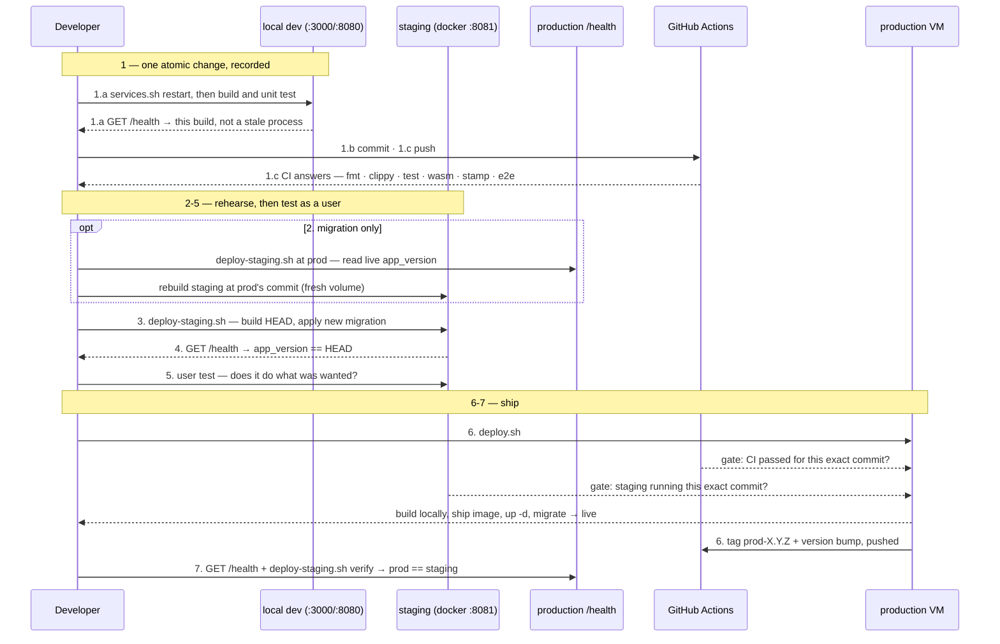

# Testing, CI & Release

Verifying a change and shipping it, end to end: automated tests and CI, a full
containerized rehearsal in the local staging environment, then the release to
production — the whole pipeline in one place, with the ordered command runbook
and a single sequence diagram below. Part of the lifecycle series — see
[docs/README.md](README.md) for the full sequence. Follows
[Development](3.2-development.md). Once a version is live,
[Production Environment & Operations](3.4-production-environment.md) covers the
running system this pipeline ships onto (container topology, secrets,
inspecting and maintaining it) — the steady state, not the release procedure.

## Running Tests

```bash
cargo test --workspace
```

Runs every crate's tests, including the `old-crates/*` prototypes (harmless — see [1.4 Roadmap](1.4-roadmap.md)'s "CLI Prototype" step). To run just one crate:

```bash
cargo test -p rules-shared    # rules/scoring/validation unit tests
cargo test -p server-game     # HTTP-level integration tests against the real Axum router
cargo test -p tile-lite-elite-ui     # move-composer logic, game-creation seat presets
cargo test -p engine-core     # engine tests
```

No test coverage for `admin-cli` (it's a thin HTTP client with no logic of its own to test in isolation) or for the WASM target specifically — `cargo test` always runs against the host target, not `wasm32-unknown-unknown`; see [Development](3.2-development.md#manual-web-client) for how to sanity-check a WASM build compiles.

## Continuous Integration

`.github/workflows/ci.yml` runs on GitHub Actions — on every push (any branch),
on pull requests, and on demand from the Actions tab. Two jobs:

**`check`** (runs on every trigger) — four steps, in order:

1. **Format** — `cargo fmt --check` on this repo's crates.
2. **Clippy** — `cargo clippy --workspace --exclude first-try --all-targets -- -D warnings`. Any clippy or compiler warning fails the build. The lint gate covers this repo's crates only; the `old-crates/*` archive is excluded (it carries pre-existing warnings that aren't maintained).
3. **Test** — `cargo test --workspace` (includes `old-crates/*`, whose tests still pass).
4. **Commit stamp** — `./scripts/check-commit-stamp.sh`, over the commits the push added. Fails a subject that doesn't carry `app <X.Y.Z> api <M.N>:`, or whose numbers disagree with that commit's own `Cargo.toml`/`API_VERSION`. It also *warns* — without failing — when a commit touches the wire surface (`crates/api/src/`, the edition registry) while leaving `API_VERSION` alone, which is the shape of a missed minor bump. Run it yourself before pushing: `./scripts/check-commit-stamp.sh origin/main..HEAD`.
5. **Wasm build** — `cargo build -p tile-lite-elite-ui --target wasm32-unknown-unknown`, so wasm-only breakage is caught even though the host-target steps above can't see it. This is a plain cargo compile of the default `web` feature, not the full `dx`/`wasm-bindgen` packaging the Docker release build runs.

**`e2e`** (Playwright, the regression pass CI owns — see [runbook step 1.c](#shipping-a-change-the-full-sequence)) — builds and starts the **staging Docker stack** (so the `dx`/`wasm-bindgen` packaging happens inside the `Dockerfile`, not on the runner), waits for `:8081/health`, then runs the `e2e/` suite against it with `PLAYWRIGHT_BASE_URL=http://localhost:8081`; the HTML report is uploaded as an artifact whenever the job wasn't cancelled — on a pass as well as a failure, since a green run's traces and timings are worth having too. Because it does a full image build, it's **gated** — only on pushes to `main`, pull requests, and manual runs — and only **after `check` passes** (`needs: check`), so a lint/test failure never burns a Docker build. On every-branch pushes, only `check` runs. Test data lives in the stack's throwaway volume (torn down with `down -v`), so no cleanup is needed on the ephemeral runner.

Notes:

- The job sets `RUSTC_WRAPPER=""` to disable the sccache wrapper that `.cargo/config.toml` configures for local dev (sccache isn't on the runner and is incompatible with wasm) while keeping that file's wasm32 rustflags.
- CI resolves the `srm-utils` git dependency (used only by `old-crates`) from the public `github.com/SteveStyle/utils` repo — no token needed as long as that repo stays public.
- CI is a signal, not a deploy gate: it runs *after* a push, in parallel with the local staging rehearsal below. `scripts/deploy.sh`'s own pre-flight checks (clean tree, pushed HEAD, staging on the same commit) remain the actual guard before production.

## Staging Environment

`docker-compose.staging.yml`, `Caddyfile.staging`, and `scripts/deploy-staging.sh` run the exact same images `scripts/deploy.sh` would ship to production, but locally (e.g. inside WSL), against their own persistent volume — the point being to catch "does this migration actually apply, does the server boot" before either ever reaches the real VM. It's a standalone compose file rather than a `docker-compose.yml` *override*: Compose's list-field merge (concatenate, not replace) makes an override an easy way to silently end up binding host ports 80/443 anyway, and the staging shape (no TLS, no domain, different host port, no cert volumes) already diverges enough from production that a full copy is clearer. See [4.1 Configuration](4.1-configuration.md#environments) for staging's place alongside the other two environments.

```bash
./scripts/deploy-staging.sh              # build + (re)start the staging stack
./scripts/deploy-staging.sh down         # stop it, keep its data
./scripts/deploy-staging.sh reset        # stop it and wipe its data
./scripts/deploy-staging.sh at <git-ref> # wipe + deploy a specific commit/tag/branch
./scripts/deploy-staging.sh at prod      # wipe + deploy whatever commit production is running
./scripts/deploy-staging.sh verify       # confirm staging is running the same version as production
```

Staging is reachable at `http://localhost:8081` — deliberately not `8080` (the local dev web server's port), so the two can run side by side. Plain HTTP, no domain, since there's nothing to provision a Let's Encrypt certificate against locally (`Caddyfile.staging` is `Caddyfile`'s same routing on a bare `:80` block instead). Its database lives on its own volume (`tile-lite-elite-staging-data`), entirely separate from production's.

**Why the volume persists across runs**: re-running `deploy-staging.sh` against an already-seeded staging DB is what actually exercises "does a new migration apply cleanly to an *existing* database" — a fresh volume would only ever apply every migration to nothing, proving much less ([4.2 Database Schema](4.2-database-schema.md)'s "Schema migrations" note has the incident history this guards against). `reset` wipes it deliberately, for when a clean slate actually is wanted. To test against a realistic copy of production data rather than whatever staging has organically accumulated, restore a production backup into `tile-lite-elite-staging-data` first, using the same backup/restore approach as [3.4 Production Environment & Operations](3.4-production-environment.md#backups) above, naming the staging volume instead.

**`at <git-ref>`** wipes the staging volume, then builds from that ref instead of the current working tree, via a throwaway `git worktree` (`mktemp -d` + `git worktree add --detach`, always removed on exit — the real checkout/branch/uncommitted changes are never touched). Since `sqlx::migrate!("./migrations")` is a compile-time macro, the resulting image only knows about whichever migrations existed in the repo at that exact commit — a genuine "start empty, replay migrations up to here," useful for checking an old release's actual behavior or bisecting a migration chain.

**`at prod`** does the same but finds the ref itself, by reading `app_version` off `https://tileliteelite.com/health` and extracting its `+<short-sha>` suffix (override the URL with `PROD_URL`); **`verify`** does the read-only half alone, diffing staging's and production's live `app_version` with no side effects — run it before trusting staging as a stand-in for prod, in case it's quietly drifted since the last `at prod`. Both fail loudly, not silently, if production's `/health` has no `app_version` (a build made outside the deploy scripts, so it never got a commit tag).

This is also the practical answer to "can a bad migration be reverted": not in place — `sqlx::migrate!` only applies pending "up" migrations, and per the migrations `README.md`'s own rule, editing or deleting an already-applied migration file makes the server **refuse to boot** rather than undo anything. The real revert is at the volume level: wipe and redeploy at the last known-good ref, or restore a pre-migration volume snapshot.

### Why the process is shaped this way

The steps below are easy to follow and easy to "optimise" wrongly, because
each one looks individually skippable. The reasoning, so that a future
tidy-up removes the right thing:

**CI answers "is this commit good?". The scripts answer "is the system
ready to move to this commit, and move it."** Those are different
questions, and only the second needs to know anything beyond the commit —
which is why `deploy.sh` sits above CI and consults its verdict rather than
re-running the suites. Things the scripts can do that CI structurally
cannot:

- reach the production VM at all (CI holds no credentials to it, deliberately)
- compile the workspace somewhere with enough RAM — the 1 GB VM cannot, which
  is why images are built locally and shipped rather than built in place
- find out what production is *currently* running (`deploy-staging.sh at prod`
  reads live `/health` and seeds staging from it)
- compare two running environments (`deploy-staging.sh verify`)
- write to git history (the version bump `deploy.sh` makes after a deploy)

**Staging is always in the sequence, even when the change plainly doesn't
need it.** Not because every change requires the rehearsal, but because the
alternative is a decision point — "does *this* change need staging?" — and
the failure mode of getting that wrong is silent: you skip the rehearsal
exactly when you were wrong about needing it.

It buys a second thing that is easy to miss. `deploy.sh` requires staging to
be running the **exact commit** being deployed, so any commit made after you
tested invalidates staging and forces a rebuild. That makes "just one small
fix after testing" impossible to do without noticing. The step is a ratchet,
not only a check.

The cost is two or three minutes of a machine's time. The thing it protects
is attention, which is scarcer.

**Staging runs on your machine, never on the production VM.** Sharing a host
would put a bursty workload — image loads, container starts, migrations, a
Playwright run — alongside production on 954 MB and two burstable vCPUs, and
production is already memory-bound enough that it swaps. But the deciding
argument is independence: staging exists to be somewhere things can break,
and an environment sharing production's fate cannot validate a deploy *to*
production, because one failure invalidates both readings at once. It would
stop being a check and become a correlated one.

**User testing could happen in dev**, and often does. It is listed against
staging because that is the last point where what you are looking at is
certain to be what ships.

### The environments, and the steps between them

Where the code lives and runs, and the runbook steps below as the arrows
between those places. Arrow labels are the command you actually type. An
arrow from a box back to itself is a step carried out there without
anything moving.


*Source: [`diagrams/release-flow.mmd`](diagrams/release-flow.mmd) — edit
that and re-render, per [`diagrams/README.md`](diagrams/README.md). It is a
pre-rendered image rather than an inline ```` ```mermaid ```` block because
it needs a layout engine GitHub's mermaid doesn't carry.*

Reading the diagram:

- **Blue boxes run code; sand boxes store it.**
- **`$` marks something you type.** Everything else happens without you —
  `(automatic)` where a script or CI does it on your behalf.
- **Solid arrows move code; dotted arrows only ask a question.**
- **The two amber `gate:` arrows are what `deploy.sh` refuses on.** Nobody
  runs them, which is the point: they are checks the release performs on
  itself, and they are why the loop can't be short-circuited.

What the picture is for:

- **Only step 6 reaches production, and only from your machine.** GitHub
  never deploys: it holds no credentials to the VM. That is why the
  deployment scripts sit above CI and consult its verdict, rather than CI
  driving the release.
- **Staging is on your machine, not beside production.** The only lines
  between them carry production's version number into staging (step 2) and
  compare the two afterwards (step 7). So a staging failure cannot take
  production with it, and staging judges a release independently rather
  than sharing its fate.
- **Steps 1–5 are a loop**, run as often as the change needs. Only the pass
  that reaches step 6 is unusual, and the two gates are why: an edit after
  staging invalidates staging, so you go round again whether or not you
  meant to.

### Version numbers: which to bump, and when

Three separate checks, easy to conflate and each with a different rule.
Run through them before every commit — the third is the one that has
actually been missed in practice.

#### Check the commit subject carries both versions

Every commit subject starts `app <X.Y.Z> api <M.N>:` — the same `app`/`api`
words `GET /health` reports, so a commit and a running server speak one
vocabulary. Read both straight out of the tree rather than from memory:

```bash
grep -m1 '^version' Cargo.toml                        # app — the workspace version
grep -m1 'API_VERSION: ApiVersion' crates/api/src/lib.rs   # api — major/minor
```

Both are the *working tree's* values, which is what you are about to
commit — not what production is currently running. The app version leads
production by one — `deploy.sh` moves it there itself, at step 6.

#### Decide whether the app version moves

Usually it doesn't. The app version is bumped **once per production
release**, and `deploy.sh` does it for you the moment a deploy succeeds —
not per commit, and not at the start of a change. That is what keeps the
working tree permanently one ahead of production, so no commit is ever
built carrying a version number that is already live.

The automatic bump is a patch. For a release that deserves a **minor**
bump — new functionality rather than fixes — edit the root `Cargo.toml`
yourself afterwards; it is a single line, since the version is
workspace-inherited.

#### Decide whether the API version moves

Bump it in the same commit as the change it describes, never afterwards.

| change | bump |
| --- | --- |
| breaking route/DTO change — old clients cannot be trusted | **major** |
| additive, non-breaking — old clients still work, without the new thing | **minor** |
| nothing a client can observe (bug fix, perf, refactor) | none |

**"Additive" includes a new accepted *value*, not just a new type.** Adding
an edition to the registry means `variant` accepts something an older client
has never heard of. That counts, and it is the case that has been missed:
0.4.13 shipped the `spicy` edition with the API left at 2.5, so no client
ever saw skew.

That matters more than a version number usually does, because **the web
client's auto-reload keys on API skew**. Skew is the signal "there is
something new here"; leaving the version alone actively tells every open tab
there is nothing worth reloading for. They keep working, and keep being
unable to offer whatever shipped. The question to ask is *can a client
observe something it could not before?* — not *did a struct change?*

Record the reasoning in the comment block above `API_VERSION` while it is
fresh. Those comments are the only place the judgement calls survive.

### Shipping a change: the full sequence

Run every command from the repo root. Three phases: **step 1** makes one
atomic change and records it in change control, **steps 2–5** rehearse the
deploy on staging and prove the change does what was wanted, and **steps
6–7** ship it.

The division of testing is deliberate:

| | where | what it answers |
| --- | --- | --- |
| unit tests | while making the change (1.a) | does the piece I just wrote work |
| technical + regression | CI, on push (1.c) | did I break anything that used to work |
| user testing | staging (5) | does the change do what was actually wanted |

Running the suites locally is a faster inner loop, not a release gate — CI
is the gate, and `deploy.sh` refuses a commit it hasn't passed.

#### Step 1 — one atomic change, recorded

**1.a Make the change.** Includes running it and unit-testing it, because
that is part of making a change rather than a stage after it. Rebuild and
restart first so you are testing *this* code and not a process still
running an old binary:

```bash
./scripts/services.sh restart      # both server and web; restart-server = backend only
curl -s http://127.0.0.1:3000/health   # confirm the running server is your build
cargo test --workspace             # the fast inner loop
```

`services.sh restart` refreshes **both** the server and the web client, and
each `start`/`restart` kills whatever is bound to `:3000`/`:8080` — even a
hand-started or orphaned process the PID file doesn't know about. A stale
server is silent and costly: a rebuilt client against an old server fails
with cryptic wire-type errors that look like a code bug and aren't. Any new
migration applies on this restart, which doubles as its first real-data
run — watch `.logs/server.log`.

**1.b Commit it.** One atomic change per commit, with the version stamp
first — see [Version numbers](#version-numbers-which-to-bump-and-when), and
run `./scripts/check-commit-stamp.sh` if unsure:

```bash
git add -A
git commit -m "app 0.4.14 api 2.6: …"
```

**1.c Push, and wait for the answer.** Unlike the two before it, this step
has a *response*: the push starts CI, and CI either passes or fails.

```bash
git push origin main
gh run watch          # or just check back later
```

That response is what the rest of the release depends on — `deploy.sh`
(step 6) refuses a commit whose CI hasn't passed. A failure means going
back to 1.a; there is no way round it further down.

#### Staging — rehearse the deploy, and test it as a user

**2. Seed staging with production's current state** — wipes staging and
rebuilds it at whatever commit prod is running, updating database and code.
Needed when the change carries a **migration**, so it is exercised against
a real copy of production's schema rather than an empty volume — which is
the one thing CI cannot do for you. Skip it for a code-only change.

```bash
./scripts/deploy-staging.sh at prod
```

(`at prod` builds production's own commit in a throwaway worktree,
independent of your working tree.) Re-run it before re-testing a migration:
sqlx won't re-apply — or let you edit — a migration already applied to the
staging volume, so a fix needs a clean prod-state seed to exercise it.

**3. Build your commit onto the staging volume** — applies any new
migration on top of the step-2 seed (a plain run does not wipe the volume):

```bash
./scripts/deploy-staging.sh
```

**4. Confirm staging booted on your commit** — `app_version` should end in
your short SHA:

```bash
git rev-parse --short HEAD
curl -s http://localhost:8081/health | grep -o '"app_version":"[^"]*"'
```

**Do not run `verify` yet** — staging is ahead of production at this point,
so a mismatch is expected rather than an error.

**5. User test on staging** — open `http://localhost:8081` and use the
change. This is the functional pass: does it do what was actually wanted?
Technical correctness and regressions are CI's job and have already been
answered by 1.c; this asks the question no assertion can.

It happens here rather than in dev because staging is the last point where
what you are looking at is certainly what ships — same container, same
build, same migration path. If something is wrong, fix it and go back to
1.a: the new commit invalidates staging, and step 6 will refuse until you
have rebuilt it.

#### Production — ship it

**6. Deploy to production** — one command, which refuses on four counts:

```bash
./scripts/deploy.sh
```

It checks that the working tree is clean, that HEAD is pushed, that **CI
passed for this exact commit**, and that staging is running it. Needs `gh`
authenticated (`gh auth login`). `DEPLOY_SKIP_CI=1` bypasses the CI gate,
for a genuine emergency where GitHub itself is the problem — not as a way
around a failing test.

On success it **tags the deployed commit** `prod-<version>` (annotated,
pushed), so git history records what shipped: `git tag --list 'prod-*'` is
the deployment log, and `git log prod-0.4.12..prod-0.4.13` is what a given
release carried. On a name collision it appends the SHA rather than moving
the tag, since force-moving would discard the record of the earlier deploy.

It then **bumps the working tree to the next patch, commits and pushes**,
so production occupies the version just shipped and the tree stays one
ahead. That is only ever correct immediately after a successful deploy,
which is why it happens here rather than being a step to remember.
`DEPLOY_SKIP_BUMP=1` opts out.

**7. Confirm production matches** — `verify` should report a match:

```bash
curl -s https://tileliteelite.com/health | grep -o '"app_version":"[^"]*"'
./scripts/deploy-staging.sh verify
```

The app version here is the one *just shipped*; your working tree has
already moved one ahead of it.

When you're done, tear down the local staging stack (optional):

```bash
./scripts/deploy-staging.sh reset
```

Once it's live, [3.4 Production Environment & Operations](3.4-production-environment.md) covers running and maintaining it.

Both `deploy-staging.sh` and `deploy.sh` refuse to build from an uncommitted working tree, for the same reason: a build-ID label that doesn't match what's actually in the image is worse than no label at all.

### The pipeline at a glance

The whole flow above as one sequence — numbers match the runbook steps. `deploy.sh`'s internal build-and-ship (build locally → `scp` → `docker load` → `up -d` → `sqlx migrate`) is a single step here, as is the version bump it now performs itself; it's spelled out in [How `deploy.sh` ships an image](#how-deploysh-ships-an-image) below.



### How `deploy.sh` ships an image

Step 9 of the runbook above is a single `./scripts/deploy.sh`; here's what it does under the hood. The live VM has 1GB RAM — not enough to compile the Rust/wasm workspace — so images are always built locally and shipped over, never built on the VM itself:

```bash
./scripts/deploy.sh
```

`deploy.sh` refuses to run unless two things are both true: the working tree is clean (it only ever builds a real commit, never uncommitted changes — commit or stash first), and [local staging](#staging-environment) is currently up and running *that exact commit* (checked via its `/health`). The second check exists specifically to catch the easy-to-miss case: test commit A in staging, then commit a "quick fix" B before running `deploy.sh` — without this, B would ship to production having never been tested anywhere. Bring staging to HEAD first (`./scripts/deploy-staging.sh`) if either check fails.

This builds both images locally, `docker save`s and gzips them, `scp`s them plus `docker-compose.yml` to the VM, `docker load`s them there, and runs `docker compose up -d`. Takes a few minutes, almost all of it the local build. Configurable via env vars (`DEPLOY_HOST`, `DEPLOY_USER`, `DEPLOY_SSH_KEY`, `DEPLOY_REMOTE_DIR`) if the target ever changes — see the script header.

CI (`.github/workflows/ci.yml` — see [Continuous Integration](#continuous-integration)) runs the test/lint gate on push, but it is **not** part of deployment: there's no registry and no build-on-push. Deployment stays a manual, on-demand scp/load push from a developer machine, appropriate for a hobby project's actual deploy frequency. Worth revisiting (push to a registry, `docker compose pull` on the VM instead of scp/load) if that ever changes.

Schema changes ship via real, versioned migrations that apply automatically the moment the new server starts — **wiping the database is no longer a normal part of shipping a schema change** (see [4.2 Database Schema](4.2-database-schema.md)'s "Schema migrations" note for why this used to be necessary and isn't anymore). For the rare genuine "start over" case, see [3.4 Production Environment & Operations](3.4-production-environment.md#wiping-production).
