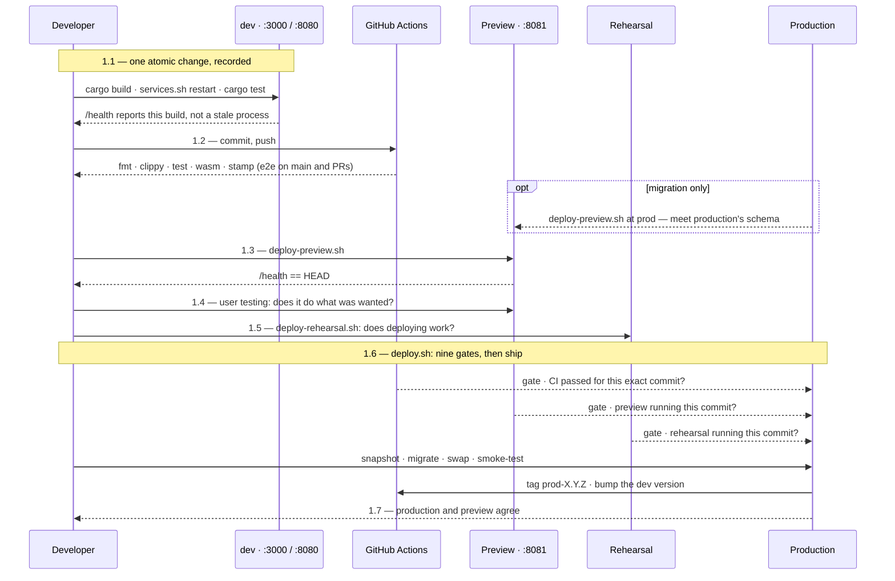
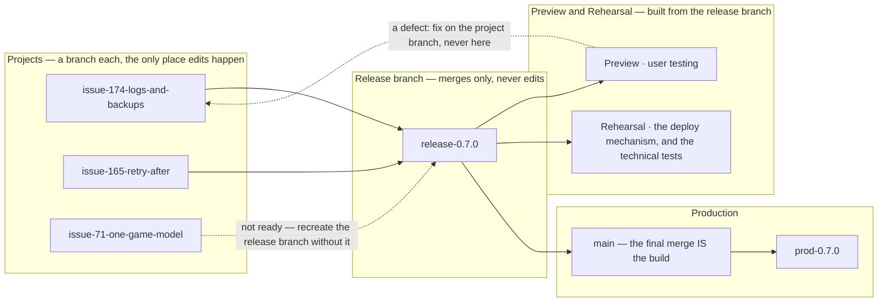

# Testing, CI & Release

Verifying a change and shipping it, end to end. Four environments, each
answering a different question:

| | asks |
| --- | --- |
| **dev** | does the code I am writing work? |
| **preview** | does the change do what was wanted? |
| **rehearsal** | does *deploying* it work? |
| **production** | — |

Plus CI, which asks whether anything that used to work still does.

**Three parts, and you probably want one of them.**

| part | for | holds |
| --- | --- | --- |
| **[What to type](#1-what-to-type)** | executing the process | the diagram, the steps, the exact commands, and what proves each one worked |
| **[The process, and why it is shaped this way](#2-the-process-and-why-it-is-shaped-this-way)** | understanding it | the environments, the three axes, the rules, and what each is for |
| **[Notes and incidents](#3-notes-and-incidents)** | when something surprises you | the failures that produced each rule, and the traps |

Nothing in part 1 explains itself; nothing in parts 2 and 3 is needed to ship a
change. Material is repeated between them where repeating it saves a jump.

## 1 What to type

Commands only. Every step says where it runs, what to type, and what proves it
worked. The reasoning is in [The process, and why it is shaped this
way](#2-the-process-and-why-it-is-shaped-this-way); the failures that produced
each rule are in [Notes and incidents](#3-notes-and-incidents) — steps 1.1 to
1.6 each have one, under [3.1 Notes on shipping a
change](#31-notes-on-shipping-a-change).

**Where these run.** Everything below runs on the development machine, in the
repository root, unless it says otherwise:

```bash
cd ~/tile-lite-elite
```

The exceptions are the two that reach a running box. They are the *only* way to
see container logs or the live database — `scripts/admin.sh` deliberately does
not reach production:

```bash
ssh tile-lite-elite            && cd ~/tile-lite-elite   # production VM
ssh tile-lite-elite-rehearsal  && cd ~/tile-lite-elite   # rehearsal VM
```

**The pipeline at a glance.** The same seven steps twice: once by **place**,
once by **time**. Numbers are the section numbers below, so a diagram and the
text can be read together.




**The steps, one line each.**

**Shipping a change** — seven steps, in order:

| | step | one line |
| --- | --- | --- |
| **1.1** | record the change | build, restart dev, unit-test, commit with the version stamp |
| **1.2** | push | CI's verdict is a deploy gate, not a signal |
| **1.3** | deploy to the preview environment | the same images production will get, locally |
| **1.4** | user testing | the one judgement no script makes |
| **1.5** | rehearse the release, and run the technical tests | the only test of the release *mechanism*, and where a claim no person can judge is asserted by a script |
| **1.6** | ship it | `deploy.sh` — nine gates, then snapshot, migrate, swap, smoke-test, tag, bump |
| **1.7** | verify what is live | production and preview report the same version |

**A release branch** — normal, and only where changes are grouped:

| | step | one line |
| --- | --- | --- |
| **1.8** | keep a version branch current | forward-merge after every release, and at scope close |
| **1.9** | release a version branch | merge first, fast-forward, then 1.3 – 1.7 |
| **1.10** | delete a branch once its change is live | merged means done, not deployed |

**When something is wrong** — not part of a normal release:

| | step | one line |
| --- | --- | --- |
| **1.11** | roll back production | go back to a release that worked |
| **1.12** | roll back across a migration | database and images together, or the container will not boot |
| **1.13** | ship an emergency change | only when going back cannot help |

**Asking a question**, changing nothing:

| | step | one line |
| --- | --- | --- |
| **1.14** | diagnostics | what is where, what is outstanding, what is broken |

**Which steps a change needs depends on its release attribute**, which comes from
the issue's type — see [Classifying a
change](#2914-classifying-a-change-type-release-route):

| release | steps |
| --- | --- |
| **merge** — documentation and tooling, live when it reaches `main` | 1.1, 1.2, then merge. No release, so no 1.3 – 1.7 |
| **fasttrack** — a patch shipped on its own, from `main` | 1.1 – 1.7 |
| **minor / major** — grouped into a version branch | 1.1, 1.2 on the branch; then 1.8, 1.9, and 1.3 – 1.7 for the release |
| **emergency** — production is broken now | 1.11 first; 1.13 only if that cannot help |

### 1.1 Record the change

**Where:** development machine, repository root.

One atomic change per commit, with the version stamp first. Build, run and
unit-test before committing — that is part of making the change, not a stage
after it.

```bash
cargo build --workspace
./scripts/services.sh restart          # refreshes server *and* web client
cargo test --workspace
git add -A
git commit -m "app 0.6.3 api 2.13: what it does, and why"
```

Every subject starts `app <X.Y.Z> api <M.N>:`, matching that commit's own
`Cargo.toml` and `API_VERSION`. CI fails a commit without it; check before
pushing:

```bash
./scripts/check-commit-stamp.sh origin/main..HEAD
```

Use `Refs #N` in the body — **except where nothing else will close it, where `Closes #N` is
correct**, because nothing else will ever close it.

**Proved by:** `cargo test --workspace` exits 0, `./scripts/check-commit-stamp.sh`
exits 0, and dev is running what you just built rather than a stale process:

```bash
curl -s http://127.0.0.1:3000/health
```

### 1.2 Push, and let CI judge it

**Where:** development machine.

```bash
git push origin main                   # or the branch
```

You need not watch it — `deploy.sh` refuses a commit whose run has not passed.
To ask early:

```bash
./scripts/ci-status.sh --run push:<branch> --wait
```

**Proved by:** the command exits 0. `check` runs on every push; `e2e` runs only
on `main`, pull requests and manual runs.

### 1.3 Deploy to the preview environment

**Where:** development machine. Preview answers on `http://localhost:8081`.

```bash
./scripts/deploy-preview.sh            # build a fresh checkout of HEAD
```

**Testing a migration**, seed preview from production's live commit first, so
the migration meets production's schema rather than an empty volume:

```bash
./scripts/deploy-preview.sh at prod    # wipe, then build production's commit
./scripts/deploy-preview.sh            # then build HEAD on top of it
```

**Proved by:** the script exits 0, and `curl -s localhost:8081/health` reports
`app_version` equal to `HEAD`.

### 1.4 User testing

**Where:** a browser, at `http://localhost:8081`.

Use the change and decide whether it does what was wanted. If something is
wrong, fix it and start again from 1.1 — the new commit invalidates the
rehearsal host, and the deploy will refuse until it is redeployed.

**Proved by:** nothing mechanical. This is the judgement no script makes, and
`deploy.sh` can only check that the commit was *deployed* to preview, never
that anybody looked at it.

**When user testing is finished, the build that ships is a new one** — the
release commit, not the one that was tested. It goes round again in order:
preview (1.3), then rehearsal (1.5), then production (1.6). That is not
ceremony: the gates compare commits, so a release whose preview and rehearsal
hosts hold an earlier commit is refused, and the thing tested is genuinely not
the thing shipped once a merge or a version bump has happened since.

### 1.5 Rehearse the release, and run the technical tests

**Where:** development machine; it deploys to the rehearsal VM.

Two questions, and they are not the same one. Preview answered *does it do what
was wanted?* Rehearsal answers *does deploying it work?* and *does it behave
correctly on hardware like production's?*

#### 1.5.1 Does deploying work?

```bash
./scripts/deploy-rehearsal.sh
```

Same script and same steps production gets, against a machine built to match it.
Nothing here is a release: no `prod-*` tag, no version bump, no milestone closed.

**Proved by:** exit 0, and `deploy.sh`'s gate agreeing — it reads the rehearsal
host's `/health` and requires the exact commit being shipped.

#### 1.5.2 Does it behave correctly on production-like hardware?

**Every release answers two testing questions**, and they are answered
independently: *does this involve functional changes that require user testing?*
— which is step 1.4, on preview — and *does this involve technical changes that
require technical testing?*, which is here.

Technical testing is where a claim no person can judge by using the site is
asserted by a script, on hardware that matches production:

```bash
./scripts/check-rate-limits.sh                       # limits still refuse, and still serve everybody else
cargo run --release --example rate_limit_load        # where they trip, on rehearsal's hardware
```

**A development machine says nothing about a 2 vCPU box**, which is why these
cannot move earlier. Limits, timing, memory and headers are the shape of it.

**Both answers can be *no*, and that is the one worth catching**: a change nobody
can show works has not been tested, it has been deployed hopefully. `yes/no`
sends it to preview alone, `no/yes` to rehearsal alone, `yes/yes` to both.

**Proved by:** each script exiting 0, against the rehearsal host.

### 1.6 Ship it

**Where:** development machine. **Run it bare** — piping into `tail` reports
the *pipe's* exit status, not the script's.

```bash
./scripts/deploy.sh                    # HEAD
./scripts/deploy.sh <commit-ish>       # a specific commit — see 1.11
```

Read the milestone before deploying, because the deploy closes **every open
issue in it**, shipped or not:

```bash
gh issue list --milestone X.Y.Z --state open
```

Two escape hatches, each meaning something specific:

| | |
| --- | --- |
| `DEPLOY_SKIP_PREVIEW=1` | there was nothing for a person to look at — not "I did not look" |
| `DEPLOY_SKIP_CI=1` | GitHub itself is the problem — not a way around a failing test |

**Proved by:** exit 0. It refuses on nine counts, and on the way through it
snapshots the database, applies migrations as their own step, swaps the
containers, smoke-tests the public URL for the exact version, tags the commit
`prod-<version>` and moves the dev version one patch ahead. If migrations or
the smoke test fail it calls `rollback.sh` itself.

When it fails and the reason is not on the terminal:

```bash
ssh tile-lite-elite
cd ~/tile-lite-elite && docker compose logs --tail=50 server
```

### 1.7 Verify what is live

**Where:** development machine.

```bash
./scripts/deploy-preview.sh verify     # preview and production report the same version
./scripts/verify.sh                    # or assert the whole world, exit non-zero if not
./scripts/verify.sh --quick            # three seconds
```

**Proved by:** exit 0. `verify.sh` counts a check it could not run as a
failure, so an absent answer never reads like a passing one.

### 1.8 Keep a version branch current

**Where:** development machine. **After every release, and once more when the
release's scope closes.** Merges flow one way — from the faster queue into the
slower ones:

```bash
git checkout 0.7.0
git merge main
git push
```

The version line conflicts every time. **Keep the branch's**:

```text
<<<<<<< HEAD
version = "0.7.0"
=======
version = "0.6.4"
>>>>>>> main
```

**Proved by:** `git merge` exiting 0 with `Cargo.toml` still reading the
branch's version.

### 1.9 Release a version branch

**Where:** development machine. **The merge comes before the deploy.**

```bash
git checkout main
git merge --ff-only 0.7.0
git push origin main
```

Then 1.3 – 1.7 as normal, from `main`.

If `--ff-only` fails, `main` has moved: forward-merge (1.8) and start the
preview and rehearsal lap again, because the merge commit is a commit nothing
has tested.

**Proved by:** `git merge --ff-only` exiting 0 — which is also the proof that
the commit tested is the commit released, byte for byte.

### 1.10 Delete a branch once its change is live

**Where:** development machine. "Live" means merged into whatever it will ship
from, not deployed.

```bash
git branch --merged main                       # the candidates
git branch -d issue-79-last-move-highlight     # -d, not -D: refuses if unmerged
```

A version branch is merged locally, so GitHub never sees it and both halves are
manual:

```bash
git push origin --delete 0.7.0
git branch -d 0.7.0
```

**Proved by:** `verify.sh` reporting no merged-and-remote-deleted branches left
behind.

### 1.11 Roll back production

**Where:** development machine. Needs no preparation of your working tree — it
can be done mid-change.

```bash
./scripts/deploy-preview.sh at prod-0.6.1    # re-stage it first — always
./scripts/deploy.sh prod-0.6.1               # ship it
```

**Production only ever moves to the commit preview currently holds**, and the
rehearsal gate enforces it, so skipping the re-stage fails the deploy rather
than shipping something untested.

In a crisis, when there is no time to re-stage, the faster form is a retag and
a database restore on the VM — seconds, no build, no gates:

```bash
./scripts/rollback.sh                        # list snapshots and the :previous image
./scripts/rollback.sh pre-0.6.2-1c8275f-20260817T133553Z.tgz
```

Listing is what it does with no arguments; the destructive form has to be named,
and it then asks you to type that name again. **A snapshot named
`pre-<version>-<commit>` was taken immediately *before* that commit was
deployed**, so restoring it returns you to whatever was live before it — not to
that commit.

**Proved by:** exit 0, then 1.7.

### 1.12 Roll back across a migration

**Where:** development machine.

An older image will not boot against a newer database — `sqlx` validates on
startup and refuses. `deploy.sh` checks for this and stops rather than shipping
a container that would die. To go back past a migration, restore the database
and the images together:

```bash
./scripts/rollback.sh                          # list snapshots and the :previous image
./scripts/rollback.sh pre-0.6.2-...tgz         # database + images back, in one step
./scripts/rollback.sh --db-only pre-0.6.2-...tgz   # database only, images untouched
```

**This discards everything written since the snapshot** — every game, move and
account. It is for a rollback minutes after a release, not a way to recover
last week.

**Proved by:** exit 0, and `/health` reporting both the old version and a
schema the image knows.

### 1.13 Ship an emergency change

**Where:** development machine. In order:

```bash
./scripts/rollback.sh                                            # 1. go back to what worked
DEPLOY_EMERGENCY="logins 500 since 14:20" ./scripts/deploy.sh    # 2. only if 1 cannot help
```

The reason is not decoration — it goes into the retrospective issue `deploy.sh`
raises for itself. `DEPLOY_EMERGENCY=1` works and records "(no reason given at
the time)", because a deploy must never be blocked on paperwork.

It skips the preview and rehearsal gates and **nothing else**: CI including
e2e, the commit being on a remote branch, and the schema check all still apply.
The tag and version bump happen as normal; the milestone and its issues are
**not** closed — close what actually shipped by hand once things are calm.

**Proved by:** exit 0, then 1.7 — and a retrospective issue appearing on
GitHub.

### 1.14 Diagnostics and occasional commands

**Where:** development machine. None of these changes anything.

| | |
| --- | --- |
| `./scripts/status.sh` | where every open change is, and what each environment is running |
| `./scripts/roadmap.sh` | what is in each release, in release order, and what waits on what |
| `./scripts/verify.sh` | **assert** everything is in place; exit non-zero if not |
| `./scripts/inbox.sh [days]` | what has been said on GitHub since you last looked |
| `./scripts/ci-status.sh --run push:<branch> --wait` | ask CI's verdict early |
| `./scripts/deploy-preview.sh at <ref>` | wipe preview and build a specific commit |
| `./scripts/deploy-preview.sh at prod` | seed preview from production's live commit |
| `./scripts/deploy-preview.sh verify` | confirm preview and production match |
| `./scripts/deploy-preview.sh down` / `reset` | stop it, keeping or wiping its data |
| `./scripts/rollback.sh` | list snapshots and the rollback image |
| `./scripts/check-commit-stamp.sh origin/main..HEAD` | check version stamps before pushing |
| `./scripts/check-rate-limits.sh` | assert the throttle's shape against a running host |

Running one crate's tests rather than the workspace:

```bash
cargo test -p rules-shared          # rules, scoring, validation
cargo test -p server-game           # HTTP-level integration against the real router
cargo test -p tile-lite-elite-ui    # move composer, seat presets
cargo test -p engine-core           # engine
```

On a running box, where a question can only be answered there:

```bash
ssh tile-lite-elite
cd ~/tile-lite-elite
docker compose logs --tail=50 server
docker compose exec server tile-lite-elite-admin users list
```

## 2 The process, and why it is shaped this way

Why each step exists, what each environment answers, and the rules the tooling
enforces. The commands themselves are in [What to type](#1-what-to-type).

### 2.1 Why each step exists, and what a tidy-up would break

*Reasoning, not procedure — nothing here is needed to execute a release.*

The steps below are easy to follow and easy to "optimise" wrongly, because
each one looks individually skippable. The reasoning, so that a future
tidy-up removes the right thing:

**The seven steps are three stages, and they run at different rates.** The
runbook reads as one pass because that is how you follow it, but the stages
it groups repeat independently:

| Stage | Steps | What ends it | How often |
| --- | --- | --- | --- |
| **A — record a change** | 1.1.1–1.2.3 | One atomic change, committed, pushed, and CI's verdict on it | Many times |
| **B — rehearse and judge it** | 2–5 | A build in preview that a person has actually used | Every so often — when enough functional change has accumulated to be worth looking at |
| **C — release** | 6–7 | A version live in production | Least often |

A repeats until there is something worth looking at; B repeats until there
is something worth shipping. So a production release usually carries
several preview rounds, and each of those several commits.

The consequence that matters: **B and C need not choose the same commit.**
Stage two commits, Andy then Brian; user testing likes Andy but wants more
work on Brian; C ships Andy. Nothing about that is a recovery procedure —
it is the ordinary shape of the process, and it is why `deploy.sh` takes a
ref. See [Deployments build a commit, never the working
tree](#211-deployments-build-a-commit-never-the-working-tree).

**CI answers "is this commit good?". The scripts answer "is the system
ready to move to this commit, and move it."** Those are different
questions, and only the second needs to know anything beyond the commit —
which is why `deploy.sh` sits above CI and consults its verdict rather than
re-running the suites. Things the scripts can do that CI structurally
cannot:

- reach the production VM at all (CI holds no credentials to it, deliberately)
- compile the workspace somewhere with enough RAM — the 1 GB VM cannot, which
  is why images are built locally and shipped rather than built in place
- find out what production is *currently* running (`deploy-preview.sh at prod`
  reads live `/health` and seeds preview from it)
- compare two running environments (`deploy-preview.sh verify`)
- write to git history (the version bump `deploy.sh` makes after a deploy)

#### 2.1.1 Deployments build a commit, never the working tree

Both deploy scripts build a **fresh checkout of the commit they were asked
for**, in a throwaway `git worktree` that is removed on exit. Nothing on
your disk — the branch you have checked out, staged changes, a
half-finished edit — is part of a build. `deploy.sh` also ships *that
checkout's* `docker-compose.yml`, so the runtime configuration the VM gets
belongs to the code being shipped rather than to whatever your tree
currently says.

The property this buys is that **what runs in an environment is always
answerable from source control alone**. Before, "preview is running commit
X" was true only by coincidence: the build took whatever was on disk, and X
was just the label stamped on it. Both scripts patched over that by
refusing to run on a dirty tree — which made the label honest, at the cost
of forcing a WIP commit before every preview test, and still left the build
depending on the tree being in the right state at the right moment.

Building the commit directly makes the label true by construction, and a
dirty tree stops being anyone's problem. Both scripts now just say so and
carry on:

```text
==> Note: your working tree has uncommitted changes. They are NOT part of
    this deploy — 3064f4c is built from a clean checkout of that commit.
```

**This is what makes roll-forward and rollback the same operation.**
`./scripts/deploy.sh <ref>` deploys any commit; with no argument it deploys
`HEAD`. Rolling back to the previous release is `./scripts/deploy.sh
prod-0.4.12` — no branch to check out, no stash, nothing to put back
afterwards, and safe to do in the middle of unrelated work. See
[Rolling back](#211-rolling-back) for the two things that behave differently on
the way back.

**Preview is always in the sequence, even when the change plainly doesn't
need it.** Not because every change requires the rehearsal, but because the
alternative is a decision point — "does *this* change need preview?" — and
the failure mode of getting that wrong is silent: you skip the rehearsal
exactly when you were wrong about needing it.

It buys a second thing that is easy to miss. `deploy.sh` requires preview to
be running the **exact commit** being deployed, so any commit made after you
tested invalidates preview and forces a rebuild. That makes "just one small
fix after testing" impossible to do without noticing. The step is a ratchet,
not only a check.

The cost is two or three minutes of a machine's time. The thing it protects
is attention, which is scarcer.

**Preview runs on your machine, never on the production VM.** Sharing a host
would put a bursty workload — image loads, container starts, migrations, a
Playwright run — alongside production on 954 MB and two burstable vCPUs, and
production is already memory-bound enough that it swaps. But the deciding
argument is independence: preview exists to be somewhere things can break,
and an environment sharing production's fate cannot validate a deploy *to*
production, because one failure invalidates both readings at once. It would
stop being a check and become a correlated one.

**User testing could happen in dev**, and often does. It is listed against
preview because that is the last point where what you are looking at is
certain to be what ships.

### 2.2 The four environments, and what each one is for

| | runs | for | reached by |
| --- | --- | --- | --- |
| **dev** | `cargo run` + `dx serve` on the laptop | building; fast feedback | `./scripts/services.sh` |
| **preview** | the real images, in Docker, on the laptop | *looking at it* — user testing, phone screenshots | `./scripts/deploy-preview.sh` |
| **rehearsal** | the real images, on an Oracle VM matching production | *the production clone* — proving the release mechanism, and anything technical that only the real hardware can answer | `./scripts/deploy-rehearsal.sh` |
| **production** | the same, on the live VM | users | `./scripts/deploy.sh` |

**Rehearsal is the production clone, not only a deploy rehearsal.** Proving
the release mechanism is its most frequent use, not its definition. Anything
whose answer depends on the real hardware belongs there and nowhere else:
performance and timing on a 1 GB two-core VM — `engine_timing_results.csv`
carries a `prod-epyc7551-2core` row for exactly that reason — memory pressure
against dictionary construction and the games held in RAM, stress and load
testing, migration timing against realistic volume, and anything involving TLS
or the real domain. A laptop measurement of any of those is not a weaker
answer; it is a different question.

Preview and rehearsal were one environment until 2026-08-02, and splitting
them is what issue #13 was for. They want opposite things. Preview must be
**fast**, because a layout change takes six rounds of feedback and each one
is a rebuild. Rehearsal must be **faithful** — remote, ssh'd to, images
shipped by `docker save`/`scp`/`docker load`, its own volume — and is
therefore slow, which does not matter because releases are far rarer than
layout tweaks. One environment optimised for the first cannot serve the
second, which is why the deploy mechanism went untested until the
2026-08-01 drill found two bugs in it.

**Only rehearsal gates a release.** `deploy.sh` refuses a production deploy
unless the rehearsal host is running that exact commit. Preview is
deliberately not a gate: a gate can check that the bits were present
somewhere, never that you looked at them and were happy, so gating on
preview adds friction while proving nothing rehearsal does not prove better.

**Why dev is not enough for user testing.** Not accessibility — dev could be
exposed too. Fidelity. Dev runs `dx serve` with a debug wasm build and the
API base URL baked in; preview and production run **Caddy** with a release
build served same-origin. There is no Caddy in dev at all, so the SPA
fallback, the compression, and the `/version.txt` bundle-hash update
mechanism — all of which are built on Caddy's behaviour — simply do not
exist there.

The files follow the names: `scripts/deploy-preview.sh`,
`docker-compose.preview.yml`, `Caddyfile.preview`, and the
`tile-lite-elite-preview-data` volume. Anything still saying "staging" is
either a pre-rendered diagram awaiting re-render, or genuinely means the
rehearsal host — the two were one environment until 2026-08-02, so old text
that says "staging" about a *release gate* means rehearsal, not preview.

### 2.3 The environments, and the steps between them

Where the code lives and runs, and the runbook steps above as the arrows
between those places. Arrow labels are the command you actually type. An
arrow from a box back to itself is a step carried out there without
anything moving.


*Source: [`diagrams/release-flow.mmd`](diagrams/release-flow.mmd) — edit
that and re-render, per [`diagrams/README.md`](diagrams/README.md). It is a
pre-rendered image rather than an inline ```` ```mermaid ```` block because
it needs a layout engine GitHub's mermaid doesn't carry.*

Reading the diagram — every line means one of three things:

- **Solid arrow: code moves**, in the direction it moves. `$` marks a
  command you type; anything else happens without you.
- **Dotted arrow: an answer comes back.** A question was asked and nothing
  shipped — `curl /health`, `ci-status.sh`, `verify`.
- **The diamond is a decision on the action**, not a place. `deploy.sh`
  reaches this point and stops until both checks hold: CI green for this
  commit, and preview running this commit. That is why it belongs on the
  arrow rather than pointing at Production — the gate happens inside the
  command, before anything ships.

**Blue boxes run code; sand boxes store it.** The working tree sits in Dev,
which is why `git add`/`git commit` is a flow *out of* it into the commit
history, while building and testing act on Dev's own files and so loop back
on themselves.

**Both deployment arrows start at local git, not at Dev** — steps 3 and 6.a
leave the commit history, not the working tree. That is literal, not a
simplification: each script checks the commit out into a throwaway
`git worktree` and builds that, so Dev's current state cannot reach either
environment. It is also why deploying an older commit needs no special
handling — the arrow starts from the same place either way. See
[Deployments build a commit, never the working
tree](#211-deployments-build-a-commit-never-the-working-tree).

What the picture is for:

- **Only step 6 reaches production, and only from your machine.** GitHub
  never deploys: it holds no credentials to the VM. That is why the
  deployment scripts sit above CI and consult its verdict, rather than CI
  driving the release.
- **Preview is on your machine, not beside production.** The only lines
  between them carry production's version number into preview (step 2) and
  compare the two afterwards (step 7). So a preview failure cannot take
  production with it, and preview judges a release independently rather
  than sharing its fate.
- **Steps 1–5 are a loop**, run as often as the change needs. Only the pass
  that reaches step 6 is unusual, and the two gates are why: an edit after
  preview invalidates preview, so you go round again whether or not you
  meant to.

### 2.4 Running Tests

```bash
cargo test --workspace
```

Runs every crate's tests, including the `old-crates/*` prototypes (harmless — see [1.4 Roadmap](1.4-roadmap.md)'s "CLI Prototype" step). To run just one crate:

```bash
cargo test -p rules-shared    # rules/scoring/validation unit tests
cargo test -p server-game     # HTTP-level integration tests against the real Axum router
cargo test -p tile-lite-elite-ui     # move-composer logic, game-creation seat presets
cargo test -p engine-core     # engine tests
```

No coverage for the WASM target specifically — `cargo test` always runs against the host target, not `wasm32-unknown-unknown`; see [Development](3.2-development.md#manual-web-client) for how to sanity-check a WASM build compiles.

#### 2.4.1 How the tests are shaped

**Tests build their own world.** No server, database or container needs to be
running: each creates a throwaway SQLite file and constructs the Axum router
in-process. That is why CI runs them on a bare runner, and why one test's
state never reaches another.

Two depths, chosen by what each can reach:

- **In-process.** Hand a `Request` to the router with `tower`'s `oneshot` and
  read the `Response`. Routing, extractors, handlers and status codes all run;
  no socket exists. Fast, and a failure points at the handler.
- **Over a socket.** Bind `127.0.0.1:0` and serve, for the few things a
  function call cannot reach. `require_loopback` reads `ConnectInfo`, which
  only a real connection populates — so in-process tests inject
  `loopback_peer()`, while a socket test gets `127.0.0.1` from the kernel.

**Testing a binary**: `cargo test` builds the package's binaries and supplies
their paths as `CARGO_BIN_EXE_<name>`, so a test can spawn the real
executable — freshly built, never stale, no install step. It must live in
that package's own `tests/` directory; the variable is not set elsewhere.

`crates/admin-cli/tests/user_deletion.rs` is both at once, and the only test
that needs to be: it hosts a server on a loopback port and spawns the real
admin binary against it. Everything the CLI adds — resolving a name to an
account, the exit code, the message — has no other route to a test, and
neither does the `into_make_service_with_connect_info` wiring that
`require_loopback` depends on.

**Prefer a walk to a point check.** `crates/server-game/src/app/`
`tests_account_lifecycle.rs` is the worked example: rather than asserting one
state, each test builds an attachment, watches an action refused, removes the
reason, and watches the same action succeed. Proving only the refusal would
pass against code that refused everything, and every defect that module has
found was a sequence rather than a state — resign then abort, invite then add
a seat. Its header says why it covers more than its name suggests.

#### 2.4.2 How a test design specification is built

The section above is about the shape of test *code*. This one is about the
document written before it, for a change big enough that "write some tests"
would not have said what to write.

**On the name.** We called this a *test plan* until 2026-08-21. The standards
reserve that for a management document — scope, schedule, resources, risks — and
call what we actually write a **test design specification**: techniques, test
conditions and pass/fail criteria. We do not write a test plan in that sense and
should not start; one developer and no schedule to coordinate. The three terms,
so a reader who knows them is not misled:

| term | what it means | ours |
| --- | --- | --- |
| **test strategy** | the test levels performed and the testing within them, holding across every change | [2.4](#24-running-tests) and this section |
| **test approach** | the strategy applied to one project: environment, tools, what is measured against what criteria | a project's *test approach* heading, or §8 of its design specification |
| **test design specification** | techniques, conditions, pass/fail criteria — the detail | this document |
| *test plan* | scope, schedule, resources, risks for one project's testing | **we do not write one** |

Two are in the repo, and they are the reference rather than this description:

- [Deleting a user](changes/41-user-deletion-test-design.md) (#41) — functional,
  user-testable, and the one that established the method.
- [Rate limiting](changes/25-rate-limiting-test-design.md) (#25) — non-functional,
  with nothing for a person to look at, so a script on the rehearsal host makes
  the judgement instead.

**A plan lives with its change, in `docs/changes/`, and stays after it ships.**
It is the documentation for the regression tests it produced — what they cover,
and why they cover it — which no amount of reading the test file recovers. The
user-deletion plan spent its first months as a comment on an issue, and was
nearly lost.

**Why write one at all.** The user-deletion plan found about as many gaps in the
requirements as in the tests, several in behaviour that had already shipped.
That is the return: working through what can happen is what surfaces the
questions nobody has answered, and the requirement gaps were the more valuable
half. It is cheaper to find them at a desk than in production.

##### 2.4.2.1 The parts, and what each is for

**1. Rules first**, written as intent and checked before anything derives from
them, citing [1.0 Rules](1.0-rules.md) ids. This is the order that matters:
tests derived from the code enshrine its bugs, and tests derived from a
half-remembered intention enshrine the memory. The rules are the third source
that breaks the circle. A rule that turns out not to exist yet gets proposed on
the branch — the rate-limiting plan's LIMIT-1 to LIMIT-7 were all written this
way.

Include the rules that cannot be tested, and say so. Its LIMIT-6 — rate
limits protect the service from load, and are not how bad behaviour is dealt
with — decides how every other rule is read. A test asserting an attacker was
stopped would have been asserting something deliberately not built.

**2. Conditions grouped into dimensions**, each marked **complete** where its
values exclude each other and cover every possibility. Completeness is the
claim doing the work: it is what lets a matrix be read as exhaustive rather
than as a list of cases somebody thought of. Where values genuinely overlap,
order them by precedence and say which wins, rather than leaving the overlap
for the reader.

**3. Outcomes listed separately**, phrased as something observable. "The
operator is told which games are in the way" is an outcome; "`delete_player`
returns `Err`" is a description of the code, and a test written from it passes
whatever the operator sees. Keeping them separate from the conditions is also
what makes step 7 possible.

**4. A matrix where two dimensions cross**, with a symbol for combinations
that cannot arise — `∅` in both plans, with the reason on the same line. Naming
the impossible cell is the point of drawing the matrix: an empty cell is
ambiguous between "cannot happen" and "not thought about", and those need
opposite responses.

**5. Scenarios as lifecycle walks**, each covering several conditions, with the
shape common to all of them stated once so the rows stay short. A walk catches
what a point check cannot, for the reason given above; stating the common shape
once is what stops twenty walks becoming twenty pages.

**6. Every refusal followed by a success.** A test that only watches something
be refused passes against code that refuses everything. Removing the reason and
watching the same action succeed pins the assertion to its cause. This is the
single most easily skipped part, and the one that decides whether the suite
means anything.

**7. Coverage written out, both ways** — every rule to a scenario, and every
condition to a scenario. Two passes over the same table, because they fail
differently: the first finds a rule nothing exercises, the second finds a
condition that quietly never varies.

**8. An approach section**: what runs, what is real, how time is manipulated,
where the tests live and *why they must live there*. The last part is not
housekeeping — `crates/admin-cli/tests/user_deletion.rs` has to be in that
package because `CARGO_BIN_EXE_<name>` is set nowhere else, and a plan that
does not record that invites someone to tidy the file into a sensible-looking
place where it cannot build.

**9. Tests named for the behaviour, never for a scenario number.**
`delete_refused_while_a_game_is_waiting`, not `s1`. The numbers are how the
plan is navigated while it is being written; six months later a failure named
`s1` sends the reader to a document to find out what broke.

**10. Gaps recorded as gaps**, each saying what will make the test fail. A gap
written down is a decision with a name on it; a gap left out is indistinguish-
able from coverage. The user-deletion plan recorded that nothing tested whether
the move timeout fires at all — the retention argument rests on it entirely.

##### 2.4.2.2 The rigour is the point

The method is heavier than the change usually looks like it deserves, and that
is the trade being made deliberately. Its value is not the tests at the end but
the questions it forces on the way through — which conditions can actually
co-occur, what the operator sees, which rule this behaviour is even serving.
Both plans changed the requirements before they changed any code.

### 2.5 Continuous Integration

`.github/workflows/ci.yml` runs on GitHub Actions — on every push (any branch),
on pull requests, and on demand from the Actions tab. Two jobs:

**`check`** (runs on every trigger) — four steps, in order:

1. **Format** — `cargo fmt --check` on this repo's crates.
2. **Clippy** — `cargo clippy --workspace --exclude first-try --all-targets -- -D warnings`. Any clippy or compiler warning fails the build. The lint gate covers this repo's crates only; the `old-crates/*` archive is excluded (it carries pre-existing warnings that aren't maintained).
3. **Test** — `cargo test --workspace` (includes `old-crates/*`, whose tests still pass).
4. **Commit stamp** — `./scripts/check-commit-stamp.sh`, over the commits the push added. Fails a subject that doesn't carry `app <X.Y.Z> api <M.N>:`, or whose numbers disagree with that commit's own `Cargo.toml`/`API_VERSION`. It also *warns* — without failing — when a commit touches the wire surface (`crates/api/src/`, the edition registry) while leaving `API_VERSION` alone, which is the shape of a missed minor bump. Run it yourself before pushing: `./scripts/check-commit-stamp.sh origin/main..HEAD`.
5. **Wasm build** — `cargo build -p tile-lite-elite-ui --target wasm32-unknown-unknown`, so wasm-only breakage is caught even though the host-target steps above can't see it. This is a plain cargo compile of the default `web` feature, not the full `dx`/`wasm-bindgen` packaging the Docker release build runs.

**`e2e`** (Playwright, the regression pass CI owns — see [runbook step 1.2.3](#1-what-to-type)) — builds and starts the **preview Docker stack** (so the `dx`/`wasm-bindgen` packaging happens inside the `Dockerfile`, not on the runner), waits for `:8081/health`, then runs the `e2e/` suite against it with `PLAYWRIGHT_BASE_URL=http://localhost:8081`; the HTML report is uploaded as an artifact whenever the job wasn't cancelled — on a pass as well as a failure, since a green run's traces and timings are worth having too. Because it does a full image build, it is **conditional** — only on pushes to `main`, pull requests, and manual runs — and only **after `check` passes** (`needs: check`), so a lint/test failure never burns a Docker build. On every-branch pushes, only `check` runs. Test data lives in the stack's throwaway volume (torn down with `down -v`), so no cleanup is needed on the ephemeral runner.

Notes:

- The job sets `RUSTC_WRAPPER=""` to disable the sccache wrapper that `.cargo/config.toml` configures for local dev (sccache isn't on the runner and is incompatible with wasm) while keeping that file's wasm32 rustflags.
- CI resolves the `srm-utils` git dependency (used only by `old-crates`) from the public `github.com/SteveStyle/utils` repo — no token needed as long as that repo stays public.
- CI **is** a deploy gate, not just a signal. It runs after a push, in parallel with the preview build below, and `scripts/deploy.sh` refuses any commit whose push-to-`main` run hasn't passed — via `scripts/ci-status.sh`, so the check you make by hand and the one the release enforces are the same code. Its other pre-flight checks (the commit is on `origin/main`, the rehearsal host is running that same commit) guard the things CI can't see.

### 2.6 Preview Environment

`docker-compose.preview.yml`, `Caddyfile.preview`, and `scripts/deploy-preview.sh` run the exact same images `scripts/deploy.sh` would ship to production, but locally (e.g. inside WSL), against their own persistent volume — the point being to catch "does this migration actually apply, does the server boot" before either ever reaches the real VM. It's a standalone compose file rather than a `docker-compose.yml` *override*: Compose's list-field merge (concatenate, not replace) makes an override an easy way to silently end up binding host ports 80/443 anyway, and the preview shape (no TLS, no domain, different host port, no cert volumes) already diverges enough from production that a full copy is clearer. See [4.1 Configuration](4.1-configuration.md#environments) for preview's place alongside the other two environments.

```bash
./scripts/deploy-preview.sh              # build + (re)start the preview stack
./scripts/deploy-preview.sh down         # stop it, keep its data
./scripts/deploy-preview.sh reset        # stop it and wipe its data
./scripts/deploy-preview.sh at <git-ref> # wipe + deploy a specific commit/tag/branch
./scripts/deploy-preview.sh at prod      # wipe + deploy whatever commit production is running
./scripts/deploy-preview.sh verify       # confirm preview is running the same version as production
```

Preview is reachable at `http://localhost:8081` — deliberately not `8080` (the local dev web server's port), so the two can run side by side. Plain HTTP, no domain, since there's nothing to provision a Let's Encrypt certificate against locally (`Caddyfile.preview` is `Caddyfile`'s same routing on a bare `:80` block instead). Its database lives on its own volume (`tile-lite-elite-preview-data`), entirely separate from production's.

**Why the volume persists across runs**: re-running `deploy-preview.sh` against an already-seeded preview DB is what actually exercises "does a new migration apply cleanly to an *existing* database" — a fresh volume would only ever apply every migration to nothing, proving much less ([4.2 Database Schema](4.2-database-schema.md)'s "Schema migrations" note has the incident history this guards against). `reset` wipes it deliberately, for when a clean slate actually is wanted. To test against a realistic copy of production data rather than whatever preview has organically accumulated, restore a production backup into `tile-lite-elite-preview-data` first, using the same backup/restore approach as [3.4 Production Environment & Operations](3.4-production-environment.md#backups) above, naming the preview volume instead.

**Every mode builds a fresh checkout of a commit** — see [Deployments build a commit, never the working tree](#211-deployments-build-a-commit-never-the-working-tree) below. Plain `deploy-preview.sh` builds `HEAD`; `at <ref>` builds that ref. Both go through a throwaway `git worktree` (`mktemp -d` + `git worktree add --detach`, always removed on exit — the real checkout, branch and uncommitted changes are never touched), so uncommitted work is not what gets tested. Commit first; a WIP commit is fine, since nothing here is pushed.

**`at <git-ref>`** additionally wipes the preview volume before building. Since `sqlx::migrate!("./migrations")` is a compile-time macro, the resulting image only knows about whichever migrations existed in the repo at that exact commit — a genuine "start empty, replay migrations up to here," useful for checking an old release's actual behavior or bisecting a migration chain.

**`at prod`** does the same but finds the ref itself, by reading `app_version` off `https://tileliteelite.com/health` and extracting its `+<short-sha>` suffix (override the URL with `PROD_URL`); **`verify`** does the read-only half alone, diffing preview's and production's live `app_version` with no side effects — run it before trusting preview as a stand-in for prod, in case it's quietly drifted since the last `at prod`. Both fail loudly, not silently, if production's `/health` has no `app_version` (a build made outside the deploy scripts, so it never got a commit tag).

This is also the practical answer to "can a bad migration be reverted": not in place — `sqlx::migrate!` only applies pending "up" migrations, and per the migrations `README.md`'s own rule, editing or deleting an already-applied migration file makes the server **refuse to boot** rather than undo anything. The real revert is at the volume level: wipe and redeploy at the last known-good ref, or restore a pre-migration volume snapshot.

### 2.7 Version numbers: which to bump, and when

Three separate checks, easy to conflate and each with a different rule.
Run through them before every commit — the third is the one that has
actually been missed in practice.

**The answers, for when you are committing rather than reading.**

| check | the answer, nearly always |
| --- | --- |
| **1. Subject stamp** | `app <X.Y.Z> api <M.N>: subject`, both read out of the tree rather than from memory — the two commands are below |
| **2. App version** | **It does not move.** `deploy.sh` bumps it once per production release. A minor or major is *branched to*, not bumped into. |
| **3. API version** | Moves only if the **wire contract** changed, in the same commit as the change: breaking → **major**, additive (including a newly accepted *value*) → **minor**, anything a client cannot observe → **none**. A change to `crates/ui` alone moves nothing. |

```bash
grep -m1 '^version' Cargo.toml                             # app
grep -m1 'API_VERSION: ApiVersion' crates/api/src/lib.rs   # api
```

Everything below is why each rule is that way, and the case that produced it.

#### 2.7.1 Check the commit subject carries both versions

Every commit subject starts `app <X.Y.Z> api <M.N>:` — the same `app`/`api`
words `GET /health` reports, so a commit and a running server speak one
vocabulary. Read both straight out of the tree rather than from memory:

```bash
grep -m1 '^version' Cargo.toml                        # app — the workspace version
grep -m1 'API_VERSION: ApiVersion' crates/api/src/lib.rs   # api — major/minor
```

Both are the *working tree's* values, which is what you are about to
commit — not what production is currently running. The app version leads
production by one — `deploy.sh` moves it there itself, at step 6.

#### 2.7.2 Decide whether the app version moves

Usually it doesn't. The app version is bumped **once per production
release**, and `deploy.sh` does it for you the moment a deploy succeeds —
not per commit, and not at the start of a change. That is what keeps the
working tree permanently one ahead of production, so no commit is ever
built carrying a version number that is already live.

The automatic bump is a patch, and that is right, because the patch line is
what `main` is for — the isolated path, and the only one that releases from
`main` directly. **A minor or major version is not bumped into, it is branched
to**, and the number is chosen when the branch is created, with the scope in
front of you rather than remembered afterwards. See
[How a change reaches production](#28-how-a-change-reaches-production) below.

Until that changed, the rule here was "edit `Cargo.toml` yourself afterwards
for a minor". Nobody ever did, across every functional release the project has
had. A default that is usually right and silently wrong the rest of the time
is not a rule, it is a trap.

#### 2.7.3 Decide whether the API version moves

Bump it in the same commit as the change it describes, never afterwards.

**The API version describes the wire contract. It does not deliver client
updates** — a hash of the built bundle does that, see [How a client learns
there is a new build](#274-how-a-client-learns-there-is-a-new-build) below.

| change | bump |
| --- | --- |
| breaking route/DTO change — an old client cannot continue | **major** |
| additive, non-breaking — old clients still work, without the new thing | **minor** |
| anything a client cannot observe on the wire | none |

**"Additive" includes a new accepted *value*.** Adding an edition to the
registry means `variant` accepts something an older client has never heard
of, which is a capability that client can now use. That is the case that has
been missed: 0.4.13 shipped the `spicy` edition at api 2.5 unchanged.

**A change to `crates/ui` alone moves nothing.** A client bug fix is not a
contract change, and until 0.4.17 it had to pretend to be one, because api
skew was the only thing that made a tab reload. That is what publishing the
build id replaced.

Record the reasoning in the comment block above `API_VERSION` while it is
fresh. Those comments are the only place the judgement calls survive.

The name is worth reading past. It was introduced on the assumption that a
client update implied an API behaviour change, and that turned out to be
false — which is why the two signals are now separate. Renaming
`API_VERSION` / `HealthDto.api_version` / the `api M.N` in commit subjects
is a wire change, so it is left alone deliberately.

#### 2.7.4 How a client learns there is a new build

One id, the **build id**, published by both containers — see
[4.1's versioning table](4.1-configuration.md#versioning) for how it sits
alongside the api and app versions.

- the **server** stamps `x-build-id` on every response
- the **web container** serves it as `/version.txt`, written into its image
- the **client** has it compiled in, so it knows its own

Every deploy moves it, including server-only ones: the Dockerfile compiles
`TILE_LITE_ELITE_BUILD_ID` into the wasm as well as the server, so a new commit
is new client code whatever the change was.

**A tab therefore knows three ids and needs only equality.** The header is the
trigger — free, on traffic already happening — and it can only say the *server*
moved. Confirming takes the web container, which is the sole thing that knows
what is actually being served:

| observation | what it does |
| --- | --- |
| web ≠ server | a deploy is in flight — wait |
| client = web | up to date — nothing to do |
| otherwise | reload |

The middle case is why the header cannot decide alone. During a deploy the two
containers are briefly on different commits, and a tab reloading then fetches
the old bundle, sees the header again, and loops.

The id is validated as plain hex before use: Caddy's SPA fallback answers a
missing `/version.txt` with **index.html and a 200**, and treating that as an id
would reload forever. A dev build sets no id at all, writes no `version.txt`
and sends no header — every comparison then answers "cannot tell", and the
client declines to reload, which is the behaviour to preserve.

**`/version.txt` used to hold a hash of the built files.** That only ever
changed because the build id was inside the wasm being hashed, so it was an
indirection over the commit that could not name the commit it meant — and it
made the deploy window something to survive by polling rather than something a
tab could recognise.

Desktop is unaffected — it has no bundle to re-fetch, so the api version
still drives its mandatory/optional update prompts.

### 2.8 How a change reaches production

**The levels, first, because every rule below is stated at one of them.**

| level | what it is | ends |
| --- | --- | --- |
| **programme** | the application *and everything we maintain to keep it going* — production, the dev, preview and rehearsal environments, the documents, the process | never |
| **workstream** | one capability, worked on indefinitely: the game model, the process, production operations | never |
| **project** | a bounded piece of work with fixed scope. **Any issue may become one**, and a project is often a single issue | when its scope is complete |
| **work package** | one unit of build inside a project. It delivers into the project and manages itself | when it merges |
| **delivery** | one act of putting change in front of whoever consumes it | when it is done |
| **release** | a delivery that **changes the application's build id and version** | when `deploy.sh` exits 0 |

*Delivery* is the general word and *release* is the specific one: a firewall rule
applied on the host is a delivery and is not a release.

**The flow, in three stages.**

**1 · The project branch is where everything happens.** Apart from pre-approved
documentation and tooling changes, every project has one. All of the project's
changes are made there until the **whole project** is delivered — including its
documents, the design and the test design specification in the project's folder.
A project with two overlapping deliveries may have a branch each, the later based
on the earlier.

**2 · The release branch is made by merging, and edited never.** A release is a
new version of the application forming some or all of a delivery, and it has its
own application version and its own branch — created by merging the branches of
the contributing projects.

**No change is ever made in it.** A defect found while testing is developed and
tested **on its project's branch**, and merged in. That is what keeps the release
branch reproducible, and reproducibility is what makes descoping possible:
**dropping a project from a release means recreating the branch from the others.**
A fix committed directly would be lost by that rebuild, silently.

The release branch is what preview and rehearsal are built from — preview for
user testing, rehearsal for the technical tests and for the deploy mechanism.

**3 · The final merge into `main` is the build.** As part of the production
deployment the release branch merges into `main`, and **that merge is the
artefact**: the basis for the final CI run, for a preview deployment for any last
user tests, and for a rehearsal deployment that tests the deployment process and
runs any last technical tests. The build used for rehearsal is then what goes to
production.

**Rolling an application change back is undoing that merge** — see [Rolling
back](#211-rolling-back), which is the same operation described from the other
end.

**Where a project delivers by more than one route**, the ordering between them
lives in the project's own delivery runbook, not here: a step applied on a host
usually assumes the artifact is already deployed, and only the project knows
which way round.

**A branch per project**, named for its issue — and **a second branch where a
project's next delivery would otherwise be swept into a release being prepared
from the first**, based on it and named for the delivery
(`issue-174-logs-and-backups`, then `issue-174-d2-backups`). Not a judgement call each time —
the judgement is only whether two pieces of work belong to the same project, and
[2.9.11](#2911-what-a-project-is-and-what-its-issue-carries) is the test for
that. A lone issue still gets a branch; it is simply a project with one
requirement.



#### The shape of a release

Three queues, named for the version slot each one releases into, so the answer and a
version number are the same word. The first thing to settle about any change is
which queue it is in.

| | **fasttrack** | **minor** | **major** |
| --- | --- | --- | --- |
| what | a change that can go live quickly without needing to be grouped: an urgent defect fix, or something small like a cosmetic change | minor functional changes, normally released as a group; some of a group may be connected to each other | a major functional or architectural change with a large impact |
| chosen because | **either** it is low risk **or** it is urgent | it is ready, and worth releasing alongside whatever else is | its impact is large enough that it wants its own release |
| lives on | `main` | a version branch, `0.5.0` | a version branch of its own |
| released as | a patch, if it goes alone — otherwise it takes the version of whatever it rides with | a minor | a major |
| released with | nothing, if it is urgent; otherwise the next release going | whatever else is in the group | the changes it affects, and nothing else |
| owes | user testing | user testing per change, then again for the whole group | a design note in `docs/2.x` **first**, then all of the above |
| pull request | no | draft, from day one | draft, from day one |

**Low risk *or* urgent, not both.** A production fire is often not a low-risk
change, and it goes out today anyway, because waiting is worse than the risk.
A rule demanding both would push exactly the changes that need speed into the
slowest queue.

**A group need not be connected.** Three unrelated small changes can share a
release simply because all three are ready. Grouping is usually about the cost
of releasing rather than about dependency — and where a group *is* connected,
that is a reason to test it together, not a condition of forming one.

**A major release carries what it affects, and nothing else.** Not "ships
alone": the work a large change drags with it belongs in the same release,
because it exists to keep up with it. What must not ride along is anything
*unrelated* — the reason a major change wants its own release is that its blast
radius is hard to predict, and if something breaks there should be one
candidate rather than several.

#### 2.8.1 The release attribute is a milestone, and so is a release

**Read [2.9.14](#2914-classifying-a-change-type-release-route) first.** This
section was written when one word — *lane* — answered three questions at once,
and it has been re-worded rather than rewritten: the reasoning below is about the
**release** attribute, which is the question *does this need a release, and how
big?* Where it says *release attribute*, the original said *lane*.

An issue carries exactly one milestone, which makes the milestone field say
where the issue is in the pipeline:

| milestone | meaning |
| --- | --- |
| `merge` | docs and tooling — no release to wait for |
| `fasttrack`, `minor`, `major` | queued — the release attribute is decided, the release is not |
| `0.4.26`, `0.5.0`, `1.0.0` | scheduled — this is the release it goes in |

**What makes a change need no release is the artifact, not the audience.**
Documentation and scripts are compiled into nothing, so there is nothing to
ship and they are live the moment they land. Client and server code is in the
image whether or not its effect can be seen in production — it travels through
preview, rehearsal and production like everything else, and it can break
production while its feature is dev-only: a stray fetch, a render that panics
on a `None` only production produces.

So the question is not "will a user see this?" but **"does this get built into
what we deploy?"**. A change that only shows itself in dev is still a release
change if it ships in the binary.

**`merge` is a fourth queue, and the odd one out.** Documentation and
non-production tooling are live the moment they reach `main` — there is no
deploy, so no version to wait for and nothing to schedule. Putting them in
`fasttrack` was wrong in a way that mattered: it implied they were waiting for
a release, when the thing they were waiting for had already happened.

That also explains why they accumulate. Every other queue has a release that
ends it, and a release closes its milestone and its issues. Nothing closes a
`merge` issue except somebody noticing it is done — which is how the game
lifecycle tests sat finished and open for a fortnight. **A `merge` issue has to
be closed by whoever merges it**, in the same act, because nothing later will.

**Scheduling is moving an issue from its queue to a version.** Nothing is lost
in the move, because the version implies the queue: a patch came from
`fasttrack`, a minor from `minor`, a major from `major`. One slot per queue is
what makes that true.

**Fasttrack means a change *can* go out on its own, not that it must.** It
records a property of the change — small enough, independent enough, safe
enough to release by itself — and that property is what makes a fast release
available when one is wanted. It is not a commitment to make one.

**So the default is to batch**, and the reason is attention rather than
mechanics. A release costs the same attention whether it carries one change or
six, so batching is cheaper per change — but the larger gain is that one scope
can be *learned*. Reading a single release's worth of changes, holding them
together, and testing them as a set is easier than doing the same thing four
times a fortnight apart, and it lets everything not in the scope be ignored
until its turn.

A patch release of its own is then for the two cases that earn it: something
urgent enough that waiting is worse, or something you simply want live now.
`0.4.24` was the second kind — one appearance fix, released alone because it
was wanted.

**Which means the scope closes when it is set.** The familiarity being bought
here comes from a scope that stops moving; a release that keeps accepting one
more change never gives it, because the thing being held in mind changes under
you. A fasttrack change arriving after the scope is fixed goes to the *next*
release unless it is urgent — and if it is urgent it goes out on its own, which
is what the queue is for.

The draft pull request is where a fixed scope is read: one page carrying every
commit and the whole diff of what the release will be.

The asymmetry still holds and is what keeps this honest: **scheduling can
always go slower than the release attribute says, never faster.** Wanting to go
faster means it was decided wrong, which is a decision to revisit rather than an exception
to make.

**A release takes the version of the highest release attribute in it.** Four patch-alone
changes together are a patch; add one minor-function change and the release is
a minor, because that is what it now contains. `check-release-version.sh`
already enforces exactly this — it refuses a patch release whose milestone
carries functional change — so the rule is in the tooling and this is the
document catching up with it.

**Patch-alone also asks that the change can be done *well* quickly.** Not merely
that it is small: a change worth thinking carefully about belongs in a slower
queue even when it is a few lines, because the answer sets how much deliberation
it will get. #82 went to `minor` on exactly that ground — not urgent, and
complex enough to deserve more time than fasttrack implies.

**And how many changes there are decides it too, not only what kind they
are.** A patch-alone release is one or two changes; that is its shape. Ten
changes is a minor release whatever their labels say, because the question a
version answers is "how much of this service just moved" — and ten of anything
is a different answer from one, however small each was.

This matters because the highest-release rule can only ever be triggered by a
*type*. A release of ten defect fixes carries no functional change at all, so
nothing in the labels would stop it going out as a patch — and it would still
be a release nobody could sensibly reason about afterwards, or roll back one
piece of. 0.6.0 was scoped that way: five `minor-function` issues settle it on
the type rule, but the count alone would have.

**One larger change per release, though — not several.** A larger change has to
be released eventually; holding it back does not reduce how much there is to
reason about, it moves the question to whichever release finally carries it, by
which time more has piled up around it. So the workable shape is one
substantial change with smaller ones bundled around it. Two or three
substantial ones together is where a release stops being reviewable, and where
a version number stops meaning anything useful.

The client-bundle refresh stayed in 0.6.0 on exactly that ground. It is the
largest thing in the scope — a response-handling seam that touches every request path in the client
— and taking it out would only have asked the same question of a later release,
with less around it to justify the trip.

Neither rule is a threshold to compute, and only the first is in tooling.
`check-release-version.sh` can see a functional label; it cannot see that
fourteen small things are more than a patch's worth. That asymmetry is
deliberate — a script that refused a release for having too many issues in it
would be guessing at a judgement — so the count is yours to apply when the
scope is fixed, which is the moment you are looking at the whole list anyway.

Both rules are the same instinct: a version should tell somebody how much
changed, applied to the two things that vary.

The release attribute needs deciding when the issue is raised, which is when the
person raising it knows most about the risk. A release cannot be decided then,
because
it depends on what else turns out to be ready — which is why committing an
issue to `0.4.26` months ahead is a guess dressed as a plan.

Both scripts that read milestones match the title exactly — `deploy.sh` closes
the one named for the released version, `check-release-version.sh` looks up the
same name — so a queue milestone is simply invisible to them.

**The point of the three is that a slower one never blocks a faster one.** An
urgent fix can always go out today as a patch, whatever else is in flight —
that property is the reason for the split, and every rule below exists to keep
it true.

**Within one queue, changes are sequenced.** Two grouped releases do not run at
once; the second starts when the first has shipped. It is across the three that
work runs in parallel.

**Isolated changes go to `main` as soon as they pass user testing, and ship.**
`main` stays permanently releasable, which is what makes "release the fix now"
a two-minute answer rather than a negotiation.

**Which holds only while `main` carries one change at a time.** Batch two
patch-alone changes there and you have made a small grouped release that happens
to live on `main` — and an emergency arriving now cannot go out without taking
them along. The fast path is only as fast as the shortest thing between `main`
and production.

So the question before batching on `main` is *would an emergency have to wait
for this?* If it would sit there for days, give the batch a version branch like
any other group. If it is going out this afternoon, the exposure is an
afternoon and a branch is ceremony. `0.4.25` was the second kind, deliberately.

**Grouped and structural changes get a branch named for the version they will
ship**, with feature branches merging into it rather than into `main`. The
branch is somewhere several changes become one thing and can be seen and tested
together, which is the only thing it buys — a single change does not need it.

**A structural change ships alone.** Not because the tooling stops you, but
because the reason it is structural is that its blast radius is hard to
predict, and a release that goes wrong should leave exactly one candidate for
what did it.

**Three questions, kept apart.** Conflating them is the mistake this table
exists to prevent:

- *How risky, and how long?* decides the **release attribute**.
- *Does anything behave differently?* decides the **version** — see
  [the seven types](#296-the-seven-types-of-change), whose table now states the
  version each implies.
- *Does the wire contract change?* decides the **api version**, which moves
  independently of both.

#### 2.8.2 Keeping a version branch current

The rule that keeps the three queues independent, and the one that will be
skipped if it is not written down.

**Merges flow one way: from the faster queue into the slower ones, after every
release.** `main` releases a patch, so `main` goes into `0.5.0`. `0.5.0`
releases and merges to `main`, so `main` — now carrying it — goes into the
structural branch. Never the other way: a slower queue's work reaching `main`
early is exactly what the three queues exist to prevent.

**And once more when the release's scope closes**, as the first step of
preparing it. Merge every change the release is taking, then merge `main`,
then rebuild preview from the result — so what is tested is what ships.

Not continuously, which is the tempting version. `main` moves throughout, so
merging as it does means re-merging repeatedly and resolving the version-line
conflict below every time; doing it once at scope-close is one resolution
against final content. It also matters that repository-route changes land on `main`
the whole time a release branch is open, so a branch cut weeks earlier is
carrying stale documentation and tooling until this step. And until scope
closes, the branch's history reads as the release's own — which is when
somebody most wants to see what it contains.

Skip it and the slower release quietly reverts a fix that is already live, and
the person who reported the bug is the one who finds out.

```text
main ──patch──▶ 0.5.0 ──▶ 1.0.0        after every release, forward only
```

```bash
git checkout 0.5.0
git merge main
git push
```

**That merge conflicts on the version line every single time**, because `main`
says `0.4.27` and the branch says `0.5.0`. The answer is always the branch's:

```text
<<<<<<< HEAD
version = "0.5.0"
=======
version = "0.4.27"
>>>>>>> main
```

Keep `0.5.0`. Taking `main`'s would silently turn the release you are building
into a patch, and the first thing to notice would be
`check-release-version.sh` refusing to ship it.

Nothing else fights: `check-commit-stamp.sh` reads each commit's version from
*its own* tree, so `0.4.27` commits sitting in a `0.5.0` branch are all correct
about themselves, and merge commits are skipped entirely.

#### 2.8.3 Releasing a version branch: merge first, and fast-forward

**The merge comes before the deploy, not after.** `main` is what is live, so
merging into it is the act of releasing — and `deploy.sh` pushes back when the
sequence is wrong: a production deploy run from tooling that is **not on `main`,
or has uncommitted changes under `scripts/`**, warns and asks for confirmation
before going on.

It is a confirmation, not a refusal, and the distinction matters. Without a
terminal it *does* refuse, so nothing scripted can slip past it; with one, a
person who knows why can proceed. The check is on the **tooling** you are
running, not on the commit being shipped — that is always a clean worktree
checkout.

**Fast-forward if you can, and you usually can.** A version branch that has
been kept current has `main` as an ancestor, so the merge can be a
fast-forward — and then **the commit that was tested is the commit that is
released**, byte for byte.

```bash
git checkout main
git merge --ff-only 0.5.0
```

A `--no-ff` merge commit is right for a feature branch, where the commit marks
the change. It is wrong here, and not merely stylistically: it creates a new
commit that **nothing has previewed, rehearsed or checked**, and the release
gates then quite correctly refuse it — so the whole preview-and-rehearse lap
has to be run again against a commit whose only difference is the merge itself.
The tag records the release; the merge commit adds nothing but work.

If a fast-forward is not possible, `main` has moved and the version branch owes
it a forward-merge — after which it is possible again.

**And the forward-merge costs a lap.** It creates a merge commit, and that
commit has been previewed by nothing, rehearsed by nothing and tested by
nothing — so it needs its own CI run, its own preview and its own rehearsal
before production, exactly as any other new commit would. Budget for it: the
release is not "already tested" once the forward-merge lands, because the thing
that was tested is no longer the thing being shipped.

The way to avoid paying it is to keep the version branch current while the
release is being prepared, rather than discovering at the end that `main` has
moved. Repository-route work continues on `main` throughout a release, so `main`
moving is the normal case, not the exception — 0.6.0 collected eleven such
commits during its testing.

#### 2.8.4 Delete the branch once its change is live

A merged branch that outlives its release is not harmless. `status.sh` calls an
issue "in progress" when a `Refs #N` commit exists that `origin/main` does not
have, so a branch left behind after its merge is mostly quiet — but one holding
a commit that never landed reports finished work as in progress, and the next
person to look has to open it to find out which.

Worse is a branch whose name and contents disagree. One survived here called
`issue-42-retention-sweep` whose only commit said `Refs #54`, holding a
superseded fix for a defect that had already shipped by another route. It cost
a real investigation to establish that it meant nothing.

**A branch merged through a pull request cleans up its own remote.**
*Automatically delete head branches* is on (set 2026-08-17), so a feature branch
disappears from GitHub the moment its PR merges. Only the local one is left:

```bash
git branch -d issue-79-last-move-highlight    # -d, not -D: refuses if unmerged
```

**A version branch does not**, because it never becomes a pull request — it is
merged locally with `git merge --ff-only` (above), which GitHub never sees. Both
halves stay manual there:

```bash
git push origin --delete 0.5.0
git branch -d 0.5.0
```

**"Live" means merged into whatever it will ship from, not deployed.** A
feature branch that has gone into a version branch is done, months before that
version releases — and until it is deleted it is a second copy of the same
document diverging from the one that will ship. That is not hypothetical: a
design note was read from a merged feature branch and found to be missing three
days of work, because the branch had stopped moving and the URL had not.

`git branch --merged main` lists the candidates. The lowercase `-d` is the
safety: it will not delete a branch holding work that is not in `main`, which
is the one mistake worth being stopped from making.

**`verify.sh` reports any that were missed**, as a `note` rather than a
failure — this is housekeeping, and it must not colour an exit status that
otherwise means something is wrong. It names only branches that are both merged
into `origin/main` and have had their remote deleted, which is the unambiguous
set; a branch that never had a remote might be work in progress.

**Why the local half can never be automatic**: nothing server-side reaches your
machine, and `git fetch --prune` removes the remote-tracking ref while leaving
the branch behind with its upstream marked `[gone]`. That is exactly how
`issue-33` and `issue-50` outlived their own releases — the remotes had been
deleted, so nothing on GitHub still showed them, and only the local copies
remained.

### 2.9 The change lifecycle: the rules

[2.8](#28-how-a-change-reaches-production) is the flow. These are the rules that
govern it, each with a subsection carrying the reasoning and the case that
produced it — so you can find the one you need without reading the rest.

**A project issue carries five headings**, each holding either text or a link to
a document — never absent, never empty. See
[2.9.11](#2911-what-a-project-is-and-what-its-issue-carries).

| heading | |
| --- | --- |
| **requirements** | what must be true when this is done |
| **design** | how it will be done |
| **impacted artefacts** | what it touches, each marked **new** or **modified** |
| **test approach** | environment, tools, and what is measured against what criteria |
| **deliveries** | a **runbook** per delivery: the steps in order, the route each takes, and — filled in afterwards — which version carried it, and when |

| | rule |
| --- | --- |
| [merging](#291-when-to-merge-and-what-to-hold-back) | Testing does not require merging. A project branch merges into a **release branch** when it is going in a release, and the release branch into `main` as part of the deploy. |
| [branching](#292-when-to-branch) | Branch when something **else** is ready to ship, or when a change looks likely to need more than one round of feedback. |
| [living documents](#293-living-documents-and-the-standing-issue-that-carries-them) | A document that is never finished gets a **standing issue**, which closes when its *subject* concludes rather than when an edit lands. It lives wherever its issue's changes live — `main`, or the project's branch. |
| [where a document lives](#294-where-a-document-lives-about-the-work-or-a-product-of-it) | A document lives wherever its issue's changes live. Testing documents belong to the release; design and test documents to the project, in its folder. |
| [tracking](#295-tracking-a-change-to-production) | `Refs #N` in the commit — **except where the change never leaves the repository, where `Closes #N` is correct**, because nothing else will ever close it. |
| [types](#296-the-seven-types-of-change) | Every issue carries exactly one type label. |
| [evidence](#297-evidence-follows-what-the-change-does-not-its-type) | Evidence follows what the change **does**, not the label it carries. |
| [closing](#298-closing-an-issue-use-the-reason-not-a-label) | Use `stateReason`, not a label. |
| [documentation](#299-documentation-is-owed-by-every-type-not-just-its-own) | Every type owes documentation; the `documentation` label means the *whole* change is documentation. |
| [splitting](#2910-one-change-one-type--split-the-issue-otherwise) | One change, one type. An issue touching both tooling and the app is two issues. |
| [gate or check](#2915-a-gate-refuses-a-check-reports) | A **gate** refuses and the work stops. A **check** reports and a person decides. |
| [who typed it](#2916-who-typed-it-the-typed-by-footer) | Every comment ends `Typed by Claude` or `Typed by Steve`. Two scripts read it. |
| [classifying](#2914-classifying-a-change-type-release-route) | Three questions, three answers: **type** and **release** on the issue, **route** on the delivery. *Lane* answered all three at once. |
| [projects](#2911-what-a-project-is-and-what-its-issue-carries) | Issues group into a **project**, which owns the requirements from that moment. The sources are **folded** and closed. |
| [branches](#2912-a-branch-belongs-to-a-project) | **One branch per project**, and it is the only place edits happen until the project is live. |
| [runbooks](#2913a-the-delivery-runbook) | Each delivery has a runbook: the steps before, and which version carried them, when, afterwards. |
| [artefacts](#2913-the-impacted-artefacts-and-why-they-are-listed-early) | List what a change touches as early as possible, even wrongly — it is how two projects discover they collide. |

**Preview is not a step towards production.** It is where you look at
something. `./scripts/deploy-preview.sh at <branch>` builds any ref with no
merge, so "show me this on my phone" and "stand up the release for user testing"
are separate acts that happen to use the same environment. Most preview deploys
are the first kind.

#### 2.9.1 When to merge, and what to hold back

Testing does not require merging — `./scripts/deploy-preview.sh at <branch>`
builds any ref. Merging is only needed to test changes *together*. So there
are two questions, with two deploys:

| | asks |
| --- | --- |
| `deploy-preview.sh at <project-branch>` | does this one change work? |
| `deploy-preview.sh at <release-branch>` | does the release candidate hold together? |

> Preview a **project branch** to test a change. Preview the **release branch**
> to test the release candidate. Merge when you have decided a change ships —
> not to look at it.

*This said "preview `main`" until 2026-08-21, when the release candidate stopped
living on `main`: it is assembled on the release branch and reaches `main` only
as the final act of deploying.*

**Small, uncontroversial changes** merge as they are finished, ready for the
next release. **Larger or controversial ones are held back** — where
*controversial* means **the change might change following review**, not that
it is risky. That is the sharper test: it is about likely rework, not
severity.

The reason the bar sits there is asymmetry. Before merge, removing a change
is `git branch -D` and `main` never saw it. After merge it is a revert —
history keeps both, which is correct but permanent. Merge is the point of no
easy return, so the bar is "confident this ships", not "want to look at it".

On 2026-08-03 six changes merged as they were finished: a tile-return fix, an
admin CLI argument, and four documentation changes — all small and
independent, so holding any back would have bought nothing. #9 and #26 are
the opposite: substantial, and likely to change following review, so they
belong on branches and previewed alone until settled.

**Merge by rebase and fast-forward, never a merge commit.** `deploy.sh`
requires preview to be running the *exact* commit being deployed. A merge
commit is a new commit that preview has never run, so it forces a rebuild
before you can ship. Fast-forward keeps the commit you tested and the commit
you release identical.

Then stage the merged result and follow the runbook. The gate enforces that
last step whether or not you remember it.

#### 2.9.2 When to branch

> Branch when something **else** is ready to ship, or when a change looks
> likely to need more than one round of feedback.

On 2026-08-01 five finished issues sat unreleased for hours while a sixth —
the mobile scores row — iterated on top of them on `main`. Six rounds of
feedback from a phone, each a fresh commit, each invalidating preview and
re-running CI for five changes that were already done. That change met both
halves of the trigger within ten minutes of starting.

A doc typo does not need a branch. Anything you would want user-tested does.

#### 2.9.3 Living documents, and the standing issue that carries them

"Nothing unfinished on `main`" and "every change has an issue" both assume a
document is written once and done. Some are not. A user testing status report
is rewritten every time a change is judged; a runbook grows as its procedure
is exercised. Neither is ever finished, and neither belongs on a branch.

The resolution is that **finished means accurate, not complete**. A living
document is finished whenever it correctly describes the state it reports on, so
"nothing unfinished on `main`" does not keep it off `main`.

**Where it lives follows its issue, not its livingness.** An issue with no branch
keeps its documents on `main`. **An issue or project with a branch keeps them on
the branch**, living or not, and they merge with everything else — because the
one-place rule outranks this one: no issue has changes in `main` and changes in a
branch. See [2.9.12](#2912-a-branch-belongs-to-a-project).

*This reversed on 2026-08-21.* It used to say a living document belongs on `main`
without qualification, and the argument was readability — a testing report on a
branch is one nobody can read while the testing happens. That assumed reading
happens in a working tree, where one checkout shows one branch. **Documents are
read in GitHub**, where a branch is as readable as `main` and shows the version
the work is actually producing, so the argument had already gone. What is left is
the confusion of two current copies, which is the thing worth avoiding.

**Deciding to branch is therefore a decision to move the documents**, in the same
commit that creates the branch.

**A workstream's design note is one of these, and its parent issue is the
standing issue.** The note describes a state the code is not in until the last
work package lands, so it cannot belong to any one branch; and the parent
closes when the *subject* concludes rather than when an edit does. That close is
also the moment the note is deleted and what survives it moves into the numbered
documents — by hand, deliberately, which is why it is worth doing rather than
letting the parent close itself when its sub-issues run out.

So they get a **standing issue** rather than one per update:

- The issue names the document and stays open for as long as it is being
  maintained — through many commits, each `Refs #N`.
- It closes when the *subject* concludes, not when an edit lands. A release's
  testing report closes when that release ships.
- Updates need no issue of their own. Requiring one would mean a dozen issues
  saying "updated the report", which is bookkeeping rather than tracking.

The test for whether something qualifies: **would a reader be misled by the
current version?** If yes it is unfinished and wants a branch. If it is
accurate today and will simply say something different tomorrow, it is living,
and `main` is where it is useful.

`docs/changes/0.6.0-user-testing.md` is the first of these.

#### 2.9.4 Where a document lives: about the work, or a product of it

Two kinds of document attach to a release or an issue, and they belong in
different places.

**About the work** — a testing report, an impact assessment, a decision note.
It has the same lifetime as the release or issue it describes, and it lives on
`main` from the moment it exists. A testing report kept on a branch is one
nobody can read while the testing it tracks is happening, which is the whole
point of it.

**A product of the work** — documentation the change itself delivers: a new
runbook, an updated section of this file, API reference for something being
built. It lives on the branch and lands with the change, because it describes
behaviour that is not true yet.

The test is the same one that decides whether something is finished: **is this
true now, or true only once the change ships?** A document saying "here is what
we are testing and how far it has got" is true now. A document saying "the
server accepts this new field" is not true until the server does.

So a release's own folder of notes is on `main` throughout, while the
documentation that release delivers arrives with it.

**Which owns it: the release, or an issue?**

- **Testing documents belong to the release. Always.** A test report, a testing
  status, an assessment of whether a release did what was wanted — release
  level, with no exceptions, so there is never a question where to look. A rule
  with a case-by-case judgement in it produces documents filed in two places and
  found in neither.
- **Technical design documents belong to the issue** that produced them — which
  may be a **parent issue**, and then the note lives on `main` for the life of
  the workstream. A note for a single change outlives no release; a workstream's
  note outlives several by design, because its work packages are separate
  branches and a note on one of them is invisible to the others.
- **One document has exactly one owner.** Where a document appears to belong to
  several issues, that is the signal those issues should be one issue: several
  issues collaborating on one product get a **parent issue** that owns the
  product and its documents, and the others become its sub-issues.

##### 2.9.4.1 Which document goes where

The two rules above cover most of it and disagree about the rest, because "test
plan" and "test report" are both testing documents and do not belong in the same
place. In full:

| document | owner | lives | ends |
| --- | --- | --- | --- |
| **design note** | the issue, or the workstream's parent issue | `docs/changes/issues/<n>-<name>/`, on `main` | deleted when the parent closes, its conclusions promoted into the numbered documents |
| **test design specification** | the **project**, or the issue where there is none | the project's folder — `docs/changes/projects/<name>/` — else the issue folder. It **stays**: it is the documentation for the regression tests it produced | never; it outlives the change |
| **test report, testing status** | the **project** | `docs/changes/projects/<name>/` | stays |
| **the deliverables** — edits to 1.x, 2.x, 4.x, the rules, the schema | the change that makes them true | the **branch**, landing with the code | permanent |

**The folder is named for the project, not for a version.** A project is called
`<workstream><letter>` — `71A`, `179B` — because its release version is not known
until it is scheduled, and a release is *"too volatile and imprecise"* to file
by (owner, 2026-08-20). A release is an attribute of a project: the mechanism by
which it puts changes live, and a project may have several. Where part of a
project ships early as a patch, that patch earns a release log entry rather than
a folder of its own. This keeps the rule *"testing documents are never filed by
judgement"* while admitting that a project and a release are not the same
thing.

**Where the release or the workstream does not exist yet**, a document is filed
under the issue that initiated it and moved later — including when an issue
*becomes* a sub-issue, at which point its documents move into the parent's
folder. Moving early is cheap, which is the argument for doing it promptly; the
five files already flat in `docs/changes/` stay where they are, because GitHub
does not follow a rename and several issue comments point at them.

**A folder appears when its first document does** — never by anticipation, never
empty. `scripts/check-docs.sh` refuses a change document that is in neither an
issue folder nor a release folder, so this is a gate rather than a hope.

The last rule is what stops the question "which branch does this go on?" from
having several defensible answers. If it has more than one, the issues are drawn
wrongly, not the document.

#### 2.9.5 Tracking a change to production

`Refs #N` in the commit, never `Closes #N`. `Closes` fires when a commit
reaches the default branch — which, committing straight to `main`, is the
moment the code is *written*. Issues went green while still unreleased,
which is the one thing this tracking exists to distinguish.

**Except where the change never leaves the repository, where `Closes #N` is correct.** A documentation
or tooling change is live the moment it reaches `main`, so "reached the
default branch" and "reached users" are the same event and the objection
above dissolves.

**The commit carries the keyword**, not a pull request body. That works
whichever way the change reaches `main`, since GitHub acts when the commit
lands on the default branch — pushed directly or merged. Without it nothing
ever closes the issue, because `deploy.sh` closes issues in the milestone of
a *deployed version* and `merge` is never one.

**A branch is optional here, and that is the point.** What this route rules
out is the *obligation* — a branch and a pull request for every typo — not
the option. Two things call for one, and either is enough:

- **Risk.** A branch buys CI's verdict before the change is live, which
  counts for more on this route than elsewhere: such a change has no
  preview or rehearsal stage behind it, so landing it is the whole release. A
  doc typo does not need that; a tooling change that could break a deploy
  might.
- **Duration.** `main`'s tip has to stay releasable, because a fasttrack or
  emergency change deploys from it. Anything sitting there unfinished either
  ships alongside them or forces the release to reach back to an earlier
  commit. A substantial new document with a review cycle measured in days
  cannot sit in `main` half-written while an urgent fix needs to go out.

**The route records when a change goes live, not how big it is.** Tooling never
leaves the repository and can still carry a lot of functionality and testing —
rebuilding the release gate around named CI runs was that route, and so was the `status.sh`
rework. A substantial new document is the same shape. Neither belongs in a
slower queue, because neither reaches users through a release: there is
nothing to group them with and nothing to deploy.

So merge does not imply small, and it does not imply quick. The large ones
are precisely the changes that want a branch on both counts.

Label these `documentation`, `non-prod-tooling` or `prod-tooling` as well.
`status.sh` decides "live at merge" from the label, not the milestone, so an
unlabelled one is filed as reaching users and waits in "done, not yet
released" for a release that is never coming.

| | means |
| --- | --- |
| **issue** open/closed | is the work done |
| **milestone** open/closed | has it reached production |

Issues are assigned to a milestone named for the release. `deploy.sh` closes
that milestone and its issues on a successful deploy, and opens the next
one, so a closed issue means live rather than merged. `git tag --contains
<sha>` answers the same question at commit level.

**A milestone is a shipping list, and the deploy closes everything in it.**
Every open issue in the milestone is closed with a "Released in prod-X.Y.Z"
comment — built or not, tested or not, deliberately deferred or not. Nothing
checks. So **anything in the milestone that is not shipping has to be moved out
before the deploy**, not after: reopening afterwards leaves an issue that has
already announced a release it was not in.

```bash
gh issue list --milestone X.Y.Z --state open    # read this before deploying
```

This is not hypothetical in either direction. #67 was closed by 0.6.0's release
while the testing report listed it as *Deferred* — the only one of twelve not
verified — and it turned out to be genuinely broken, needing its own release.
Issue #151 was caught sitting unbuilt in 0.6.1 with an hour to spare.

The trap is that the milestone asserts a scope completed, and shipping is then
taken as evidence that each item in it worked — which is *evidence inherited
from a label*, and evidence inherited from a label cannot fail.

Version-bump commits need no issue.

**Removing a change that fails**: before merge, delete the branch — main
never saw it, and there is nothing to undo. After release, `git revert`;
history keeps both, which is correct, because production ran that code.

#### 2.9.6 The seven types of change

Every issue carries exactly one type label. The type is descriptive, so a
change classifies itself rather than needing a test applied to it, and it
says what the change *owes* before it can ship.

**The first three do not change the app; the last four do.** That single
line settles the awkward cases: fixing a bug in `deploy.sh` is a tooling
change, not a defect fix, because the app is untouched.

| type | label | how it ships | version |
| --- | --- | --- | --- |
| documentation | `documentation` | merge — no deployment exists for `docs/**` | — |
| non-production tooling | `non-prod-tooling` | deploy to the non-production environments, smoke-test them | — |
| production tooling | `prod-tooling` | the full release path — see below | patch |
| appearance | `appearance` | the full release path | patch |
| defect fix | `bug` | the full release path | patch |
| minor functional change | `minor-function` | the full release path | **minor** |
| major functional change | `major-function` | a design note in `docs/2.x` *first*, then the full release path | **minor or major** |

**Appearance is the type for a change with only a visual impact** — nothing
behaves differently, nothing on the wire moves, and no test would notice. It
still ships the full release path, because it is in the image and a person has
to look at it; it is a patch, because a version number describes what the
software *does*.

It was added late, for the last-move highlight. That change was labelled
`minor-function` because it touched the UI, which made the release gate refuse
a patch bump — correctly, given the label, and wrongly, given the change.
Neither `bug` nor `minor-function` was honest: it fixed no defect and altered
no behaviour. A taxonomy that forces a wrong answer produces wrong answers.

#### 2.9.7 Evidence follows what the change does, not its type

The type decides **how a change ships** — which environments, which gates,
whether a design note comes first. It does not decide **what would convince
you the change works**. Name that in the issue when you raise it.

| a change that… | owes |
| --- | --- |
| alters a layout | eyes on it, at the sizes that matter |
| alters concurrency or capacity | load, in the rehearsal environment |
| fixes a defect | a test that fails before the fix and passes after |
| changes the schema | a migration applied to production's data, not an empty volume |
| changes the wire contract | a client built against the old version, still working |

The table above used to say a `minor-function` change owes "user testing on
the real artifact", and #11 showed why that is wrong. It bounded password
hashing and moved it off the async runtime — a person clicking through the UI
sees **identical behaviour whether it works or not**, because the difference
only appears under concurrency. User testing there would have produced a tick
against a box while proving nothing. What it actually owed was load: sixty
simultaneous logins against the rehearsal host, checking that `/health` kept
answering and that a refusal arrived as `503` with `Retry-After` rather than
a stalled connection.

Inheriting evidence from a label is how a change gets verified in a way that
cannot fail. Naming it per change is how it gets verified in a way that can.

GitHub's own `documentation` and `bug` are reused rather than duplicated,
with their descriptions amended. Its `enhancement` is deliberately *not*
used: it occupies the same slot as `minor-function` and `major-function` and
collapses the distinction between them, which is the one that decides
whether a design note is owed. The remaining defaults — `good first issue`,
`help wanted`, `question` — are collaboration signals rather than types, so
they coexist with a type label instead of competing with one.

**Why production tooling takes the full path despite not changing the app.**
`deploy.sh`, `deploy-preview.sh` and `rollback.sh` are not in the image, and
they still get every gate. They do not run *in* production; they act *on*
it. A defect there does not break the site directly — it lets a bad change
reach production, or removes your ability to release or roll back at the
moment you need it. That is exactly the class of bug the 2026-08-01 drill
found, and exactly why finding it needed a real deploy rather than a smoke
test.

**The test is about behaviour, not delivery.** Ask:

> Does it change what production does **on its own** — or only what happens
> when somebody **runs** something?

The app is what runs unattended and serves users: `server-game`, `ui`, and
`Caddyfile`, which configures a web server that runs continuously. Everything
that does nothing until invoked is tooling: `deploy.sh`, `rollback.sh`,
`seed-rehearsal.sh`, `status.sh` — and `admin-cli`, **wherever its binary
happens to live**. A tool is a tool wherever it lives.

An earlier version of this asked whether something shipped in the image. That
is checkable, and wrong at the edge: `admin-cli` ships in the image and is
plainly tooling. Where a thing is *delivered* says nothing about whether it
*acts*.

The image contents are still worth knowing, as supporting evidence rather
than as the test — it copies `crates`, `Cargo.toml`, `Cargo.lock`, `.cargo`,
`old-crates` and `Caddyfile`, and nothing else, which is why `docs/` and
`scripts/` cannot possibly affect a running production.

**And the label decides evidence and process, not deployment.** `admin-cli`
is `prod-tooling` and still ships in the image, so it releases exactly as an
app change would. Type answers "what would convince me this works"; it does
not answer "does this need deploying".

#### 2.9.8 Closing an issue: use the reason, not a label

GitHub has a native field for this — `stateReason`, carrying `COMPLETED`,
`NOT_PLANNED` or `DUPLICATE` — which is structured data attached to the
close event rather than a tag added and removed by hand.

The default labels that duplicated it (`duplicate`, `invalid`, `wontfix`)
were deleted for that reason: two mechanisms for one fact is how they drift
apart. `invalid` and `wontfix` both map to `not planned`, and the
distinction between them belongs in the closing comment, where it can say
something specific.

**One label survives beside the reason, and only because no reason fits.**
`folded` means *its requirement moved into a project and it was never delivered
as itself* — see [2.9.11](#2911-what-a-project-is-and-what-its-issue-carries).
`duplicate` would be untrue, since a folded issue is not a second copy of
another; `completed` would be worse. So it closes as **not planned** *and*
carries the label, which is what keeps *closed* answerable in two ways:
delivered, or folded. Adding a label here is the exception, not a precedent —
the test it had to pass was that the fact is real, queryable, and unsayable in
the native field.

```bash
gh issue close <N> --reason completed        # the work shipped
gh issue close <N> --reason "not planned"    # decided against, superseded
```

`DUPLICATE` is set from the web UI's close button; the CLI does not offer it.

There is no third state field. An issue is open or closed, a closure carries
a reason, and a milestone says whether it reached production. Anything
richer would have to be *stored* — a Projects board's custom `Status` field
is the usual answer — and storing status is what `scripts/status.sh` exists
to avoid: a derived view cannot drift, a field you forget to update can.

GitHub's native **Issue Types** would replace the six type labels with a
first-class field, but it is an organization-level feature and this is a
personal repository, so labels are the mechanism available.

#### 2.9.9 Documentation is owed by every type, not just its own

The `documentation` label means *the whole change is documentation*. It is
not how documentation normally gets written.

> A change is not done until the documentation it invalidated has been
> updated, **in the same commit**.

Never a follow-up issue. `docs/4.3-api-schema.md` sat declaring API 2.4 for
five bumps because each change left its own doc update for later, and later
never came for any of them.

Documentation-typed changes come in two shapes with the same process and
different delivery: anything under `docs/` ships nowhere, while a doc comment
in `crates/**` rides the next release and moves the build id like any other
source edit.

#### 2.9.10 One change, one type — split the issue otherwise

An issue becomes two when it **touches both tooling and the app**, or when
it **will be two releases**. The second half is the one that gets missed:
two releases means two changes even when the type is identical.

**Deferred work is a second release, so it is a second issue.** If part of a
change cannot be finished and the rest should not wait, raise the new issue
**before merging** — not after the release has closed the old one.

> Never milestone an issue with outstanding work. The milestone means
> "reached production", and `deploy.sh` closes every issue in it on release.

The tell is a commit message or issue comment saying "left deliberately" or
"tracked as a follow-up" with no issue number beside it: a split that has
been described but not made. #35 shipped that way — its diagram render was
deferred, the automation closed it, and the published picture disagreed with
the prose beside it until #46 finished the job.

Issues #9 and #10 are the worked example. Moving the DTO conversions to where a
client can reach them is `major-function` and ships on its own; the bot
harness that then becomes possible is `non-prod-tooling`. One issue for
each, with the dependency recorded, rather than one issue that is half of
each.

#### 2.9.11 What a project is, and what its issue carries

**A project is a state an issue enters, not a thing created up front.** Three
shapes, and they are one shape at different times:

- several issues are grouped, and a new issue becomes the project
- one issue is run as a project in its own right
- one issue accretes others later and becomes their project

So nothing has to be decided when an issue is raised, which is what keeps raising
one a five-second act. **Raise freely; consolidate deliberately** — the merging
happens in the *scope and design* phase, once, and visibly.

**The test for one project or two** is not how many issues went in. It is whether
one design can be written covering them without saying *"and separately"*.

##### The project owns the requirements, so its sources are folded

Once a project owns them, a source issue that is still live is a second place
requirements can change, and two sources drift silently.

**Folding an issue**: copy its content into the project **first**, then close it
with the `folded` label and a comment naming the project. Two rules keep the
freeze from becoming a trap — **fold before you freeze**, because closing an
issue whose requirement was never copied loses it; and **a frozen issue can be
thawed** if it turns out not to belong.

`folded` is a label rather than a close reason because GitHub offers only
*completed*, *not planned* and *duplicate*. The close reason is **not planned**,
which carries the one bit that matters: it was not delivered as itself. This is
the exception to [2.9.8](#298-closing-an-issue-use-the-reason-not-a-label) — the
reason is used *and* a label, because no native reason means "its requirement
moved".

##### One project, one design

A project does not accumulate a design per issue it absorbed. It has *a* design,
covering however many requirements it carries and however many deliveries it
takes to satisfy them. That is the fold seen from the other end: folding puts the
requirements in one place, and one design puts the answer there too.

##### Why five headings and not four paragraphs

**An empty heading and a missing heading look identical in prose and mean
completely different things** — one says *nobody has decided*, the other says
*nobody thought to ask*. Headings make the difference visible, and a script can
check they are present.

A heading with three lines under it is a complete answer. The size of a project
changes how long each one is, never whether it exists.

#### 2.9.12 A branch belongs to a project

| | |
| --- | --- |
| **created** | when the project starts |
| **during** | **the only place edits happen** — code, documents, everything |
| **merges out** | into a release branch, and to `main` as part of testing and deploying. More than once, if the project takes more than one release |
| **deleted** | when the project is **live** and closed |

**The one-place rule is about where a change can be made, not where content
exists.** A project's content reaches `main` every time it delivers while the
branch runs on; what is forbidden is editing in two places, which is what
produces a file whose two versions each look current.

**Deleting the branch only when the project is live is required, not tidy.** A
release branch is always rebuildable from the project branches — cut from `main`,
merge the projects named in the release, stamp the version — and **you cannot
rebuild from a branch that has been deleted**. Keeping it is what lets a project
be dropped from a release right up to the last release it needs.

**Nothing is ever committed directly to a release branch.** A fix made there is
lost at the next rebuild, silently, and the release then ships without a change
everybody watched being made. A defect found in preview goes to **its project's
branch**.

**A project branch is kept current with `main`.** A branch that has not seen
`main` for three weeks makes the rebuild a conflict resolution rather than a
mechanical step, and a conflict resolution is a change nobody reviewed.

#### 2.9.13 The impacted artefacts, and why they are listed early

Every project lists what it touches, each marked **new** or **modified**. The
list is a guess when the issue is raised, argued through design, and **accurate
once the design is agreed** — and once the test approach is agreed too, if the
testing builds anything, because **test tooling is an artefact** and the one most
often forgotten.

**Attempt it early even though it will be wrong**, because a wrong list naming
the right file finds a collision just as well as a right one. Three things an
overlap between two projects can mean:

| | |
| --- | --- |
| they are the same work seen twice | one project |
| one needs the other's change first | sequence them, and say so — a dependency found at merge time is found too late |
| they touch different parts of one file | do it once, or accept a conflict somebody resolves under pressure |

**An artefact is not only a file.** A change reaches production five different
ways, and a list that quietly means *files changed* describes only one of them. A
project may touch a host file, a bucket, an alarm and a GitHub label without
changing a line of code.

##### Naming, so two lists can be compared

| kind | canonical name |
| --- | --- |
| in the repository | its path from the repository root |
| on a host | the host role, then the absolute path — `production:/etc/…` |
| a cloud resource | provider, type, and the provider's own name — `OCI bucket tile-lite-elite-backups` |
| a GitHub object | `github:label folded` · `github:ruleset main` |

**A repository artefact is self-naming** — the path is the name and the file
either exists or it does not. Everything else is registered in
[4.8 Artefacts](4.8-artefacts.md), which holds exactly what git does not, and is
therefore also the answer to *"what else was on that box?"*

**Mark a provisional list provisional.** A guess that looks settled is worse than
no list, for the same reason a missing heading differs from an empty one.

##### What the design owes on top

The design lists **the same artefacts and what changes in each** — the names are
deliberately in both places and nothing else is, because the issue is the part
that stays visible while the design sits on a branch.

The summary is **what the artefact does afterwards that it did not before**, not
what lines changed. *"Modified: added a function"* is what the table looks like
when it has died.

**And the depth owed is inverse to how well git records it**: least for a
repository file, where the diff is the detail and the summary is the intent above
it; most for a host file or a cloud resource, where there is no diff anywhere, so
that entry **is** the record and must be enough to do it again.

#### 2.9.13a The delivery runbook

A project's *deliveries* heading holds **one runbook per delivery** — written
before as a procedure, completed afterwards as a record.

| written before | filled in after |
| --- | --- |
| the steps, in order, and the route each takes | which app version or build carried it, and **when** |

**The second column is the part with no substitute**, and it earns its place
three times over:

- **host and service steps leave no other trace.** A firewall rule applied on a
  Tuesday is in no diff anywhere; the runbook line is the whole history
- **a delivery may span more than one release**, so *"is this delivered?"* is only
  answerable by knowing which release carried which step
- **rollback.** If a host change went out alongside `0.7.0` and production rolls
  back to `0.6.3`, **is the host change still valid?** A journald drop-in
  survives; a script calling an endpoint that no longer exists does not. Only the
  runbook recorded the pairing, so only the runbook can answer

**It is not a second copy of the delivery log.** The log holds one row per
delivery across the whole programme — version, date, kind, where, what, outcome —
for somebody asking *what changed in production, and when.* The runbook holds
every step for somebody doing it, or undoing it. The version and the date appear
in both, deliberately, and the log is **derivable** from the runbooks and the
tags — which is the direction to generate it, if it is ever generated.

#### 2.9.14 Classifying a change: type, release, route

**Three questions, and one word used to answer all of them.** *Lane* named a
milestone, an authorisation level and a shipping mechanism at once, which is why
mapping a real change onto it took an argument every time. Each question now has
its own answer.

| question | attribute | where it is recorded |
| --- | --- | --- |
| **what kind of change is this?** | **type** | a label on the issue — [2.9.6](#296-the-seven-types-of-change) |
| **does it need a release, and how big?** | **release** | the issue |
| **how does it reach whoever consumes it?** | **route** | the **delivery**, not the issue |

##### Release

| value | means |
| --- | --- |
| **nothing** | no release is needed. Its consumer has it when it merges, or when it is applied |
| **patch alone** | ships on its own as `X.Y.Z+1`, without waiting for anything |
| **minor** | rides a grouped release |
| **major** | ships alone, because its blast radius is hard to predict |
| **not decided yet** | nobody has scheduled it. **The honest answer for most of the backlog** |

##### Route belongs to the delivery

A project may have several deliveries, a delivery may involve several routes, and
where there are several **they are ordered** — a step applied on the host usually
assumes the artifact is already deployed. None of that fits a single field on an
issue, which is why route is not asked when an issue is raised.

| route | how it arrives | when it is done |
| --- | --- | --- |
| **in the artifact** | built into the image | the release is live |
| **carried by the deploy** | `deploy.sh` puts it there | the deploy succeeds |
| **applied on the host** | typed on the machine | **when its documentation is** |
| **applied to a service we use** | a console or an API somewhere else | **when its documentation is** |
| **never leaves the repository** | the consumer reads it in git or GitHub | on merge, or on save where there is no branch |

The last two rows are why [4.8 Artefacts](4.8-artefacts.md) exists: those changes
leave no trace anywhere else, so writing them down **is** the delivery, not a
courtesy afterwards.

##### The old word, for anyone who knew it

| lane | is now |
| --- | --- |
| `merge` | route *never leaves the repository*, release **nothing** |
| `fasttrack` | release **patch alone** |
| `minor` | release **minor** |
| `major` | release **major** |
| `emergency` | not a classification at all — it is a **process**, see [2.12](#212-emergency-changes) |

##### What a change must go through is derived, not asked

Type plus route plus the standard-change criteria already decide it, so asking
for it as well would be asking a question whose answer is in the answers.

| category | when | what it owes |
| --- | --- | --- |
| **pre-approved** | meets the standard-change criteria | nothing beyond the commit. Straight to `main` |
| **document, reviewed** | a document stating a rule, or a major revision | a branch, a pull request, a review checklist, the owner's tick |
| **non-production tooling** | `non-prod-tooling` | **the design and test approach agreed before it is built**, then a branch and a review |
| **production tooling** | `prod-tooling` | the same, plus rehearsal wherever the change can be rehearsed |
| **application change** | `bug` · `appearance` · `minor-function` · `major-function` | the full release path: CI, preview, user testing, rehearsal, the deploy gates. `major-function` owes a design note first |
| **emergency** | production is broken now | the rollback first; two gates skipped, and a retrospective owed |

**The design-and-test-approach gate on the two tooling rows is the newest part**,
and it exists because a tooling change used to go straight from *"good idea"* to a
branch. That is how `check-docs.sh` acquired a second copy of CI's markdown lint,
and how `actions.py` was rewritten three times in a morning against a moving
target.

**The gate is on the test approach, not on a test plan.** A paragraph saying how
we will know it works clears it; a test design specification satisfies it by
containing one.

#### 2.9.15 A gate refuses; a check reports

Two words for two different things, used strictly from 2026-08-21. They had been
interchangeable, and #137's audit found `docs/3.3` describing one as the other —
which is what a word doing two jobs eventually does to a reader.

| | it | example |
| --- | --- | --- |
| **gate** | **refuses.** The work stops and there is nothing to decide | `deploy.sh`'s nine gates; CI's `check` job on a protected branch; the review checklist while a box is unticked |
| **check** | **reports.** A person reads it and decides | `verify.sh` after a deploy; `status.sh`; the warning when tooling lands on `main` |

The distinction is not about severity but about **who acts next**. A gate has
already decided; a check has handed you something to decide with.

#### 2.9.16 Who typed it: the `Typed by` footer

**Every comment on an issue or pull request ends with `Typed by Claude` or
`Typed by Steve`.** One GitHub account is shared, so the author field says
`SteveStyle` whoever wrote it, and nothing else distinguishes them.

**This is read by tooling, not merely good manners.** `scripts/inbox.sh` uses the
string to decide which comments are marked as the owner's — the ones worth
reading — and Claude's session hook uses it to exclude its own comments from *new
since you last looked*. **A comment without the footer is attributed to the owner
and reported back to Claude as the owner's activity**, both halves wrong at once,
and silently.

Twenty comments over two days were missing it before the rule was written down,
which is the argument for writing it down: it lived inside two scripts, one of
them not in the repository, so nothing a reader could open said it existed.

### 2.10 The diagnostic tools, and what each is for

Everything below is diagnostic or occasional. None of it is part of a
normal release; the commands themselves are in [1.14 Diagnostics and occasional
commands](#114-diagnostics-and-occasional-commands).

| | |
| --- | --- |
| `./scripts/ci-status.sh --run push:<branch> --wait` | ask CI's verdict early |
| `./scripts/deploy-preview.sh at <ref>` | wipe preview and build a specific commit |
| `./scripts/deploy-preview.sh at prod` | seed preview from production's live commit — do this before testing a **migration**, so it runs against production's schema rather than an empty volume |
| `./scripts/deploy-preview.sh verify` | confirm preview and production match |
| `./scripts/deploy-preview.sh reset` | wipe preview's database |
| `./scripts/rollback.sh` | list snapshots and the rollback image |
| `./scripts/check-commit-stamp.sh origin/main..HEAD` | check version stamps before pushing |
| `./scripts/status.sh` | where every open change is, and what each environment is running |
| `./scripts/verify.sh` | **assert** that everything is in place, and exit non-zero if not |
| `./scripts/roadmap.sh` | what is in each release, in release order, and what waits on what |

`roadmap.sh` answers the question `status.sh` does not: **what is in each
release**. `status.sh` walks issues one at a time, which is right for "where is
this change" and wrong for scoping, where the work is grouping forty issues by
milestone in your head. It prints version milestones oldest first, then the queues
feeding them, then anything unmilestoned — which is last because nobody having
decided is itself worth seeing.

It also lists issues **mentioned by two or more other open issues**, derived from
`#N` references in their bodies. Called "mentioned by" rather than "depends on"
deliberately: the text is unstructured, so it is evidence to read, not a graph to
trust. It is still the fastest way to notice that several issues are queued
behind one.

Like `status.sh`, it is derived at run time and stores nothing, so it cannot go
stale — which is the property a written roadmap could not have offered.

`verify.sh` is the complement to `status.sh`: one *shows* the world, the other
*asserts* it. The difference matters because a display has to be read and
interpreted, and the failure mode of reading is not noticing. It runs the
tooling's own tests, asks CI's verdict on what is pushed, reports what each
environment holds, checks the milestone for issues no commit mentions, and
finally runs the real deploy gates under `DEPLOY_GATES_ONLY=1`.

It exists because CI and the deploy gates each answer at a moment you are not
necessarily present for — CI after a push and only if you look, the gates during
a deploy, which is a bad time to find out the tooling is broken. Nothing in it
is skipped quietly: a check that cannot run says so and counts as a failure,
because an absent answer must never read like a passing one.

`status.sh` is a **view, not a tracking system** — it stores nothing, so
there is nothing to keep up to date and nothing that can drift. Every column
is derived: issue open/closed is "is the work done", a `Refs #N` commit that
`origin/main` does not have is "somebody is on it", the same commit on
`origin/main` is "merged", and the issue's type decides whether merging was
already the release.

Reading the commits rather than the branch name is what lets one branch carry
several issues and show under each. Its one dependency is the convention
itself: a change with neither a `Refs #N` commit nor an `issue-<N>-*` branch
reads "not started", which is deliberate — that is the signal the convention
slipped, and papering over it would remove the only warning.

### 2.11 Rolling back

Deploying an earlier release is the same command with a ref, and needs no
preparation of your working tree — you can do it mid-change:

```bash
./scripts/deploy-preview.sh at prod-0.4.12   # re-stage it first — always
./scripts/deploy.sh prod-0.4.12              # ship it
```

**Re-deploy preview first, always** — even for a commit that has been staged
before. **Production only ever moves to the commit preview currently holds.**
[1](#32-notes-on-rolling-back) [2](#32-notes-on-rolling-back)

**This is aimed at production.** `DEPLOY_ENV=rehearsal` works, and exists for
the same reason `deploy-rehearsal.sh` does — so the rollback can be *rehearsed*
before it is needed, rather than performed for the first time during an
incident. It was proven end to end that way in the 2026-08-01 drill.

#### 2.11.1 Rolling back across a migration

**Migrations only run forward, and an older image will not start against a
newer database.** On startup `Migrator::run` validates that every migration
*recorded in the database* is one the binary knows about. It isn't lenient
by default (`ignore_missing: false`), so an image that lacks a migration the
database has applied fails with `VersionMissing(<version>)` and **does not
boot**. Nothing is corrupted; it simply refuses.

There is no `undo` to reach for. These are forward-only migrations — no
`.down.sql` files exist, deliberately. A down script restores *shape* but
never *data* (`drop column notes` destroys what was in it, and nothing can
bring it back), so it would be a way out that looks real right up until it
is needed.

**The mechanism is a snapshot instead.** `deploy.sh` copies the production
database before every deploy — server stopped first, so SQLite's WAL is
quiesced and the copy is consistent — and keeps the most recent few
(`SNAPSHOT_KEEP`, default 5):

```text
snapshots/pre-0.4.13-fb36f50-20260731T164500Z.tgz
```

The name records the version and commit that were live *before* that
deploy. To go back past a migration, restore the snapshot and then deploy
the matching older image:

```bash
./scripts/rollback.sh                    # list snapshots and the :previous image
./scripts/rollback.sh pre-0.4.13-...tgz  # database + images back, in one step
```

That restores the previous images *and* the database together, because
neither works alone: old code against a new schema won't boot, and a new
build against an old database is the same mismatch the other way round.
`deploy.sh` keeps the last images tagged `:previous` on the VM, so this is
a retag rather than a rebuild.

**This discards everything written since the snapshot** — every game, move
and account. That is the accepted trade, and it rests on an assumption
worth stating: a rollback happens *immediately*, when the release is
minutes old and the lost writes are the few games played in that window.
It is not a way to recover last week.

**You are told before it bites, not after.** `deploy.sh` compares
production's live `schema_version` (from `/health`) against the highest
migration in the target commit's tree, and refuses rather than shipping a
container that would die on startup:

```text
error: production's database is at migration 7, but a1c9f02 only knows up to 6.
       That image would fail sqlx's startup check and never boot.
```

Preview has the same hazard and a blunter answer: `deploy-preview.sh at
<ref>` wipes its volume before building, so stepping backwards there always
works. That wipe is load-bearing for a backwards re-stage, not a
convenience — preview's database would otherwise still hold the newer
migration.

One boundary follows from all this: **a rollback needs no snapshot at all
as long as the target isn't behind a migration production has applied.** In
the Andy/Brian case it isn't, because Brian never reached production — its
migration only ever ran in preview. Most rollbacks are that case.

### 2.12 Emergency changes

Three kinds of change reach production, and they differ in what may be assumed
rather than in how urgent they feel:

| | what it is | path |
| --- | --- | --- |
| **normal** | anything planned | branch, look at it, merge, release |
| **standard** | pre-approved and repeatable | deploy and smoke-test |
| **emergency** | production is broken now | this section |

**In a crisis, in order:**

```bash
./scripts/rollback.sh                                     # 1. go back to what worked
DEPLOY_EMERGENCY="logins 500 since 14:20" ./scripts/deploy.sh   # 2. only if 1 cannot help
```

Everything below is why, and what the second one gives up.

#### 2.12.1 Roll back first

The first question is not "how do I ship a fix". It is **"can I go back to
what was working"**, and usually the answer is yes:

```bash
./scripts/rollback.sh
```

It is a retag and a database restore — seconds, no build, no transfer — and it
has no gates at all, because it only ever moves production to something that
was already running there. It was proven end to end in the 2026-08-01 drill.

Restoring the database discards writes made since the snapshot, which is the
accepted trade and the reason to do it promptly rather than after an
investigation. Read [Rolling back](#211-rolling-back) before you need it, not
during.

Fixing forward is for when going back cannot help: a bug that has been live for
a week, so there is no good version to return to, or an outage caused by
something outside the image.

#### 2.12.2 The emergency deploy

```bash
DEPLOY_EMERGENCY="logins 500 for everyone since 14:20" ./scripts/deploy.sh
```

The reason is not decoration — it goes into the retrospective issue, and it is
the sentence you will not want to reconstruct tomorrow. `DEPLOY_EMERGENCY=1`
works and records "(no reason given at the time)", because a deploy should
never be blocked on paperwork.

**What it skips, and why only these two:**

| skipped | what it costs normally |
| --- | --- |
| the preview gate | an image build, plus standing it up locally |
| the rehearsal gate | an image build, a transfer, and a deploy to the rehearsal host |

Those are the slow parts. Everything else in the pipeline is automated and
quick, and a check that takes seconds is not worth the risk of skipping.

**What it does not skip:**

- **CI, including e2e.** One complete run is the check worth waiting for — it
  is the only thing between here and production that has actually exercised
  the change. `DEPLOY_SKIP_CI` still exists and still means what it always
  did: *GitHub itself is unreachable*. That is a different problem from
  production being down, and treating them as one would let an emergency ship
  something nothing had run.
- **The commit is on a remote branch.** Bypass it and production runs something
  that exists only on one laptop — nothing to roll back to, and nothing to
  reason about afterwards. A `git push` costs a second.
- **The schema check.** Physics, not policy: an image the database has outrun
  does not boot, so skipping this turns a bug into an outage.

#### 2.12.3 What it still does, and what it deliberately does not

The tag and the version bump happen as normal. Those are *facts* about what is
running, and letting production and the repository disagree would outlast the
emergency.

The milestone and its issues are **not** closed. That is a *claim* that a scope
completed the normal process, which is exactly what did not happen. Close what
actually shipped by hand, once things are calm.

#### 2.12.4 The retrospective is the price

`deploy.sh` raises an issue itself, recording the version, the tag, the reason
given, and what was bypassed. It is raised rather than suggested because a
reminder printed at the worst moment of the week is a reminder that does not
happen — and an emergency change is *retrospectively reviewed*, not unreviewed.
Without that review the emergency path quietly becomes the normal one.

The issue arrives with no type and no release attribute, deliberately: what it turns into is
a judgement. Its checklist separates the two questions this whole section is
built around — **restore service** and **understand the cause** — because
answering the first makes it tempting never to answer the second.

### 2.13 How `deploy.sh` ships an image

*Reasoning, not procedure — `deploy.sh` does all of this itself. Read it to
understand or debug the deploy, not to perform one.*

Step 6 of the runbook above is a single `./scripts/deploy.sh`; here's what it does under the hood. The live VM has 1GB RAM — not enough to compile the Rust/wasm workspace — so images are always built locally and shipped over, never built on the VM itself:

```bash
./scripts/deploy.sh              # HEAD
./scripts/deploy.sh <commit-ish> # a specific commit, tag or branch
```

**The gates**, in order, each refusing rather than warning:

| Gate | Question | Why the scripts, not CI |
| --- | --- | --- |
| `origin/main` | Is this commit on the remote? | If this machine were lost, what's in production must still be reproducible from source control. Asked as `git merge-base --is-ancestor <commit> origin/main` — the property that matters directly, rather than via the current branch's upstream, which a commit reached by tag or SHA doesn't have at all |
| CI | Did the **push-to-`main` run** for this exact commit pass, e2e included — and the `pull_request` run too, where there is one? | Delegated to `scripts/ci-status.sh --run push:main --require e2e`, so the check made by hand at 1.2.3 and the one enforced here are the same code and cannot answer differently. Naming the run is the point — see [Gating on a particular run](#2131-gating-on-a-particular-run) |
| Rehearsal | Is the [rehearsal host](#22-the-four-environments-and-what-each-one-is-for) running that same commit? | Read from its `/health`. Catches the easy-to-miss case: rehearse commit A, commit a "quick fix" B, deploy — without this, B ships having been rehearsed nowhere |

**Asking without deploying.** `DEPLOY_GATES_ONLY=1 ./scripts/deploy.sh` runs
every gate above and stops before the first side effect. Useful by hand — the
answer to "would this go out?" should not cost an image build — and it is what
`scripts/tests/deploy.test.sh` drives, so these gates are exercised by CI
rather than only by deploying.

That matters because the branch where a gate says **no** is otherwise almost
never taken: nobody rehearses a deploy against a commit they expect to be
refused. Two gates here have failed open for exactly that reason, and one
refused every rehearsal for a day before anyone tripped over it.

Note what is *not* a gate: the state of your working tree. The build is a
fresh `git worktree` checkout of the target commit, so uncommitted changes
can neither ship nor block — see [Deployments build a commit, never the
working tree](#211-deployments-build-a-commit-never-the-working-tree).

#### 2.13.1 Gating on a particular run

**A gate names the run it depends on, and consults nothing else.** One commit
has several CI runs, and they do not run the same jobs.

`e2e` runs for a push to `main`, a pull request, or a manual dispatch. Anywhere
else — a branch push, a tag push — it is recorded as `skipped`, and a run whose
only absent job was skipped still concludes `success`. So "did CI pass for this
commit" has no single answer.

The commit released as 0.5.0 had four:

| trigger | ran e2e? | result |
| --- | --- | --- |
| push to branch `0.5.0` | skipped — not `main` | success |
| pull request on `0.5.0` | **ran** | **failure** |
| push to `main` | **cancelled** mid-run | cancelled |
| push of tag `prod-0.5.0` | skipped — a tag | success |

Two successes. The gate scanned for one and found it, and a commit whose only
completed e2e run had failed went to production. Nothing else caught it: `main`
has no branch protection, the merge is done locally rather than through GitHub,
and a failing check never blocks a pull request from being closed.

So `ci-status.sh` requires `--run`:

```bash
./scripts/ci-status.sh --run push:main --require e2e   # what a deploy asks
./scripts/ci-status.sh --run push:my-branch --wait     # what you ask at 1.2.3
./scripts/ci-status.sh --run pull_request              # the PR's own verdict
```

There is deliberately no "any run" mode. `--require` is separate because a
green run is not enough on its own: it asserts a named job is present *and*
successful, which is what catches a job that was skipped rather than run.

**`main` is exempt from `cancel-in-progress`.** The push-to-`main` run is the
one a deploy judges, and it was being cancelled by the deploy itself — the
version bump `deploy.sh` pushes after tagging landed 2m22s after the release
commit, against an e2e job taking four to ten minutes. On a branch, superseding
an older run is right; on `main` every commit is one that might be released.

**A production deploy checks two runs, and they answer differently:**

| run | required | what it adds |
| --- | --- | --- |
| the push to `main`, with `e2e` | always | this is what production ships, tested as it now stands on `main` |
| the `pull_request` run | when one exists | a version branch merges fast-forward, so the released commit *is* the branch tip the PR tested. For 0.5.0 that run had failed, and this alone would have refused it |

**A rehearsal asks a different question**, and must: it exercises a commit that
is usually still on a branch, where there is no push-to-`main` run to wait for
and `e2e` does not run at all. So it names `--run push` — the commit's own push
run, whichever ref — and requires no particular job. Asking a rehearsal for
`push:main` blocked it for the gate's full twenty minutes and never reached the
build.

The second is conditional because not every change has a pull request — the
a repository-route change routinely does not. Absence is therefore a pass, which is the shape
that let 0.5.0 through, so the deploy **says so out loud**:

```text
==> No pull-request run for this commit — nothing to check there
```

A line you can notice and question is not the same as a gate that goes quiet
when it has nothing to check.

**The sequence**, once the gates pass. The ordering is the point: everything destructive happens after a snapshot, and the schema change is proved before the new build becomes the server.

| Step | What | Why here |
| --- | --- | --- |
| 1 | Build both images from the worktree, `docker save`, gzip, `scp` with that checkout's `docker-compose.yml` | A few minutes, almost all of it the local build |
| 2 | Retag the live images `:previous` | Before `docker load` moves `:latest`. Otherwise the old image goes dangling and the prune destroys it — which is what made rollback a rebuild |
| 3 | `docker compose stop server`, then tar the volume to `snapshots/` | Stopped first so SQLite's WAL is quiesced and the copy is consistent |
| 4 | `docker compose run --rm server --migrate-only` | **The schema change on its own.** Fail here and the deploy aborts with the previous version still installed, instead of taking the site down |
| 5 | `docker compose up -d`, prune, trim snapshots to `SNAPSHOT_KEEP` | The swap. Prune now removes the generation `:previous` just displaced, keeping exactly two |
| 6 | Poll `$PROD_URL/health` for the expected `app_version` | End to end — DNS, TLS, Caddy, server. Fails → automatic rollback |

Configurable via env vars (`DEPLOY_HOST`, `DEPLOY_USER`, `DEPLOY_SSH_KEY`, `DEPLOY_REMOTE_DIR`, `PROD_URL`, `SNAPSHOT_KEEP`) if the target ever changes — see the script header.

**Why step 4 exists.** Migrations otherwise run as a side effect of the server starting, which fuses two questions that want separate answers: *does the schema change work* and *does the new version serve traffic*. Fused, a bad migration is an outage — the old container has already been replaced, and the new one exits, restarts, exits, behind a Caddy that can only return 502. Asked separately, nothing has been swapped in yet and the deploy just stops. SQLite's transactional DDL means the database is unchanged either way; what step 4 buys is that the *site* is unchanged too.

**Why the smoke test checks the version, not just a 200.** A container that never restarted would answer perfectly well. Requiring `app_version` to equal `<version>+<sha>` is what makes it a test of *this* deploy rather than of the site in general.

**Afterwards**, it tags the deployed commit and (rolling forward only) bumps the dev version — both covered under runbook step 6 above.

Deployment itself stays a manual, on-demand scp/load push from a developer machine — no registry, no build-on-push — which suits a hobby project's actual deploy frequency. CI is a *gate* on that push, not the mechanism of it. Worth revisiting (push to a registry, `docker compose pull` on the VM instead of scp/load) if the frequency ever changes.

Schema changes ship via real, versioned migrations that apply automatically the moment the new server starts — **wiping the database is no longer a normal part of shipping a schema change** (see [4.2 Database Schema](4.2-database-schema.md)'s "Schema migrations" note for why this used to be necessary and isn't anymore). For the rare genuine "start over" case, see [3.4 Production Environment & Operations](3.4-production-environment.md#wiping-production).

## 3 Notes and incidents

The reasoning that does not fit beside a rule: the failures each rule came from,
the alternatives rejected, and the traps that cost an evening. Referenced from
the parts above; never required by them.

### 3.1 Notes on shipping a change

The failures and judgements behind [What to type](#1-what-to-type)'s first seven
steps. Nothing here is needed to execute the process.

#### 3.1.1 Why the steps are written down at all

Three rules, in this order, because anyone can forget a step:

1. **Make sure the steps are accurate.** A step that describes something the
   system no longer does is worse than no step, because it is followed.
2. **Make sure the tooling enforces them.** A gate that checks the world —
   what the rehearsal host is actually running — beats one that asks whether
   you remembered.
3. **Follow the steps.**

Each layer catches what the one before it misses, and only the first can be
checked by reading.

The division of testing is the reason the shape holds:

| | where | what it answers |
| --- | --- | --- |
| unit tests | while making the change | does the piece I wrote work |
| technical + regression | CI, after the push | did I break anything that used to work |
| user testing | preview, step 4 | does it do what was actually wanted |
| the release mechanism | rehearsal, step 5 | does deploying it actually work |

#### 3.1.2 Why the dev restart matters

`services.sh restart` kills whatever holds `:3000`/`:8080`, including an
orphan the PID file doesn't know about. A stale server is silent and
costly: a rebuilt client against an old one fails with cryptic wire-type
errors that look like a code bug and aren't.

#### 3.1.3 Why the look happens on preview rather than in dev

This is the functional pass, and it is the one thing no script can do.
Correctness and regressions were CI's job and are already answered. It
happens on preview rather than in dev because preview is the last point
where what you are looking at is certainly what ships — same container,
same build, same migration path.

#### 3.1.4 What rehearsal actually tests

The same script and the same steps production gets, against a machine built to
match it. This is not another look at the change — that was step 1.4. It is the
only test of the **mechanism**: `docker save`, the transfer, `docker load`, the
`:previous` retag, the database snapshot, migrations as their own step, the
smoke test. It is also where the technical tests run (step 1.5.2), for the
claims a development machine cannot settle.

##### The same commit, not yet the same image

**Until #134, production builds its own image.** Rehearsal proves the mechanism
against this commit; `deploy.sh` then builds the commit *again* for production.
The two agree in practice because the build is hermetic in everything we
control — but the base tags are not pinned. `rust:1-bookworm`,
`debian:bookworm-slim` and `caddy:2-alpine` all float, so a Caddy minor release
landing between the two builds would mean rehearsal tested a web server
production does not run.

**And the gate cannot see it.** `TILE_LITE_ELITE_BUILD_ID` is the target SHA, so
a rebuild stamps the *same* version string: rehearsal and production report
identical `/health` output while running different bytes. That is not a weak
gate, it is a blind one — which is why *"they have always agreed"* is not
evidence of anything.

**#134 closes it**, and needs no change to the image: the artefact is already
host-agnostic, since the client is built with `TILE_LITE_ELITE_API_BASE_URL=""`
and the Caddyfile takes its hostnames from `{$SITE_ADDRESS}` at run time. Only
`deploy.sh` changes — keep the `docker save` tarball built for rehearsal and ship
*that file* to production, and have the gate compare image digests rather than
version strings.

#### 3.1.5 Where a change with nothing to look at gets tested

Step 3 asks
a person whether the change does what was wanted; some changes have no answer
to that. Rate limiting is the worked example — preview can show that limiting
happens, that the error is decent and that `/health` still answers, but it
runs on a development machine, and numbers checked there say nothing about the
2 vCPU box they protect.

So the judgement moves here and becomes a script:

```bash
./scripts/check-rate-limits.sh              # against the rehearsal host
```

It asserts the shape — refused rather than queued, per caller rather than
globally, health exempt — and deliberately not the numbers, which need real
load rather than a handful of requests. Write the equivalent for any change
whose correctness depends on conditions preview cannot reproduce, and run it
here, where the machine matches.

**`deploy.sh` refuses without it.** The gate reads the rehearsal host's
`/health` and requires the exact commit you are about to ship. Skipping this
step does not produce a riskier release; it produces a release that stops at
the gate.

#### 3.1.6 The nine gates, and the one that is easy to overlook

It refuses on nine counts. The commit must be a **valid ref**, **on the
remote**, and carry a **readable version**; the **push-to-`main` CI run** must
have passed for it, **and the `pull_request` run** where one exists; the version
must satisfy `check-release-version.sh`; production's database must not have
**moved past the schema** this build knows; and **both preview and the rehearsal
host must be running it**. What it does once they pass is under [2.13 How
`deploy.sh` ships an image](#213-how-deploysh-ships-an-image). Needs `gh`
authenticated.

The `pull_request` run is easy to overlook and is the reason 0.5.0's failure was
caught the second time: e2e does not run on a push to a release branch, so the
branch's own runs are green because e2e **did not run**, not because it passed.

The last two are separate gates because they answer separate questions.
Preview is where somebody used the change and decided it does what was wanted;
rehearsal is where the release mechanism itself was proved. They were one
environment once, which is why older wording here spoke of preview alone.

`DEPLOY_SKIP_PREVIEW=1` is for a change preview cannot judge — release
tooling, or anything with no behaviour a person can look at. It says "there
was nothing to see", not "I did not look".

Two different things share the name "user testing", and only the second is a
gate. **Exploratory** — run the change on a branch because seeing it work is
expected to change what was wanted. That is part of making the change, and
`./scripts/deploy-preview.sh at <branch>` is how. **Formal** — run the commit
that will ship and decide it does what was wanted.

The gate compares commits rather than asking whether preview is running
something, so it separates the two by itself: exploratory work leaves preview
on a branch, and the release stays refused until preview runs the commit being
shipped. The second pass is not bureaucracy after the first — the thing under
test is different, because the branch has since been merged.

The preview gate proves the commit was *deployed* there. It cannot prove
anybody looked at it, and nothing else can either — whether a person formed a
judgement is not visible to a script. It is a prompt rather than a proof, and
the only one available for that question. Skipping it deliberately leaves a
record; having no gate leaves none.

#### 3.1.7 It reads the stack, not a browser

The commit comes from preview's own
`/health`, server-side, so what a tab happens to be displaying is irrelevant to
it. Worth knowing because the two can disagree: a browser holding an old bundle
shows an old version while preview is serving the new one, which looks exactly
like the gate having failed to run. It has not — the tab is stale, and #67 is
why.

Run it bare. Piping it into `tail` or `head` reports the *pipe's* exit status,
not the script's, so a deploy that stopped halfway reads as one that finished
— which is how a release once tagged and went live while its version bump and
milestone closure silently never ran. Let it print.

Then, without being asked: snapshot the database, apply migrations as a
separate step so a failure there is not an outage, swap the containers,
smoke-test the public URL for the exact version, tag the deployed commit
`prod-<version>`, and move the dev version one patch ahead. If the
migrations or the smoke test fail it calls `scripts/rollback.sh` itself.

`DEPLOY_SKIP_CI=1` bypasses the CI gate for a genuine emergency where
GitHub itself is the problem — not as a way around a failing test.

#### 3.1.8 Run it bare, and why that is not fussiness

Piping into `tail` or `head`
reports the pipe's exit status rather than the script's, so a deploy that
stopped halfway reads as one that finished — which is how a release once tagged
and went live while its version bump and milestone closure silently never ran.
Let it print.

### 3.2 Notes on rolling back

**[1] Why the re-stage has no exceptions.** This is the [B/C stage
split](#21-why-each-step-exists-and-what-a-tidy-up-would-break) in practice: stage Andy, stage
Brian, decide Brian needs rework and Andy should ship. Andy was already
rehearsed, so a second pass proves nothing new — but a rule with no exceptions
is worth more than the two minutes it costs. The alternative is a judgement
call ("do I need to re-stage *this* one?") whose wrong answer is silent.

**[2] And it is enforced, not trusted.** The rehearsal gate compares `/health`
against the commit you asked for, so skipping the re-stage fails the deploy
rather than shipping something untested.

It is also not merely ceremonial when moving backwards — see [Rolling back
across a migration](#2111-rolling-back-across-a-migration) for what `at` does
that a plain re-run would not.

The gates are the same ones, applied to that commit. Two behave differently
on the way back, both deliberately:

**CI may have to be re-run for the target commit.** CI's
`cancel-in-progress` concurrency rule cancels a run when a newer push
supersedes it, and a cancelled run is not a pass — the commit was never
judged. Releases you actually deployed will have passed (that was gate two
at the time), but an arbitrary older commit may not have. `ci-status.sh`
accepts a success from *any* run for the commit, not just the newest, so
re-running is the fix; it prints the exact `gh run rerun` command when it
hits this.

**The version bump is skipped.** After a rollback your branch tip is
already ahead of what is now in production, and bumping again would claim a
release that never happened — the version to move on from is the newest
one, not the one just redeployed. The script says which case it took:

```text
==> Deployed 0.4.12 from an earlier commit, so leaving the version alone.
    Your branch (main) is already ahead of what's now in production.
```

The `prod-*` tag is still written, since a rollback is a deploy and belongs
in the deployment log. If that version already carries a tag, a UTC
timestamp is appended rather than moving the existing one — the first
deploy of that version is a fact worth keeping.

### 3.3 Notes on releases and branches

#### 3.3.1 What closing a release's scope does not freeze

Closing scope stops **new issues and new functionality** entering a release. It
does not freeze the issues already in it.

The reason is what user testing is for. It does not only check the build against
the requirement — it checks the **requirement**, which is the part nobody can
verify from a description. So a requirement can shift under testing, and usually
becomes more precise rather than larger. If closing scope froze the issues
inside it, testing could only ever observe and never act, and the release would
ship the version nobody had yet held.

The test for whether something has left the scope: **does it add an issue, or a
piece of functionality, that was not there when scope closed?** Size is not the
measure. 0.6.0's unread-message work was reshaped through a morning of testing —
eight files, a redesigned seen model, and an api minor — and stayed in scope,
because it made one issue's requirement sharper. A new issue would have been out
of scope however small.

What this does mean is that the release keeps moving while it is being judged,
so preview has to be rebuilt after each round rather than tested once and
trusted.

#### 3.3.2 Two version numbers, counting different things

They are unrelated, and reading either as a comment on the other is the way to
get both wrong.

| | shape | counts | decided by |
| --- | --- | --- | --- |
| **app** | `major.minor.patch` | which queue the release came out of | risk and duration — the table above |
| **api** | `major.minor` | the contract with the client | whether the wire broke, or only grew |

**The app version numbers the queues, and a release takes the highest one it
contains.** Only fasttrack changes in it, and it is a patch; one minor-function
change among them and it is a minor; a major change and it is a major. That is
the whole rule, and it is the one `check-release-version.sh` checks.

**The api version answers a different question entirely** — see
[Decide whether the API version moves](#273-decide-whether-the-api-version-moves).
Breaking is a major, additive a minor, invisible-on-the-wire is neither.

**So they move independently, and often only one of them moves.** An isolated
change that adds an optional field is an app patch and an api minor. A
structural refactor that never touches a DTO is an app major and no api change
at all. Neither number constrains the other, and a release that moves both is
a coincidence rather than a pattern.

#### 3.3.3 The next structural release is 1.0.0

The version has been `0.4.x`, so the leading zero was inert and two slots were
carrying three queues — grouped and structural both landing on the minor. The
next structural change takes the major slot and the scheme becomes true.

**Nothing is being declared by that.** A leading zero conventionally means
"pre-release, may change without warning", and this project has never been
using it that way: it is deployed, people are playing on it, the wire contract
is documented and versioned, and clients are told to reload when it moves. The
zero was describing a state the service left long ago.

**And `1.0.0` is not a freeze.** It says breaking changes get a major bump — it
does not say there will not be any. Under the release mapping that is exactly what
is wanted: the number tells you what kind of release you are looking at, which
is only useful if every kind has a number to use.

#### 3.3.4 Priority is the schedule

There is no priority field, and none is wanted. **The milestone an issue
carries is its priority** — which release it is in, and therefore what comes
before it. Ordering within a release is decided when the release is planned,
which is the only moment it can be decided honestly, because it depends on
what else is in it.

GitHub does offer a real Priority field, on a Projects board. Declined for the
same reason `status.sh` stores nothing: a board is a second record of what is
already true elsewhere, and two records of the same thing eventually disagree.
A separate priority would be exactly that — an opinion sitting next to a
commitment, free to contradict it.

The test for revisiting this: two issues in one milestone, and a real
disagreement about which comes first that the release plan cannot settle. That
has not happened.

#### 3.3.5 Tooling is released by merging, so what tests it?

Documentation and tooling reach `main` and are immediately in use — there is no
deploy to gate them, and none of preview, rehearsal or user testing applies.
That removes every step that forces a change to be tried before it counts.

**What actually holds the line is CI, and only for what CI can reach.** So the
rule is: **a gate that can fail open gets a test in `scripts/tests/`, and CI
runs it.**

"Fails open" is the whole of the selection. A script that *shows* you something
— `status.sh` — is wrong visibly, and you find out by reading it. A script that
*permits* something — `check-commit-stamp.sh`, `ci-status.sh`,
`check-release-version.sh` — is wrong silently, because a gate that has stopped
checking looks exactly like a gate everything passed. That is enforceable, unlike a promise to
have run something. `read-api-version.sh` and `check-release-version.sh` both
have one; both were written after the logic they cover had already broken
something.

This is not theoretical. `check-release-version.test.sh` passed locally and
failed in CI on its first push, because it hid `gh` with `PATH=/usr/bin:/bin` —
true on the machine it was written on, where `gh` is in `~/.local/bin`, and
false on a runner, where `gh` **is** `/usr/bin/gh`. The tooling was one merge
away from being live and wrong, and the only thing between the two was a test
running somewhere other than where it was written.

**Where CI cannot reach, the tool's own use is the test, and it has to happen
before the merge.** A change to `deploy.sh` is tried by deploying to rehearsal;
a change to `status.sh` or a check script is tried by running it and reading
the output. Neither can be enforced, so both belong in the issue as what the
change owes — the same place [Evidence follows what the change
does](#297-evidence-follows-what-the-change-does-not-its-type) puts everything else.

**The trap to name plainly:** tooling is the only kind of change whose author
is also its only user, on the machine where it already works. That is precisely
the condition under which "it works for me" is worth nothing, and it is why the
test has to run somewhere else before the merge rather than after it.

#### 3.3.6 Why `deploy.sh` needs no approval step of its own

It already gets one, as a side effect of two gates that exist for other
reasons — worth spelling out, because it is not obvious and it is the reason
not to build anything further.

`deploy-rehearsal.sh` is a twenty-line wrapper: **rehearsal and production run
the same `deploy.sh`, with a different environment.** So a rehearsal deploy is
not a rough approximation of the release path, it *is* the release path.

Now chain the gates. A production release of commit `X` refuses unless the
rehearsal host is already running `X`, and will not proceed unconfirmed unless
`scripts/` is clean and on `main` — a refusal outright when there is no terminal
to confirm at. If `X` is the change to `deploy.sh` itself, then `X` is main's
tip, the working tree is at `X`, and putting rehearsal on `X` means somebody
ran **that** `deploy.sh` end to end against a real host. The new tooling cannot
reach production without having succeeded once already.

The property is narrower than it looks and the edges are worth knowing:

- **Deploying an older ref** — a rollback — runs the *current* tooling against
  a commit rehearsal may already be holding, so the chain does not close.
- **`DEPLOY_SKIP_PREVIEW` or `DEPLOY_SKIP_BUMP`** step around parts of it, as
  they are meant to.

So it covers the ordinary forward release, which is where tooling changes go
out. An approved-hash file was considered and rejected for the reason it always
should be: it records an intention rather than a fact, and the failure being
guarded against — a check that silently stops checking, as
`check-commit-stamp.sh` once did — is exactly the kind a tick cannot catch and
a test can.

#### 3.3.7 Reviewing the documents

Two different questions, and only one of them has ever had a mechanism.

**Is it still accurate?** The 4.x documents carry a freshness stamp — the
commit their contents were last checked against the code — because they make
falsifiable claims that go silently wrong when the code moves.

**Is it still worth reading?** Relevant, ordered, navigable, not a history of
how we got here. Nothing answers that but reading the whole thing, and nothing
prompts you to.

So the same shape, for the second question. After reading a document through,
stamp it near its title:

```text
*Reviewed whole at `dade865` (app 0.4.25, 2026-08-09).*
```

`status.sh` then reports any document that has changed by a quarter or more
since its stamp, and any that has never been read at all.

**The trigger is change, not the calendar.** A document nobody has touched
needs no re-reading; one that has grown by a quarter has become a different
document. This one went from 629 lines to 986 in two days with every addition
justified on its own, and was over 1,400 before anybody said so out loud —
which is the case the check exists to catch, and the reason a one-off review
issue was the wrong instrument.

#### 3.3.8 Pull requests, and what they are for here

A pull request is a request to merge one branch into another, plus somewhere to
watch it. There is no reviewer on this project, so two of the three usual
reasons do not apply — but the third does, and one mechanical thing matters.

**It runs the tests that branch pushes do not.** CI's `check` job (fmt, clippy,
test, wasm) runs on every push to any branch. The `e2e` job — Playwright
against the preview stack — is gated to `main`, pull requests, and manual runs,
because it builds images. A version branch accumulating a month of work without
it is exactly the case e2e exists for.

**It is a running view of the release.** One page showing every commit and the
whole diff of what `0.5.0` will be, which no local command gives you as
readably.

**Open it as a draft** the day the branch is created, and mark it ready when
the scope is closed. A draft still runs CI; it just cannot be merged by
accident.

```bash
git checkout -b 0.5.0 main
# set Cargo.toml to 0.5.0, commit, push
gh pr create --draft --base main --head 0.5.0 \
  --title "0.5.0 — one game model, rate limiting, last-move highlight" \
  --body "Scope: #71, #25, #79"

gh pr ready          # when the scope is done
gh pr checks         # what CI says
gh pr merge --merge  # see the warning below
```

**Merge with a merge commit, not a squash.** Every commit here carries an
`app X.Y.Z api M.N:` stamp and CI checks it; a squash collapses them into one
commit whose subject GitHub generates, which has no stamp and fails the check.
`--merge` keeps the individual commits, and the merge commit itself is skipped
by the checker because its subject describes no change of its own.

**Closing keywords are for the pull request, not the commits.** Commits say
`Refs #71` so that a change is not marked done before it is live; the PR body
can say `Closes #71`, which GitHub acts on at merge — which is the moment it
becomes true.

That is the release queues. A repository-route change puts `Closes #N` in the commit
instead, whether or not it uses a branch — see [Tracking a change to
production](#295-tracking-a-change-to-production).

Worth reading once, if pull requests are new:

- [About pull requests](https://docs.github.com/en/pull-requests/reference/pull-requests)
- [About pull request merges](https://docs.github.com/en/pull-requests/reference/pull-request-merges) — the merge/squash/rebase difference, which matters here
- [Changing the stage of a pull request](https://docs.github.com/en/pull-requests/how-tos/create-pull-requests/changing-the-stage-of-a-pull-request) — drafts
- [`gh pr create`](https://cli.github.com/manual/gh_pr_create)

### 3.4 Keeping this document honest

Three rules about the document itself, because the process has repeatedly been
followed from memory of it rather than from it.

**Check here at a process step.** Not a summary, not a recollection. A summary
is accurate the day it is written and goes stale silently, giving no sign it has
aged — which is how twelve repository-route issues came to be left open with
their work shipped, each commit saying `Refs #N` where that route takes
`Closes`.

**When a gap is found, fill it here.** A rule that lives only in practice, in a
commit message or in someone's notes is one nobody else can follow, and it is
free to drift because nothing contradicts it.

**When the process changes, change this document as part of deciding** — not
afterwards. A decision recorded only in a conversation gets made again,
differently.

**Which part something belongs in.** Three questions, and the split falls where
their answers differ:

- **What will a reader need every time they execute the process?** Part 1 — the
  command, the sequence, where it runs, and what proves it worked.
- **What will a reader need to understand the process and decide with it?**
  Part 2 — the rule, what it is for, and what each environment answers.
- **What will a reader need only when something surprises them?** Part 3 — why
  the rule is that way, the failure that produced it, the alternative rejected.

A rule stated in the middle of its own justification fails the first question,
because the reader has to read the justification to find the rule. Moving the
justification later does not lose it; it stops it being in the way. Before this
was split, the first shipping command was 1,689 lines into the document, after
twelve unrelated code blocks.

**Repetition between the parts is allowed**, and deliberate: a command repeated
in part 2 beside its reasoning saves a jump, and the diagram is worth having
wherever it is needed. What is not allowed is a *rule* stated twice, because
then one copy is eventually edited and the other is not.

**The numbers are addresses.** Every heading is numbered so a rule can be cited
— "3.3 §1.6" — in an issue, a commit message or a conversation, which a heading title
does badly. They are generated, not typed: the numbering is
sequential by depth, so inserting a section renumbers everything after it.

**Which is why anchors have to be re-checked after any renumbering.** GitHub
builds an anchor from the heading text, numbers included, so moving a section
silently breaks every link to it — 53 inside this document and 28 from other
documents, the last time this was done. A broken anchor does not error; it
lands the reader at the top of the page.

**And wherever a rule can be checked by the tooling, check it there.** A rule in
a document is advisory; a rule in a gate is real. This is the same principle as
"a gate that can fail open gets a test" applied one level up: prose describes
what should happen, and something executable should notice when it does not.

The failure that makes this concrete: this document described `deploy.sh`
closing the milestone and its issues on release, and for months the code did
not — the block sat inside the emergency branch, so a normal release closed
nothing and printed nothing. The document was right about the intent and wrong
about the behaviour, and nothing compared the two. Most claims here *are*
checkable, against `deploy.sh`, `ci-status.sh`, `.github/workflows/ci.yml` and
`scripts/tests/`. Where this document says a gate does something, that is
testable prose.
