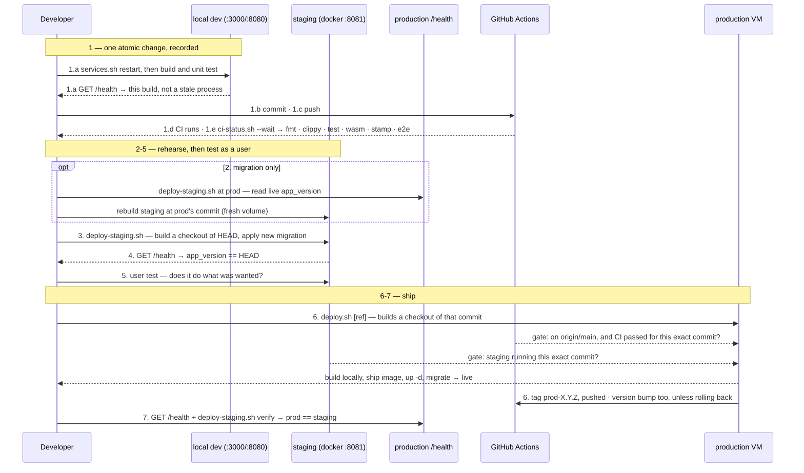

# Testing, CI & Release

Verifying a change and shipping it, end to end: automated tests and CI, a full
containerized rehearsal in the local staging environment, then the release to
production — the whole pipeline in one place, with the ordered command runbook
and a single sequence diagram below. Part of the lifecycle series — see
[docs/README.md](README.md) for the full sequence. Follows
[Development](3.2-development.md). Once a version is live,
[Production Environment & Operations](3.4-production-environment.md) covers the
running system this pipeline ships onto (container topology, secrets,
inspecting and maintaining it) — the steady state, not the release procedure.

## Running Tests

```bash
cargo test --workspace
```

Runs every crate's tests, including the `old-crates/*` prototypes (harmless — see [1.4 Roadmap](1.4-roadmap.md)'s "CLI Prototype" step). To run just one crate:

```bash
cargo test -p rules-shared    # rules/scoring/validation unit tests
cargo test -p server-game     # HTTP-level integration tests against the real Axum router
cargo test -p tile-lite-elite-ui     # move-composer logic, game-creation seat presets
cargo test -p engine-core     # engine tests
```

No test coverage for `admin-cli` (it's a thin HTTP client with no logic of its own to test in isolation) or for the WASM target specifically — `cargo test` always runs against the host target, not `wasm32-unknown-unknown`; see [Development](3.2-development.md#manual-web-client) for how to sanity-check a WASM build compiles.

## Continuous Integration

`.github/workflows/ci.yml` runs on GitHub Actions — on every push (any branch),
on pull requests, and on demand from the Actions tab. Two jobs:

**`check`** (runs on every trigger) — four steps, in order:

1. **Format** — `cargo fmt --check` on this repo's crates.
2. **Clippy** — `cargo clippy --workspace --exclude first-try --all-targets -- -D warnings`. Any clippy or compiler warning fails the build. The lint gate covers this repo's crates only; the `old-crates/*` archive is excluded (it carries pre-existing warnings that aren't maintained).
3. **Test** — `cargo test --workspace` (includes `old-crates/*`, whose tests still pass).
4. **Commit stamp** — `./scripts/check-commit-stamp.sh`, over the commits the push added. Fails a subject that doesn't carry `app <X.Y.Z> api <M.N>:`, or whose numbers disagree with that commit's own `Cargo.toml`/`API_VERSION`. It also *warns* — without failing — when a commit touches the wire surface (`crates/api/src/`, the edition registry) while leaving `API_VERSION` alone, which is the shape of a missed minor bump. Run it yourself before pushing: `./scripts/check-commit-stamp.sh origin/main..HEAD`.
5. **Wasm build** — `cargo build -p tile-lite-elite-ui --target wasm32-unknown-unknown`, so wasm-only breakage is caught even though the host-target steps above can't see it. This is a plain cargo compile of the default `web` feature, not the full `dx`/`wasm-bindgen` packaging the Docker release build runs.

**`e2e`** (Playwright, the regression pass CI owns — see [runbook step 1.c](#shipping-a-change-the-full-sequence)) — builds and starts the **staging Docker stack** (so the `dx`/`wasm-bindgen` packaging happens inside the `Dockerfile`, not on the runner), waits for `:8081/health`, then runs the `e2e/` suite against it with `PLAYWRIGHT_BASE_URL=http://localhost:8081`; the HTML report is uploaded as an artifact whenever the job wasn't cancelled — on a pass as well as a failure, since a green run's traces and timings are worth having too. Because it does a full image build, it's **gated** — only on pushes to `main`, pull requests, and manual runs — and only **after `check` passes** (`needs: check`), so a lint/test failure never burns a Docker build. On every-branch pushes, only `check` runs. Test data lives in the stack's throwaway volume (torn down with `down -v`), so no cleanup is needed on the ephemeral runner.

Notes:

- The job sets `RUSTC_WRAPPER=""` to disable the sccache wrapper that `.cargo/config.toml` configures for local dev (sccache isn't on the runner and is incompatible with wasm) while keeping that file's wasm32 rustflags.
- CI resolves the `srm-utils` git dependency (used only by `old-crates`) from the public `github.com/SteveStyle/utils` repo — no token needed as long as that repo stays public.
- CI **is** a deploy gate, not just a signal. It runs after a push, in parallel with the local staging rehearsal below, and `scripts/deploy.sh` refuses any commit it hasn't passed — via `scripts/ci-status.sh`, so the check you make by hand and the one the release enforces are the same code. Its other pre-flight checks (the commit is on `origin/main`, staging is running that same commit) guard the things CI can't see.

## Staging Environment

`docker-compose.staging.yml`, `Caddyfile.staging`, and `scripts/deploy-staging.sh` run the exact same images `scripts/deploy.sh` would ship to production, but locally (e.g. inside WSL), against their own persistent volume — the point being to catch "does this migration actually apply, does the server boot" before either ever reaches the real VM. It's a standalone compose file rather than a `docker-compose.yml` *override*: Compose's list-field merge (concatenate, not replace) makes an override an easy way to silently end up binding host ports 80/443 anyway, and the staging shape (no TLS, no domain, different host port, no cert volumes) already diverges enough from production that a full copy is clearer. See [4.1 Configuration](4.1-configuration.md#environments) for staging's place alongside the other two environments.

```bash
./scripts/deploy-staging.sh              # build + (re)start the staging stack
./scripts/deploy-staging.sh down         # stop it, keep its data
./scripts/deploy-staging.sh reset        # stop it and wipe its data
./scripts/deploy-staging.sh at <git-ref> # wipe + deploy a specific commit/tag/branch
./scripts/deploy-staging.sh at prod      # wipe + deploy whatever commit production is running
./scripts/deploy-staging.sh verify       # confirm staging is running the same version as production
```

Staging is reachable at `http://localhost:8081` — deliberately not `8080` (the local dev web server's port), so the two can run side by side. Plain HTTP, no domain, since there's nothing to provision a Let's Encrypt certificate against locally (`Caddyfile.staging` is `Caddyfile`'s same routing on a bare `:80` block instead). Its database lives on its own volume (`tile-lite-elite-staging-data`), entirely separate from production's.

**Why the volume persists across runs**: re-running `deploy-staging.sh` against an already-seeded staging DB is what actually exercises "does a new migration apply cleanly to an *existing* database" — a fresh volume would only ever apply every migration to nothing, proving much less ([4.2 Database Schema](4.2-database-schema.md)'s "Schema migrations" note has the incident history this guards against). `reset` wipes it deliberately, for when a clean slate actually is wanted. To test against a realistic copy of production data rather than whatever staging has organically accumulated, restore a production backup into `tile-lite-elite-staging-data` first, using the same backup/restore approach as [3.4 Production Environment & Operations](3.4-production-environment.md#backups) above, naming the staging volume instead.

**Every mode builds a fresh checkout of a commit** — see [Deployments build a commit, never the working tree](#deployments-build-a-commit-never-the-working-tree) below. Plain `deploy-staging.sh` builds `HEAD`; `at <ref>` builds that ref. Both go through a throwaway `git worktree` (`mktemp -d` + `git worktree add --detach`, always removed on exit — the real checkout, branch and uncommitted changes are never touched), so uncommitted work is not what gets tested. Commit first; a WIP commit is fine, since nothing here is pushed.

**`at <git-ref>`** additionally wipes the staging volume before building. Since `sqlx::migrate!("./migrations")` is a compile-time macro, the resulting image only knows about whichever migrations existed in the repo at that exact commit — a genuine "start empty, replay migrations up to here," useful for checking an old release's actual behavior or bisecting a migration chain.

**`at prod`** does the same but finds the ref itself, by reading `app_version` off `https://tileliteelite.com/health` and extracting its `+<short-sha>` suffix (override the URL with `PROD_URL`); **`verify`** does the read-only half alone, diffing staging's and production's live `app_version` with no side effects — run it before trusting staging as a stand-in for prod, in case it's quietly drifted since the last `at prod`. Both fail loudly, not silently, if production's `/health` has no `app_version` (a build made outside the deploy scripts, so it never got a commit tag).

This is also the practical answer to "can a bad migration be reverted": not in place — `sqlx::migrate!` only applies pending "up" migrations, and per the migrations `README.md`'s own rule, editing or deleting an already-applied migration file makes the server **refuse to boot** rather than undo anything. The real revert is at the volume level: wipe and redeploy at the last known-good ref, or restore a pre-migration volume snapshot.

### Why the process is shaped this way

The steps below are easy to follow and easy to "optimise" wrongly, because
each one looks individually skippable. The reasoning, so that a future
tidy-up removes the right thing:

**The seven steps are three stages, and they run at different rates.** The
runbook reads as one pass because that is how you follow it, but the stages
it groups repeat independently:

| Stage | Steps | What ends it | How often |
| --- | --- | --- | --- |
| **A — record a change** | 1.a–1.e | One atomic change, committed, pushed, and CI's verdict on it | Many times |
| **B — rehearse and judge it** | 2–5 | A build in staging that a person has actually used | Every so often — when enough functional change has accumulated to be worth looking at |
| **C — release** | 6–7 | A version live in production | Least often |

A repeats until there is something worth looking at; B repeats until there
is something worth shipping. So a production release usually carries
several staging rounds, and each of those several commits.

The consequence that matters: **B and C need not choose the same commit.**
Stage two commits, Andy then Brian; user testing likes Andy but wants more
work on Brian; C ships Andy. Nothing about that is a recovery procedure —
it is the ordinary shape of the process, and it is why `deploy.sh` takes a
ref. See [Deployments build a commit, never the working
tree](#deployments-build-a-commit-never-the-working-tree).

**CI answers "is this commit good?". The scripts answer "is the system
ready to move to this commit, and move it."** Those are different
questions, and only the second needs to know anything beyond the commit —
which is why `deploy.sh` sits above CI and consults its verdict rather than
re-running the suites. Things the scripts can do that CI structurally
cannot:

- reach the production VM at all (CI holds no credentials to it, deliberately)
- compile the workspace somewhere with enough RAM — the 1 GB VM cannot, which
  is why images are built locally and shipped rather than built in place
- find out what production is *currently* running (`deploy-staging.sh at prod`
  reads live `/health` and seeds staging from it)
- compare two running environments (`deploy-staging.sh verify`)
- write to git history (the version bump `deploy.sh` makes after a deploy)

#### Deployments build a commit, never the working tree

Both deploy scripts build a **fresh checkout of the commit they were asked
for**, in a throwaway `git worktree` that is removed on exit. Nothing on
your disk — the branch you have checked out, staged changes, a
half-finished edit — is part of a build. `deploy.sh` also ships *that
checkout's* `docker-compose.yml`, so the runtime configuration the VM gets
belongs to the code being shipped rather than to whatever your tree
currently says.

The property this buys is that **what runs in an environment is always
answerable from source control alone**. Before, "staging is running commit
X" was true only by coincidence: the build took whatever was on disk, and X
was just the label stamped on it. Both scripts patched over that by
refusing to run on a dirty tree — which made the label honest, at the cost
of forcing a WIP commit before every staging test, and still left the build
depending on the tree being in the right state at the right moment.

Building the commit directly makes the label true by construction, and a
dirty tree stops being anyone's problem. Both scripts now just say so and
carry on:

```text
==> Note: your working tree has uncommitted changes. They are NOT part of
    this deploy — 3064f4c is built from a clean checkout of that commit.
```

**This is what makes roll-forward and rollback the same operation.**
`./scripts/deploy.sh <ref>` deploys any commit; with no argument it deploys
`HEAD`. Rolling back to the previous release is `./scripts/deploy.sh
prod-0.4.12` — no branch to check out, no stash, nothing to put back
afterwards, and safe to do in the middle of unrelated work. See
[Rolling back](#rolling-back) for the two things that behave differently on
the way back.

**Staging is always in the sequence, even when the change plainly doesn't
need it.** Not because every change requires the rehearsal, but because the
alternative is a decision point — "does *this* change need staging?" — and
the failure mode of getting that wrong is silent: you skip the rehearsal
exactly when you were wrong about needing it.

It buys a second thing that is easy to miss. `deploy.sh` requires staging to
be running the **exact commit** being deployed, so any commit made after you
tested invalidates staging and forces a rebuild. That makes "just one small
fix after testing" impossible to do without noticing. The step is a ratchet,
not only a check.

The cost is two or three minutes of a machine's time. The thing it protects
is attention, which is scarcer.

**Staging runs on your machine, never on the production VM.** Sharing a host
would put a bursty workload — image loads, container starts, migrations, a
Playwright run — alongside production on 954 MB and two burstable vCPUs, and
production is already memory-bound enough that it swaps. But the deciding
argument is independence: staging exists to be somewhere things can break,
and an environment sharing production's fate cannot validate a deploy *to*
production, because one failure invalidates both readings at once. It would
stop being a check and become a correlated one.

**User testing could happen in dev**, and often does. It is listed against
staging because that is the last point where what you are looking at is
certain to be what ships.

### The environments, and the steps between them

Where the code lives and runs, and the runbook steps below as the arrows
between those places. Arrow labels are the command you actually type. An
arrow from a box back to itself is a step carried out there without
anything moving.


*Source: [`diagrams/release-flow.mmd`](diagrams/release-flow.mmd) — edit
that and re-render, per [`diagrams/README.md`](diagrams/README.md). It is a
pre-rendered image rather than an inline ```` ```mermaid ```` block because
it needs a layout engine GitHub's mermaid doesn't carry.*

Reading the diagram — every line means one of three things:

- **Solid arrow: code moves**, in the direction it moves. `$` marks a
  command you type; anything else happens without you.
- **Dotted arrow: an answer comes back.** A question was asked and nothing
  shipped — `curl /health`, `ci-status.sh`, `verify`.
- **The diamond is a decision on the action**, not a place. `deploy.sh`
  reaches this point and stops until both checks hold: CI green for this
  commit, and staging running this commit. That is why it belongs on the
  arrow rather than pointing at Production — the gate happens inside the
  command, before anything ships.

**Blue boxes run code; sand boxes store it.** The working tree sits in Dev,
which is why `git add`/`git commit` is a flow *out of* it into the commit
history, while building and testing act on Dev's own files and so loop back
on themselves.

**Both deployment arrows start at local git, not at Dev** — steps 3 and 6.a
leave the commit history, not the working tree. That is literal, not a
simplification: each script checks the commit out into a throwaway
`git worktree` and builds that, so Dev's current state cannot reach either
environment. It is also why deploying an older commit needs no special
handling — the arrow starts from the same place either way. See
[Deployments build a commit, never the working
tree](#deployments-build-a-commit-never-the-working-tree).

What the picture is for:

- **Only step 6 reaches production, and only from your machine.** GitHub
  never deploys: it holds no credentials to the VM. That is why the
  deployment scripts sit above CI and consult its verdict, rather than CI
  driving the release.
- **Staging is on your machine, not beside production.** The only lines
  between them carry production's version number into staging (step 2) and
  compare the two afterwards (step 7). So a staging failure cannot take
  production with it, and staging judges a release independently rather
  than sharing its fate.
- **Steps 1–5 are a loop**, run as often as the change needs. Only the pass
  that reaches step 6 is unusual, and the two gates are why: an edit after
  staging invalidates staging, so you go round again whether or not you
  meant to.

### Version numbers: which to bump, and when

Three separate checks, easy to conflate and each with a different rule.
Run through them before every commit — the third is the one that has
actually been missed in practice.

#### Check the commit subject carries both versions

Every commit subject starts `app <X.Y.Z> api <M.N>:` — the same `app`/`api`
words `GET /health` reports, so a commit and a running server speak one
vocabulary. Read both straight out of the tree rather than from memory:

```bash
grep -m1 '^version' Cargo.toml                        # app — the workspace version
grep -m1 'API_VERSION: ApiVersion' crates/api/src/lib.rs   # api — major/minor
```

Both are the *working tree's* values, which is what you are about to
commit — not what production is currently running. The app version leads
production by one — `deploy.sh` moves it there itself, at step 6.

#### Decide whether the app version moves

Usually it doesn't. The app version is bumped **once per production
release**, and `deploy.sh` does it for you the moment a deploy succeeds —
not per commit, and not at the start of a change. That is what keeps the
working tree permanently one ahead of production, so no commit is ever
built carrying a version number that is already live.

The automatic bump is a patch. For a release that deserves a **minor**
bump — new functionality rather than fixes — edit the root `Cargo.toml`
yourself afterwards; it is a single line, since the version is
workspace-inherited.

#### Decide whether the API version moves

Bump it in the same commit as the change it describes, never afterwards.

| change | bump |
| --- | --- |
| breaking route/DTO change — old clients cannot be trusted | **major** |
| additive, non-breaking — old clients still work, without the new thing | **minor** |
| nothing a client can observe (bug fix, perf, refactor) | none |

**"Additive" includes a new accepted *value*, not just a new type.** Adding
an edition to the registry means `variant` accepts something an older client
has never heard of. That counts, and it is the case that has been missed:
0.4.13 shipped the `spicy` edition with the API left at 2.5, so no client
ever saw skew.

That matters more than a version number usually does, because **the web
client's auto-reload keys on API skew**. Skew is the signal "there is
something new here"; leaving the version alone actively tells every open tab
there is nothing worth reloading for. They keep working, and keep being
unable to offer whatever shipped. The question to ask is *can a client
observe something it could not before?* — not *did a struct change?*

Record the reasoning in the comment block above `API_VERSION` while it is
fresh. Those comments are the only place the judgement calls survive.

### Shipping a change: the full sequence

Run every command from the repo root. Three phases: **step 1** makes one
atomic change and records it in change control, **steps 2–5** rehearse the
deploy on staging and prove the change does what was wanted, and **steps
6–7** ship it.

The division of testing is deliberate:

| | where | what it answers |
| --- | --- | --- |
| unit tests | while making the change (1.a) | does the piece I just wrote work |
| technical + regression | CI, answered at 1.e | did I break anything that used to work |
| user testing | staging (5) | does the change do what was actually wanted |

Running the suites locally is a faster inner loop, not a release gate — CI
is the gate, and `deploy.sh` refuses a commit it hasn't passed.

#### Step 1 — one atomic change, recorded

**1.a Make the change.** Includes running it and unit-testing it, because
that is part of making a change rather than a stage after it. Rebuild and
restart first so you are testing *this* code and not a process still
running an old binary:

```bash
cargo build --workspace                 # build it
./scripts/services.sh restart           # run it — both server and web
curl -s http://127.0.0.1:3000/health    # confirm the running server is your build
cargo test --workspace                  # unit test it
```

`services.sh restart` refreshes **both** the server and the web client, and
each `start`/`restart` kills whatever is bound to `:3000`/`:8080` — even a
hand-started or orphaned process the PID file doesn't know about. A stale
server is silent and costly: a rebuilt client against an old server fails
with cryptic wire-type errors that look like a code bug and aren't. Any new
migration applies on this restart, which doubles as its first real-data
run — watch `.logs/server.log`.

**1.b Commit it.** One atomic change per commit, with the version stamp
first — see [Version numbers](#version-numbers-which-to-bump-and-when), and
run `./scripts/check-commit-stamp.sh` if unsure:

```bash
git add -A
git commit -m "app 0.4.14 api 2.6: …"
```

**1.c Push.** This is what starts CI — so pushing early costs nothing and
is on the critical path for the release rather than beside it. It still
deploys nothing on its own.

```bash
git push origin main
```

**1.d CI runs.** Not something you do — the push triggers it. `fmt`,
`clippy`, the full test suite, the wasm build, the commit stamp, and on
`main` the Playwright e2e suite.

**1.e Get the answer.** Unlike everything before it, this step is a
*question*: CI either passed for this commit or it didn't.

```bash
./scripts/ci-status.sh --wait    # blocks until CI finishes, then says which
```

`--wait` blocks until the run completes; without it the script answers
immediately with whatever is true right now ("still in progress" is an
answer too). It exits non-zero on anything but success, so 1.c and 1.e
chain: `git push origin main && ./scripts/ci-status.sh --wait`.

**Don't rely on GitHub's failure emails for this.** They only arrive when
something breaks, so silence means "passed", "never started" and "went to
spam" indistinguishably — and they land somewhere other than where you are
working. Ask the question and get an answer.

That answer is what the rest of the release depends on: `deploy.sh` (step
6) runs the same script as its gate and refuses a commit whose CI hasn't
passed. Same code, so the check you make by hand and the one the release
enforces cannot disagree. A failure means going back to 1.a; there is no
way round it further down.

#### Staging — rehearse the deploy, and test it as a user

**2. Seed staging with production's current state** — wipes staging and
rebuilds it at whatever commit prod is running, updating database and code.
Needed when the change carries a **migration**, so it is exercised against
a real copy of production's schema rather than an empty volume — which is
the one thing CI cannot do for you. Skip it for a code-only change.

```bash
./scripts/deploy-staging.sh at prod
```

(`at prod` builds production's own commit in a throwaway worktree,
independent of your working tree.) Re-run it before re-testing a migration:
sqlx won't re-apply — or let you edit — a migration already applied to the
staging volume, so a fix needs a clean prod-state seed to exercise it.

**3. Build your commit onto the staging volume** — applies any new
migration on top of the step-2 seed (a plain run does not wipe the volume):

```bash
./scripts/deploy-staging.sh
```

**4. Confirm staging booted on your commit** — `app_version` should end in
your short SHA:

```bash
git rev-parse --short HEAD
curl -s http://localhost:8081/health | grep -o '"app_version":"[^"]*"'
```

**Do not run `verify` yet** — staging is ahead of production at this point,
so a mismatch is expected rather than an error.

**5. User test on staging** — open `http://localhost:8081` and use the
change. This is the functional pass: does it do what was actually wanted?
Technical correctness and regressions are CI's job and have already been
answered by 1.e; this asks the question no assertion can.

It happens here rather than in dev because staging is the last point where
what you are looking at is certainly what ships — same container, same
build, same migration path. If something is wrong, fix it and go back to
1.a: the new commit invalidates staging, and step 6 will refuse until you
have rebuilt it.

#### Production — ship it

**6. Deploy to production** — one command, which refuses on three counts:

```bash
./scripts/deploy.sh
```

It checks that the commit is **on `origin/main`**, that **CI passed for
it**, and that **staging is running it**. Needs `gh` authenticated (`gh auth
login`). `DEPLOY_SKIP_CI=1` bypasses the CI gate, for a genuine emergency
where GitHub itself is the problem — not as a way around a failing test.

Your working tree is not among the checks: the build is a fresh checkout of
the commit, so uncommitted changes are neither shipped nor an obstacle (see
[Deployments build a commit, never the working
tree](#deployments-build-a-commit-never-the-working-tree)). The script says
so on the way past rather than leaving it to be inferred.

If the migrations or the smoke test fail, `deploy.sh` calls
`scripts/rollback.sh` itself — restoring the snapshot and retagging
`:previous` back to `:latest`. Both the automatic recovery and the one you
would run by hand are the same script, so they cannot drift apart.

On success it **tags the deployed commit** `prod-<version>` (annotated,
pushed), so git history records what shipped: `git tag --list 'prod-*'` is
the deployment log, and `git log prod-0.4.12..prod-0.4.13` is what a given
release carried. On a name collision — a redeploy, or a rollback to a
release that already carries its tag — it appends a UTC timestamp rather
than moving the tag, since force-moving would discard the record of the
earlier deploy. (A timestamp rather than the SHA: on a redeploy the SHA is
identical, so it would collide again.)

It then **bumps the working tree to the next patch, commits and pushes**,
so production occupies the version just shipped and the tree stays one
ahead. That is only ever correct immediately after a successful deploy,
which is why it happens here rather than being a step to remember.
`DEPLOY_SKIP_BUMP=1` opts out.

**7. Confirm production matches** — `verify` should report a match:

```bash
curl -s https://tileliteelite.com/health | grep -o '"app_version":"[^"]*"'
./scripts/deploy-staging.sh verify
```

The app version here is the one *just shipped*; your working tree has
already moved one ahead of it.

When you're done, tear down the local staging stack (optional):

```bash
./scripts/deploy-staging.sh reset
```

Once it's live, [3.4 Production Environment & Operations](3.4-production-environment.md) covers running and maintaining it.

### Rolling back

Deploying an earlier release is the same command with a ref, and needs no
preparation of your working tree — you can do it mid-change:

```bash
./scripts/deploy-staging.sh at prod-0.4.12   # re-stage it first — always
./scripts/deploy.sh prod-0.4.12              # ship it
```

**Staging is re-deployed first, even though that commit has already been
staged once.** This is the [B/C stage
split](#why-the-process-is-shaped-this-way) in practice: stage Andy, stage
Brian, decide Brian needs rework and Andy should ship. Andy was already
rehearsed, so a second pass proves nothing new — but the rule is that
**production only ever moves to the commit staging currently holds**, and a
rule with no exceptions is worth more than the two minutes it costs. The
alternative is a judgement call ("do I need to re-stage *this* one?") whose
wrong answer is silent. `deploy.sh` enforces it rather than trusting it: the
staging gate compares `/health` against the commit you asked for, so
skipping the re-stage fails the deploy rather than shipping something
untested.

It is also not merely ceremonial when moving backwards — see [Rolling back
across a migration](#rolling-back-across-a-migration) for what `at` does
that a plain re-run would not.

The gates are the same ones, applied to that commit. Two behave differently
on the way back, both deliberately:

**CI may have to be re-run for the target commit.** CI's
`cancel-in-progress` concurrency rule cancels a run when a newer push
supersedes it, and a cancelled run is not a pass — the commit was never
judged. Releases you actually deployed will have passed (that was gate two
at the time), but an arbitrary older commit may not have. `ci-status.sh`
accepts a success from *any* run for the commit, not just the newest, so
re-running is the fix; it prints the exact `gh run rerun` command when it
hits this.

**The version bump is skipped.** After a rollback your branch tip is
already ahead of what is now in production, and bumping again would claim a
release that never happened — the version to move on from is the newest
one, not the one just redeployed. The script says which case it took:

```text
==> Deployed 0.4.12 from an earlier commit, so leaving the version alone.
    Your branch (main) is already ahead of what's now in production.
```

The `prod-*` tag is still written, since a rollback is a deploy and belongs
in the deployment log. If that version already carries a tag, a UTC
timestamp is appended rather than moving the existing one — the first
deploy of that version is a fact worth keeping.

#### Rolling back across a migration

**Migrations only run forward, and an older image will not start against a
newer database.** On startup `Migrator::run` validates that every migration
*recorded in the database* is one the binary knows about. It isn't lenient
by default (`ignore_missing: false`), so an image that lacks a migration the
database has applied fails with `VersionMissing(<version>)` and **does not
boot**. Nothing is corrupted; it simply refuses.

There is no `undo` to reach for. These are forward-only migrations — no
`.down.sql` files exist, deliberately. A down script restores *shape* but
never *data* (`drop column notes` destroys what was in it, and nothing can
bring it back), so it would be a way out that looks real right up until it
is needed.

**The mechanism is a snapshot instead.** `deploy.sh` copies the production
database before every deploy — server stopped first, so SQLite's WAL is
quiesced and the copy is consistent — and keeps the most recent few
(`SNAPSHOT_KEEP`, default 5):

```text
snapshots/pre-0.4.13-fb36f50-20260731T164500Z.tgz
```

The name records the version and commit that were live *before* that
deploy. To go back past a migration, restore the snapshot and then deploy
the matching older image:

```bash
./scripts/rollback.sh                    # list snapshots and the :previous image
./scripts/rollback.sh pre-0.4.13-...tgz  # database + images back, in one step
```

That restores the previous images *and* the database together, because
neither works alone: old code against a new schema won't boot, and a new
build against an old database is the same mismatch the other way round.
`deploy.sh` keeps the last images tagged `:previous` on the VM, so this is
a retag rather than a rebuild.

**This discards everything written since the snapshot** — every game, move
and account. That is the accepted trade, and it rests on an assumption
worth stating: a rollback happens *immediately*, when the release is
minutes old and the lost writes are the few games played in that window.
It is not a way to recover last week.

**You are told before it bites, not after.** `deploy.sh` compares
production's live `schema_version` (from `/health`) against the highest
migration in the target commit's tree, and refuses rather than shipping a
container that would die on startup:

```text
error: production's database is at migration 7, but a1c9f02 only knows up to 6.
       That image would fail sqlx's startup check and never boot.
```

Staging has the same hazard and a blunter answer: `deploy-staging.sh at
<ref>` wipes its volume before building, so stepping backwards there always
works. That wipe is load-bearing for a backwards re-stage, not a
convenience — staging's database would otherwise still hold the newer
migration.

One boundary follows from all this: **a rollback needs no snapshot at all
as long as the target isn't behind a migration production has applied.** In
the Andy/Brian case it isn't, because Brian never reached production — its
migration only ever ran in staging. Most rollbacks are that case.

### The pipeline at a glance

The whole flow above as one sequence — numbers match the runbook steps. `deploy.sh`'s internal build-and-ship (build locally → `scp` → `docker load` → `up -d` → `sqlx migrate`) is a single step here, as is the version bump it now performs itself; it's spelled out in [How `deploy.sh` ships an image](#how-deploysh-ships-an-image) below.



### How `deploy.sh` ships an image

Step 6 of the runbook above is a single `./scripts/deploy.sh`; here's what it does under the hood. The live VM has 1GB RAM — not enough to compile the Rust/wasm workspace — so images are always built locally and shipped over, never built on the VM itself:

```bash
./scripts/deploy.sh              # HEAD
./scripts/deploy.sh <commit-ish> # a specific commit, tag or branch
```

**The gates**, in order, each refusing rather than warning:

| Gate | Question | Why the scripts, not CI |
| --- | --- | --- |
| `origin/main` | Is this commit on the remote? | If this machine were lost, what's in production must still be reproducible from source control. Asked as `git merge-base --is-ancestor <commit> origin/main` — the property that matters directly, rather than via the current branch's upstream, which a commit reached by tag or SHA doesn't have at all |
| CI | Did CI pass for **this exact commit**? | Delegated to `scripts/ci-status.sh`, so the check made by hand at 1.e and the one enforced here are the same code and cannot answer differently |
| Staging | Is [local staging](#staging-environment) running that same commit? | Read from its `/health`. Catches the easy-to-miss case: test commit A in staging, commit a "quick fix" B, deploy — without this, B ships having been tested nowhere |

Note what is *not* a gate: the state of your working tree. The build is a
fresh `git worktree` checkout of the target commit, so uncommitted changes
can neither ship nor block — see [Deployments build a commit, never the
working tree](#deployments-build-a-commit-never-the-working-tree).

**The sequence**, once the gates pass. The ordering is the point: everything destructive happens after a snapshot, and the schema change is proved before the new build becomes the server.

| Step | What | Why here |
| --- | --- | --- |
| 1 | Build both images from the worktree, `docker save`, gzip, `scp` with that checkout's `docker-compose.yml` | A few minutes, almost all of it the local build |
| 2 | Retag the live images `:previous` | Before `docker load` moves `:latest`. Otherwise the old image goes dangling and the prune destroys it — which is what made rollback a rebuild |
| 3 | `docker compose stop server`, then tar the volume to `snapshots/` | Stopped first so SQLite's WAL is quiesced and the copy is consistent |
| 4 | `docker compose run --rm server --migrate-only` | **The schema change on its own.** Fail here and the deploy aborts with the previous version still installed, instead of taking the site down |
| 5 | `docker compose up -d`, prune, trim snapshots to `SNAPSHOT_KEEP` | The swap. Prune now removes the generation `:previous` just displaced, keeping exactly two |
| 6 | Poll `$PROD_URL/health` for the expected `app_version` | End to end — DNS, TLS, Caddy, server. Fails → automatic rollback |

Configurable via env vars (`DEPLOY_HOST`, `DEPLOY_USER`, `DEPLOY_SSH_KEY`, `DEPLOY_REMOTE_DIR`, `PROD_URL`, `SNAPSHOT_KEEP`) if the target ever changes — see the script header.

**Why step 4 exists.** Migrations otherwise run as a side effect of the server starting, which fuses two questions that want separate answers: *does the schema change work* and *does the new version serve traffic*. Fused, a bad migration is an outage — the old container has already been replaced, and the new one exits, restarts, exits, behind a Caddy that can only return 502. Asked separately, nothing has been swapped in yet and the deploy just stops. SQLite's transactional DDL means the database is unchanged either way; what step 4 buys is that the *site* is unchanged too.

**Why the smoke test checks the version, not just a 200.** A container that never restarted would answer perfectly well. Requiring `app_version` to equal `<version>+<sha>` is what makes it a test of *this* deploy rather than of the site in general.

**Afterwards**, it tags the deployed commit and (rolling forward only) bumps the dev version — both covered under runbook step 6 above.

Deployment itself stays a manual, on-demand scp/load push from a developer machine — no registry, no build-on-push — which suits a hobby project's actual deploy frequency. CI is a *gate* on that push, not the mechanism of it. Worth revisiting (push to a registry, `docker compose pull` on the VM instead of scp/load) if the frequency ever changes.

Schema changes ship via real, versioned migrations that apply automatically the moment the new server starts — **wiping the database is no longer a normal part of shipping a schema change** (see [4.2 Database Schema](4.2-database-schema.md)'s "Schema migrations" note for why this used to be necessary and isn't anymore). For the rare genuine "start over" case, see [3.4 Production Environment & Operations](3.4-production-environment.md#wiping-production).
