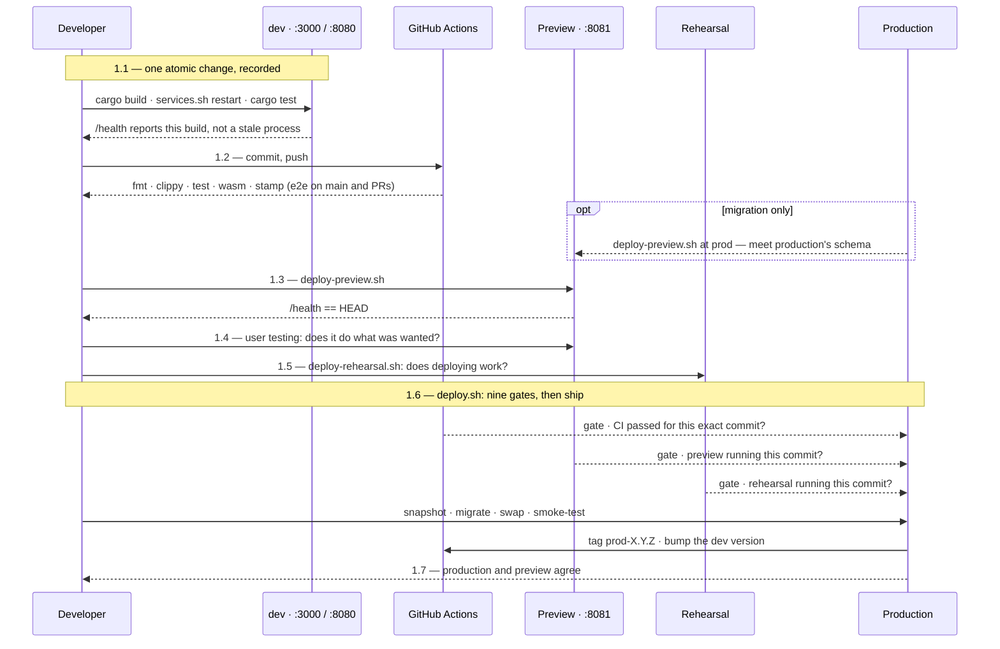

# Testing, CI & Release

Verifying a change and shipping it, end to end. Four environments, each
answering a different question:

| | asks |
| --- | --- |
| **dev** | does the code I am writing work? |
| **preview** | does the change do what was wanted? |
| **rehearsal** | does *deploying* it work? |
| **production** | — |

Plus CI, which asks whether anything that used to work still does.

**Three parts, and you probably want one of them.**

| part | for | holds |
| --- | --- | --- |
| **[What to type](#1-what-to-type)** | executing the process | the diagram, the steps, the exact commands, and what proves each one worked |
| **[The process, and why it is shaped this way](#2-the-process-and-why-it-is-shaped-this-way)** | understanding it | the environments, the three axes, the rules, and what each is for |
| **[Notes and incidents](#3-notes-and-incidents)** | when something surprises you | the failures that produced each rule, and the traps |

Nothing in part 1 explains itself; nothing in parts 2 and 3 is needed to ship a
change. Material is repeated between them where repeating it saves a jump.

## 1 What to type

Commands only. Every step says where it runs, what to type, and what proves it
worked. The reasoning is in [The process, and why it is shaped this
way](#2-the-process-and-why-it-is-shaped-this-way); the failures that produced
each rule are in [Notes and incidents](#3-notes-and-incidents) — steps 1.1 to
1.6 each have one, under [3.1 Notes on shipping a
change](#31-notes-on-shipping-a-change).

**Where these run.** Everything below runs on the development machine, in the
repository root, unless it says otherwise:

```bash
cd ~/tile-lite-elite
```

The exceptions are the two that reach a running box. They are the *only* way to
see container logs or the live database — `scripts/admin.sh` deliberately does
not reach production:

```bash
ssh tile-lite-elite            && cd ~/tile-lite-elite   # production VM
ssh tile-lite-elite-rehearsal  && cd ~/tile-lite-elite   # rehearsal VM
```

**The pipeline at a glance.** The same seven steps twice: once by **place**,
once by **time**. Numbers are the section numbers below, so a diagram and the
text can be read together.




**The steps, one line each.**

**Shipping a change** — seven steps, in order:

| | step | one line |
| --- | --- | --- |
| **1.1** | record the change | build, restart dev, unit-test, commit with the version stamp |
| **1.2** | push | CI's verdict is a deploy gate, not a signal |
| **1.3** | deploy to the preview environment | the same images production will get, locally |
| **1.4** | user testing | the one judgement no script makes |
| **1.5** | rehearse the release, and run the technical tests | the only test of the release *mechanism*, and where a claim no person can judge is asserted by a script |
| **1.6** | ship it | `deploy.sh` — nine gates, then snapshot, migrate, swap, smoke-test, tag, bump |
| **1.7** | verify what is live | production and preview report the same version |

**A release branch** — normal, and only where changes are grouped:

| | step | one line |
| --- | --- | --- |
| **1.8** | keep a version branch current | forward-merge after every release, and at scope close |
| **1.9** | release a version branch | merge first, fast-forward, then 1.3 – 1.7 |
| **1.10** | delete a branch once its change is live | merged means done, not deployed |

**When something is wrong** — not part of a normal release:

| | step | one line |
| --- | --- | --- |
| **1.11** | roll back production | go back to a release that worked |
| **1.12** | roll back across a migration | database and images together, or the container will not boot |
| **1.13** | ship an emergency change | only when going back cannot help |

**Asking a question**, changing nothing:

| | step | one line |
| --- | --- | --- |
| **1.14** | diagnostics | what is where, what is outstanding, what is broken |

**Which steps a change needs depends on its release attribute**, which comes from
the issue's type — see [Classifying a
change](3.6-change-lifecycle.md#215-classifying-a-change):

| release | steps |
| --- | --- |
| **merge** — documentation and tooling, live when it reaches `main` | 1.1, 1.2, then merge. No release, so no 1.3 – 1.7 |
| **patch** — a patch shipped on its own, from `main` | 1.1 – 1.7 |
| **minor / major** — grouped into a version branch | 1.1, 1.2 on the branch; then 1.8, 1.9, and 1.3 – 1.7 for the release |
| **emergency** — production is broken now | 1.11 first; 1.13 only if that cannot help |

### 1.1 Record the change

**Where:** development machine, repository root.

One atomic change per commit, with the version stamp first. Build, run and
unit-test before committing — that is part of making the change, not a stage
after it.

```bash
cargo build --workspace
./scripts/services.sh restart          # refreshes server *and* web client
cargo test --workspace
git add -A
git commit -m "app 0.6.3 api 2.13: what it does, and why"
```

Every subject starts `app <X.Y.Z> api <M.N>:`, matching that commit's own
`Cargo.toml` and `API_VERSION`. CI fails a commit without it; check before
pushing:

```bash
./scripts/check-commit-stamp.sh origin/main..HEAD
```

Use `Refs #N` in the body — **except where nothing else will close it, where `Closes #N` is
correct**, because nothing else will ever close it.

**Proved by:** `cargo test --workspace` exits 0, `./scripts/check-commit-stamp.sh`
exits 0, and dev is running what you just built rather than a stale process:

```bash
curl -s http://127.0.0.1:3000/health
```

### 1.2 Push, and let CI judge it

**Where:** development machine.

```bash
git push origin main                   # or the branch
```

You need not watch it — `deploy.sh` refuses a commit whose run has not passed.
To ask early:

```bash
./scripts/ci-status.sh --run push:<branch> --wait
```

**Proved by:** the command exits 0. `check` runs on every push; `e2e` runs only
on `main`, pull requests and manual runs.

### 1.3 Deploy to the preview environment

**Where:** development machine. Preview answers on `http://localhost:8081`.

```bash
./scripts/deploy-preview.sh            # build a fresh checkout of HEAD
```

**Testing a migration**, seed preview from production's live commit first, so
the migration meets production's schema rather than an empty volume:

```bash
./scripts/deploy-preview.sh at prod    # wipe, then build production's commit
./scripts/deploy-preview.sh            # then build HEAD on top of it
```

**Proved by:** the script exits 0, and `curl -s localhost:8081/health` reports
`app_version` equal to `HEAD`.

### 1.4 User testing

**Where:** a browser, at `http://localhost:8081`.

Use the change and decide whether it does what was wanted. If something is
wrong, fix it and start again from 1.1 — the new commit invalidates the
rehearsal host, and the deploy will refuse until it is redeployed.

**Proved by:** nothing mechanical. This is the judgement no script makes, and
`deploy.sh` can only check that the commit was *deployed* to preview, never
that anybody looked at it.

**When user testing is finished, the build that ships is a new one** — the
release commit, not the one that was tested. It goes round again in order:
preview (1.3), then rehearsal (1.5), then production (1.6). That is not
ceremony: the gates compare commits, so a release whose preview and rehearsal
hosts hold an earlier commit is refused, and the thing tested is genuinely not
the thing shipped once a merge or a version bump has happened since.

### 1.5 Rehearse the release, and run the technical tests

**Where:** development machine; it deploys to the rehearsal VM.

Two questions, and they are not the same one. Preview answered *does it do what
was wanted?* Rehearsal answers *does deploying it work?* and *does it behave
correctly on hardware like production's?*

#### 1.5.1 Does deploying work?

```bash
./scripts/deploy-rehearsal.sh
```

Same script and same steps production gets, against a machine built to match it.
Nothing here is a release: no `prod-*` tag, no version bump, no milestone closed.

**Proved by:** exit 0, and `deploy.sh`'s gate agreeing — it reads the rehearsal
host's `/health` and requires the exact commit being shipped.

#### 1.5.2 Does it behave correctly on production-like hardware?

**Every release answers two testing questions**, and they are answered
independently: *does this involve functional changes that require user testing?*
— which is step 1.4, on preview — and *does this involve technical changes that
require technical testing?*, which is here.

Technical testing is where a claim no person can judge by using the site is
asserted by a script, on hardware that matches production:

```bash
./scripts/check-rate-limits.sh                       # limits still refuse, and still serve everybody else
cargo run --release --example rate_limit_load        # where they trip, on rehearsal's hardware
```

**A development machine says nothing about a 2 vCPU box**, which is why these
cannot move earlier. Limits, timing, memory and headers are the shape of it.

**Both answers can be *no*, and that is the one worth catching**: a change nobody
can show works has not been tested, it has been deployed hopefully. `yes/no`
sends it to preview alone, `no/yes` to rehearsal alone, `yes/yes` to both.

**The two answers are two task lists in the project's test approach**, under
headings matched literally by tooling:

| heading | answers | run at |
| --- | --- | --- |
| `### Functional user tests — Preview` | does it do what was wanted? | 1.4 |
| `### Technical tests — Rehearsal` | does it behave correctly on production-like hardware? | 1.5.2 |

`verify.sh` counts the unticked boxes and names any project in the release
milestone with tests outstanding. It **reports**; it does not refuse — #240
shipped with its `revoke` test unrun, which was harmless, and a gate would have
refused a correct release. What was missing was being told. #289.

**Proved by:** each script exiting 0, against the rehearsal host.

### 1.6 Ship it

**Where:** development machine. **Run it bare** — piping into `tail` reports
the *pipe's* exit status, not the script's.

```bash
./scripts/deploy.sh                    # HEAD
./scripts/deploy.sh <commit-ish>       # a specific commit — see 1.11
```

Read the milestone before deploying, because the deploy closes **every open
issue in it**, shipped or not:

```bash
gh issue list --milestone X.Y.Z --state open --json number,title,issueType
```

**The gate now says what each one is, and how many commits mention it** —
`#229  Project  … (7 commits)`. Two things follow from the type. An issue that is
not a `Project` raises a warning, because a milestone is a release and a release
is made of project deliveries (§1.1); a requirement is closed when it folds into
a project, so it should not be carrying a milestone at all. And the count
replaced a boolean that could not report success — see §3.3.2.

Two escape hatches, each meaning something specific:

| | |
| --- | --- |
| `DEPLOY_SKIP_PREVIEW=1` | there was nothing for a person to look at — not "I did not look" |
| `DEPLOY_SKIP_CI=1` | GitHub itself is the problem — not a way around a failing test |

**Proved by:** exit 0. It refuses on nine counts, and on the way through it
snapshots the database, applies migrations as their own step, swaps the
containers, smoke-tests the public URL for the exact version, tags the commit
`prod-<version>`, publishes a **GitHub Release** on that tag, and moves the dev
version one patch ahead. If migrations or
the smoke test fail it calls `rollback.sh` itself.

When it fails and the reason is not on the terminal:

```bash
ssh tile-lite-elite
cd ~/tile-lite-elite && docker compose logs --tail=50 server
```

### 1.7 Verify what is live

**Where:** development machine.

```bash
./scripts/deploy-preview.sh verify     # preview and production report the same version
./scripts/verify.sh                    # or assert the whole world, exit non-zero if not
./scripts/verify.sh --quick            # three seconds
```

**Proved by:** exit 0. `verify.sh` counts a check it could not run as a
failure, so an absent answer never reads like a passing one.

### 1.8 Keep a version branch current

**Where:** development machine. **After every release, and once more when the
release's scope closes.** Merges flow one way — from the faster queue into the
slower ones:

```bash
git checkout 0.7.0
git merge main
git push
```

The version line conflicts every time. **Keep the branch's**:

```text
<<<<<<< HEAD
version = "0.7.0"
=======
version = "0.6.4"
>>>>>>> main
```

**Proved by:** `git merge` exiting 0 with `Cargo.toml` still reading the
branch's version.

### 1.9 Release a version branch

**Where:** development machine. **The merge comes before the deploy.**

```bash
git checkout main
git merge --ff-only 0.7.0
git push origin main
```

Then 1.3 – 1.7 as normal, from `main`.

If `--ff-only` fails, `main` has moved: forward-merge (1.8) and start the
preview and rehearsal lap again, because the merge commit is a commit nothing
has tested.

**Proved by:** `git merge --ff-only` exiting 0 — which is also the proof that
the commit tested is the commit released, byte for byte.

### 1.10 Delete a branch once its change is live

**Where:** development machine. "Live" means merged into whatever it will ship
from, not deployed.

```bash
git branch --merged main                       # the candidates
git branch -d issue-79-last-move-highlight     # -d, not -D: refuses if unmerged
```

A version branch is merged locally, so GitHub never sees it and both halves are
manual:

```bash
git push origin --delete 0.7.0
git branch -d 0.7.0
```

**Proved by:** `verify.sh` reporting no merged-and-remote-deleted branches left
behind.

### 1.11 Roll back production

**Where:** development machine. Needs no preparation of your working tree — it
can be done mid-change.

```bash
./scripts/deploy-preview.sh at prod-0.6.1    # re-stage it first — always
./scripts/deploy.sh prod-0.6.1               # ship it
```

**Production only ever moves to the commit preview currently holds**, and the
rehearsal gate enforces it, so skipping the re-stage fails the deploy rather
than shipping something untested.

In a crisis, when there is no time to re-stage, the faster form is a retag and
a database restore on the VM — seconds, no build, no gates:

```bash
./scripts/rollback.sh                        # list snapshots and the :previous image
./scripts/rollback.sh pre-0.6.2-1c8275f-20260817T133553Z.tgz
```

Listing is what it does with no arguments; the destructive form has to be named,
and it then asks you to type that name again. **A snapshot named
`pre-<version>-<commit>` was taken immediately *before* that commit was
deployed**, so restoring it returns you to whatever was live before it — not to
that commit.

**Proved by:** exit 0, then 1.7.

### 1.12 Roll back across a migration

**Where:** development machine.

An older image will not boot against a newer database — `sqlx` validates on
startup and refuses. `deploy.sh` checks for this and stops rather than shipping
a container that would die. To go back past a migration, restore the database
and the images together:

```bash
./scripts/rollback.sh                          # list snapshots and the :previous image
./scripts/rollback.sh pre-0.6.2-...tgz         # database + images back, in one step
./scripts/rollback.sh --db-only pre-0.6.2-...tgz   # database only, images untouched
```

**This discards everything written since the snapshot** — every game, move and
account. It is for a rollback minutes after a release, not a way to recover
last week.

**Proved by:** exit 0, and `/health` reporting both the old version and a
schema the image knows.

### 1.13 Ship an emergency change

**Where:** development machine. In order:

```bash
./scripts/rollback.sh                                            # 1. go back to what worked
DEPLOY_EMERGENCY="logins 500 since 14:20" ./scripts/deploy.sh    # 2. only if 1 cannot help
```

The reason is not decoration — it goes into the retrospective issue `deploy.sh`
raises for itself. `DEPLOY_EMERGENCY=1` works and records "(no reason given at
the time)", because a deploy must never be blocked on paperwork.

It skips the preview and rehearsal gates and **nothing else**: CI including
e2e, the commit being on a remote branch, and the schema check all still apply.
The tag and version bump happen as normal; the milestone and its issues are
**not** closed — close what actually shipped by hand once things are calm.

**Proved by:** exit 0, then 1.7 — and a retrospective issue appearing on
GitHub.

### 1.14 Diagnostics and occasional commands

**Where:** development machine. None of these changes anything.

| | |
| --- | --- |
| `./scripts/status.sh` | where every open change is, and what each environment is running |
| `./scripts/verify.sh` | **assert** everything is in place; exit non-zero if not |
| `./scripts/inbox.sh [days]` | what has been said on GitHub since you last looked |
| `./scripts/ci-status.sh --run push:<branch> --wait` | ask CI's verdict early |
| `./scripts/deploy-preview.sh at <ref>` | wipe preview and build a specific commit |
| `./scripts/deploy-preview.sh at prod` | seed preview from production's live commit |
| `./scripts/deploy-preview.sh verify` | confirm preview and production match |
| `./scripts/deploy-preview.sh down` / `reset` | stop it, keeping or wiping its data |
| `./scripts/rollback.sh` | list snapshots and the rollback image |
| `./scripts/check-commit-stamp.sh origin/main..HEAD` | check version stamps before pushing |
| `./scripts/check-rate-limits.sh` | assert the throttle's shape against a running host |

Running one crate's tests rather than the workspace:

```bash
cargo test -p rules-shared          # rules, scoring, validation
cargo test -p server-game           # HTTP-level integration against the real router
cargo test -p tile-lite-elite-ui    # move composer, seat presets
cargo test -p engine-core           # engine
```

On a running box, where a question can only be answered there:

```bash
ssh tile-lite-elite
cd ~/tile-lite-elite
docker compose logs --tail=50 server
docker compose exec server tile-lite-elite-admin users list
```

## 2 The process, and why it is shaped this way

Why each step exists, what each environment answers, and the rules the tooling
enforces. The commands themselves are in [What to type](#1-what-to-type).

### 2.1 Why each step exists, and what a tidy-up would break

*Reasoning, not procedure — nothing here is needed to execute a release.*

The steps below are easy to follow and easy to "optimise" wrongly, because
each one looks individually skippable. The reasoning, so that a future
tidy-up removes the right thing:

**The seven steps are three stages, and they run at different rates.** The
runbook reads as one pass because that is how you follow it, but the stages
it groups repeat independently:

| Stage | Steps | What ends it | How often |
| --- | --- | --- | --- |
| **A — record a change** | 1.1.1–1.2.3 | One atomic change, committed, pushed, and CI's verdict on it | Many times |
| **B — rehearse and judge it** | 2–5 | A build in preview that a person has actually used | Every so often — when enough functional change has accumulated to be worth looking at |
| **C — release** | 6–7 | A version live in production | Least often |

A repeats until there is something worth looking at; B repeats until there
is something worth shipping. So a production release usually carries
several preview rounds, and each of those several commits.

The consequence that matters: **B and C need not choose the same commit.**
Stage two commits, Andy then Brian; user testing likes Andy but wants more
work on Brian; C ships Andy. Nothing about that is a recovery procedure —
it is the ordinary shape of the process, and it is why `deploy.sh` takes a
ref. See [Deployments build a commit, never the working
tree](#211-deployments-build-a-commit-never-the-working-tree).

**CI answers "is this commit good?". The scripts answer "is the system
ready to move to this commit, and move it."** Those are different
questions, and only the second needs to know anything beyond the commit —
which is why `deploy.sh` sits above CI and consults its verdict rather than
re-running the suites. Things the scripts can do that CI structurally
cannot:

- reach the production VM at all (CI holds no credentials to it, deliberately)
- compile the workspace somewhere with enough RAM — the 1 GB VM cannot, which
  is why images are built locally and shipped rather than built in place
- find out what production is *currently* running (`deploy-preview.sh at prod`
  reads live `/health` and seeds preview from it)
- compare two running environments (`deploy-preview.sh verify`)
- write to git history (the version bump `deploy.sh` makes after a deploy)

#### 2.1.1 Deployments build a commit, never the working tree

Both deploy scripts build a **fresh checkout of the commit they were asked
for**, in a throwaway `git worktree` that is removed on exit. Nothing on
your disk — the branch you have checked out, staged changes, a
half-finished edit — is part of a build. `deploy.sh` also ships *that
checkout's* `docker-compose.yml`, so the runtime configuration the VM gets
belongs to the code being shipped rather than to whatever your tree
currently says.

The property this buys is that **what runs in an environment is always
answerable from source control alone**. Before, "preview is running commit
X" was true only by coincidence: the build took whatever was on disk, and X
was just the label stamped on it. Both scripts patched over that by
refusing to run on a dirty tree — which made the label honest, at the cost
of forcing a WIP commit before every preview test, and still left the build
depending on the tree being in the right state at the right moment.

Building the commit directly makes the label true by construction, and a
dirty tree stops being anyone's problem. Both scripts now just say so and
carry on:

```text
==> Note: your working tree has uncommitted changes. They are NOT part of
    this deploy — 3064f4c is built from a clean checkout of that commit.
```

**This is what makes roll-forward and rollback the same operation.**
`./scripts/deploy.sh <ref>` deploys any commit; with no argument it deploys
`HEAD`. Rolling back to the previous release is `./scripts/deploy.sh
prod-0.4.12` — no branch to check out, no stash, nothing to put back
afterwards, and safe to do in the middle of unrelated work. See
[Rolling back](#211-rolling-back) for the two things that behave differently on
the way back.

**Preview is always in the sequence, even when the change plainly doesn't
need it.** Not because every change requires the rehearsal, but because the
alternative is a decision point — "does *this* change need preview?" — and
the failure mode of getting that wrong is silent: you skip the rehearsal
exactly when you were wrong about needing it.

It buys a second thing that is easy to miss. `deploy.sh` requires preview to
be running the **exact commit** being deployed, so any commit made after you
tested invalidates preview and forces a rebuild. That makes "just one small
fix after testing" impossible to do without noticing. The step is a ratchet,
not only a check.

The cost is two or three minutes of a machine's time. The thing it protects
is attention, which is scarcer.

**Preview runs on your machine, never on the production VM.** Sharing a host
would put a bursty workload — image loads, container starts, migrations, a
Playwright run — alongside production on 954 MB and two burstable vCPUs, and
production is already memory-bound enough that it swaps. But the deciding
argument is independence: preview exists to be somewhere things can break,
and an environment sharing production's fate cannot validate a deploy *to*
production, because one failure invalidates both readings at once. It would
stop being a check and become a correlated one.

**User testing could happen in dev**, and often does. It is listed against
preview because that is the last point where what you are looking at is
certain to be what ships.

### 2.2 The four environments, and what each one is for

| | runs | for | reached by |
| --- | --- | --- | --- |
| **dev** | `cargo run` + `dx serve` on the laptop | building; fast feedback | `./scripts/services.sh` |
| **preview** | the real images, in Docker, on the laptop | *looking at it* — user testing, phone screenshots | `./scripts/deploy-preview.sh` |
| **rehearsal** | the real images, on an Oracle VM matching production | *the production clone* — proving the release mechanism, and anything technical that only the real hardware can answer | `./scripts/deploy-rehearsal.sh` |
| **production** | the same, on the live VM | users | `./scripts/deploy.sh` |

**Rehearsal is the production clone, not only a deploy rehearsal.** Proving
the release mechanism is its most frequent use, not its definition. Anything
whose answer depends on the real hardware belongs there and nowhere else:
performance and timing on a 1 GB two-core VM — `engine_timing_results.csv`
carries a `prod-epyc7551-2core` row for exactly that reason — memory pressure
against dictionary construction and the games held in RAM, stress and load
testing, migration timing against realistic volume, and anything involving TLS
or the real domain. A laptop measurement of any of those is not a weaker
answer; it is a different question.

Preview and rehearsal were one environment until 2026-08-02, and splitting
them is what issue #13 was for. They want opposite things. Preview must be
**fast**, because a layout change takes six rounds of feedback and each one
is a rebuild. Rehearsal must be **faithful** — remote, ssh'd to, images
shipped by `docker save`/`scp`/`docker load`, its own volume — and is
therefore slow, which does not matter because releases are far rarer than
layout tweaks. One environment optimised for the first cannot serve the
second, which is why the deploy mechanism went untested until the
2026-08-01 drill found two bugs in it.

**Only rehearsal gates a release.** `deploy.sh` refuses a production deploy
unless the rehearsal host is running that exact commit. Preview is
deliberately not a gate: a gate can check that the bits were present
somewhere, never that you looked at them and were happy, so gating on
preview adds friction while proving nothing rehearsal does not prove better.

**Why dev is not enough for user testing.** Not accessibility — dev could be
exposed too. Fidelity. Dev runs `dx serve` with a debug wasm build and the
API base URL baked in; preview and production run **Caddy** with a release
build served same-origin. There is no Caddy in dev at all, so the SPA
fallback, the compression, and the `/version.txt` bundle-hash update
mechanism — all of which are built on Caddy's behaviour — simply do not
exist there.

The files follow the names: `scripts/deploy-preview.sh`,
`docker-compose.preview.yml`, `Caddyfile.preview`, and the
`tile-lite-elite-preview-data` volume. Anything still saying "staging" is
either a pre-rendered diagram awaiting re-render, or genuinely means the
rehearsal host — the two were one environment until 2026-08-02, so old text
that says "staging" about a *release gate* means rehearsal, not preview.

### 2.3 The environments, and the steps between them

Where the code lives and runs, and the runbook steps above as the arrows
between those places. Arrow labels are the command you actually type. An
arrow from a box back to itself is a step carried out there without
anything moving.


*Source: [`diagrams/release-flow.mmd`](diagrams/release-flow.mmd) — edit
that and re-render, per [`diagrams/README.md`](diagrams/README.md). It is a
pre-rendered image rather than an inline ```` ```mermaid ```` block because
it needs a layout engine GitHub's mermaid doesn't carry.*

Reading the diagram — every line means one of three things:

- **Solid arrow: code moves**, in the direction it moves. `$` marks a
  command you type; anything else happens without you.
- **Dotted arrow: an answer comes back.** A question was asked and nothing
  shipped — `curl /health`, `ci-status.sh`, `verify`.
- **The diamond is a decision on the action**, not a place. `deploy.sh`
  reaches this point and stops until both checks hold: CI green for this
  commit, and preview running this commit. That is why it belongs on the
  arrow rather than pointing at Production — the gate happens inside the
  command, before anything ships.

**Blue boxes run code; sand boxes store it.** The working tree sits in Dev,
which is why `git add`/`git commit` is a flow *out of* it into the commit
history, while building and testing act on Dev's own files and so loop back
on themselves.

**Both deployment arrows start at local git, not at Dev** — steps 3 and 6.a
leave the commit history, not the working tree. That is literal, not a
simplification: each script checks the commit out into a throwaway
`git worktree` and builds that, so Dev's current state cannot reach either
environment. It is also why deploying an older commit needs no special
handling — the arrow starts from the same place either way. See
[Deployments build a commit, never the working
tree](#211-deployments-build-a-commit-never-the-working-tree).

What the picture is for:

- **Only step 6 reaches production, and only from your machine.** GitHub
  never deploys: it holds no credentials to the VM. That is why the
  deployment scripts sit above CI and consult its verdict, rather than CI
  driving the release.
- **Preview is on your machine, not beside production.** The only lines
  between them carry production's version number into preview (step 2) and
  compare the two afterwards (step 7). So a preview failure cannot take
  production with it, and preview judges a release independently rather
  than sharing its fate.
- **Steps 1–5 are a loop**, run as often as the change needs. Only the pass
  that reaches step 6 is unusual, and the two gates are why: an edit after
  preview invalidates preview, so you go round again whether or not you
  meant to.

### 2.4 Running Tests

```bash
cargo test --workspace
```

Runs every crate's tests, including the `old-crates/*` prototypes (harmless — see [1.4 Roadmap](1.4-roadmap.md)'s "CLI Prototype" step). To run just one crate:

```bash
cargo test -p rules-shared    # rules/scoring/validation unit tests
cargo test -p server-game     # HTTP-level integration tests against the real Axum router
cargo test -p tile-lite-elite-ui     # move-composer logic, game-creation seat presets
cargo test -p engine-core     # engine tests
```

No coverage for the WASM target specifically — `cargo test` always runs against the host target, not `wasm32-unknown-unknown`; see [Development](3.2-development.md#manual-web-client) for how to sanity-check a WASM build compiles.

#### 2.4.1 How the tests are shaped

**Tests build their own world.** No server, database or container needs to be
running: each creates a throwaway SQLite file and constructs the Axum router
in-process. That is why CI runs them on a bare runner, and why one test's
state never reaches another.

Two depths, chosen by what each can reach:

- **In-process.** Hand a `Request` to the router with `tower`'s `oneshot` and
  read the `Response`. Routing, extractors, handlers and status codes all run;
  no socket exists. Fast, and a failure points at the handler.
- **Over a socket.** Bind `127.0.0.1:0` and serve, for the few things a
  function call cannot reach. `require_loopback` reads `ConnectInfo`, which
  only a real connection populates — so in-process tests inject
  `loopback_peer()`, while a socket test gets `127.0.0.1` from the kernel.

**Testing a binary**: `cargo test` builds the package's binaries and supplies
their paths as `CARGO_BIN_EXE_<name>`, so a test can spawn the real
executable — freshly built, never stale, no install step. It must live in
that package's own `tests/` directory; the variable is not set elsewhere.

`crates/admin-cli/tests/user_deletion.rs` is both at once, and the only test
that needs to be: it hosts a server on a loopback port and spawns the real
admin binary against it. Everything the CLI adds — resolving a name to an
account, the exit code, the message — has no other route to a test, and
neither does the `into_make_service_with_connect_info` wiring that
`require_loopback` depends on.

**Prefer a walk to a point check.** `crates/server-game/src/app/`
`tests_account_lifecycle.rs` is the worked example: rather than asserting one
state, each test builds an attachment, watches an action refused, removes the
reason, and watches the same action succeed. Proving only the refusal would
pass against code that refused everything, and every defect that module has
found was a sequence rather than a state — resign then abort, invite then add
a seat. Its header says why it covers more than its name suggests.

#### 2.4.2 A new check is shown to fail before it ships

**Write the check, then break the thing it watches, and see it go red.** Only
then wire it in. A check that has never fired cannot tell *nothing to do* from
*not looking*, and both look identical in a green run.

The `scripts/tests/*.test.sh` suites are built this way: each stubs `gh`, feeds
the script a world where the answer is known, and includes the **quiet case** —
the run where the check should say nothing — because that is the case a broken
check passes by accident. `deploy-milestone.test.sh` earned it: an early version
matched the API call by name, so a malformed mutation passed the test and would
have failed the deploy.

D37, decided 2026-09-01.

#### 2.4.3 How a test design specification is built

The section above is about the shape of test *code*. This one is about the
document written before it, for a change big enough that "write some tests"
would not have said what to write.

**On the name.** We called this a *test plan* until 2026-08-21. The standards
reserve that for a management document — scope, schedule, resources, risks — and
call what we actually write a **test design specification**: techniques, test
conditions and pass/fail criteria. We do not write a test plan in that sense and
should not start; one developer and no schedule to coordinate. The three terms,
so a reader who knows them is not misled:

| term | what it means | ours |
| --- | --- | --- |
| **test strategy** | the test levels performed and the testing within them, holding across every change | [2.4](#24-running-tests) and this section |
| **test approach** | the strategy applied to one project: environment, tools, what is measured against what criteria | a project's *test approach* heading, or §8 of its design specification |
| **test design specification** | techniques, conditions, pass/fail criteria — the detail | this document |
| *test plan* | scope, schedule, resources, risks for one project's testing | **we do not write one** |

Two are in the repo, and they are the reference rather than this description:

- [Deleting a user](changes/41-user-deletion-test-design.md) (#41) — functional,
  user-testable, and the one that established the method.
- [Rate limiting](changes/25-rate-limiting-test-design.md) (#25) — non-functional,
  with nothing for a person to look at, so a script on the rehearsal host makes
  the judgement instead.

**A plan lives with its change, in `docs/changes/`, and stays after it ships.**
It is the documentation for the regression tests it produced — what they cover,
and why they cover it — which no amount of reading the test file recovers. The
user-deletion plan spent its first months as a comment on an issue, and was
nearly lost.

**Why write one at all.** The user-deletion plan found about as many gaps in the
requirements as in the tests, several in behaviour that had already shipped.
That is the return: working through what can happen is what surfaces the
questions nobody has answered, and the requirement gaps were the more valuable
half. It is cheaper to find them at a desk than in production.

##### 2.4.3.1 The parts, and what each is for

**1. Rules first**, written as intent and checked before anything derives from
them, citing [1.0 Rules](1.0-rules.md) ids. This is the order that matters:
tests derived from the code enshrine its bugs, and tests derived from a
half-remembered intention enshrine the memory. The rules are the third source
that breaks the circle. A rule that turns out not to exist yet gets proposed on
the branch — the rate-limiting plan's LIMIT-1 to LIMIT-7 were all written this
way.

Include the rules that cannot be tested, and say so. Its LIMIT-6 — rate
limits protect the service from load, and are not how bad behaviour is dealt
with — decides how every other rule is read. A test asserting an attacker was
stopped would have been asserting something deliberately not built.

**2. Conditions grouped into dimensions**, each marked **complete** where its
values exclude each other and cover every possibility. Completeness is the
claim doing the work: it is what lets a matrix be read as exhaustive rather
than as a list of cases somebody thought of. Where values genuinely overlap,
order them by precedence and say which wins, rather than leaving the overlap
for the reader.

**3. Outcomes listed separately**, phrased as something observable. "The
operator is told which games are in the way" is an outcome; "`delete_player`
returns `Err`" is a description of the code, and a test written from it passes
whatever the operator sees. Keeping them separate from the conditions is also
what makes step 7 possible.

**4. A matrix where two dimensions cross**, with a symbol for combinations
that cannot arise — `∅` in both plans, with the reason on the same line. Naming
the impossible cell is the point of drawing the matrix: an empty cell is
ambiguous between "cannot happen" and "not thought about", and those need
opposite responses.

**5. Scenarios as lifecycle walks**, each covering several conditions, with the
shape common to all of them stated once so the rows stay short. A walk catches
what a point check cannot, for the reason given above; stating the common shape
once is what stops twenty walks becoming twenty pages.

**6. Every refusal followed by a success.** A test that only watches something
be refused passes against code that refuses everything. Removing the reason and
watching the same action succeed pins the assertion to its cause. This is the
single most easily skipped part, and the one that decides whether the suite
means anything.

**7. Coverage written out, both ways** — every rule to a scenario, and every
condition to a scenario. Two passes over the same table, because they fail
differently: the first finds a rule nothing exercises, the second finds a
condition that quietly never varies.

**8. An approach section**: what runs, what is real, how time is manipulated,
where the tests live and *why they must live there*. The last part is not
housekeeping — `crates/admin-cli/tests/user_deletion.rs` has to be in that
package because `CARGO_BIN_EXE_<name>` is set nowhere else, and a plan that
does not record that invites someone to tidy the file into a sensible-looking
place where it cannot build.

**9. Tests named for the behaviour, never for a scenario number.**
`delete_refused_while_a_game_is_waiting`, not `s1`. The numbers are how the
plan is navigated while it is being written; six months later a failure named
`s1` sends the reader to a document to find out what broke.

**10. Gaps recorded as gaps**, each saying what will make the test fail. A gap
written down is a decision with a name on it; a gap left out is indistinguish-
able from coverage. The user-deletion plan recorded that nothing tested whether
the move timeout fires at all — the retention argument rests on it entirely.

##### 2.4.3.2 The rigour is the point

The method is heavier than the change usually looks like it deserves, and that
is the trade being made deliberately. Its value is not the tests at the end but
the questions it forces on the way through — which conditions can actually
co-occur, what the operator sees, which rule this behaviour is even serving.
Both plans changed the requirements before they changed any code.

### 2.5 Continuous Integration

`.github/workflows/ci.yml` runs on GitHub Actions — on every push (any branch),
on pull requests, and on demand from the Actions tab. Two jobs:

**`check`** (runs on every trigger) — four steps, in order:

1. **Format** — `cargo fmt --check` on this repo's crates.
2. **Clippy** — `cargo clippy --workspace --exclude first-try --all-targets -- -D warnings`. Any clippy or compiler warning fails the build. The lint gate covers this repo's crates only; the `old-crates/*` archive is excluded (it carries pre-existing warnings that aren't maintained).
3. **Test** — `cargo test --workspace` (includes `old-crates/*`, whose tests still pass).
4. **Commit stamp** — `./scripts/check-commit-stamp.sh`, over the commits the push added. Fails a subject that doesn't carry `app <X.Y.Z> api <M.N>:`, or whose numbers disagree with that commit's own `Cargo.toml`/`API_VERSION`. It also *warns* — without failing — when a commit touches the wire surface (`crates/api/src/`, the edition registry) while leaving `API_VERSION` alone, which is the shape of a missed minor bump. Run it yourself before pushing: `./scripts/check-commit-stamp.sh origin/main..HEAD`.
5. **Wasm build** — `cargo build -p tile-lite-elite-ui --target wasm32-unknown-unknown`, so wasm-only breakage is caught even though the host-target steps above can't see it. This is a plain cargo compile of the default `web` feature, not the full `dx`/`wasm-bindgen` packaging the Docker release build runs.

**`e2e`** (Playwright, the regression pass CI owns — see [runbook step 1.2.3](#1-what-to-type)) — builds and starts the **preview Docker stack** (so the `dx`/`wasm-bindgen` packaging happens inside the `Dockerfile`, not on the runner), waits for `:8081/health`, then runs the `e2e/` suite against it with `PLAYWRIGHT_BASE_URL=http://localhost:8081`; the HTML report is uploaded as an artifact whenever the job wasn't cancelled — on a pass as well as a failure, since a green run's traces and timings are worth having too. Because it does a full image build, it is **conditional** — only on pushes to `main`, pull requests, and manual runs — and only **after `check` passes** (`needs: check`), so a lint/test failure never burns a Docker build. On every-branch pushes, only `check` runs. Test data lives in the stack's throwaway volume (torn down with `down -v`), so no cleanup is needed on the ephemeral runner.

Notes:

- The job sets `RUSTC_WRAPPER=""` to disable the sccache wrapper that `.cargo/config.toml` configures for local dev (sccache isn't on the runner and is incompatible with wasm) while keeping that file's wasm32 rustflags.
- CI resolves the `srm-utils` git dependency (used only by `old-crates`) from the public `github.com/SteveStyle/utils` repo — no token needed as long as that repo stays public.
- CI **is** a deploy gate, not just a signal. It runs after a push, in parallel with the preview build below, and `scripts/deploy.sh` refuses any commit whose push-to-`main` run hasn't passed — via `scripts/ci-status.sh`, so the check you make by hand and the one the release enforces are the same code. Its other pre-flight checks (the commit is on `origin/main`, the rehearsal host is running that same commit) guard the things CI can't see.

### 2.6 Preview Environment

`docker-compose.preview.yml`, `Caddyfile.preview`, and `scripts/deploy-preview.sh` run the exact same images `scripts/deploy.sh` would ship to production, but locally (e.g. inside WSL), against their own persistent volume — the point being to catch "does this migration actually apply, does the server boot" before either ever reaches the real VM. It's a standalone compose file rather than a `docker-compose.yml` *override*: Compose's list-field merge (concatenate, not replace) makes an override an easy way to silently end up binding host ports 80/443 anyway, and the preview shape (no TLS, no domain, different host port, no cert volumes) already diverges enough from production that a full copy is clearer. See [4.1 Configuration](4.1-configuration.md#environments) for preview's place alongside the other two environments.

```bash
./scripts/deploy-preview.sh              # build + (re)start the preview stack
./scripts/deploy-preview.sh down         # stop it, keep its data
./scripts/deploy-preview.sh reset        # stop it and wipe its data
./scripts/deploy-preview.sh at <git-ref> # wipe + deploy a specific commit/tag/branch
./scripts/deploy-preview.sh at prod      # wipe + deploy whatever commit production is running
./scripts/deploy-preview.sh verify       # confirm preview is running the same version as production
```

Preview is reachable at `http://localhost:8081` — deliberately not `8080` (the local dev web server's port), so the two can run side by side. Plain HTTP, no domain, since there's nothing to provision a Let's Encrypt certificate against locally (`Caddyfile.preview` is `Caddyfile`'s same routing on a bare `:80` block instead). Its database lives on its own volume (`tile-lite-elite-preview-data`), entirely separate from production's.

**Why the volume persists across runs**: re-running `deploy-preview.sh` against an already-seeded preview DB is what actually exercises "does a new migration apply cleanly to an *existing* database" — a fresh volume would only ever apply every migration to nothing, proving much less ([4.2 Database Schema](4.2-database-schema.md)'s "Schema migrations" note has the incident history this guards against). `reset` wipes it deliberately, for when a clean slate actually is wanted. To test against a realistic copy of production data rather than whatever preview has organically accumulated, restore a production backup into `tile-lite-elite-preview-data` first, using the same backup/restore approach as [3.4 Production Environment & Operations](3.4-production-environment.md#backups) above, naming the preview volume instead.

**Every mode builds a fresh checkout of a commit** — see [Deployments build a commit, never the working tree](#211-deployments-build-a-commit-never-the-working-tree) below. Plain `deploy-preview.sh` builds `HEAD`; `at <ref>` builds that ref. Both go through a throwaway `git worktree` (`mktemp -d` + `git worktree add --detach`, always removed on exit — the real checkout, branch and uncommitted changes are never touched), so uncommitted work is not what gets tested. Commit first; a WIP commit is fine, since nothing here is pushed.

**`at <git-ref>`** additionally wipes the preview volume before building. Since `sqlx::migrate!("./migrations")` is a compile-time macro, the resulting image only knows about whichever migrations existed in the repo at that exact commit — a genuine "start empty, replay migrations up to here," useful for checking an old release's actual behavior or bisecting a migration chain.

**`at prod`** does the same but finds the ref itself, by reading `app_version` off `https://tileliteelite.com/health` and extracting its `+<short-sha>` suffix (override the URL with `PROD_URL`); **`verify`** does the read-only half alone, diffing preview's and production's live `app_version` with no side effects — run it before trusting preview as a stand-in for prod, in case it's quietly drifted since the last `at prod`. Both fail loudly, not silently, if production's `/health` has no `app_version` (a build made outside the deploy scripts, so it never got a commit tag).

This is also the practical answer to "can a bad migration be reverted": not in place — `sqlx::migrate!` only applies pending "up" migrations, and per the migrations `README.md`'s own rule, editing or deleting an already-applied migration file makes the server **refuse to boot** rather than undo anything. The real revert is at the volume level: wipe and redeploy at the last known-good ref, or restore a pre-migration volume snapshot.

### 2.7 Version numbers: which to bump, and when

Three separate checks, easy to conflate and each with a different rule.
Run through them before every commit — the third is the one that has
actually been missed in practice.

**The answers, for when you are committing rather than reading.**

| check | the answer, nearly always |
| --- | --- |
| **1. Subject stamp** | `app <X.Y.Z> api <M.N>: subject`, both read out of the tree rather than from memory — the two commands are below |
| **2. App version** | **It does not move.** `deploy.sh` bumps it once per production release. A minor or major is *branched to*, not bumped into. |
| **3. API version** | Moves only if the **wire contract** changed, in the same commit as the change: breaking → **major**, additive (including a newly accepted *value*) → **minor**, anything a client cannot observe → **none**. A change to `crates/ui` alone moves nothing. |

```bash
grep -m1 '^version' Cargo.toml                             # app
grep -m1 'API_VERSION: ApiVersion' crates/api/src/lib.rs   # api
```

Everything below is why each rule is that way, and the case that produced it.

#### 2.7.1 Check the commit subject carries both versions

Every commit subject starts `app <X.Y.Z> api <M.N>:` — the same `app`/`api`
words `GET /health` reports, so a commit and a running server speak one
vocabulary. Read both straight out of the tree rather than from memory:

```bash
grep -m1 '^version' Cargo.toml                        # app — the workspace version
grep -m1 'API_VERSION: ApiVersion' crates/api/src/lib.rs   # api — major/minor
```

Both are the *working tree's* values, which is what you are about to
commit — not what production is currently running. The app version leads
production by one — `deploy.sh` moves it there itself, at step 6.

#### 2.7.2 Decide whether the app version moves

Usually it doesn't. The app version is bumped **once per production
release**, and `deploy.sh` does it for you the moment a deploy succeeds —
not per commit, and not at the start of a change. That is what keeps the
working tree permanently one ahead of production, so no commit is ever
built carrying a version number that is already live.

The automatic bump is a patch, and that is right, because the patch line is
what `main` is for — the isolated path, and the only one that releases from
`main` directly. **A minor or major version is not bumped into, it is branched
to**, and the number is chosen when the branch is created, with the scope in
front of you rather than remembered afterwards. See
[How a change reaches production](3.6-change-lifecycle.md#1-the-flow-how-a-change-reaches-production) below.

Until that changed, the rule here was "edit `Cargo.toml` yourself afterwards
for a minor". Nobody ever did, across every functional release the project has
had. A default that is usually right and silently wrong the rest of the time
is not a rule, it is a trap.

#### 2.7.3 Decide whether the API version moves

Bump it in the same commit as the change it describes, never afterwards.

**The API version describes the wire contract. It does not deliver client
updates** — a hash of the built bundle does that, see [How a client learns
there is a new build](#274-how-a-client-learns-there-is-a-new-build) below.

| change | bump |
| --- | --- |
| breaking route/DTO change — an old client cannot continue | **major** |
| additive, non-breaking — old clients still work, without the new thing | **minor** |
| anything a client cannot observe on the wire | none |

**"Additive" includes a new accepted *value*.** Adding an edition to the
registry means `variant` accepts something an older client has never heard
of, which is a capability that client can now use. That is the case that has
been missed: 0.4.13 shipped the `spicy` edition at api 2.5 unchanged.

**A change to `crates/ui` alone moves nothing.** A client bug fix is not a
contract change, and until 0.4.17 it had to pretend to be one, because api
skew was the only thing that made a tab reload. That is what publishing the
build id replaced.

Record the reasoning in the comment block above `API_VERSION` while it is
fresh. Those comments are the only place the judgement calls survive.

The name is worth reading past. It was introduced on the assumption that a
client update implied an API behaviour change, and that turned out to be
false — which is why the two signals are now separate. Renaming
`API_VERSION` / `HealthDto.api_version` / the `api M.N` in commit subjects
is a wire change, so it is left alone deliberately.

#### 2.7.4 How a client learns there is a new build

One id, the **build id**, published by both containers — see
[4.1's versioning table](4.1-configuration.md#versioning) for how it sits
alongside the api and app versions.

- the **server** stamps `x-build-id` on every response
- the **web container** serves it as `/version.txt`, written into its image
- the **client** has it compiled in, so it knows its own

Every deploy moves it, including server-only ones: the Dockerfile compiles
`TILE_LITE_ELITE_BUILD_ID` into the wasm as well as the server, so a new commit
is new client code whatever the change was.

**A tab therefore knows three ids and needs only equality.** The header is the
trigger — free, on traffic already happening — and it can only say the *server*
moved. Confirming takes the web container, which is the sole thing that knows
what is actually being served:

| observation | what it does |
| --- | --- |
| web ≠ server | a deploy is in flight — wait |
| client = web | up to date — nothing to do |
| otherwise | reload |

The middle case is why the header cannot decide alone. During a deploy the two
containers are briefly on different commits, and a tab reloading then fetches
the old bundle, sees the header again, and loops.

The id is validated as plain hex before use: Caddy's SPA fallback answers a
missing `/version.txt` with **index.html and a 200**, and treating that as an id
would reload forever. A dev build sets no id at all, writes no `version.txt`
and sends no header — every comparison then answers "cannot tell", and the
client declines to reload, which is the behaviour to preserve.

**`/version.txt` used to hold a hash of the built files.** That only ever
changed because the build id was inside the wasm being hashed, so it was an
indirection over the commit that could not name the commit it meant — and it
made the deploy window something to survive by polling rather than something a
tab could recognise.

Desktop is unaffected — it has no bundle to re-fetch, so the api version
still drives its mandatory/optional update prompts.

### 2.8 The change lifecycle

**Moved to [3.5 The change lifecycle](3.6-change-lifecycle.md)** on 2026-08-21 —
the levels, the three-stage flow, how a release is shaped, and the rules that
govern all of it.

Owner: *"3.3 has become a lifecycle document from requirement being raised to
production delivery. Which is fine, but perhaps the lifecycle rules and the
environmental technical stuff should be separated."*

**This document holds the mechanisms; 3.5 holds the rules.** The environments,
continuous integration, the deploy script, rollback, and the runbook of what to
type are here. What a project is, when to branch, how a release is assembled and
what each step owes are there.

### 2.10 The diagnostic tools, and what each is for

Everything below is diagnostic or occasional. None of it is part of a
normal release; the commands themselves are in [1.14 Diagnostics and occasional
commands](#114-diagnostics-and-occasional-commands).

| | |
| --- | --- |
| `./scripts/ci-status.sh --run push:<branch> --wait` | ask CI's verdict early |
| `./scripts/deploy-preview.sh at <ref>` | wipe preview and build a specific commit |
| `./scripts/deploy-preview.sh at prod` | seed preview from production's live commit — do this before testing a **migration**, so it runs against production's schema rather than an empty volume |
| `./scripts/deploy-preview.sh verify` | confirm preview and production match |
| `./scripts/deploy-preview.sh reset` | wipe preview's database |
| `./scripts/rollback.sh` | list snapshots and the rollback image |
| `./scripts/check-commit-stamp.sh origin/main..HEAD` | check version stamps before pushing |
| `./scripts/status.sh` | where every open change is, and what each environment is running |
| `./scripts/verify.sh` | **assert** that everything is in place, and exit non-zero if not |

**The question `status.sh` does not answer — *what is in each release* — is
answered by the board rather than by a script.** `status.sh` walks issues one at
a time, which is right for "where is this change" and wrong for scoping, where
the work is grouping forty issues by milestone in your head.

That was `scripts/roadmap.sh` until 2026-08-28. It is now two views on
[the programme board](https://github.com/orgs/delphside/projects/1):
`is:open type:Project` grouped by **Milestone** for what each release contains,
and `is:open type:Requirement` grouped by **Type of change** for the backlog
behind them. Unset groups render as their own column, so *nobody having decided*
is still visible, which is the property that made the script's last section worth
having.

**What waits on what is a real link now**, not a guess. The script scraped `#N`
references out of issue bodies and called the column *mentioned by* rather than
*depends on*, because the text was unstructured. GitHub's `blocked by`
relationships replaced it: a blocked issue is marked on the board and in the
issue list, and `gh issue list --json blockedBy` reads the relation.

Like `status.sh`, a view is derived when it is opened and stores nothing, so it
cannot go stale — which is the property a written roadmap could not have offered,
and the reason the script existed at all.

`verify.sh` is the complement to `status.sh`: one *shows* the world, the other
*asserts* it. The difference matters because a display has to be read and
interpreted, and the failure mode of reading is not noticing. It runs the
tooling's own tests, asks CI's verdict on what is pushed, reports what each
environment holds, checks the milestone for issues no commit mentions, and
finally runs the real deploy gates under `DEPLOY_GATES_ONLY=1`.

It exists because CI and the deploy gates each answer at a moment you are not
necessarily present for — CI after a push and only if you look, the gates during
a deploy, which is a bad time to find out the tooling is broken. Nothing in it
is skipped quietly: a check that cannot run says so and counts as a failure,
because an absent answer must never read like a passing one.

`status.sh` is a **view, not a tracking system** — it stores nothing, so
there is nothing to keep up to date and nothing that can drift. Every column
is derived: issue open/closed is "is the work done", a `Refs #N` commit that
`origin/main` does not have is "somebody is on it", the same commit on
`origin/main` is "merged", and the issue's type decides whether merging was
already the release.

Reading the commits rather than the branch name is what lets one branch carry
several issues and show under each. Its one dependency is the convention
itself: a change with neither a `Refs #N` commit nor an `issue-<N>-*` branch
reads "not started", which is deliberate — that is the signal the convention
slipped, and papering over it would remove the only warning.

### 2.11 Rolling back

Deploying an earlier release is the same command with a ref, and needs no
preparation of your working tree — you can do it mid-change:

```bash
./scripts/deploy-preview.sh at prod-0.4.12   # re-stage it first — always
./scripts/deploy.sh prod-0.4.12              # ship it
```

**Re-deploy preview first, always** — even for a commit that has been staged
before. **Production only ever moves to the commit preview currently holds.**
[1](#32-notes-on-rolling-back) [2](#32-notes-on-rolling-back)

**This is aimed at production.** `DEPLOY_ENV=rehearsal` works, and exists for
the same reason `deploy-rehearsal.sh` does — so the rollback can be *rehearsed*
before it is needed, rather than performed for the first time during an
incident. It was proven end to end that way in the 2026-08-01 drill.

#### 2.11.1 Rolling back across a migration

**Migrations only run forward, and an older image will not start against a
newer database.** On startup `Migrator::run` validates that every migration
*recorded in the database* is one the binary knows about. It isn't lenient
by default (`ignore_missing: false`), so an image that lacks a migration the
database has applied fails with `VersionMissing(<version>)` and **does not
boot**. Nothing is corrupted; it simply refuses.

There is no `undo` to reach for. These are forward-only migrations — no
`.down.sql` files exist, deliberately. A down script restores *shape* but
never *data* (`drop column notes` destroys what was in it, and nothing can
bring it back), so it would be a way out that looks real right up until it
is needed.

**The mechanism is a snapshot instead.** `deploy.sh` copies the production
database before every deploy — server stopped first, so SQLite's WAL is
quiesced and the copy is consistent — and keeps the most recent few
(`SNAPSHOT_KEEP`, default 5):

```text
snapshots/pre-0.4.13-fb36f50-20260731T164500Z.tgz
```

The name records the version and commit that were live *before* that
deploy. To go back past a migration, restore the snapshot and then deploy
the matching older image:

```bash
./scripts/rollback.sh                    # list snapshots and the :previous image
./scripts/rollback.sh pre-0.4.13-...tgz  # database + images back, in one step
```

That restores the previous images *and* the database together, because
neither works alone: old code against a new schema won't boot, and a new
build against an old database is the same mismatch the other way round.
`deploy.sh` keeps the last images tagged `:previous` on the VM, so this is
a retag rather than a rebuild.

**This discards everything written since the snapshot** — every game, move
and account. That is the accepted trade, and it rests on an assumption
worth stating: a rollback happens *immediately*, when the release is
minutes old and the lost writes are the few games played in that window.
It is not a way to recover last week.

**You are told before it bites, not after.** `deploy.sh` compares
production's live `schema_version` (from `/health`) against the highest
migration in the target commit's tree, and refuses rather than shipping a
container that would die on startup:

```text
error: production's database is at migration 7, but a1c9f02 only knows up to 6.
       That image would fail sqlx's startup check and never boot.
```

Preview has the same hazard and a blunter answer: `deploy-preview.sh at
<ref>` wipes its volume before building, so stepping backwards there always
works. That wipe is load-bearing for a backwards re-stage, not a
convenience — preview's database would otherwise still hold the newer
migration.

One boundary follows from all this: **a rollback needs no snapshot at all
as long as the target isn't behind a migration production has applied.** In
the Andy/Brian case it isn't, because Brian never reached production — its
migration only ever ran in preview. Most rollbacks are that case.

### 2.12 Emergency changes

Three kinds of change reach production, and they differ in what may be assumed
rather than in how urgent they feel:

| | what it is | path |
| --- | --- | --- |
| **normal** | anything planned | branch, look at it, merge, release |
| **standard** | pre-approved and repeatable | deploy and smoke-test |
| **emergency** | production is broken now | this section |

**In a crisis, in order:**

```bash
./scripts/rollback.sh                                     # 1. go back to what worked
DEPLOY_EMERGENCY="logins 500 since 14:20" ./scripts/deploy.sh   # 2. only if 1 cannot help
```

Everything below is why, and what the second one gives up.

#### 2.12.1 Roll back first

The first question is not "how do I ship a fix". It is **"can I go back to
what was working"**, and usually the answer is yes:

```bash
./scripts/rollback.sh
```

It is a retag and a database restore — seconds, no build, no transfer — and it
has no gates at all, because it only ever moves production to something that
was already running there. It was proven end to end in the 2026-08-01 drill.

Restoring the database discards writes made since the snapshot, which is the
accepted trade and the reason to do it promptly rather than after an
investigation. Read [Rolling back](#211-rolling-back) before you need it, not
during.

Fixing forward is for when going back cannot help: a bug that has been live for
a week, so there is no good version to return to, or an outage caused by
something outside the image.

#### 2.12.2 The emergency deploy

```bash
DEPLOY_EMERGENCY="logins 500 for everyone since 14:20" ./scripts/deploy.sh
```

The reason is not decoration — it goes into the retrospective issue, and it is
the sentence you will not want to reconstruct tomorrow. `DEPLOY_EMERGENCY=1`
works and records "(no reason given at the time)", because a deploy should
never be blocked on paperwork.

**What it skips, and why only these two:**

| skipped | what it costs normally |
| --- | --- |
| the preview gate | an image build, plus standing it up locally |
| the rehearsal gate | an image build, a transfer, and a deploy to the rehearsal host |

Those are the slow parts. Everything else in the pipeline is automated and
quick, and a check that takes seconds is not worth the risk of skipping.

**What it does not skip:**

- **CI, including e2e.** One complete run is the check worth waiting for — it
  is the only thing between here and production that has actually exercised
  the change. `DEPLOY_SKIP_CI` still exists and still means what it always
  did: *GitHub itself is unreachable*. That is a different problem from
  production being down, and treating them as one would let an emergency ship
  something nothing had run.
- **The commit is on a remote branch.** Bypass it and production runs something
  that exists only on one laptop — nothing to roll back to, and nothing to
  reason about afterwards. A `git push` costs a second.
- **The schema check.** Physics, not policy: an image the database has outrun
  does not boot, so skipping this turns a bug into an outage.

#### 2.12.3 What it still does, and what it deliberately does not

The tag and the version bump happen as normal. Those are *facts* about what is
running, and letting production and the repository disagree would outlast the
emergency.

The milestone and its issues are **not** closed. That is a *claim* that a scope
completed the normal process, which is exactly what did not happen. Close what
actually shipped by hand, once things are calm.

#### 2.12.4 The retrospective is the price

`deploy.sh` raises an issue itself, recording the version, the tag, the reason
given, and what was bypassed. It is raised rather than suggested because a
reminder printed at the worst moment of the week is a reminder that does not
happen — and an emergency change is *retrospectively reviewed*, not unreviewed.
Without that review the emergency path quietly becomes the normal one.

The issue arrives with no type and no release attribute, deliberately: what it turns into is
a judgement. Its checklist separates the two questions this whole section is
built around — **restore service** and **understand the cause** — because
answering the first makes it tempting never to answer the second.

### 2.13 How `deploy.sh` ships an image

*Reasoning, not procedure — `deploy.sh` does all of this itself. Read it to
understand or debug the deploy, not to perform one.*

Step 6 of the runbook above is a single `./scripts/deploy.sh`; here's what it does under the hood. The live VM has 1GB RAM — not enough to compile the Rust/wasm workspace — so images are always built locally and shipped over, never built on the VM itself:

```bash
./scripts/deploy.sh              # HEAD
./scripts/deploy.sh <commit-ish> # a specific commit, tag or branch
```

**The gates**, in order, each refusing rather than warning:

| Gate | Question | Why the scripts, not CI |
| --- | --- | --- |
| `origin/main` | Is this commit on the remote? | If this machine were lost, what's in production must still be reproducible from source control. Asked as `git merge-base --is-ancestor <commit> origin/main` — the property that matters directly, rather than via the current branch's upstream, which a commit reached by tag or SHA doesn't have at all |
| CI | Did the **push-to-`main` run** for this exact commit pass, e2e included — and the `pull_request` run too, where there is one? | Delegated to `scripts/ci-status.sh --run push:main --require e2e`, so the check made by hand at 1.2.3 and the one enforced here are the same code and cannot answer differently. Naming the run is the point — see [Gating on a particular run](#2132-gating-on-a-particular-run) |
| Rehearsal | Is the [rehearsal host](#22-the-four-environments-and-what-each-one-is-for) running that same commit? | Read from its `/health`. Catches the easy-to-miss case: rehearse commit A, commit a "quick fix" B, deploy — without this, B ships having been rehearsed nowhere |

**Asking without deploying.** `DEPLOY_GATES_ONLY=1 ./scripts/deploy.sh` runs
every gate above and stops before the first side effect. Useful by hand — the
answer to "would this go out?" should not cost an image build — and it is what
`scripts/tests/deploy.test.sh` drives, so these gates are exercised by CI
rather than only by deploying.

That matters because the branch where a gate says **no** is otherwise almost
never taken: nobody rehearses a deploy against a commit they expect to be
refused. Two gates here have failed open for exactly that reason, and one
refused every rehearsal for a day before anyone tripped over it.

Note what is *not* a gate: the state of your working tree. The build is a
fresh `git worktree` checkout of the target commit, so uncommitted changes
can neither ship nor block — see [Deployments build a commit, never the
working tree](#211-deployments-build-a-commit-never-the-working-tree).

#### 2.13.1 One build per commit, shared by every environment

**`deploy.sh` builds a commit once.** The images are saved to
`artifacts/<full sha>.tar.gz` in the working copy, git-ignored, and a build runs
only when that file is absent. Rehearsal builds it; production finds it and
loads the same bytes.

It used not to. `deploy-rehearsal.sh` is this script with a different host, so a
rehearsed release built twice from one commit, and Docker builds are not
bit-reproducible: base tags move, apt mirrors move, the toolchain resolves at
build time. Rehearsal proved *a* build of commit X and production shipped
*another*. #214 R1.

| | |
| --- | --- |
| where | `artifacts/<sha>.tar.gz`, plus a `.sha256` beside it |
| when it builds | only when that file is absent |
| what proves sameness | the digest, printed on every deploy — `sha256:` in the export line |
| retention | the newest `ARTIFACT_KEEP` (5), pruned after a successful deploy |
| if one is lost | it rebuilds from the commit. It is a cache, not a record |

**The digest is the check, not the version.** A rebuild of one commit stamps the
same version, so `/health` cannot tell two builds apart — which is why the
version string could never have caught the thing this fixes. Compare the
`sha256:` from the rehearsal deploy with the one from the production deploy: the
same twelve characters mean the same object.

**A corrupted artefact is refused rather than shipped.** The digest is recorded
at build time and re-checked before every transfer, so a file truncated by a
full disk fails the deploy instead of loading half an image.

#### 2.13.2 Gating on a particular run

**A gate names the run it depends on, and consults nothing else.** One commit
has several CI runs, and they do not run the same jobs.

`e2e` runs for a push to `main`, a pull request, or a manual dispatch. Anywhere
else — a branch push, a tag push — it is recorded as `skipped`, and a run whose
only absent job was skipped still concludes `success`. So "did CI pass for this
commit" has no single answer.

The commit released as 0.5.0 had four:

| trigger | ran e2e? | result |
| --- | --- | --- |
| push to branch `0.5.0` | skipped — not `main` | success |
| pull request on `0.5.0` | **ran** | **failure** |
| push to `main` | **cancelled** mid-run | cancelled |
| push of tag `prod-0.5.0` | skipped — a tag | success |

Two successes. The gate scanned for one and found it, and a commit whose only
completed e2e run had failed went to production. Nothing else caught it: `main`
has no branch protection, the merge is done locally rather than through GitHub,
and a failing check never blocks a pull request from being closed.

So `ci-status.sh` requires `--run`:

```bash
./scripts/ci-status.sh --run push:main --require e2e   # what a deploy asks
./scripts/ci-status.sh --run push:my-branch --wait     # what you ask at 1.2.3
./scripts/ci-status.sh --run pull_request              # the PR's own verdict
```

There is deliberately no "any run" mode. `--require` is separate because a
green run is not enough on its own: it asserts a named job is present *and*
successful, which is what catches a job that was skipped rather than run.

**`main` is exempt from `cancel-in-progress`.** The push-to-`main` run is the
one a deploy judges, and it was being cancelled by the deploy itself — the
version bump `deploy.sh` pushes after tagging landed 2m22s after the release
commit, against an e2e job taking four to ten minutes. On a branch, superseding
an older run is right; on `main` every commit is one that might be released.

**A production deploy checks two runs, and they answer differently:**

| run | required | what it adds |
| --- | --- | --- |
| the push to `main`, with `e2e` | always | this is what production ships, tested as it now stands on `main` |
| the `pull_request` run | when one exists | a version branch merges fast-forward, so the released commit *is* the branch tip the PR tested. For 0.5.0 that run had failed, and this alone would have refused it |

**A rehearsal asks a different question**, and must: it exercises a commit that
is usually still on a branch, where there is no push-to-`main` run to wait for
and `e2e` does not run at all. So it names `--run push` — the commit's own push
run, whichever ref — and requires no particular job. Asking a rehearsal for
`push:main` blocked it for the gate's full twenty minutes and never reached the
build.

The second is conditional because not every change has a pull request — the
a repository-route change routinely does not. Absence is therefore a pass, which is the shape
that let 0.5.0 through, so the deploy **says so out loud**:

```text
==> No pull-request run for this commit — nothing to check there
```

A line you can notice and question is not the same as a gate that goes quiet
when it has nothing to check.

**The sequence**, once the gates pass. The ordering is the point: everything destructive happens after a snapshot, and the schema change is proved before the new build becomes the server.

| Step | What | Why here |
| --- | --- | --- |
| 1 | Build both images from the worktree, `docker save`, gzip, `scp` with that checkout's `docker-compose.yml` | A few minutes, almost all of it the local build |
| 2 | Retag the live images `:previous` | Before `docker load` moves `:latest`. Otherwise the old image goes dangling and the prune destroys it — which is what made rollback a rebuild |
| 3 | `docker compose stop server`, then tar the volume to `snapshots/` | Stopped first so SQLite's WAL is quiesced and the copy is consistent |
| 4 | `docker compose run --rm server --migrate-only` | **The schema change on its own.** Fail here and the deploy aborts with the previous version still installed, instead of taking the site down |
| 5 | `docker compose up -d`, prune, trim snapshots to `SNAPSHOT_KEEP` | The swap. Prune now removes the generation `:previous` just displaced, keeping exactly two |
| 6 | Poll `$PROD_URL/health` for the expected `app_version` | End to end — DNS, TLS, Caddy, server. Fails → automatic rollback |

Configurable via env vars (`DEPLOY_HOST`, `DEPLOY_USER`, `DEPLOY_SSH_KEY`, `DEPLOY_REMOTE_DIR`, `PROD_URL`, `SNAPSHOT_KEEP`) if the target ever changes — see the script header.

**Why step 4 exists.** Migrations otherwise run as a side effect of the server starting, which fuses two questions that want separate answers: *does the schema change work* and *does the new version serve traffic*. Fused, a bad migration is an outage — the old container has already been replaced, and the new one exits, restarts, exits, behind a Caddy that can only return 502. Asked separately, nothing has been swapped in yet and the deploy just stops. SQLite's transactional DDL means the database is unchanged either way; what step 4 buys is that the *site* is unchanged too.

**Why the smoke test checks the version, not just a 200.** A container that never restarted would answer perfectly well. Requiring `app_version` to equal `<version>+<sha>` is what makes it a test of *this* deploy rather than of the site in general.

**Afterwards**, it tags the deployed commit and (rolling forward only) bumps the dev version — both covered under runbook step 6 above.

Deployment itself stays a manual, on-demand scp/load push from a developer machine — no registry, no build-on-push — which suits a hobby project's actual deploy frequency. CI is a *gate* on that push, not the mechanism of it. Worth revisiting (push to a registry, `docker compose pull` on the VM instead of scp/load) if the frequency ever changes.

Schema changes ship via real, versioned migrations that apply automatically the moment the new server starts — **wiping the database is no longer a normal part of shipping a schema change** (see [4.2 Database Schema](4.2-database-schema.md)'s "Schema migrations" note for why this used to be necessary and isn't anymore). For the rare genuine "start over" case, see [3.4 Production Environment & Operations](3.4-production-environment.md#wiping-production).

## 3 Notes and incidents

The reasoning that does not fit beside a rule: the failures each rule came from,
the alternatives rejected, and the traps that cost an evening. Referenced from
the parts above; never required by them.

### 3.1 Notes on shipping a change

The failures and judgements behind [What to type](#1-what-to-type)'s first seven
steps. Nothing here is needed to execute the process.

#### 3.1.1 Why the steps are written down at all

Three rules, in this order, because anyone can forget a step:

1. **Make sure the steps are accurate.** A step that describes something the
   system no longer does is worse than no step, because it is followed.
2. **Make sure the tooling enforces them.** A gate that checks the world —
   what the rehearsal host is actually running — beats one that asks whether
   you remembered.
3. **Follow the steps.**

Each layer catches what the one before it misses, and only the first can be
checked by reading.

The division of testing is the reason the shape holds:

| | where | what it answers |
| --- | --- | --- |
| unit tests | while making the change | does the piece I wrote work |
| technical + regression | CI, after the push | did I break anything that used to work |
| user testing | preview, step 4 | does it do what was actually wanted |
| the release mechanism | rehearsal, step 5 | does deploying it actually work |

#### 3.1.2 Why the dev restart matters

`services.sh restart` kills whatever holds `:3000`/`:8080`, including an
orphan the PID file doesn't know about. A stale server is silent and
costly: a rebuilt client against an old one fails with cryptic wire-type
errors that look like a code bug and aren't.

#### 3.1.3 Why the look happens on preview rather than in dev

This is the functional pass, and it is the one thing no script can do.
Correctness and regressions were CI's job and are already answered. It
happens on preview rather than in dev because preview is the last point
where what you are looking at is certainly what ships — same container,
same build, same migration path.

#### 3.1.4 What rehearsal actually tests

The same script and the same steps production gets, against a machine built to
match it. This is not another look at the change — that was step 1.4. It is the
only test of the **mechanism**: `docker save`, the transfer, `docker load`, the
`:previous` retag, the database snapshot, migrations as their own step, the
smoke test. It is also where the technical tests run (step 1.5.2), for the
claims a development machine cannot settle.

##### The same commit, not yet the same image

**Until #134, production builds its own image.** Rehearsal proves the mechanism
against this commit; `deploy.sh` then builds the commit *again* for production.
The two agree in practice because the build is hermetic in everything we
control — but the base tags are not pinned. `rust:1-bookworm`,
`debian:bookworm-slim` and `caddy:2-alpine` all float, so a Caddy minor release
landing between the two builds would mean rehearsal tested a web server
production does not run.

**And the gate cannot see it.** `TILE_LITE_ELITE_BUILD_ID` is the target SHA, so
a rebuild stamps the *same* version string: rehearsal and production report
identical `/health` output while running different bytes. That is not a weak
gate, it is a blind one — which is why *"they have always agreed"* is not
evidence of anything.

**#134 closes it**, and needs no change to the image: the artefact is already
host-agnostic, since the client is built with `TILE_LITE_ELITE_API_BASE_URL=""`
and the Caddyfile takes its hostnames from `{$SITE_ADDRESS}` at run time. Only
`deploy.sh` changes — keep the `docker save` tarball built for rehearsal and ship
*that file* to production, and have the gate compare image digests rather than
version strings.

#### 3.1.5 Where a change with nothing to look at gets tested

Step 3 asks
a person whether the change does what was wanted; some changes have no answer
to that. Rate limiting is the worked example — preview can show that limiting
happens, that the error is decent and that `/health` still answers, but it
runs on a development machine, and numbers checked there say nothing about the
2 vCPU box they protect.

So the judgement moves here and becomes a script:

```bash
./scripts/check-rate-limits.sh              # against the rehearsal host
```

It asserts the shape — refused rather than queued, per caller rather than
globally, health exempt — and deliberately not the numbers, which need real
load rather than a handful of requests. Write the equivalent for any change
whose correctness depends on conditions preview cannot reproduce, and run it
here, where the machine matches.

**`deploy.sh` refuses without it.** The gate reads the rehearsal host's
`/health` and requires the exact commit you are about to ship. Skipping this
step does not produce a riskier release; it produces a release that stops at
the gate.

#### 3.1.6 The nine gates, and the one that is easy to overlook

It refuses on nine counts. The commit must be a **valid ref**, **on the
remote**, and carry a **readable version**; the **push-to-`main` CI run** must
have passed for it, **and the `pull_request` run** where one exists; the version
must satisfy `check-release-version.sh`; production's database must not have
**moved past the schema** this build knows; and **both preview and the rehearsal
host must be running it**. What it does once they pass is under [2.13 How
`deploy.sh` ships an image](#213-how-deploysh-ships-an-image). Needs `gh`
authenticated.

The `pull_request` run is easy to overlook and is the reason 0.5.0's failure was
caught the second time: e2e does not run on a push to a release branch, so the
branch's own runs are green because e2e **did not run**, not because it passed.

The last two are separate gates because they answer separate questions.
Preview is where somebody used the change and decided it does what was wanted;
rehearsal is where the release mechanism itself was proved. They were one
environment once, which is why older wording here spoke of preview alone.

`DEPLOY_SKIP_PREVIEW=1` is for a change preview cannot judge — release
tooling, or anything with no behaviour a person can look at. It says "there
was nothing to see", not "I did not look".

Two different things share the name "user testing", and only the second is a
gate. **Exploratory** — run the change on a branch because seeing it work is
expected to change what was wanted. That is part of making the change, and
`./scripts/deploy-preview.sh at <branch>` is how. **Formal** — run the commit
that will ship and decide it does what was wanted.

The gate compares commits rather than asking whether preview is running
something, so it separates the two by itself: exploratory work leaves preview
on a branch, and the release stays refused until preview runs the commit being
shipped. The second pass is not bureaucracy after the first — the thing under
test is different, because the branch has since been merged.

The preview gate proves the commit was *deployed* there. It cannot prove
anybody looked at it, and nothing else can either — whether a person formed a
judgement is not visible to a script. It is a prompt rather than a proof, and
the only one available for that question. Skipping it deliberately leaves a
record; having no gate leaves none.

#### 3.1.7 It reads the stack, not a browser

The commit comes from preview's own
`/health`, server-side, so what a tab happens to be displaying is irrelevant to
it. Worth knowing because the two can disagree: a browser holding an old bundle
shows an old version while preview is serving the new one, which looks exactly
like the gate having failed to run. It has not — the tab is stale, and #67 is
why.

Run it bare. Piping it into `tail` or `head` reports the *pipe's* exit status,
not the script's, so a deploy that stopped halfway reads as one that finished
— which is how a release once tagged and went live while its version bump and
milestone closure silently never ran. Let it print.

Then, without being asked: snapshot the database, apply migrations as a
separate step so a failure there is not an outage, swap the containers,
smoke-test the public URL for the exact version, tag the deployed commit
`prod-<version>`, and move the dev version one patch ahead. If the
migrations or the smoke test fail it calls `scripts/rollback.sh` itself.

`DEPLOY_SKIP_CI=1` bypasses the CI gate for a genuine emergency where
GitHub itself is the problem — not as a way around a failing test.

#### 3.1.8 Run it bare, and why that is not fussiness

Piping into `tail` or `head`
reports the pipe's exit status rather than the script's, so a deploy that
stopped halfway reads as one that finished — which is how a release once tagged
and went live while its version bump and milestone closure silently never ran.
Let it print.

### 3.2 Notes on rolling back

**[1] Why the re-stage has no exceptions.** This is the [B/C stage
split](#21-why-each-step-exists-and-what-a-tidy-up-would-break) in practice: stage Andy, stage
Brian, decide Brian needs rework and Andy should ship. Andy was already
rehearsed, so a second pass proves nothing new — but a rule with no exceptions
is worth more than the two minutes it costs. The alternative is a judgement
call ("do I need to re-stage *this* one?") whose wrong answer is silent.

**[2] And it is enforced, not trusted.** The rehearsal gate compares `/health`
against the commit you asked for, so skipping the re-stage fails the deploy
rather than shipping something untested.

It is also not merely ceremonial when moving backwards — see [Rolling back
across a migration](#2111-rolling-back-across-a-migration) for what `at` does
that a plain re-run would not.

The gates are the same ones, applied to that commit. Two behave differently
on the way back, both deliberately:

**CI may have to be re-run for the target commit.** CI's
`cancel-in-progress` concurrency rule cancels a run when a newer push
supersedes it, and a cancelled run is not a pass — the commit was never
judged. Releases you actually deployed will have passed (that was gate two
at the time), but an arbitrary older commit may not have. `ci-status.sh`
accepts a success from *any* run for the commit, not just the newest, so
re-running is the fix; it prints the exact `gh run rerun` command when it
hits this.

**The version bump is skipped.** After a rollback your branch tip is
already ahead of what is now in production, and bumping again would claim a
release that never happened — the version to move on from is the newest
one, not the one just redeployed. The script says which case it took:

```text
==> Deployed 0.4.12 from an earlier commit, so leaving the version alone.
    Your branch (main) is already ahead of what's now in production.
```

The `prod-*` tag is still written, since a rollback is a deploy and belongs
in the deployment log. If that version already carries a tag, a UTC
timestamp is appended rather than moving the existing one — the first
deploy of that version is a fact worth keeping.

### 3.3 Notes on releases and branches

**Moved to [3.5 The change lifecycle](3.6-change-lifecycle.md#3-notes-on-releases-and-branches)**,
with the sections they annotate.

### 3.3.1 The GitHub Release, and what it is not

**Added 2026-08-27**, from #206's last open question. `deploy.sh` runs
`gh release create` on the tag it has just pushed, with `--generate-notes`, so
GitHub writes the changelog from the pull requests merged since the previous
release. Nobody types it, which is the point: a changelog somebody has to
remember to write is a changelog that stops being written.

**`--notes-start-tag` is passed** when a predecessor exists. Without it GitHub
walks back to the first commit, so the first release ever published would carry
the entire history as its notes. The predecessor is the newest `prod-X.Y.Z`
tag other than this one — matched by a regular expression rather than a glob,
because a redeploy tag carries a timestamp suffix and would otherwise compete.

**It is never fatal.** Production is already serving the new version by the time
this runs. A release that fails to publish prints the command to run by hand and
the deploy still exits 0 — making a green deploy look red is the worse failure.

**Only a first-time tag gets one.** A redeploy of a version already released
would claim a changelog that already exists.

**It does not replace [4.9](4.9-delivery-log.md).** A Release hangs off a git
tag, so the five deliveries of `0.7.0a` to `0.7.0e` — which shipped no code —
can never have one. They are different questions: a Release answers *what
shipped to players in this version*, the delivery log answers *what did we put
in front of anyone, and when*. Owner, 2026-08-27: *"add `gh release create` to
`deploy.sh` and continue to maintain 4.9 as now."*

**And it is where desktop builds would go**, if #38 ever wants a download site:
a Release takes file attachments, which is a download site with no hosting to
run.

### 3.3.2 The gate that could not report success

**A boolean that could only ever say no.** From #194 and #207, fixed 2026-08-28.
The milestone gate asked whether any commit being shipped mentions each open
issue, so it cannot close one claiming it shipped when nothing built it. It asked
like this:

```bash
git log --oneline "$ref" --grep="#${num}\b" | grep -q .
```

`grep -q` exits on its first match. `git log` is still writing, takes **SIGPIPE**
and dies with **141**. The script runs under `set -o pipefail`, so the
*pipeline's* status is 141 and the `if` takes the else branch — reporting
**"NO COMMIT MENTIONS THIS"** precisely because it found one.

| | `git log` | `grep -q` | pipeline under `pipefail` | the gate said |
| --- | --- | --- | --- | --- |
| **matches exist** | killed, 141 | 0 | **141** | not mentioned |
| no matches | 0 | 1 | 1 | not mentioned |

**It is deterministic, not intermittent** — and it depends on volume, which is
why it survived so long. Measured 2026-08-28 from `d2adc63`, where fifty commits
mention #174: **ten runs out of ten** report failure. From `HEAD` the same
command succeeds, which is how an earlier attempt to reproduce it concluded,
wrongly, that it was gone.

**`git rev-list --count` has no pipe**, so there is no race to lose, and it
answers with a number rather than a boolean — which is more use in the message
the gate prints.

**It lived in [`scripts/issue-mentions.sh`](../scripts/issue-mentions.sh)
afterwards, sourced by both callers.** `verify.sh` carried the identical line,
untouched, because it carried an identical *copy* — one defect in two places for
one reason. `scripts/tests/issue-mentions.test.sh` covers it with real commits
from this repository's history, because a fixture with **one** matching commit
passes against the broken code, which is exactly why this survived to fire on a
production release. One of its cases asserts that the old pipeline still fails,
so nobody reintroduces it believing it worked.

### 3.3.3 What a release settles, and what an emergency does not

**Three ways through, and the middle one is why it is a function.** From #207's
R3, 2026-08-28. After a production deploy, `deploy.sh` closes the milestone it
shipped and opens the next; a **rehearsal or preview** deploy settles nothing
because it has not reached users; an **emergency** settles nothing on purpose.

**The emergency case is a deliberate asymmetry.** The tag and the version bump
still happen — those are facts about what is running, and letting production and
the repository disagree would be worse than the emergency. Closing a milestone is
a different kind of statement: that a scope completed the normal process, which
is exactly what did not happen. The retrospective issue carries the record
instead.

**This code was unreachable by any test until it became a function**, because it
runs after a deploy has finished — so exercising it meant deploying. That is how
the defect in #150 survived: the normal-release path sat *inside* the emergency
branch, so a normal release fell off the end of the `if` in silence, and 0.6.0's
eleven issues and its milestone were closed by hand afterwards. Nothing noticed
for a release and a half.

`scripts/tests/deploy-milestone.test.sh` now covers all three paths with a `gh`
that records what it was asked to do. Verified by reintroducing #150's shape —
inverting the emergency test — which fails five of its cases.

### 3.4 Keeping this document honest

Three rules about the document itself, because the process has repeatedly been
followed from memory of it rather than from it.

**Check here at a process step.** Not a summary, not a recollection. A summary
is accurate the day it is written and goes stale silently, giving no sign it has
aged — which is how twelve repository-route issues came to be left open with
their work shipped, each commit saying `Refs #N` where that route takes
`Closes`.

**When a gap is found, fill it here.** A rule that lives only in practice, in a
commit message or in someone's notes is one nobody else can follow, and it is
free to drift because nothing contradicts it.

**When the process changes, change this document as part of deciding** — not
afterwards. A decision recorded only in a conversation gets made again,
differently.

**Which part something belongs in.** Three questions, and the split falls where
their answers differ:

- **What will a reader need every time they execute the process?** Part 1 — the
  command, the sequence, where it runs, and what proves it worked.
- **What will a reader need to understand the process and decide with it?**
  Part 2 — the rule, what it is for, and what each environment answers.
- **What will a reader need only when something surprises them?** Part 3 — why
  the rule is that way, the failure that produced it, the alternative rejected.

A rule stated in the middle of its own justification fails the first question,
because the reader has to read the justification to find the rule. Moving the
justification later does not lose it; it stops it being in the way. Before this
was split, the first shipping command was 1,689 lines into the document, after
twelve unrelated code blocks.

**Repetition between the parts is allowed**, and deliberate: a command repeated
in part 2 beside its reasoning saves a jump, and the diagram is worth having
wherever it is needed. What is not allowed is a *rule* stated twice, because
then one copy is eventually edited and the other is not.

**The numbers are addresses.** Every heading is numbered so a rule can be cited
— "3.3 §1.6" — in an issue, a commit message or a conversation, which a heading title
does badly. They are generated, not typed: the numbering is
sequential by depth, so inserting a section renumbers everything after it.

**Which is why anchors have to be re-checked after any renumbering.** GitHub
builds an anchor from the heading text, numbers included, so moving a section
silently breaks every link to it — 53 inside this document and 28 from other
documents, the last time this was done. A broken anchor does not error; it
lands the reader at the top of the page.

**And wherever a rule can be checked by the tooling, check it there.** A rule in
a document is advisory; a rule in a gate is real. This is the same principle as
"a gate that can fail open gets a test" applied one level up: prose describes
what should happen, and something executable should notice when it does not.

The failure that makes this concrete: this document described `deploy.sh`
closing the milestone and its issues on release, and for months the code did
not — the block sat inside the emergency branch, so a normal release closed
nothing and printed nothing. The document was right about the intent and wrong
about the behaviour, and nothing compared the two. Most claims here *are*
checkable, against `deploy.sh`, `ci-status.sh`, `.github/workflows/ci.yml` and
`scripts/tests/`. Where this document says a gate does something, that is
testable prose.
