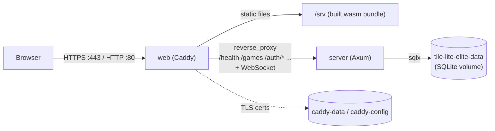
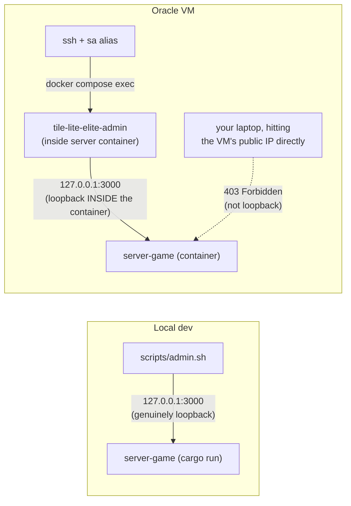

# Production Environment & Operations

The live production system: what actually runs, and how you inspect and
maintain it once a release is out. The release *procedure* that puts a version
here — test → stage → push → deploy → verify, and the `deploy.sh` machinery
under the hood — lives in
[Testing, CI & Release](3.3-testing-ci-and-release.md#shipping-a-change-the-full-sequence);
this doc is the steady state after that, not a second copy of it. Part of the
lifecycle series — see [docs/README.md](README.md) for the full sequence.
Follows [Testing, CI & Release](3.3-testing-ci-and-release.md).

## Container Topology

`Dockerfile`, `docker-compose.yml`, and `Caddyfile` at the repo root run the app as two containers:

- **`server`** — the Axum backend (`server-game`), release-built. Not published to the host; only reachable from `web` over the compose network, and via `docker compose exec`.
- **`web`** — Caddy, serving the release web build (`dx build --platform web --release`) as static files, reverse-proxying API/WebSocket paths to `server`, and handling automatic HTTPS. Published on `:80` and `:443`.



Same-origin end to end: the browser only ever talks to Caddy, which serves the static bundle *and* proxies the API/WebSocket from the same origin — see "Why one image serves both" below for why that matters.

SQLite lives on a named volume (`tile-lite-elite-data`, mounted at `/data` in `server`) — it survives `docker compose down` and rebuilds, but not `docker compose down -v`. See [Backups](#backups) for backing it up and [Inspecting the database](#inspecting-the-database) for reading it.

Caddy's obtained TLS certificate lives on its own named volumes (`caddy-data`, `caddy-config`) for the same reason — losing them means a fresh certificate request on next start, not a functional problem, just unnecessary churn against Let's Encrypt's rate limits.

**Why one image serves both, same-origin**: the web build is compiled with `TILE_LITE_ELITE_API_BASE_URL=""` (explicitly empty, not unset — see the [Configuration table](4.1-configuration.md#environment-variables)), which makes the client derive its API/WebSocket target from whatever origin actually served the page (`crates/ui/src/app.rs`'s `websocket_url`/`same_origin_websocket_url`). That's what lets the same compiled wasm bundle work regardless of the host's IP or domain, with no rebuild needed if either changes — and it sidesteps CORS entirely, since Caddy serves both the static assets and the proxied API from one origin.

**Setting `RESEND_API_KEY`**: `docker-compose.yml` reads it via `${RESEND_API_KEY:-}` substitution, which Compose fills in from a `.env` file it auto-loads from the same directory — *not* from the `environment:` block itself, so the real key never goes anywhere near git. Create it once on the VM (`scripts/deploy.sh` only ever scps `docker-compose.yml` and the image tarball, never `.env`, so this survives every future redeploy untouched — same handling as the deploy SSH key):

```bash
ssh tile-lite-elite
cat > ~/tile-lite-elite/.env <<'EOF'
RESEND_API_KEY=re_your_real_key_here
EOF
cd ~/tile-lite-elite && docker compose up -d   # picks up the new .env immediately
```

Leaving `.env` absent (or `RESEND_API_KEY` unset within it) is a supported, fully-functional state — see `RESEND_API_KEY`'s row in the [Configuration table](4.1-configuration.md#environment-variables).

## Admin CLI

The admin CLI — crate `crates/admin-cli`, binary/command name `tile-lite-elite-admin` — is operator tooling for a running server: list/delete users, reset a password, list/delete/force-end games, and read the daily record of what the database holds (`sa size`). It's a thin HTTP client against `server-game`'s `/admin/*` endpoints, not a separate implementation, so it can't drift from what the server actually does (cascading deletes, password hashing, etc. all stay server-side). Output is a table by default and JSON under `--json` — see [Reading the output](#reading-the-output) below.

**There's no admin account or token.** The `/admin/*` endpoints only accept requests whose peer address is loopback (`127.0.0.1`/`::1`), regardless of what `TILE_LITE_ELITE_BIND` is set to — running the CLI *from the server's own terminal* is the access control. This matters specifically because `TILE_LITE_ELITE_BIND=0.0.0.0:3000` (see [Development](3.2-development.md#manual-backend-only)'s LAN-play example) would otherwise expose these endpoints to the whole LAN, not just the machine running the server. In the container deployment it means the same thing: `/admin/*` stays loopback-only, and a request proxied in from the `web` container isn't a loopback connection, so the server rejects it the same as it would over a LAN. Where you run `tile-lite-elite-admin` *from* isn't a preference, it's the only thing that determines whether it works at all — the two cases below are genuinely different, not interchangeable:

**Local dev server** (running directly on this machine, not in a container):

```bash
./scripts/admin.sh users list
./scripts/admin.sh users reset-password <player_id>          # prints a generated password
./scripts/admin.sh users reset-password <player_id> --password 'a specific one'
./scripts/admin.sh users delete <player_id>

./scripts/admin.sh games list
./scripts/admin.sh games list --status waiting               # waiting | active | finished | aborted
./scripts/admin.sh games list --older-than-days 30
./scripts/admin.sh games delete <game_id>
./scripts/admin.sh games force-end <game_id>

./scripts/admin.sh --json games list | jq '.[] | select(.status == "waiting")'
```

`scripts/admin.sh` builds `admin-cli` in **release** mode and runs that binary — a plain `cargo run -p admin-cli` builds and runs a *debug* binary instead, which still works but is worth avoiding out of habit now that a script exists to do the right thing by default.

### Reading the output

Both listings are aligned tables, sized to the data rather than to fixed column widths. Timestamps are **UTC** — stated once in the column header, not repeated per row — and deliberately not converted to the machine's local time, which on a deployment VM is an accident of provisioning; they also line up that way with `--older-than-days`, which the server evaluates in absolute seconds, and with the raw values if you go looking in [the database](#inspecting-the-database).

`users list` shows each account's rating and how many rated games produced it. A rating of `-` means the account has never *finished* a rated game — distinct from an account sitting at the starting 1500, which is what makes "registered but never really played" visible at a glance. `last seen` is real activity (see `players.last_seen_at` in [4.2 Database Schema](4.2-database-schema.md#players)), refreshed on authenticated requests, not profile edits.

`games list`'s seats column marks what an operator triaging a stuck game needs: `[bot]` for an engine seat, `[unclaimed]` for a human seat nobody has taken (otherwise indistinguishable from a player named "Open seat"), `[out]` for a seat that resigned, was force-resigned, or timed out. Scores appear once a game has started.

`--json` prints the server's own records instead of a table — the full DTO, timestamps left as the epoch seconds the server sent — for piping into `jq`. It works on every command, including the mutations, which emit a small confirmation object.

Two behaviors worth knowing before you need them: `games force-end` is **refused** (400) on a game that has already finished or been aborted, rather than overwriting its result — so a mistyped game id is safe. And `games delete`/`users delete` have no confirmation prompt and no undo; they are the one genuinely irreversible pair here. `users delete` keeps the player's games, unclaiming their seat rather than deleting the history; see [Retention and Deletion](4.2-database-schema.md#retention-and-deletion) for exactly what each removes.

**The Oracle VM's (or any container deployment's) server**: `scripts/admin.sh` can't reach it — it always targets `127.0.0.1`, and that's a different loopback than the VM's, by design (see above; pointing `--server`/`TILE_LITE_ELITE_API_BASE_URL` at the VM's public address from your own machine just gets a 403, it isn't a workaround). Run it *inside* the server container instead, where `127.0.0.1` genuinely is that container. An alias `sa` has been set up on the VM so it can be called from any directory.

**The dev machine has the same two shortcuts**, written into `~/.bashrc` by
`scripts/setup-dev-environment.sh` — the split is because dev and preview run
the server differently, not as a convenience:

| alias | environment | why |
| --- | --- | --- |
| `sadev` | dev | the server runs natively on `:3000`, which is the CLI's default, so this is `scripts/admin.sh` — which also rebuilds the CLI if it is stale |
| `sapre` | preview | the server is in a container, and the host's `127.0.0.1` is not the container's, so `admin.sh` gets a 403; this runs the CLI inside |

```bash
sadev users list
sapre size
```

Re-running the setup script rewrites both lines rather than appending, so they
cannot drift out of date or accumulate.

```bash
ssh -i ~/.ssh/oracle_tile_lite_elite ubuntu@129.151.69.246
sa games list
sa size            # what the database has held, a row per day
cd ~/tile-lite-elite
docker compose exec server tile-lite-elite-admin games list
```



That binary is the release build baked into the `runtime-server` image by the `Dockerfile` — there's nothing extra to build or configure on the VM itself.

Deleting a user unclaims their seats (`player_id` set to null on `game_participants`) rather than deleting their games — game history and other players' records survive.

## Inspecting the database

For anything the admin CLI doesn't cover — an ad-hoc query, checking a column
value, confirming a migration applied — read the SQLite file directly. Use the
aliases; they exist so this is one word rather than a remembered incantation:

```bash
dbprod                       # production, over ssh
dbpre                        # preview
dbdev                        # dev
dbpre "select count(*) from games;"    # or one query, non-interactively
```

All three are `-readonly`: an inspection session cannot write, whichever
environment it lands in, and production is one keystroke away from preview.
`scripts/setup-dev-environment.sh` writes them into `~/.bashrc`.

### Notes on reading the database

**Why a container at all.** The database lives on a Docker volume
(`tile-lite-elite-data`, `/data` inside `server`), and the `runtime-server`
image is a slim Debian with no `sqlite3` binary. So the CLI runs in a separate
container mounting the same volume.

**Why a prepared image rather than a permanent container.** A container holds
the volume for as long as it exists — *including while stopped* — and
`deploy-preview.sh reset` does `down -v`, so a long-lived inspection container
silently breaks wiping preview until somebody remembers to remove it. The
answer is a throwaway container from a **prebuilt image** (`tle-sqlite`, a 5MB
Alpine with `sqlite` baked in): 0.8s per query against 3.3s for installing the
package every time, and nothing holds the volume between uses.

**`--rm` is not the protection it looks like.** It fires when the container
*exits*, and an interactive session that never exits — terminal closed, ssh
dropped, laptop shut — leaves it running. A container started this way was
found on production three weeks later, still holding the volume. If you use an
interactive session, exit it; and `docker ps` on the VM is worth a glance
occasionally.

**Do not reach for the volume's host path** (`/var/lib/docker/volumes/...`): it
is root-owned, so it needs `sudo`, and the container needs neither that nor a
copy. If you do copy the database out to read it with the host's own `sqlite3`,
take the `-wal` and `-shm` files with it — preview's WAL routinely holds more
than a megabyte the `.sqlite3` file does not yet contain, so copying one file
gives a silently stale answer.

**Production still installs the package per invocation.** `tle-sqlite` is built
on the development machine, not on the VM, so `dbprod` falls back to
`apk add --no-cache sqlite` each time. It works and it is slower; building the
image on the VM would remove the difference.

**Dev** keeps its database as an ordinary file in the checkout rather than in a
volume, so the host's own `sqlite3` reads it with no container at all:

```bash
sqlite3 -readonly data/tile-lite-elite.sqlite3
```

### Shortcuts on the dev machine

`scripts/setup-dev-environment.sh` writes `dbdev`, `dbpre` and `dbprod` into
`~/.bashrc` alongside the admin ones. Each is `-readonly`, which matters most
for the third: production is one keystroke from preview, and neither can write.

```bash
dbdev                                  # interactive
dbpre "select count(*) from games;"    # or a query as an argument
dbprod
```

`dbpre` runs a **throwaway container from a small prebuilt image** — built on
first use, about 5MB, roughly 0.8s per query against 3.3s for installing
`sqlite3` each time. `docker image rm tle-sqlite` refreshes it.

**Deliberately not a long-lived container.** One would be marginally faster
still, but a container holds a volume *even while stopped*, and
`deploy-preview.sh reset` does `down -v` — so a permanent admin container
would break wiping preview until somebody remembered to remove it:

```text
Error response from daemon: remove tile-lite-elite-preview-data:
volume is in use - [bcb2d45f...]
```

Baking the image rather than the container gets the speed without owning a
lifecycle.

`-readonly` is deliberate: it guarantees an inspection session can't accidentally write. Reading while the live `server` container is running is safe — the database is in **WAL** mode (see [4.1 Configuration](4.1-configuration.md#sqlite)), so a reader never blocks the server's writes or vice versa. Useful starting points once at the `sqlite>` prompt:

```sql
.tables                                          -- list tables
.schema games                                    -- one table's DDL
.headers on
.mode column
select id, status, turn_number from games order by created_at desc limit 10;
select version, description from _sqlx_migrations order by version;  -- migrations applied
PRAGMA journal_mode; PRAGMA foreign_keys;        -- confirm runtime pragmas
```

Prefer not to touch production at all? Restore a [backup](#backups) into a local volume (or just `tar xzf` it somewhere) and point a local `sqlite3` at the copy — same queries, zero risk to the live file. Remember the authoritative game state is the `snapshot_json` blob, not the flat columns (see [4.4 snapshot_json Schema](4.4-snapshot-json-schema.md) and [4.5 Data Dictionary](4.5-data-dictionary.md)) — the columns are queryable projections of it.

## Logging

`server-game` uses `tracing`, not `eprintln!`. Application-level events (registration, login success/failure, game created/started/finished, invitations, admin actions, move-time-limit retirement) log at `info` by default; per-HTTP-request spans (method, path, status, latency) from `tower-http`'s `TraceLayer` log at `debug` and are off by default to keep normal output readable.

```bash
# Default verbosity — app events, no per-request noise
cargo run -p server-game

# See per-request HTTP tracing too
RUST_LOG=server_game=info,tower_http=debug cargo run -p server-game

# Everything, very verbose
RUST_LOG=debug cargo run -p server-game
```

Failed logins log the attempted display name (never the password) at `warn`, along with the reason (unknown name vs. wrong password) — visible only to whoever can read the server's own logs, so it doesn't weaken the login endpoint's existing anti-enumeration behavior (the client always gets the same generic error either way). Admin actions (`admin_delete_user`, `admin_reset_password`, `admin_delete_game`, `admin_force_end_game`) log at `warn` specifically so they stand out as an audit trail even at default verbosity.

In the container deployment, this all goes to `docker compose logs server` (or `-f` to follow); `RUST_LOG` can be set as an extra `environment:` entry in `docker-compose.yml`'s `server` service if you need more/less than the default.

## Monitoring and alerting

Four things watch production. All publish to one OCI Notifications topic,
`tile-lite-elite-alerts`, which emails the owner.

| what | fires when |
| --- | --- |
| `tile-lite-elite-production-health-success-rate` | two of three external probes cannot get `/health`, for 3 minutes |
| `CPU 90%` | mean CPU above 90% for 5 minutes |
| `Memory 90%` | mean memory above 90% for 5 minutes |
| `Stopped` | the instance's status changes to stopped |

The external probe is an OCI **Health Check**,
`tile-lite-elite-production-health`: HTTPS `GET https://tileliteelite.com/health`
on port 443, every 60s with a 10s timeout, from three vantage points (AWS West
EU 3, São Paulo, Tokyo). Its alarm reads `oci_healthchecks` / `HTTP.isHealthy`,
`mean()` with `grouping()`, filtered to that monitor's `resourceId`, firing
below **0.5**.

The three host alarms read `oci_computeagent` on the instance named
`instance-20260712-1225-production`. Nothing was installed to make this work —
the Oracle Cloud Agent is present on the VM and its Compute Instance Monitoring
plugin was already publishing.

All of it was created in the OCI console. There is no code and nothing in this
repo builds it.

### Notes on monitoring

**Why the external probe is the one that matters.** The three host alarms are
published by an agent running on the host they report about, so if the VM goes
away, silence looks exactly like health. `RESEND_API_KEY` lives on that same VM,
so anything we wrote ourselves would have died with the thing it was meant to
report. Oracle's probes and alarms run outside it — which is the whole argument
for using their tooling here rather than writing our own.

**Why the alarm threshold is 0.5 and not 1.** With three vantage points the
mean is a vote: 1.0 all well, 0.67 one point down, 0.33 two down. Below 0.5
means at least two of three agree, so a single probe with a bad network path
does not page anyone.

**Two traps, both nearly shipped.** The Health Check's target must be the
**hostname**, not the instance the dropdown offers — probing the bare IP over
HTTPS fails the TLS handshake outright, since no certificate exists for an IP,
and a monitor built that way reports DOWN forever. And `grouping()` needs the
`resourceId` dimension filter: without it the alarm averages *every* stream in
the namespace, so adding a rehearsal health check later would give three
production streams at 0 against three rehearsal streams at 1 — exactly 0.5,
which is not *less than* 0.5. Production down, and silence.

**What is deliberately not monitored.** Filesystem free space: `oci_computeagent`
publishes disk I/O but not free space, and Oracle has no built-in metric for it,
so it would need a custom metric or paid Stack Monitoring. Deferred at 13% used.
Error rates, latency and request volume: there is no traffic baseline, and a
threshold picked from nothing produces noise, which is how monitoring comes to
be ignored. The test each of these fails is that **an alert wants a response** —
availability passes it, a rate does not yet.

**Memory is the one with a trajectory.** Every game ever played is held in RAM
and leaves only when deleted, so the number tracks the size of the table rather
than activity. It was 141MB of 954 when this was set up.

**Rehearsal is not monitored.** It is a clone for testing, not a service, and an
alert about it would want no response.

## Backups

SQLite lives on a named volume (`tile-lite-elite-data` in production, `tile-lite-elite-preview-data` in preview — see [4.1 Configuration](4.1-configuration.md#environments)). Back it up with:

```bash
docker run --rm -v tile-lite-elite-data:/data -v "$PWD":/backup debian \
  tar czf /backup/tile-lite-elite-data-$(date +%Y%m%d).tgz -C /data .
```

Swap the volume name for `tile-lite-elite-preview-data` to back up preview instead. Restoring is the reverse: stop the stack, extract the tarball's contents into the volume, start it again.

**Stop the server first.** SQLite runs in WAL mode here, so a copy taken while the server holds a connection can catch the main file without the WAL entry that completes it. `docker compose stop server`, snapshot, then `up -d`.

### Automatic pre-deploy snapshots

`scripts/deploy.sh` already does exactly this before every deploy, without being asked — server stopped, volume tarred to `~/tile-lite-elite/snapshots/`, stack restarted. It keeps the most recent few (`SNAPSHOT_KEEP`, default 5) so a 1 GB VM's disk doesn't fill quietly.

```text
snapshots/pre-0.4.13-fb36f50-20260731T164500Z.tgz
```

The name records the version and commit that were live *before* that deploy, which is what you want when choosing one to go back to. These exist for one purpose: **rolling back across a migration**, which cannot be done by redeploying an older image — that image refuses to boot against a database carrying a migration it doesn't know. See [Rolling back across a migration](3.3-testing-ci-and-release.md#rolling-back-across-a-migration).

```bash
./scripts/rollback.sh                    # list snapshots and the :previous image
./scripts/rollback.sh pre-0.4.13-...tgz  # database + images back
./scripts/rollback.sh --db-only <snap>   # database only, leave the code alone
```

`deploy.sh` also keeps the previous images tagged `:previous` on the VM, so a rollback is a retag rather than a rebuild — seconds, no transfer. It calls `rollback.sh` itself if a deploy's migrations or smoke test fail.

The restore discards everything written since the snapshot, so it asks you to retype the name. It is a *rollback* mechanism, not a backup regime — the retention is a few deploys, and nothing copies these off the VM. For anything you'd be sorry to lose, take a real backup with the command above and keep it somewhere else.

## Wiping production

Real, versioned migrations apply automatically on startup, so **wiping the database is no longer a normal part of shipping a schema change** — see [4.2 Database Schema](4.2-database-schema.md)'s "Schema migrations" note for the incident history behind that fix. The only remaining case for wiping production is a genuine "start over" decision (e.g. pre-launch testing), and even then, back up first:

```bash
ssh tile-lite-elite
cd ~/tile-lite-elite

# 1. Stop services — leaves the named volumes untouched, just stops the
#    containers so nothing's writing to the DB while you back it up.
docker compose down

# 2. Full backup of the data volume (see Backups above).
docker run --rm -v tile-lite-elite-data:/data -v "$PWD":/backup debian \
  tar czf /backup/tile-lite-elite-data-$(date +%Y%m%d).tgz -C /data .

# 3. Clear the DB from the volume so the new server starts fresh
#    (create_if_missing(true) recreates it, migrations included, on next
#    start). Renaming aside instead of deleting, if you'd rather keep a
#    copy in place as well as the tarball:
docker run --rm -v tile-lite-elite-data:/data debian \
  sh -c 'rm -f /data/tile-lite-elite.sqlite3 /data/tile-lite-elite.sqlite3-wal /data/tile-lite-elite.sqlite3-shm'
```
