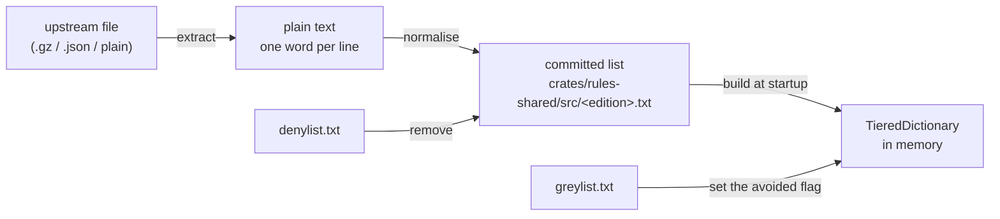

# Word Lists and Dictionaries

How a published word list becomes the trie the engine searches, and how to do it
again when a list changes.

Four editions ship a dictionary. Each is built from three text files: the
edition's own word list, plus the two shared lists that decide what nobody may
play and what no engine will choose. Everything between those files and the
structure in memory is described here.

> **Status, 2026-08-12.** Stages 1–3 have been performed once, by hand, and the
> results are committed. The tooling that makes them repeatable — `normalise`
> and the importer — is **not built yet**, and neither list has been sourced.
> This document is the agreed process and the runbook that tooling implements,
> written before the code so the shape is settled first. Where it describes
> something that does not exist, it says so.

## The four stages



Two of these are one-off human work (extract, and reviewing what the generators
propose); two are mechanical and must stay so.

## Stage 1: recording where a list came from

Provenance lives in [`ATTRIBUTIONS.md`](../ATTRIBUTIONS.md), not here — one
entry per list with its upstream URL, its licence, the count it was imported at,
and the count it ships at. A list whose origin is not recorded cannot be argued
about later, and one of the four already demonstrates the cost of that:
`sowpods.txt` predates the project, arrived with the original `scrabble` crate,
and no record survives of where it was obtained.

Add a **SHA-256 of the upstream file** to that entry when importing. It is the
only thing that lets somebody holding the original confirm the committed file
descends from it.

**What CI can and cannot check.** CI verifies that a committed list has the
right *properties* — sorted, deduped, uppercase, inside the alphabet, within the
length bounds, free of denied words. It cannot verify the list came from the
stated upstream, because that needs the network and a file that may have moved
or changed. Properties are checked automatically; origin is checked by a person
with the checksum. Do not confuse a green build for proof of provenance.

## Stage 2: extracting plain text from whatever upstream ships

The only per-source step, and the only one that stays outside the tooling.
Upstream formats differ and there is no value in teaching a Rust binary to
un-gzip and parse JSON when a shell pipeline does it in one line — that would
add dependencies to `rules-shared`, which compiles to wasm.

The output of this stage is plain text, one word per line, in any case. Confirm
the raw URL against `ATTRIBUTIONS.md` before running any of these; upstream
repository layouts move.

| edition | upstream shape | extraction |
| --- | --- | --- |
| `enable2k` | gzipped text | `curl -sL <url>/enable2k.txt.gz \| gunzip` |
| `german` | plain `words` file | `curl -sL <url>/words` |
| `spanish` | JSON array | `curl -sL <url>/index.json \| jq -r '.[]'` |
| `sowpods` | unrecorded | — |

## Stage 3: normalising a list so construction can trust it

One function, `normalise(text, &alphabet)` in `rules-shared`, applied to the
extracted text. It is **not built yet**. In order:

1. **Uppercase.** The board holds uppercase graphemes, so the dictionary must.
2. **`ß` → `SS`.** German only, before the alphabet filter. German sets have no
   `ß` tile and such words are physically played as two `S` tiles.
3. **Drop any word using a character outside the edition's alphabet.** This is
   why the function takes an `Alphabet` rather than assuming A–Z: Spanish files
   `Ñ` and has no `K` or `W`; German adds `Ä Ö Ü`. Taking the real `Alphabet`
   from `VariantRules` means the filter cannot drift from what the engine
   believes the letters are. Note it tests *characters*, not graphemes —
   Spanish's `CH`/`LL`/`RR` are digraph tiles, but the text is plain and
   unannotated, so `C`, `H`, `L` and `R` are all ordinary members.
4. **Drop words shorter than 2 or longer than 15 letters.** Nothing outside
   that range can be played.
5. **Remove denylisted words** (see stage 4).
6. **Sort and dedupe in byte order** — `LC_ALL=C sort -u`, and **never** a
   locale-aware sort. Byte order is code-point order for UTF-8, which is the
   order the prefix cursor's binary search assumes. German collation files `Ä`
   beside `A`, which would silently break lookups on the two non-ASCII lists
   while leaving the two ASCII ones looking perfect.

### Why normalising happens here and not at startup

Because the alternative was measured and rejected. Before commit `25e9e09`,
construction re-established sortedness on every startup, in every process, to
fix two defective bytes in one file. Normalise the data once, commit it, and let
every process that reads it trust the file.

The same argument moved denylist removal into this stage rather than leaving it
as a runtime filter over 7MB of text per list per process start. It also means
the removal is visible as a diff, which is better for review than an unexplained
deletion.

### The invariant that keeps it honest

The committed file must be a **fixed point of the normaliser**:

```rust
assert_eq!(normalise(committed, &alphabet), committed);
```

One assertion proves every property above at once, with no second copy of the
rules to drift. It fails the moment anyone changes an alphabet, the length
bounds, or either list without regenerating — which is exactly when a silently
wrong answer would otherwise be easiest to ship.

This replaces `every_compiled_in_word_list_is_sorted_deduped_and_blank_free`,
which checks ordering and blank lines but would not notice a lowercase word, a
19-letter word, `KWIK` in the Spanish list, or a denied word.

## Stage 4: generating the denylist and the greylist

The two lists, their different subjects, and why the denylist is deliberately
narrow are covered in
[`crates/rules-shared/src/wordlists/README.md`](../crates/rules-shared/src/wordlists/README.md).
This section is only how they are produced.

Both are generated with [`rustrict`](https://crates.io/crates/rustrict) as a
**dev-dependency of the importer**, never a runtime dependency: `rules-shared`
compiles to wasm, and classifying 1.6M words on every process start repeats the
mistake stage 3 exists to avoid. Record the crate version in `ATTRIBUTIONS.md`
— a regenerated list that silently differs is worse than no list.

### What was measured, and what it means for each list

Measured 2026-08-11 against `sowpods.txt` (267,752 words) with rustrict 0.7.38,
words lowercased before analysis because an all-caps string raises `SPAM` on its
own. `is_clean()` does not exist in the crate; the predicate is
`isnt(Type::ANY)`.

| threshold | words |
| --- | --- |
| `is(Type::ANY)` — anything flagged | 2,431 |
| `OFFENSIVE \| SEVERE` | 938 |
| `OFFENSIVE & SEVERE` | 185 |

**rustrict cannot generate a denylist, at any threshold.** It is a chat
moderator built to defeat evasion, so on isolated dictionary words it fires on
stems and topics rather than meanings. `OFFENSIVE | SEVERE` denies `HOLOCAUST`,
`SLAVERY`, `JEW`, `ANTIRACIST`, `AUTISTIC`, `NIGGARDLY`, `QUEER`, `RAPE` and
`SCUNTHORPE` — the last being the failure the module's own guard test is named
after, arriving through the generator rather than through the matcher, so
whole-word matching does not protect against it. Narrowing to the intersection
still denies `NIGGLE`, `NIGER`, `NIQAB`, `HOAR`, `FAGOTTO`, `SNIGGER` and six
Māori words including `TAONGA`.

So the denylist is **curated by a person** from a candidate set, and the
greylist is **generated**. That split follows from what each list costs when it
is wrong: a wrongly denied word is taken away from a human, who sees it and is
rightly annoyed; a wrongly greyed word is one the bot declines to play, which
nobody can observe.

### Generating the greylist

```text
greylist = rustrict is(Type::ANY)
         ∪ words matching a curated stem in greylist-stems.txt
         − denylist
```

About 2,500 words, ~0.93% of the dictionary.

The stem expansion exists because **rustrict's recall gaps are arbitrary**: it
flags `NEGROES`, `NEGROID` and `NEGROIDS` but not `NEGRO`; `POOFTER` but not
`POOF` or `POOFTAH`; `POONTANG` but not `POON`; `SMUTTY` but not `SMUT`; and
misses `MONG` entirely. A base word slipping through while its inflections are
caught is precisely the case the greylist exists to prevent.

Expansion is **per-stem and reviewed**, not a blanket substring pass, because
the two behave completely differently. Expanding LDNOOBW's 279 single-word
entries by raw substring adds 5,218 words — `ASSASSIN`, `BUTTERFLY`,
`PASSENGER`, `INSTITUTION`, `CLASSROOMS`, `SKYSCRAPER` — and surfaces about ten
genuinely bad ones. Even per-stem it is not uniform: `NEGRO*` is safe except
`NEGRONI`, a cocktail, while `MONG*` catches `MONGER`, `MONGOOSE`, `MONGREL`
and `MONGST`. `greylist-stems.txt` therefore carries stems *and* their
exclusions, and it is the file that holds the judgement, so it is committed and
reviewed like code.

**Err long.** Two changes made the cost of a large greylist effectively zero:
lookups no longer allocate, and `GreedyEngine` only asks whether a move is
avoided when it is about to become the new best — roughly `ln(n)` checks per
move instead of one per legal move. There is no performance argument for keeping
the list short, and there is a real reason to keep it generous.

### Curating the denylist

Not yet done, and not on the critical path: what an engine will never play is
the **union** of both lists, so an empty denylist with a full greylist already
gives complete protection against a bot playing something offensive. The
denylist only decides what a *person* may play.

When it is done, the candidate set is the 185-word `OFFENSIVE & SEVERE`
intersection plus the four slurs LDNOOBW catches that rustrict misses — `NEGRO`,
`MONG`, `POOF`, `POON`. Strike the false positives. Anything struck falls
through into the greylist automatically, so the review is safe in one direction:
strike too much and the bot still will not play it.

LDNOOBW has **no slurs sub-list** — it is one flat file per language, `en` is
403 lines, of which 279 are single words and 165 are playable in sowpods.

German and Spanish are out of scope for both lists. Neither can be reviewed by
somebody who does not speak the language, which is the blocker rather than the
sourcing.

## Stage 5: verifying a committed list

Run by `cargo test`, so CI enforces all of it:

- **the fixed point** — `normalise(committed, &alphabet) == committed`, per
  edition
- **whole-word matching** — `SCUNTHORPE`, `ASSASSIN` and `BASEMENT` survive a
  denylist containing their substrings
- **innocent words are absent from the committed lists** — the permanent form of
  the denylist review, naming the words that must never appear in it: `NIGGLE`,
  `NIGER`, `TAONGA`, `NIQAB`, `FAGOTTO`, `HOAR`, `SNIGGER`, `HOLOCAUST`, `JEW`,
  `AUTISTIC`, `ANTIRACIST`
- **the empty case is a no-op** — the state that ships today

## Stage 6: building the trie

`TieredDictionary::from_word_list(text, &alphabet)`, once per edition, behind a
`LazyLock` warmed by `build_all_dictionaries()` off the request path. The
arena is ordered by letter index rather than code point, which is why
construction needs the alphabet: Spanish files `Ñ` between `N` and `O`.

The greylist is applied **here**, not in stage 3, and the asymmetry has a
reason: denied words *leave* the data, greyed words *annotate* it, and an
annotation can only be attached while the structure is being built. It sets the
`avoided` bit — bit 29 of the packed child, beside `is_word` — so the property
travels with the dictionary instead of living in one engine's move loop, where a
future engine could forget to consult it. See issue #33 for the bit layout.

## Runbook: re-sourcing an edition's word list

1. Extract to plain text (stage 2); note the SHA-256 of the upstream file
2. `cargo run -p rules-shared --example import-wordlist -- --edition <name> < words.txt > crates/rules-shared/src/<name>.txt`
3. `cargo test -p rules-shared` — the fixed-point test is the acceptance check
4. Update that edition's `ATTRIBUTIONS.md` entry: URL, licence, checksum,
   imported count, shipped count
5. Commit the list and the attribution together; the diff is the audit

The importer does not exist yet.

## Runbook: changing the denylist or the greylist

**Greylist** — regenerate, commit, done. Nothing else depends on it; the trie
picks it up at build time.

**Denylist** — denied words are removed from the committed word lists, so
changing it means **regenerating all four editions** (stage 3, step 5) in the
same commit. The fixed-point test fails if you forget, which is the point of it
being a fixed point rather than a set of separate property checks. Expect a
large diff across four files; that diff is the record of what was removed.

## What is deliberately not automated

- **Extraction** — one line of shell per source, run rarely, versus permanent
  gzip and JSON dependencies in a crate that targets wasm.
- **Denylist curation** — a judgement about which words a person may play, which
  no classifier gets right (see stage 4).
- **Provenance verification** — needs the network and an upstream file that may
  have moved. The checksum is recorded so a human can do it.
