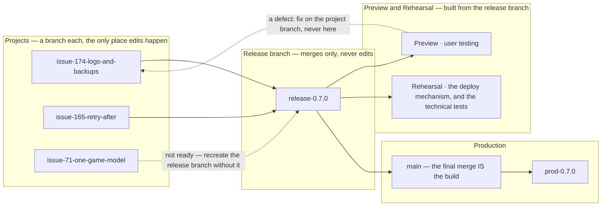

# The change lifecycle: from an issue raised to production

**What happens to a change**, from the moment somebody notices something to the
moment it is live and reviewed: how an issue is triaged, what a project is, where
the branches go, how a release is assembled, and what each step owes.

**Its sibling is [3.3 Testing, CI & Release](3.3-testing-ci-and-release.md)**,
which holds the *machinery* — the environments, continuous integration, the
deploy script, rollback, and the runbook of what to type. This document holds the
**rules**; that one holds the **mechanisms** they run on.

Split out of `docs/3.3` on 2026-08-21. Owner: *"3.3 has become a lifecycle
document from requirement being raised to production delivery. Which is fine, but
perhaps the lifecycle rules and the environmental technical stuff should be
separated."* They were already different sections; this makes them different
documents, so a reader looking for *"what happens when I raise an issue?"* is not
reading a document about testing.

**Three parts**, the same shape 3.3 uses:

| | |
| --- | --- |
| **[1 The flow](#1-the-flow-how-a-change-reaches-production)** | the levels, the three stages, and how a release is shaped |
| **[2 The rules](#2-the-rules)** | one subsection per rule, each carrying the case that produced it |
| **[3 Notes](#3-notes-on-releases-and-branches)** | what was learned the hard way |

## 1 The flow: how a change reaches production

**The levels, first, because every rule below is stated at one of them.**

| level | what it is | ends |
| --- | --- | --- |
| **programme** | the application *and everything we maintain to keep it going* — production, the dev, preview and rehearsal environments, the documents, the process | never |
| **workstream** | one capability, worked on indefinitely: the game model, the process, production operations | never |
| **project** | a bounded piece of work with fixed scope. **Any issue may become one**, and a project is often a single issue | when its scope is complete |
| **work package** | one unit of build inside a project. It delivers into the project and manages itself | when it merges |
| **delivery** | one act of putting change in front of whoever consumes it | when it is done |
| **release** | a delivery that **changes the application's build id and version** | when `deploy.sh` exits 0 |

*Delivery* is the general word and *release* is the specific one: a firewall rule
applied on the host is a delivery and is not a release.

**The workstreams, in three areas.** Owner, 2026-08-24: *"We now have three
areas: process definition, delivery tooling, operations."*

| | owns | ends at |
| --- | --- | --- |
| **Process Definition** (#188) | the rules, and the documents that state them — how a change is raised, classified, agreed and reviewed | it says what should happen |
| **Delivery Tooling** (#204) | the machinery that makes it happen — `deploy.sh`, `deploy-preview.sh`, the build model, CI, the release gates, test tooling | the release |
| **Operations & Infrastructure** (#189) | the service once it is live — the host, monitoring, alerting, logging, backups, disaster recovery | never; it is a running concern |

**A workstream's name is a proper noun, and is capitalised.** Decided
2026-08-28, with the test that settles every case: *"in a sentence I want to say
'This project belongs to Capacity Planning'."* Every other title in this
repository is sentence case, because a requirement or project title is a
**sentence**; a workstream name is the name of a permanent category. The capitals
say which kind of thing is being named before it has been read — and they will
sit beside field values like `tooling` and `Scope and design`, where the
distinction earns its keep.

Quotations keep whatever they said at the time.

**Two cuts produced them.** *"The clear division would be up to release, and then
production operations after release"* separates the third from the first two. A
deploy **is** the release, so deployment tooling sits before that line, not after
it. *"Separating the process from the tooling also works"* separates the first
two: writing the process down and building the machinery that implements it are
agreed, tested and delivered differently, and keeping them apart stops the
heavier obligation being applied to a paragraph.

**The last two cover every environment**, preview and rehearsal as well as
production. They are kept deliberately alike, and splitting their ownership is
the first thing that would make them drift — which is how `deploy.sh` and
`deploy-preview.sh` became two implementations of one principle (#134).

**The test is what a change is *for*, not how it shipped.** #174's logging
shipped as a release and is operations work, because what it changes is how the
running service is watched.

**There is no index issue.** #203 was one — pinned, listing the workstreams,
parent of all nine — and it was closed on 2026-08-28. Owner: *"it is better not
to have container issues, they shouldn't be needed, just a workaround."*

An index issue held four jobs, and by then it held none of them alone: the tree
root is now nine roots, which GitHub renders as well as one; what each
workstream owns is written *in the workstream*; what the levels mean is written
here; and the entry point is the
[programme board](https://github.com/orgs/delphside/projects/1), which shows the
same structure without anybody maintaining a list. A container that duplicates
what it contains goes stale in one direction only — quietly.

**The flow, in three stages.**

**1 · The project branch is where everything happens.** Apart from
[pre-approved](#22-when-to-branch-and-what-pre-approved-means) changes, every
project has one — a project is by definition work held back until it is whole. All of the project's
changes are made there until the **whole project** is delivered — including its
documents, the design and the test design specification in the project's folder.
A project with two overlapping deliveries may have a branch each, the later based
on the earlier.

**2 · The release branch is made by merging, and edited never.** A release is a
new version of the application forming some or all of a delivery, and it has its
own application version and its own branch — created by merging the branches of
the contributing projects.

**No change is ever made in it.** A defect found while testing is developed and
tested **on its project's branch**, and merged in. That is what keeps the release
branch reproducible, and reproducibility is what makes descoping possible:
**dropping a project from a release means recreating the branch from the others.**
A fix committed directly would be lost by that rebuild, silently.

The release branch is what preview and rehearsal are built from — preview for
user testing, rehearsal for the technical tests and for the deploy mechanism.

### One round of preview and rehearsal, or two?

**Two only when the merge changes the tree.** The rule underneath is *test the
artefact you will ship*, and a second round exists to catch a merge that made
something new — so when there is nothing new, it proves nothing.

| | |
| --- | --- |
| **`main` has moved**, and the merge combines work | **two rounds.** The combination has never existed before and is what ships |
| **a fast-forward** — the branch already contains `main` | **one round.** The tested commit and the shipped commit are the same object |

**Use `--ff-only` where it is available**, in place of the usual written merge
commit: a merge commit changes the sha, and the commit tested stops being the
commit shipped. The branch's own messages carry the story.

**Preview from the branch before merging is still worth it**, and is not part of
either round: it is a cheap look for whatever would otherwise reach `main`, and
it costs one command.

**The trade, stated because it is real**: a problem found in rehearsal after
merging means fixing on the branch, re-merging and re-testing. Accepted because
preview from the branch has already exercised the same tree.

### How much of this is a symptom of rebuilding

**Most of it.** *Which commit was tested?*, *does a merge commit invalidate the
gate?*, *is a second round of preview and rehearsal owed?* — every one of those
questions exists because each environment gets **its own build of the same
commit**, so "the thing tested" and "the thing shipped" are different objects
that we reason about being equivalent.

**Promote one artefact and the questions do not get easier — they stop being
questions.** You test image X and ship image X. The sha it was built from is a
label on it rather than a thing to keep in step, and the gate compares **digests**
instead of version strings, which is what stops it being blind (a rebuild of the
same commit stamps the same version, so `/health` cannot tell them apart).

That is **#134**, and it is not done. Until it is, the rules above are the
careful version of a thing that ought to be trivial — worth keeping, and worth
knowing why they are needed.

**3 · The final merge into `main` is the build.** As part of the production
deployment the release branch merges into `main`, and **that merge is the
artefact**: the basis for the final CI run, for a preview deployment for any last
user tests, and for a rehearsal deployment that tests the deployment process and
runs any last technical tests. The build used for rehearsal is then what goes to
production.

**Rolling an application change back is undoing that merge** — see [Rolling
back](3.3-testing-ci-and-release.md#211-rolling-back), which is the same operation described from the other
end.

**Where a project delivers by more than one route**, the ordering between them
lives in the project's own delivery runbook, not here: a step applied on a host
usually assumes the artifact is already deployed, and only the project knows
which way round.

**A branch per project**, named for its issue — and **a second branch where a
project's next delivery would otherwise be swept into a release being prepared
from the first**, based on it and named for the delivery
(`issue-174-logs-and-backups`, then `issue-174-d2-backups`). Not a judgement call each time —
the judgement is only whether two pieces of work belong to the same project, and
[2.9.11](#211-what-a-project-is-and-what-its-issue-carries) is the test for
that. A lone issue still gets a branch; it is simply a project with one
requirement.



### 1.0 The shape of a release

Three queues, named for the version slot each one releases into, so the answer and a
version number are the same word. The first thing to settle about any change is
which queue it is in.

| | **patch** | **minor** | **major** |
| --- | --- | --- | --- |
| what | a change that can go live quickly without needing to be grouped: an urgent defect fix, or something small like a cosmetic change | minor functional changes, normally released as a group; some of a group may be connected to each other | a major functional or architectural change with a large impact |
| chosen because | **either** it is low risk **or** it is urgent | it is ready, and worth releasing alongside whatever else is | its impact is large enough that it wants its own release |
| lives on | `main` | a version branch, `0.5.0` | a version branch of its own |
| released as | a patch, if it goes alone — otherwise it takes the version of whatever it rides with | a minor | a major |
| released with | nothing, if it is urgent; otherwise the next release going | whatever else is in the group | the changes it affects, and nothing else |
| owes | user testing | user testing per change, then again for the whole group | a design note in `docs/2.x` **first**, then all of the above |
| pull request | no | draft, from day one | draft, from day one |

**Low risk *or* urgent, not both.** A production fire is often not a low-risk
change, and it goes out today anyway, because waiting is worse than the risk.
A rule demanding both would push exactly the changes that need speed into the
slowest queue.

**A group need not be connected.** Three unrelated small changes can share a
release simply because all three are ready. Grouping is usually about the cost
of releasing rather than about dependency — and where a group *is* connected,
that is a reason to test it together, not a condition of forming one.

**A major release carries what it affects, and nothing else.** Not "ships
alone": the work a large change drags with it belongs in the same release,
because it exists to keep up with it. What must not ride along is anything
*unrelated* — the reason a major change wants its own release is that its blast
radius is hard to predict, and if something breaks there should be one
candidate rather than several.

### 1.1 The release attribute is a milestone, and so is a release

**Read [2.9.14](#215-classifying-a-change) first.** This
section was written when one word — *lane* — answered three questions at once,
and it has been re-worded rather than rewritten: the reasoning below is about the
**release** attribute, which is the question *does this need a release, and how
big?* Where it says *release attribute*, the original said *lane*.

An issue carries exactly one milestone, which makes the milestone field say
where the issue is in the pipeline:

| milestone | meaning |
| --- | --- |
| `no-release` | docs and tooling — **no application version carries it**, though it is still delivered |
| `patch`, `minor`, `major` | queued — the release attribute is decided, the release is not |
| `0.4.26`, `0.5.0`, `1.0.0` | scheduled — this is the release it goes in |
| `0.7.0a`, `0.7.0b` | a **delivery that ships no application code** — see below |

#### A delivery that ships no application code — D34

A host change, a console change or a drill reaches production without changing
the build, so no version names it and no `prod-*` tag records it. It still needs
identifying, because *all deliveries should be logged and identifiable*.

**The form is the production version plus a letter** — `0.7.0a`, then `0.7.0b`.
The version is **what production is running**, not what `Cargo.toml` holds:
`Cargo.toml` leads production by one, so during normal work it says `0.7.1`
while a delivery today is `0.7.0a`. The identifier names what production *was*
when the delivery landed, which is the fact a reader of the log wants.

**`0.7.0a`, never `0.7.0-a`.** The hyphenated form is valid SemVer, and SemVer
orders a prerelease *before* its release — backwards for something that happened
after it. The plain form is better precisely because nothing will try to sort it
as a version.

**The safety is structural, not a convention to remember.** `deploy.sh` reads
its milestone from `Cargo.toml`, which can only hold real SemVer, so a lettered
milestone **can never be matched by a deploy** and can never be auto-closed.
These are closed by hand, and nothing else will close them.

Recorded in [`4.9 Delivery log`](4.9-delivery-log.md). This supersedes the
earlier answer that such a delivery gets a row *with no version*.

**Only a project's deliveries get an identifier.** Owner, 2026-08-25: *"the
delivery log only needs to include project deliveries, with a label.
Pre-approved changes not listed as deliveries under a project do not get a
label. Change history must be derived from git."* A pre-approved change is one
nothing depends on (§2.2) and there are dozens of them — logging each would be
a worse copy of `git log`, kept by hand. The log answers *which planned work
reached its users and did it work*, not *what changed*.

#### A delivery can be shared across projects

**Gathering happens at three levels, not two.** Owner, 2026-08-28: *"project
deliveries can be shared across projects. That is mainly where application
changes are ready at the same time so we want to put them in the same
release."*

| | gathers |
| --- | --- |
| a **project** | requirements, where one delivery carries them well |
| a **delivery** | work from more than one project, where it is ready together |
| a **release** | whatever deliveries it carries |

**The reason is the cost of a release, not tidiness.** A release is rehearsed,
smoke-tested, tagged, watched and rolled back as one thing. Two projects whose
application changes are both ready pay all of that twice for no gain, and the
second waits — the same argument that lets a project gather requirements, one
level up.

**A shared delivery gets one row in [4.9](4.9-delivery-log.md) and one
identifier**, naming every project it carried. The identifier was never
per-project: `0.7.0a` is a delivery, and which projects it served is the row's
content.

**What it does not change is which project the release closes.** The rule below
still holds per project: a project sits in the milestone of **its own** last
delivery. A release carrying the last delivery of one project and a middle
delivery of another closes the first and leaves the second open, which is
exactly right and needs no tooling to know it.

**And it does not let a project skip its own obligations.** Sharing a delivery
shares the *act of shipping*, not the design, the testing or the review. Two
projects in one release are still two projects.

**What makes sharing safe is being able to unshare it late — #135.** Each
project's work is merged into the release branch from its own branch, so the
release branch is a **composition** rather than a place work happens, and
de-scoping is *"rebuild it from the same parts, minus one"* rather than
*"revert a change nobody can cleanly identify"*. Owner's proposal, from #133:
*"Is there a point that all changes are made on the issue branch and then merged
into the release branch. That way we could always rebuild the release branch
without one of the issues?"*

**Until that exists, sharing raises the cost of being wrong.** A release
carrying two projects is a release where user testing finding one of them not
ready has no cheap answer: the work is interleaved, and taking it out means
untangling it. So share a delivery when both projects are genuinely ready, not
in the hope that both will be — and read #135 as the thing that turns that
judgement back into a mechanism.

**It also sharpens #135's own open question.** That issue asks whether *rebuild
without it* or *revert it* is the primary mechanism, and leaves it open because
revert is cheaper while rebuild is cleaner. Shared deliveries answer it: what
has to come out is **one project's entire contribution**, not one change — and a
composition of merges is what makes that a single operation either way.

#### Answering a post-deployment check

**A check says how it is done, not what is being checked.** *"Run this script
and look for this line in the log"* can be run by anybody; *"the bot does not
play the plural"* names a fact and leaves the method to be invented. Owner,
2026-09-02, on #282 — where no method existed, because the greylist is compiled
in and only steers the engine's choice, so the behavioural test needs a
constructed rack and production deals at random.

**Three answers, not two.**

| | |
| --- | --- |
| **passed** | it was done, and the benefit is there |
| **cannot be tested** | there is no way to observe it in production. Say what evidence stands instead, and where it was taken |
| **failed** | it was done, and the benefit is not there |

with a note on what happened. *Cannot be tested* has to be visible as an answer,
because the alternative is a row left blank or a fact asserted without a method.

**Where a check cannot be run, two pre-deployment facts carry it instead:**

| | |
| --- | --- |
| the change was tested outside production, according to the project's test approach | |
| the change was identified as being in the build, when the build was made | see [4.9](4.9-delivery-log.md) and the build manifest |

Owner, 2026-09-02: the second is the weaker one, because *what is in the build*
is currently answered by the planning tools rather than derived from the build
itself — and those were wrong three separate ways in 0.7.1 before being corrected
by hand.

#### Milestones, deliveries, and which of them get an issue

**Every project delivery has a milestone, and it is recorded in the delivery
log.** If the delivery includes a release, the milestone is that release's
semver. Otherwise it is the previous semver with a letter appended.

**A project issue carries the milestone of its last delivery**, once that is
known — a release semver or a letter milestone, whichever the last delivery is.

**A delivery that is a release and is not the last one gets a Project Delivery
issue**, to hold its release's milestone. That is what lets it be planned, and
what makes the release's contents visible in GitHub's release view.

**A delivery that is not a release and is not the last one gets no issue** —
unless its `Pre-approved` answer differs from its project's. Such deliveries are
generally independent of other changes, so they need no planning of that kind.
The delivery log records them, and the project's deliveries table plans them.

| the delivery | milestone | issue |
| --- | --- | --- |
| the project's last one | its own | the project issue sits in it |
| an earlier release | the release semver | a **Project Delivery** issue |
| an earlier non-release whose `Pre-approved` answer differs from its project's | previous semver plus a letter | a **Project Delivery** issue, to hold that answer |
| any other earlier non-release | previous semver plus a letter | none |

**The second trigger exists because an approval has nowhere else to live.**
Owner, 2026-09-02. A project that is not pre-approved may still have one delivery
— a documentation update, say — that can go straight to `main`. Without an issue
for that delivery, the approval goes back to being a sentence in chat, which is
what the field was created to stop.

**"Differs" is what keeps it small.** A project approved as a whole covers every
delivery it has and needs no extra issues. Only the delivery whose answer is not
its project's gets one, and the sequence is: raise the issue, then approve it —
slightly more ceremony than approving in conversation, which is the point.

**Why the project issue needs a milestone at all.** `deploy.sh` closes every
open issue in the milestone it ships, which is right for one unit of work and
wrong for a project with several deliveries: it closed #174 on 2026-08-22 when
one of its three had shipped. Parking the project in its last delivery's
milestone means earlier releases ignore it and the final one settles it.

**A delivery to a non-production environment is a delivery in full.** It reaches
its users and it delivers a benefit; what it does not do is consume a version.
Owner, 2026-09-01, on #240: *"the first delivers the benefit of controlling
access to Rehearsal. The second delivers the benefit of keeping Rehearsal and
Production in line."* So the same change delivered twice is two deliveries, not
a delivery and a check on it, and the post-deployment check answers each benefit
separately.

**The runbook lives in one place, and which place does not matter.** Owner,
2026-09-02: *"it doesn't matter if the runbook is in the project or the project
delivery issue, as long as it is in one place."* Where a delivery has its own
issue the steps usually live there and the project's table links to it; where it
does not, they are in the table. What is not allowed is both.

**#240 is the worked example.** Delivery 1 redeployed rehearsal, so it is a
letter milestone, a delivery log row, and no issue. Delivery 2 carries the same
`Caddyfile` to production in 0.7.1 and is the last, so #240 sits in 0.7.1.

*This was recorded as unsolved (#195) while a milestone was the only marker a
project carried. The Phase field answers it: a project outside the milestones
shows the phase it is in.*

**What makes a change need no release is the artifact, not the audience.**
Documentation and scripts are compiled into nothing, so there is nothing to
ship and they are live the moment they land. Client and server code is in the
image whether or not its effect can be seen in production — it travels through
preview, rehearsal and production like everything else, and it can break
production while its feature is dev-only: a stray fetch, a render that panics
on a `None` only production produces.

So the question is not "will a user see this?" but **"does this get built into
what we deploy?"**. A change that only shows itself in dev is still a release
change if it ships in the binary.

**`no-release` names what does not happen, and the delivery still does.** Owner,
2026-08-24: *"I am not completely convinced by no-release. There is a delivery,
when it is merged into main"* — and then the terminology that settles it:
**release = an application version; delivery = the generic term for an updated
artefact reaching its users.** So *no release* denies the first and not the
second. The artefact reaches its users when it lands on `main` — **on save** if
it was edited there, **on merge** if it came from a branch — and that is a
delivery in full.

The milestone was called `merge` until 2026-08-24. That was worse for a reason
neither of us gave at the time: it named the way the commit **arrives**, not the
delivery. Under the standing pre-approval most process changes are edited
straight on `main` and never merged at all — and the delivery for all of them,
however the commit arrived, is the push to `origin/main`
([2.15](#215-classifying-a-change)).

#### Scheduling a release

**The placeholder milestones are queues**: `patch` for a change that can ship on
its own, `minor` for one that rides a grouped release, `major` for one that ships
alone. **Scheduling is moving an issue from its queue to a version.**

**`no-release` is the odd one out.** Documentation and tooling are live the
moment they reach `main`, so there is no deploy to wait for and nothing to
schedule — which is also why the queue accumulates. Every other queue is emptied
by a release; nothing empties this one.

**`patch` means a change *can* go out alone, not that it must.** The default is
to batch, and the reason is attention rather than cost: a release that carries
one change is looked at once, and four changes looked at together are looked at
less. It also asks that the change can be done *well* quickly — a fix that is
fast to type and slow to be sure of is not one.

**One larger change per release, not several.** A larger change has to be
understood on its own when something goes wrong, and two of them in a release
means neither can be.

**A release takes the version of the highest thing in it.** Four patch changes
make a patch; add one `functional` and it is not — which of minor or major is
the judgement made when the version is chosen.

**A slower queue never blocks a faster one**, which is the point of having three.
An isolated change goes to `main` as soon as it passes user testing and ships;
that holds only while `main` carries one change at a time, so a grouped or
structural change takes a branch named for the version it will become.

**Scope closes when it is set.** What is in a release is decided when the version
is chosen, not accumulated until someone stops.

### 1.2 Keeping a version branch current

The rule that keeps the three queues independent, and the one that will be
skipped if it is not written down.

**Merges flow one way: from the faster queue into the slower ones, after every
release.** `main` releases a patch, so `main` goes into `0.5.0`. `0.5.0`
releases and merges to `main`, so `main` — now carrying it — goes into the
structural branch. Never the other way: a slower queue's work reaching `main`
early is exactly what the three queues exist to prevent.

**And once more when the release's scope closes**, as the first step of
preparing it. Merge every change the release is taking, then merge `main`,
then rebuild preview from the result — so what is tested is what ships.

Not continuously, which is the tempting version. `main` moves throughout, so
merging as it does means re-merging repeatedly and resolving the version-line
conflict below every time; doing it once at scope-close is one resolution
against final content. It also matters that repository-route changes land on `main`
the whole time a release branch is open, so a branch cut weeks earlier is
carrying stale documentation and tooling until this step. And until scope
closes, the branch's history reads as the release's own — which is when
somebody most wants to see what it contains.

Skip it and the slower release quietly reverts a fix that is already live, and
the person who reported the bug is the one who finds out.

```text
main ──patch──▶ 0.5.0 ──▶ 1.0.0        after every release, forward only
```

```bash
git checkout 0.5.0
git merge main
git push
```

**That merge conflicts on the version line every single time**, because `main`
says `0.4.27` and the branch says `0.5.0`. The answer is always the branch's:

```text
<<<<<<< HEAD
version = "0.5.0"
=======
version = "0.4.27"
>>>>>>> main
```

Keep `0.5.0`. Taking `main`'s would silently turn the release you are building
into a patch, and the first thing to notice would be
`check-release-version.sh` refusing to ship it.

Nothing else fights: `check-commit-stamp.sh` reads each commit's version from
*its own* tree, so `0.4.27` commits sitting in a `0.5.0` branch are all correct
about themselves, and merge commits are skipped entirely.

### 1.3 Releasing a version branch: merge first, and fast-forward

**The merge comes before the deploy, not after.** `main` is what is live, so
merging into it is the act of releasing — and `deploy.sh` pushes back when the
sequence is wrong: a production deploy run from tooling that is **not on `main`,
or has uncommitted changes under `scripts/`**, warns and asks for confirmation
before going on.

It is a confirmation, not a refusal, and the distinction matters. Without a
terminal it *does* refuse, so nothing scripted can slip past it; with one, a
person who knows why can proceed. The check is on the **tooling** you are
running, not on the commit being shipped — that is always a clean worktree
checkout.

**Fast-forward if you can, and you usually can.** A version branch that has
been kept current has `main` as an ancestor, so the merge can be a
fast-forward — and then **the commit that was tested is the commit that is
released**, byte for byte.

```bash
git checkout main
git merge --ff-only 0.5.0
```

A `--no-ff` merge commit is right for a feature branch, where the commit marks
the change. It is wrong here, and not merely stylistically: it creates a new
commit that **nothing has previewed, rehearsed or checked**, and the release
gates then quite correctly refuse it — so the whole preview-and-rehearse lap
has to be run again against a commit whose only difference is the merge itself.
The tag records the release; the merge commit adds nothing but work.

If a fast-forward is not possible, `main` has moved and the version branch owes
it a forward-merge — after which it is possible again.

**And the forward-merge costs a lap.** It creates a merge commit, and that
commit has been previewed by nothing, rehearsed by nothing and tested by
nothing — so it needs its own CI run, its own preview and its own rehearsal
before production, exactly as any other new commit would. Budget for it: the
release is not "already tested" once the forward-merge lands, because the thing
that was tested is no longer the thing being shipped.

The way to avoid paying it is to keep the version branch current while the
release is being prepared, rather than discovering at the end that `main` has
moved. Repository-route work continues on `main` throughout a release, so `main`
moving is the normal case, not the exception — 0.6.0 collected eleven such
commits during its testing.

### 1.4 Delete the branch once its change is live

A merged branch that outlives its release is not harmless. `status.sh` calls an
issue "in progress" when a `Refs #N` commit exists that `origin/main` does not
have, so a branch left behind after its merge is mostly quiet — but one holding
a commit that never landed reports finished work as in progress, and the next
person to look has to open it to find out which.

Worse is a branch whose name and contents disagree. One survived here called
`issue-42-retention-sweep` whose only commit said `Refs #54`, holding a
superseded fix for a defect that had already shipped by another route. It cost
a real investigation to establish that it meant nothing.

**A branch merged through a pull request cleans up its own remote.**
*Automatically delete head branches* is on (set 2026-08-17), so a feature branch
disappears from GitHub the moment its PR merges. Only the local one is left:

```bash
git branch -d issue-79-last-move-highlight    # -d, not -D: refuses if unmerged
```

**A version branch does not**, because it never becomes a pull request — it is
merged locally with `git merge --ff-only` (above), which GitHub never sees. Both
halves stay manual there:

```bash
git push origin --delete 0.5.0
git branch -d 0.5.0
```

**"Live" means merged into whatever it will ship from, not deployed.** A
feature branch that has gone into a version branch is done, months before that
version releases — and until it is deleted it is a second copy of the same
document diverging from the one that will ship. That is not hypothetical: a
design note was read from a merged feature branch and found to be missing three
days of work, because the branch had stopped moving and the URL had not.

`git branch --merged main` lists the candidates. The lowercase `-d` is the
safety: it will not delete a branch holding work that is not in `main`, which
is the one mistake worth being stopped from making.

**`verify.sh` reports any that were missed**, as a `note` rather than a
failure — this is housekeeping, and it must not colour an exit status that
otherwise means something is wrong. It names only branches that are both merged
into `origin/main` and have had their remote deleted, which is the unambiguous
set; a branch that never had a remote might be work in progress.

**Why the local half can never be automatic**: nothing server-side reaches your
machine, and `git fetch --prune` removes the remote-tracking ref while leaving
the branch behind with its upstream marked `[gone]`. That is exactly how
`issue-33` and `issue-50` outlived their own releases — the remotes had been
deleted, so nothing on GitHub still showed them, and only the local copies
remained.

## 2 The rules

[2.8](#1-the-flow-how-a-change-reaches-production) is the flow. These are the rules that
govern it, each with a subsection carrying the reasoning and the case that
produced it — so you can find the one you need without reading the rest.

**A project issue carries seven headings**, each holding either text or a link to
a document — never absent, never empty. It was five until 2026-08-22, when
writing the template showed that nothing held a dependency. See
[2.9.11](#211-what-a-project-is-and-what-its-issue-carries).

| heading | |
| --- | --- |
| **requirements** | what must be true when this is done |
| **design** | how it will be done |
| **impacted artefacts** | what it touches, each marked **new** or **modified** |
| **test approach** | environment, tools, and what is measured against what criteria — as **two task lists**, functional tests on Preview and technical tests on Rehearsal, which `verify.sh` counts |
| **dependencies and related work** | what it waits on, what it overlaps, and what it anticipates — one line each, with the reason |
| **deliveries** | a **runbook** per delivery: the steps in order, the route each takes, and — filled in afterwards — which version carried it, and when |
| **post-deployment checks** | one check per requirement, saying **how** it is done. Answered **passed**, **cannot be tested**, or **failed** |

| | rule |
| --- | --- |
| [merging](#21-when-to-merge-and-what-to-hold-back) | Testing does not require merging. A project branch merges into a **release branch** when it is going in a release, and the release branch into `main` as part of the deploy. |
| [branching](#22-when-to-branch-and-what-pre-approved-means) | A branch exists to hold a change back. No branch means the change goes live immediately, which is what **pre-approved** means. A project either has a branch or it does not — if it has one, *everything* it touches goes there, documentation included. |
| [living documents](#23-living-documents-and-the-standing-issue-that-carries-them) | A document that is never finished gets a **standing issue**, which closes when its *subject* concludes rather than when an edit lands. It lives wherever its issue's changes live — `main`, or the project's branch. |
| [where a document lives](#24-where-a-document-lives-about-the-work-or-a-product-of-it) | A document lives wherever its issue's changes live. Testing documents belong to the release; design and test documents to the project, in its folder. |
| [tracking](#25-tracking-a-change-to-production) | `Refs #N` in the commit — **except where the change never leaves the repository, where `Closes #N` is correct**, because nothing else will ever close it. |
| [types](#26-type-of-change) | Every issue carries exactly one type label. |
| [evidence](#27-evidence-follows-what-the-change-does-not-its-type) | Evidence follows what the change **does**, not the label it carries. |
| [closing](#28-closing-an-issue-use-the-reason-not-a-label) | Use `stateReason`, not a label. |
| [documentation](#29-documentation-is-owed-by-every-type-not-just-its-own) | Every type owes documentation; the `documentation` label means the *whole* change is documentation. |
| [splitting](#210-requirements-split-projects-gather) | Requirements split into parts; projects gather them. An issue touching both tooling and the app is two issues. |
| [gate or check](#216-a-gate-refuses-a-check-reports) | A **gate** refuses and the work stops. A **check** reports and a person decides. |
| [classifying](#215-classifying-a-change) | Three questions, three answers: **type** and **release** on the issue, **route** on the delivery. *Lane* answered all three at once. |
| [triage](#218-triage-what-happens-to-an-issue-when-it-is-raised) | Four outcomes for an issue that is not rejected: straight to `main`, a patch project, a project of its own, or folded into one. |
| [projects](#211-what-a-project-is-and-what-its-issue-carries) | Issues group into a **project**, which owns the requirements from that moment. The sources are **folded** and closed. |
| [branches](#212-a-branch-belongs-to-a-project) | **One branch per project**, and it is the only place edits happen until the project is live. |
| [runbooks](#214-the-delivery-runbook) | Each delivery has a runbook: the steps before, and which version carried them, when, afterwards. |
| [artefacts](#213-the-impacted-artefacts-and-why-they-are-listed-early) | List what a change touches as early as possible, even wrongly — it is how two projects discover they collide. |

**Preview is not a step towards production.** It is where you look at
something. `./scripts/deploy-preview.sh at <branch>` builds any ref with no
merge, so "show me this on my phone" and "stand up the release for user testing"
are separate acts that happen to use the same environment. Most preview deploys
are the first kind.

### 2.1 When to merge, and what to hold back

Testing does not require merging — `./scripts/deploy-preview.sh at <branch>`
builds any ref. Merging is only needed to test changes *together*. So there
are two questions, with two deploys:

| | asks |
| --- | --- |
| `deploy-preview.sh at <project-branch>` | does this one change work? |
| `deploy-preview.sh at <release-branch>` | does the release candidate hold together? |

> Preview a **project branch** to test a change. Preview the **release branch**
> to test the release candidate. Merge when you have decided a change ships —
> not to look at it.

*This said "preview `main`" until 2026-08-21, when the release candidate stopped
living on `main`: it is assembled on the release branch and reaches `main` only
as the final act of deploying.*

**Small, uncontroversial changes** merge as they are finished, ready for the
next release. **Larger or controversial ones are held back** — where
*controversial* means **the change might change following review**, not that
it is risky. That is the sharper test: it is about likely rework, not
severity.

The reason the bar sits there is asymmetry. Before merge, removing a change
is `git branch -D` and `main` never saw it. After merge it is a revert —
history keeps both, which is correct but permanent. Merge is the point of no
easy return, so the bar is "confident this ships", not "want to look at it".

On 2026-08-03 six changes merged as they were finished: a tile-return fix, an
admin CLI argument, and four documentation changes — all small and
independent, so holding any back would have bought nothing. #9 and #26 are
the opposite: substantial, and likely to change following review, so they
belong on branches and previewed alone until settled.

**Merge by rebase and fast-forward, never a merge commit.** `deploy.sh`
requires preview to be running the *exact* commit being deployed. A merge
commit is a new commit that preview has never run, so it forces a rebuild
before you can ship. Fast-forward keeps the commit you tested and the commit
you release identical.

Then stage the merged result and follow the runbook. The gate enforces that
last step whether or not you remember it.

### 2.2 When to branch, and what *pre-approved* means

> **A branch exists to hold a change back.** Branch only when the change
> **cannot be put into `main` until the work is completed** — which is when the
> old versions of the documents and tooling are still needed in the interim.
> Otherwise commit straight to `main`. **A change that needs no branch is a
> pre-approved change**; the two descriptions are the same test asked from
> opposite ends.

Owner, 2026-08-23: *"We can make changes to main where there is no branch,
which is where we are happy that the changes go live immediately. Having a
branch implies we want to keep some changes back, because there is a project
doing development, or because we are making a significant change to an existing
document that needs review."* — and, asked whether this was a new rule or the
old one named: *"Yes, I am describing pre-approved changes."*

**This is the standard-change criteria** that [2.15](#215-classifying-a-change)
and the delivery table refer to. Both cited it before it was written down.

**Sharpened 2026-08-24.** It used to say *branch when you want to hold the
change back*. Owner: *"A branch is only needed if the changes cannot be put into
main until the work is completed, which would be if the old versions of the
documents and tooling are required in the interim."* That names **why** you would
hold it back, and "am I still operating by the old version?" is checkable in a
way "do I want to?" is not.

It is worth preferring over a list of cases because it asks about the **work**
rather than about a change's size or kind. A large change nothing depends on
belongs on `main`; a one-line change to a script people are running today does
not.

### The standing pre-approval for process changes

**Ad-hoc changes to the process, following discussion, need no project, no
branch and no separate review.** They are made directly in `main` and pushed.
Where issues were raised, they are **closed by hand** — nothing else will close
them. The full policy is on **#188**, which is where it belongs: it is standing,
and #179 is a project that ends.

**The discussion is the review**, done before the change rather than after it.
That is what makes this consistent with the paragraph above rather than an
exception to it.

**What the pre-approval is *for*.** Owner, 2026-08-24: *"pre-approval is for
things we can change quickly and safely, things that can't impact anything
else."*

That is the branch test from the other side. *Can it impact anything else?* and
*are the old versions needed in the interim?* are the same question: a change
nothing depends on can go straight to `main`, and a change other work is
standing on cannot.

**The first real case decided it.** #207 changes `scripts/deploy.sh` — the
script by which everything else ships. A half-finished version on `main` blocks
every other delivery, so the old one has to stay available, so it takes a
branch. Small, entirely in one file, and not remotely pre-approved. **Size is
not the test; blast radius is.**

**A view may be tweaked freely; what it reads may not.** Owner, 2026-08-27:
*"anything recorded against issues which is used by the tooling needs to be
documented and can't be changed without a record."* A project view is a saved
filter over data that lives elsewhere — get one wrong and nothing is lost, and
you see it immediately. An **issue type, an issue field, one of its option
values, a label or a milestone lane** is read by scripts that match the string
literally, so renaming one is a code change wearing a dropdown's clothing.

**The sharp edge is the release gate.** `check-release-version.sh` matches the
literal `functional`; rename it and every patch release passes its gate while
nothing appears to break. It happened on 2026-09-02: the option was renamed from
`minor-function` and the gate matched the old string until it was repointed. That is the same failure
that nearly shipped when the type labels were deleted, and it is why the values
are listed in [4.8](4.8-artefacts.md) with what reads them.

**Projects are still possible** inside a workstream, where significant changes
need design and testing documentation.

**Risk does not change the route, it changes what is owed.** Owner, 2026-08-24:
*"I think it covers prod and non-prod tooling. There is clearly different risk
for changes to `deploy.sh`, so it is more likely to require a project."* The
pre-approval settles **authorisation**. It says nothing about **rigour**: a
change to `deploy.sh` is pre-approved and still likely to need a design and a
test approach agreed before it is built, because a defect there breaks a deploy
rather than a sentence. Conflating the two is what made *lane* unusable.

**A project either has a branch or it does not** — the
[one-place rule](#212-a-branch-belongs-to-a-project). If it has one, **every**
change the project makes goes there: its code, its runbook, its design note, its
documentation, its corrections. Not *"the code is on the branch and the docs went
to `main` because they were only docs"*.

**The reason is reading, not tidiness.** Owner, 2026-08-23: *"This prevents
mistakes coming from looking at a branch and looking at main."* If a project's
changes are split, then neither place shows the project. Whichever you open, you
are reading a partial answer without being told it is partial — and the two
disagree silently, which is the failure mode that costs hours rather than
minutes. One place means what you read is what there is.

This was broken on 2026-08-22. `#174`'s branch was open, a correction to its
runbook was pushed straight to `main` because it was documentation — and `main`
had by then become the release candidate, so the commit landed in a tree being
tested rather than in the project that owned it. Nothing broke, but the deployed
commit had to be named explicitly to avoid shipping an untested tree.

**Two things follow.** `main` is not a staging area — anything on it is a
candidate for the next deploy, which is what
[1.4](#14-delete-the-branch-once-its-change-is-live) assumes. And a branch is
not free: it is a promise to come back, so branching a change nobody intends to
review just leaves litter.

**Worked example, on the side that commits to `main`.** The version bump after a
release (`aab9633`, 0.7.0 → 0.7.1) goes straight to `main` deliberately, so that
every change made afterwards picks it up. Holding it on a branch would mean every
other branch cut in the meantime carried the old version. There is also nothing a
reviewer could say about it: CI enforces the commit stamp, and
`check-release-version.sh` enforces the number.

**Worked example, on the side that branches.** On 2026-08-01 five finished issues
sat unreleased for hours while a sixth — the mobile scores row — iterated on top
of them on `main`. Six rounds of feedback from a phone, each a fresh commit, each
invalidating preview and re-running CI for five changes that were already done.
The change wanted holding back and did not get it, and the cost fell on the five
that were ready.

A doc typo does not need a branch. Anything you would want user-tested does.

### 2.3 Living documents, and the standing issue that carries them

"Nothing unfinished on `main`" and "every change has an issue" both assume a
document is written once and done. Some are not. A user testing status report
is rewritten every time a change is judged; a runbook grows as its procedure
is exercised. Neither is ever finished, and neither belongs on a branch.

The resolution is that **finished means accurate, not complete**. A living
document is finished whenever it correctly describes the state it reports on, so
"nothing unfinished on `main`" does not keep it off `main`.

**Where it lives follows its issue, not its livingness.** An issue with no branch
keeps its documents on `main`. **An issue or project with a branch keeps them on
the branch**, living or not, and they merge with everything else — because the
one-place rule outranks this one: no issue has changes in `main` and changes in a
branch. See [2.9.12](#212-a-branch-belongs-to-a-project).

*This reversed on 2026-08-21.* It used to say a living document belongs on `main`
without qualification, and the argument was readability — a testing report on a
branch is one nobody can read while the testing happens. That assumed reading
happens in a working tree, where one checkout shows one branch. **Documents are
read in GitHub**, where a branch is as readable as `main` and shows the version
the work is actually producing, so the argument had already gone. What is left is
the confusion of two current copies, which is the thing worth avoiding.

**Deciding to branch is therefore a decision to move the documents**, in the same
commit that creates the branch.

**A workstream's design note is one of these, and its parent issue is the
standing issue.** The note describes a state the code is not in until the last
work package lands, so it cannot belong to any one branch; and the parent
closes when the *subject* concludes rather than when an edit does. That close is
also the moment the note is deleted and what survives it moves into the numbered
documents — by hand, deliberately, which is why it is worth doing rather than
letting the parent close itself when its sub-issues run out.

So they get a **standing issue** rather than one per update:

- The issue names the document and stays open for as long as it is being
  maintained — through many commits, each `Refs #N`.
- It closes when the *subject* concludes, not when an edit lands. A release's
  testing report closes when that release ships.
- Updates need no issue of their own. Requiring one would mean a dozen issues
  saying "updated the report", which is bookkeeping rather than tracking.

The test for whether something qualifies: **would a reader be misled by the
current version?** If yes it is unfinished and wants a branch. If it is
accurate today and will simply say something different tomorrow, it is living,
and `main` is where it is useful.

`docs/changes/0.6.0-user-testing.md` is the first of these.

### 2.4 Where a document lives: about the work, or a product of it

Two kinds of document attach to a release or an issue, and they belong in
different places.

**About the work** — a testing report, an impact assessment, a decision note.
It has the same lifetime as the release or issue it describes, and it lives on
`main` from the moment it exists. A testing report kept on a branch is one
nobody can read while the testing it tracks is happening, which is the whole
point of it.

**A product of the work** — documentation the change itself delivers: a new
runbook, an updated section of this file, API reference for something being
built. It lives on the branch and lands with the change, because it describes
behaviour that is not true yet.

The test is the same one that decides whether something is finished: **is this
true now, or true only once the change ships?** A document saying "here is what
we are testing and how far it has got" is true now. A document saying "the
server accepts this new field" is not true until the server does.

So a release's own folder of notes is on `main` throughout, while the
documentation that release delivers arrives with it.

**Which owns it: the release, or an issue?**

- **Testing documents belong to the release. Always.** A test report, a testing
  status, an assessment of whether a release did what was wanted — release
  level, with no exceptions, so there is never a question where to look. A rule
  with a case-by-case judgement in it produces documents filed in two places and
  found in neither.
- **Technical design documents belong to the issue** that produced them — which
  may be a **parent issue**, and then the note lives on `main` for the life of
  the workstream. A note for a single change outlives no release; a workstream's
  note outlives several by design, because its work packages are separate
  branches and a note on one of them is invisible to the others.
- **One document has exactly one owner.** Where a document appears to belong to
  several issues, that is the signal those issues should be one issue: several
  issues collaborating on one product get a **parent issue** that owns the
  product and its documents, and the others become its sub-issues.

#### 2.9.4.1 Which document goes where

The two rules above cover most of it and disagree about the rest, because "test
plan" and "test report" are both testing documents and do not belong in the same
place. In full:

| document | owner | lives | ends |
| --- | --- | --- | --- |
| **design note** | the issue, or the workstream's parent issue | `docs/changes/workstreams/<workstream>/<n>-<name>/`, on `main` | deleted when the parent closes, its conclusions promoted into the numbered documents |
| **test design specification** | the **project**, or the issue where there is none | the project's folder — `docs/changes/projects/<name>/` — else the issue folder. It **stays**: it is the documentation for the regression tests it produced | never; it outlives the change |
| **test report, testing status** | the **project** | `docs/changes/projects/<name>/` | stays |
| **the deliverables** — edits to 1.x, 2.x, 4.x, the rules, the schema | the change that makes them true | the **branch**, landing with the code | permanent |

**The folder is named for the project, not for a version.** A project is called
`<workstream><letter>` — `71A`, `179B` — because its release version is not known
until it is scheduled, and a release is *"too volatile and imprecise"* to file
by (owner, 2026-08-20). A release is an attribute of a project: the mechanism by
which it puts changes live, and a project may have several. Where part of a
project ships early as a patch, that patch earns a release log entry rather than
a folder of its own. This keeps the rule *"testing documents are never filed by
judgement"* while admitting that a project and a release are not the same
thing.

**Where the release or the workstream does not exist yet**, a document is filed
under the issue that initiated it and moved later — including when an issue
*becomes* a sub-issue, at which point its documents move into the parent's
folder. Moving early is cheap, which is the argument for doing it promptly; the
five files already flat in `docs/changes/` stay where they are, because GitHub
does not follow a rename and several issue comments point at them.

**A folder appears when its first document does** — never by anticipation, never
empty. `scripts/check-docs.sh` refuses a change document that is in neither an
issue folder nor a release folder, so this is a gate rather than a hope.

The last rule is what stops the question "which branch does this go on?" from
having several defensible answers. If it has more than one, the issues are drawn
wrongly, not the document.

### 2.5 Tracking a change to production

`Refs #N` in the commit, never `Closes #N`. `Closes` fires when a commit
reaches the default branch — which, committing straight to `main`, is the
moment the code is *written*. Issues went green while still unreleased,
which is the one thing this tracking exists to distinguish.

**Except where the change never leaves the repository, where `Closes #N` is correct.** A documentation
or tooling change is live the moment it reaches `main`, so "reached the
default branch" and "reached users" are the same event and the objection
above dissolves.

**A reference in a commit message is never only an illustration.** Added
2026-08-28, from #229, which closed itself by accident. The squash-merge of #230
carried an example of the new milestone gate's output in its body:

```text
and reports what it closed: #229 Project (7 commits)
```

GitHub read `closed: #229` as a keyword and closed the issue — one the merge was
*about*, not one it delivered. The example was illustrating a feature using live
data, which is the natural thing to reach for and the wrong thing to write.

**So examples use a number that cannot exist**, `#0` or `#NNN`, or no number at
all. The keywords GitHub acts on are `close`, `closes`, `closed`, `fix`, `fixes`,
`fixed`, `resolve`, `resolves`, `resolved` — and any of them near a `#N`
anywhere in a commit body will fire, including inside a fenced code block, which
is where this one was.

**The commit carries the keyword**, not a pull request body. That works
whichever way the change reaches `main`, since GitHub acts when the commit
lands on the default branch — pushed directly or merged. Without it nothing
ever closes the issue, because `deploy.sh` closes issues in the milestone of
a *deployed version* and `no-release` is never one.

**A branch is optional here, and that is the point.** What this route rules
out is the *obligation* — a branch and a pull request for every typo — not
the option. Two things call for one, and either is enough:

- **Risk.** A branch buys CI's verdict before the change is live, which
  counts for more on this route than elsewhere: such a change has no
  preview or rehearsal stage behind it, so landing it is the whole release. A
  doc typo does not need that; a tooling change that could break a deploy
  might.
- **Duration.** `main`'s tip has to stay releasable, because a patch or
  emergency change deploys from it. Anything sitting there unfinished either
  ships alongside them or forces the release to reach back to an earlier
  commit. A substantial new document with a review cycle measured in days
  cannot sit in `main` half-written while an urgent fix needs to go out.

**The route records when a change goes live, not how big it is.** Tooling never
leaves the repository and can still carry a lot of functionality and testing —
rebuilding the release gate around named CI runs was that route, and so was the `status.sh`
rework. A substantial new document is the same shape. Neither belongs in a
slower queue, because neither reaches users through a release: there is
nothing to group them with and nothing to deploy.

So merge does not imply small, and it does not imply quick. The large ones
are precisely the changes that want a branch on both counts.

Label these `documentation`, `tooling` as well.
`status.sh` decides "live at merge" from the label, not the milestone, so an
unlabelled one is filed as reaching users and waits in "done, not yet
released" for a release that is never coming.

| | means |
| --- | --- |
| **issue** open/closed | is the work done |
| **milestone** open/closed | has it reached production |

Issues are assigned to a milestone named for the release. `deploy.sh` closes
that milestone and its issues on a successful deploy, and opens the next
one, so a closed issue means live rather than merged. `git tag --contains
<sha>` answers the same question at commit level.

**A milestone is a shipping list, and the deploy closes everything in it.**
Every open issue in the milestone is closed with a "Released in prod-X.Y.Z"
comment — built or not, tested or not, deliberately deferred or not. Nothing
checks. So **anything in the milestone that is not shipping has to be moved out
before the deploy**, not after: reopening afterwards leaves an issue that has
already announced a release it was not in.

```bash
gh issue list --milestone X.Y.Z --state open    # read this before deploying
```

This is not hypothetical in either direction. #67 was closed by 0.6.0's release
while the testing report listed it as *Deferred* — the only one of twelve not
verified — and it turned out to be genuinely broken, needing its own release.
Issue #151 was caught sitting unbuilt in 0.6.1 with an hour to spare.

The trap is that the milestone asserts a scope completed, and shipping is then
taken as evidence that each item in it worked — which is *evidence inherited
from a label*, and evidence inherited from a label cannot fail.

Version-bump commits need no issue.

**Removing a change that fails**: before merge, delete the branch — main
never saw it, and there is nothing to undo. After release, `git revert`;
history keeps both, which is correct, because production ran that code.

### 2.6 Type of change

**Every issue carries one `Type of change`.** It is descriptive — a change
classifies itself rather than having a test applied to it — and it says what the
change owes before it can ship. The field is authoritative; this describes it.

| type | what it is | ships by |
| --- | --- | --- |
| `documentation` | documents | its route: usually Repository Change |
| `tooling` | scripts, CI, the machinery around the app | its route |
| `cosmetic` | only a visual difference — nothing behaves differently and nothing on the wire moves | Production Release, as a patch |
| `bug` | the app doing the wrong thing | Production Release, as a patch |
| `functional` | the app doing something new or different | Production Release, and **not** as a patch |

**`documentation` and `tooling` do not change the app; the other three do.** That
settles the awkward cases: fixing a bug in `deploy.sh` is `tooling`, because the
app is untouched.

**`cosmetic` exists because a version number describes what the software does.** A
purely visual change is in the image and a person has to look at it, so it takes
the full release path — but nothing it does has changed, so it is a patch. It was
added after the last-move highlight was typed as functional, which made the
release gate refuse a patch: correct for the label, wrong for the change.

**`functional` is read by `check-release-version.sh`**, which refuses a patch
release whose milestone carries one. That is the single place this field decides
something rather than describing it — see [4.8](4.8-artefacts.md).

### 2.7 Evidence follows what the change does, not its type

The type decides **how a change ships** — which environments, which gates,
whether a design note comes first. It does not decide **what would convince
you the change works**. Name that in the issue when you raise it.

| a change that… | owes |
| --- | --- |
| alters a layout | eyes on it, at the sizes that matter |
| alters concurrency or capacity | load, in the rehearsal environment |
| fixes a defect | a test that fails before the fix and passes after |
| changes the schema | a migration applied to production's data, not an empty volume |
| changes the wire contract | a client built against the old version, still working |

The table above used to say a `functional` change owes "user testing on
the real artifact", and #11 showed why that is wrong. It bounded password
hashing and moved it off the async runtime — a person clicking through the UI
sees **identical behaviour whether it works or not**, because the difference
only appears under concurrency. User testing there would have produced a tick
against a box while proving nothing. What it actually owed was load: sixty
simultaneous logins against the rehearsal host, checking that `/health` kept
answering and that a refusal arrived as `503` with `Retry-After` rather than
a stalled connection.

Inheriting evidence from the type is how a change gets verified in a way that
cannot fail. Naming it per change is how it gets verified in a way that can.

**`enhancement` is deliberately absent** from the field's options: it occupies
the same slot as `functional` and adds nothing the five values do not already
say. GitHub's default labels went with the rest on 2026-08-27 —
`good first issue`, `help wanted` and `question` are collaboration signals for
a project with contributors to route, and there is one developer here.

**Why production tooling takes the full path despite not changing the app.**
`deploy.sh`, `deploy-preview.sh` and `rollback.sh` are not in the image, and
they still get every gate. They do not run *in* production; they act *on*
it. A defect there does not break the site directly — it lets a bad change
reach production, or removes your ability to release or roll back at the
moment you need it. That is exactly the class of bug the 2026-08-01 drill
found, and exactly why finding it needed a real deploy rather than a smoke
test.

**The test is about behaviour, not delivery.** Ask:

> Does it change what production does **on its own** — or only what happens
> when somebody **runs** something?

The app is what runs unattended and serves users: `server-game`, `ui`, and
`Caddyfile`, which configures a web server that runs continuously. Everything
that does nothing until invoked is tooling: `deploy.sh`, `rollback.sh`,
`seed-rehearsal.sh`, `status.sh` — and `admin-cli`, **wherever its binary
happens to live**. A tool is a tool wherever it lives.

An earlier version of this asked whether something shipped in the image. That
is checkable, and wrong at the edge: `admin-cli` ships in the image and is
plainly tooling. Where a thing is *delivered* says nothing about whether it
*acts*.

The image contents are still worth knowing, as supporting evidence rather
than as the test — it copies `crates`, `Cargo.toml`, `Cargo.lock`, `.cargo`,
`old-crates` and `Caddyfile`, and nothing else, which is why `docs/` and
`scripts/` cannot possibly affect a running production.

**And the label decides evidence and process, not deployment.** `admin-cli`
is `tooling` and still ships in the image, so it releases exactly as an
app change would. Type answers "what would convince me this works"; it does
not answer "does this need deploying".

### 2.8 Closing an issue: use the reason, not a label

GitHub has a native field for this — `stateReason`, carrying `COMPLETED`,
`NOT_PLANNED` or `DUPLICATE` — which is structured data attached to the
close event rather than a tag added and removed by hand.

The default labels that duplicated it (`duplicate`, `invalid`, `wontfix`)
were deleted for that reason: two mechanisms for one fact is how they drift
apart. `invalid` and `wontfix` both map to `not planned`, and the
distinction between them belongs in the closing comment, where it can say
something specific.

**One label survives beside the reason, and only because no reason fits.**
`folded` means *its requirement moved into a project and it was never delivered
as itself* — see [2.9.11](#211-what-a-project-is-and-what-its-issue-carries).
`duplicate` would be untrue, since a folded issue is not a second copy of
another; `completed` would be worse. So it closes as **not planned** *and*
carries the label, which is what keeps *closed* answerable in two ways:
delivered, or folded. Adding a label here is the exception, not a precedent —
the test it had to pass was that the fact is real, queryable, and unsayable in
the native field.

**The queue is a requirement with no workstream.** Decided 2026-08-28, #229:
*"I think the 'needs triage' should be requirements without a workstream."* The
workstream is the one triage act that **cannot** happen at raising — the form
has no parent field — so its absence is exactly *nobody has assessed this*.
Derived, so there is nothing to remember and nothing to forget.

**It replaced a label that lasted one day.** `needs-triage` was introduced on
2026-08-27 because a filter asking *"has nobody said what kind of change this
is"* missed #228, which arrived with `Type of change` and `Effort` set at the
form. That diagnosis was right — **classifying is not assessing**, and questions
6 to 8 are the ones triage exists for — but the remedy was wrong. A label has to
be applied by every route that raises an issue, and a route that forgets fails
silently. The parent link cannot be forgotten, because its absence *is* the
signal.

The label retired with the rule that fed it, leaving `folded` as the only one.
Folding needs no label removed any more: a folded requirement is **closed**, and
`folded` says which kind of closure it was.

Nothing removes it automatically today, which is the same gap as the four
manual actions that apply a triage (#215): the answer is decided, and putting
it where tools can read it is a separate act nobody holds.

```bash
gh issue close <N> --reason completed        # the work shipped
gh issue close <N> --reason "not planned"    # decided against, superseded
```

`DUPLICATE` is set from the web UI's close button; the CLI does not offer it.

There is no third state field. An issue is open or closed, a closure carries
a reason, and a milestone says whether it reached production. Anything
richer would have to be *stored* — a Projects board's custom `Status` field
is the usual answer — and storing status is what `scripts/status.sh` exists
to avoid: a derived view cannot drift, a field you forget to update can.

GitHub's native **Issue Types** would replace the six type labels with a
first-class field, but it is an organization-level feature and this is a
personal repository, so labels are the mechanism available.

### 2.9 Documentation is owed by every type, not just its own

The `documentation` label means *the whole change is documentation*. It is
not how documentation normally gets written.

> A change is not done until the documentation it invalidated has been
> updated, **in the same commit**.

Never a follow-up issue. `docs/4.3-api-schema.md` sat declaring API 2.4 for
five bumps because each change left its own doc update for later, and later
never came for any of them.

Documentation-typed changes come in two shapes with the same process and
different delivery: anything under `docs/` ships nowhere, while a doc comment
in `crates/**` rides the next release and moves the build id like any other
source edit.

### 2.10 Requirements split; projects gather

**The two levels pull in opposite directions, and that is deliberate.** Owner,
2026-08-28: *"requirements should be broken into separate parts. Project should
bring requirements together where it simplifies the delivery, even if it spans
workstreams."*

| | |
| --- | --- |
| a **requirement** | one thing, split as finely as it honestly divides |
| a **project** | as many requirements as one delivery carries well |

**A requirement becomes two** when it **touches both tooling and the app**, when
it **will be two releases**, or when it **belongs to two workstreams**. The second
is the one that gets missed: two releases means two changes even when the type is
identical.

**#160 is the worked example.** It held five GitHub features on one shortlist and
never felt ready to plan, because it was three types at once — a `bug`
(#234, nothing reports a vulnerable dependency), `tooling` (#235, no ruleset
on `main`) and `tooling` (#236, actions never updated). Split on
2026-08-28, each part became obvious on its own.

**A project may span workstreams**, and the test is whether it **simplifies the
delivery** — not whether the boundary is crossed. This reverses what this section
said until 2026-08-28, which read the splitting rule as governing both levels and
would have forbidden a project that gathers work naturally delivered together.

**Splitting a requirement costs nothing; splitting a delivery costs a release.**
Two requirements in one project are reviewed once, branched once, tested once and
shipped once. The same two as separate projects pay all of that twice, and the
second one waits.

**What a cross-workstream project still owes.** It carries **one** `Workstream`
value, because the field is single-select and one owner is the point. It takes
the workstream where the **content** is defined — the same rule that puts the
shared messaging mechanism with the game rather than with everything that uses
it ([3.7](3.7-workstreams.md)). A project that cannot say which workstream
defines it is not one project.

**And the sequencing rule survives the reversal**: where one half generates
requirements for the other, the generating half still goes first, whether they
are one project or two.

#### Spanning two workstreams: split it, and do the end-to-end half first

Owner, 2026-08-24: *"a number involve changes to end-to-end game logic (#208) and
related changes to UI logic (#209). So they fall into two workstreams. The design
and code should be kept separate — DTOs belong to #208, mapping DTOs to UI
controls is #209. The e2e logic should be worked on first. That will generate
requirements for UI logic."*

| | belongs to |
| --- | --- |
| what the game does, what the server says, the DTOs that carry it | **#208** |
| how that reaches a person: which control, which screen, what a notification does | **#209** |

**The end-to-end half goes first, and generates the other.** Until the game
decides what happens and what it broadcasts, the UI requirement cannot be written
except by guessing. Doing them together means designing the presentation of
behaviour that has not been agreed.

**This will be common rather than exceptional.** Owner: *"because #209 is a layer
on top of the game logic a lot of changes will have this property."* The client
UI is a layer providing access to every other capability, so most user-visible
requirements have a half in it. That is what the layer **is**, not a sign the
workstreams are drawn wrongly — §2.11's overlap test does not apply to it.

**The test for whether a split is needed** is whether the game's behaviour
changes at all. #88 (out-of-turn staging) is UI logic alone if staging is purely
client-side, and a split if it changes what the server accepts.

**Deferred work is a second release, so it is a second issue.** If part of a
change cannot be finished and the rest should not wait, raise the new issue
**before merging** — not after the release has closed the old one.

> Never milestone an issue with outstanding work. The milestone means
> "reached production", and `deploy.sh` closes every issue in it on release.

The tell is a commit message or issue comment saying "left deliberately" or
"tracked as a follow-up" with no issue number beside it: a split that has
been described but not made. #35 shipped that way — its diagram render was
deferred, the automation closed it, and the published picture disagreed with
the prose beside it until #46 finished the job.

Issues #9 and #10 are the worked example. Moving the DTO conversions to where a
client can reach them is `functional` and ships on its own; the bot
harness that then becomes possible is `tooling`. One issue for
each, with the dependency recorded, rather than one issue that is half of
each.

### 2.11 What a project is, and what its issue carries

**A project is a state an issue enters, not a thing created up front — and the
project always gets its own issue**, even when it implements a single
requirement.

- several issues are grouped, and a **new issue** becomes the project
- one issue justifies a project, and a **new issue** becomes it — the original is
  folded like any other source
- a project accretes further requirements later, which fold into it

**Never by rewriting the requirement's issue into a project's**, because the two
bodies serve different jobs. A requirement issue's body holds the conclusions
about the requirement, kept current as the comments discuss it; a project issue's
body is six headings kept current, and a stale one is worse than none. Overwriting the
first with the second destroys the record — and relying on GitHub's edit history
to hold it is weaker than it sounds: it is there, and it appears in no search, no
tool, and nothing anybody scrolling the issue will see.

So nothing has to be decided when an issue is raised, which is what keeps raising
one a five-second act. **Raise freely; consolidate deliberately** — the merging
happens in the *scope and design* phase, once, and visibly.

**But a project may be raised directly**, with no requirement first. Owner,
2026-08-28, having done it twice in a day: *"raise it straight as a project
again. I think that works well when it is 'no-release' pre-approved work we
intend to start straight away."*

That names the conditions precisely, and each one earns its place:

| | why it matters |
| --- | --- |
| **no-release** | nothing reaches users, so there is no release to schedule it into and no scope for it to compete with |
| **pre-approved** | the authorisation question is already answered, so the requirement would be recording a decision nobody has to make |
| **starting straight away** | a requirement's job is to survive until somebody looks at it. Work beginning now does not need to survive anything |

**A requirement is not a formality skipped, it is a record not needed.** Its
purpose is to hold what was noticed until it is assessed — so when the noticing,
the assessing and the starting are one act by one person, writing it down twice
records nothing. #229 and #232 were both raised this way; #207 was not, and
should not have been, because it had three requirements folded into it from
weeks earlier.

**This is not a licence to skip triage.** It is the same judgement triage would
have made, made at the moment of raising because nothing was waiting on it. If
any of the three conditions is missing — it ships to users, it needs approval,
or it is for later — the requirement comes first.

**The test for one project or two** is not how many issues went in. It is whether
one design can be written covering them without saying *"and separately"*.

#### The project owns the requirements, so its sources are folded

Once a project owns them, a source issue that is still live is a second place
requirements can change, and two sources drift silently.

**Folding an issue**: copy its content into the project **first**, then close it
with the `folded` label and a comment naming the project. Two rules keep the
freeze from becoming a trap — **fold before you freeze**, because closing an
issue whose requirement was never copied loses it; and **a frozen issue can be
thawed** if it turns out not to belong.

`folded` is a label rather than a close reason because GitHub offers only
*completed*, *not planned* and *duplicate*. The close reason is **not planned**,
which carries the one bit that matters: it was not delivered as itself. This is
the exception to [2.9.8](#28-closing-an-issue-use-the-reason-not-a-label) — the
reason is used *and* a label, because no native reason means "its requirement
moved".

#### One project, one design

A project does not accumulate a design per issue it absorbed. It has *a* design,
covering however many requirements it carries and however many deliveries it
takes to satisfy them. That is the fold seen from the other end: folding puts the
requirements in one place, and one design puts the answer there too.

#### Text or a link, decided per heading and driven by size

Owner, 2026-08-22: *"the project issue should either contain the content or point
to a project document. Although this is not a rule that each project will do one
or the other consistently. A small single issue project will have its
documentation within the project issue body, a larger project will have separate
documents and link to them. In the second case the project body should be kept
short to avoid duplicating the documents."*

**Per heading, not per project.** A project may hold its requirements as text and
link to a design; nothing has to be consistent across the five, because the five
are different sizes for different projects.

| | |
| --- | --- |
| **a small, single-issue project** | all six headings are text in the issue. There is nothing to link to, and creating documents for three lines each is the ceremony this process keeps refusing |
| **a larger project** | separate documents, and the heading is a link — **and the body is kept short** |

**The second half of that is the operative one.** A body that links *and*
restates is worse than either, because the two copies drift and the reader cannot
tell which is current. So a linked heading says what the document is and where it
is, and stops.

**The exception is the artefact names**, and it is deliberate rather than an
oversight. They stay in the issue even when a design document lists them again,
because a design lives on the project's branch until the project is live and the
issue is the part that is always visible — see
[2.13](#213-the-impacted-artefacts-and-why-they-are-listed-early). What must
*not* be repeated is the per-artefact detail: the names are an index, the
summaries are the content.

#### Why headings and not paragraphs

**An empty heading and a missing heading look identical in prose and mean
completely different things** — one says *nobody has decided*, the other says
*nobody thought to ask*. Headings make the difference visible, and a script can
check they are present.

A heading with three lines under it is a complete answer. The size of a project
changes how long each one is, never whether it exists.

### 2.12 A branch belongs to a project

| | |
| --- | --- |
| **created** | when the project starts |
| **during** | **the only place edits happen** — code, documents, everything |
| **merges out** | into a release branch, and to `main` as part of testing and deploying. More than once, if the project takes more than one release |
| **deleted** | when the project is **live** and closed |

**The one-place rule is about where a change can be made, not where content
exists.** A project's content reaches `main` every time it delivers while the
branch runs on; what is forbidden is editing in two places, which is what
produces a file whose two versions each look current.

**Deleting the branch only when the project is live is required, not tidy.** A
release branch is always rebuildable from the project branches — cut from `main`,
merge the projects named in the release, stamp the version — and **you cannot
rebuild from a branch that has been deleted**. Keeping it is what lets a project
be dropped from a release right up to the last release it needs.

**Nothing is ever committed directly to a release branch.** A fix made there is
lost at the next rebuild, silently, and the release then ships without a change
everybody watched being made. A defect found in preview goes to **its project's
branch**.

**A project branch is kept current with `main`.** A branch that has not seen
`main` for three weeks makes the rebuild a conflict resolution rather than a
mechanical step, and a conflict resolution is a change nobody reviewed.

### 2.13 The impacted artefacts, and why they are listed early

**The shape, first.** A project has **deliveries**; each delivery has
**artefacts**; each artefact has a **route**, which is a property of the artefact
and never stated. So the project's artefact list is the union of its deliveries'.

```text
project
  └── delivery            one act of putting change in front of its consumer
        └── artefact      what that act touches
              └── route   how it reaches its consumer — derived, not written
```

**The list carries a delivery column**, and that is not tidiness: three things
need the per-delivery set and cannot use the union. The **runbook** is written
per delivery and has to know which artefacts *this* act touches, in what order.
**Rollback** — *"what does undoing this delivery touch?"* — gets the wrong answer
from the union, which names artefacts a different delivery put there. And *"is it
delivered?"* has no answer at all for a project that is half-delivered, which is
every project with two deliveries for as long as it takes.

The union still does what the list was invented for: the collision test between
two projects works on the whole table.

Every project lists what it touches, each marked **new** or **modified**. The
list is a guess when the issue is raised, argued through design, and **accurate
once the design is agreed** — and once the test approach is agreed too, if the
testing builds anything, because **test tooling is an artefact** and the one most
often forgotten.

**Attempt it early even though it will be wrong**, because a wrong list naming
the right file finds a collision just as well as a right one. Three things an
overlap between two projects can mean:

| | |
| --- | --- |
| they are the same work seen twice | one project |
| one needs the other's change first | sequence them, and say so — a dependency found at merge time is found too late |
| they touch different parts of one file | do it once, or accept a conflict somebody resolves under pressure |

**An artefact is not only a file.** A change reaches production five different
ways, and a list that quietly means *files changed* describes only one of them. A
project may touch a host file, a bucket, an alarm and a GitHub label without
changing a line of code.

#### Derived does not mean hidden — show the route

Owner, 2026-08-22: *"in the artefact tables I think we should include the routes
as a column. They are derived from the artefact registry, but it is useful to see
them rather than having to look them up."*

**So the artefact table carries a route column**, and the distinction worth
keeping is between *stored* and *shown*:

| | |
| --- | --- |
| **not stored** | nobody decides a route, and nobody maintains it as an independent fact. It follows from what the artefact **is** |
| **shown** | because a reader asking *"what does delivering this involve?"* should not have to hold the convention in their head and translate each row |

Same shape as `status.sh` and `actions.py`, which display things nothing stores —
where a change is, what a release would ship. **Deriving a value is a reason not
to ask for it, never a reason to withhold it.**

**And the naming convention makes the column checkable.** A repository path, a
`production:` prefix, `OCI`, `github:` — the name already says which kind the
artefact is, so a row whose route disagrees with its name is a **typo, not a
decision**, and a script could say so. Not built; worth knowing it could be.

#### Naming, so two lists can be compared

| kind | canonical name |
| --- | --- |
| in the repository | its path from the repository root |
| on a host | the host role, then the absolute path — `production:/etc/…` |
| a cloud resource | provider, type, and the provider's own name — `OCI bucket tile-lite-elite-backups` |
| a GitHub object | `github:label folded` · `github:ruleset main` |

**A repository artefact is self-naming** — the path is the name and the file
either exists or it does not. Everything else is registered in
[4.8 Artefacts](4.8-artefacts.md), which holds exactly what git does not, and is
therefore also the answer to *"what else was on that box?"*

**Mark a provisional list provisional.** A guess that looks settled is worse than
no list, for the same reason a missing heading differs from an empty one.

#### A new artefact says whether it outlives the project, and when it runs

**Test tooling is the case that needs this**, because it is the only kind of
artefact that can look like coverage while being dead.

**The test for permanence is not how useful the script was during the project —
it is whether the claim it asserts is permanent.** *"The migration converted all
412 rows"* is true once, and the script that proved it is finished. *"No address
reaches the log"* must hold for as long as the service runs, so the script that
proves it has to keep running.

**A kept script with no trigger is worse than no script.** It becomes something
nobody has run since the release it was written for, and the repository then
shows a test for a property that is no longer being checked — coverage on paper
and none in fact. So every permanent test artefact records **when it runs**: in
CI on every push, in the release path when a release touches a named area, or on
a stated interval.

**Four categories, and the entry names which one it is:**

| | the claim | where it lives | when it runs |
| --- | --- | --- | --- |
| **1 · not relevant after the project** | was true once — *"the migration converted all 412 rows"* | **the project's folder** under `docs/changes/…`, not `scripts/` | during the project, and never again |
| **2 · part of regression testing** | must hold for as long as the service runs, and can be checked automatically | wherever the suite lives — `crates/*/tests/`, `e2e/` | **every time**, without anybody deciding to |
| **3 · triggered** | must hold, but cannot be checked on every push | `scripts/`, listed in [3.0 Tools](3.0-tools.md) | **on a schedule, or after a particular kind of change** |
| **4 · ad-hoc** | worth checking sometimes; nothing decides when | `scripts/`, listed in [3.0 Tools](3.0-tools.md) | when somebody chooses to |

**The line between 3 and 4 is the one that matters**, and it is not how important
the test is. It is whether **something other than memory** can fire it. A
schedule, a deploy gate, a condition on the changed files — all of those can be
made to happen. *"We should run this every few months"* cannot.

**So category 3 owes one more thing than the others: what fires it.** Not *when
it ought to run* — what makes it run. A quarterly drill with nothing scheduling
it is category 4 wearing category 3's clothes, and the difference only shows up
the year nobody notices it has not run.

**Category 4 is where tests go to be forgotten**, which is fine as long as it is
chosen rather than defaulted into. An entry there says **why it cannot be
triggered** — *"it needs a person to judge the result"* is a real answer;
*"nobody has set up the cron"* is category 3 with work outstanding.

**Where it lives is part of the answer, not an afterthought.** `scripts/` is the
toolkit: every entry is documented in `docs/3.0` and is expected to work. A
one-off left there is a permanent-looking thing nobody will ever delete, because
deleting somebody else's script always feels like the wrong call. In the
project's folder it is unmistakably part of finished work.

**A test in category 3 or 4 says why it is not in category 2.** *"It needs a
running stack"* and *"it takes eleven minutes"* are reasons that can stop being
true — and when the reason goes, the test should be promoted rather than staying
where it is out of habit. Without the reason written down, nobody can tell later
whether the placement was a judgement or an accident.

#### What the design owes on top

The design lists **the same artefacts and what changes in each** — the names are
deliberately in both places and nothing else is, because the issue is the part
that stays visible while the design sits on a branch.

The summary is **what the artefact does afterwards that it did not before**, not
what lines changed. *"Modified: added a function"* is what the table looks like
when it has died.

**And the depth owed is inverse to how well git records it**: least for a
repository file, where the diff is the detail and the summary is the intent above
it; most for a host file or a cloud resource, where there is no diff anywhere, so
that entry **is** the record and must be enough to do it again.

### 2.14 The delivery runbook

A project's *deliveries* heading holds **one runbook per delivery** — written
before as a procedure, completed afterwards as a record.

| written before | filled in after |
| --- | --- |
| the steps, in order, and the route each takes | which app version or build carried it, and **when** |

#### The delivery log row is part of the delivery

**Write it in the change that delivers**, not afterwards. Owner, 2026-08-26,
reviewing a delivery whose row was missing: *"as it is project delivery it
should have an entry on the delivery log."*

Three deliveries were recorded in three days and **two of the three rows were
added after the fact** — noticed each time, and each time by someone happening
to look. A row written afterwards depends on somebody remembering; a row written
in the same branch cannot be forgotten, because the delivery does not merge
without it.

**This is D36 one level up.** That rule says a decision is applied in the same
commit that records it, or an issue is raised. The same argument holds for a
delivery and its row: recording and doing are one act, or the gap has an owner.

**Only project deliveries get a row**, and pre-approved changes get none — see
[`4.9`](4.9-delivery-log.md), whose order is **oldest first, newest last**, so a
new row is appended.

#### It is filled in three times, not written once

Owner, 2026-08-21: *"the delivery runbook should be more detailed, giving all the
information necessary to do the delivery, even the commands to type. But that
detail may come later, when it is known, in time for the actual delivery."*

| when | what the runbook holds |
| --- | --- |
| **scope and design** | the **outline** — which artefacts, in what order, by which route. Enough to see the shape and to argue with it |
| **before the delivery** | the **commands**. The actual lines to type, the console pages to open, the file to write. This is the gate: **a delivery does not start until its runbook is executable** |
| **after** | which version or build carried it, and when |

**Writing the commands out in advance is a design check, not clerical work.** It
is where *"apply the drop-in on the host"* turns into a path, a `sudo`, and a
`systemctl` — and where you discover the step needs something nobody had
mentioned. A step that cannot be written down yet is a step that is not
understood yet, and finding that out at the keyboard at eleven at night is how
production incidents start.

**And for the host and service routes it is the only record that will exist.**
Nothing else says what was typed. A runbook written *afterwards* is a memory of
what somebody thinks they did; written before and ticked off as it goes, it is
what happened.

**The second column is the part with no substitute**, and it earns its place
three times over:

- **host and service steps leave no other trace.** A firewall rule applied on a
  Tuesday is in no diff anywhere; the runbook line is the whole history
- **a delivery may span more than one release**, so *"is this delivered?"* is only
  answerable by knowing which release carried which step
- **rollback.** If a host change went out alongside `0.7.0` and production rolls
  back to `0.6.3`, **is the host change still valid?** A journald drop-in
  survives; a script calling an endpoint that no longer exists does not. Only the
  runbook recorded the pairing, so only the runbook can answer

**It is not a second copy of the delivery log.** The log holds one row per
delivery across the whole programme — version, date, kind, where, what, outcome —
for somebody asking *what changed in production, and when.* The runbook holds
every step for somebody doing it, or undoing it. The version and the date appear
in both, deliberately, and the log is **derivable** from the runbooks and the
tags — which is the direction to generate it, if it is ever generated.

### 2.15 Classifying a change

**Three questions, three answers**, each recorded on the issue in its own field.
[4.8](4.8-artefacts.md) lists every scheme in one place; these are the three that
classify a change rather than describing where it lives.

| question | field |
| --- | --- |
| what kind of change is this? | `Type of change` — §2.6 |
| how does it reach its users? | `Route` |
| which delivery carries it? | `Milestone` |

**None of them says who owns it.** That is the `Workstream`, and it is a
different question: a change to rehearsal's exposure is Operations work even
though rehearsal is not production.

#### Route

| route | reaches its users | takes a semver |
| --- | --- | --- |
| **Production Release** | when `deploy.sh` deploys to production | **yes, always** |
| **Repository Change** | when it is pushed to `origin/main` | no |
| **Other** | when somebody applies it — a host, a console, a deploy to preview or rehearsal | no |

**A release always takes a semver**, even when only the `Caddyfile` changed. The
version is compiled in, so bumping it rebuilds the binary: the new number names
bytes that genuinely differ.

**An artefact has a route and a delivery takes the heaviest of them**, in the
order above. `docs/4.8` records each artefact's route, which is where the field's
value comes from.

**The repository route has one delivery moment: the push to `origin/main`.**
Documents are read from `origin/main` and scripts are run from the local `main`
in dev, so until it is pushed a change exists on one disk. The test is what would
survive a rebuild elsewhere.

**Run an unpushed script to test it, never to use it.** Exercising one to find
out whether it works is how it gets built; using one to do a job depends on a
state that exists nowhere else and cannot be reproduced by whoever looks next.

### 2.16 A gate refuses; a check reports

Two words for two different things, used strictly from 2026-08-21. They had been
interchangeable, and #137's audit found `docs/3.3` describing one as the other —
which is what a word doing two jobs eventually does to a reader.

| | it | example |
| --- | --- | --- |
| **gate** | **refuses.** The work stops and there is nothing to decide | `deploy.sh`'s nine gates; CI's `check` job on a protected branch; the review checklist while a box is unticked |
| **check** | **reports.** A person reads it and decides | `verify.sh` after a deploy; `status.sh`; the warning when tooling lands on `main` |

The distinction is not about severity but about **who acts next**. A gate has
already decided; a check has handed you something to decide with.

### 2.18 Triage: what happens to an issue when it is raised

|||
| --- | --- |
| **requirement**  | A request for a change.  Can be raised quickly and analysed in more detail later.  **Unless the project is already clear** — then raise the project and skip this, see [Straight to project](#straight-to-project). |
| **triage**  | Initial assessment.  Add any useful info but the minimum is ensure a clear short description and set workstream, priority and type of change.  |
| **scope** | Functional options to meet the requirement.  Technical options.  **Feasibility** — check that the option recommended can actually be done, rather than assuming it.  Identify dependencies.  Make recommendations and set effort accordingly.  |
| **project planning**  | Should this requirement be in an existing project?  Should it be grouped into a new project?  Is it urgent and need to be released in it's own project?  |
| **projects**  | When a project is raised the requirement is made a sub-issue, labelled as 'folded' and closed.  Projects have their own lifecycle to deliver the required change. |

#### The Requirement Lifecycle

```text
requirement ──triage──▶ ──scope──▶ ──ready for project──▶ ──planninng──▶ candidate solo project/ candidate grouped project/ on hold/ cancelled
              enriches    enriches  └──── the backlog ────┘   creates
```

The work involved in triaging, scoping and planning requirements is a continual process which is a function of the programme.

#### Applying Decisions — D36

Owner, 2026-08-26: *"either the answer is applied in the same commit as the
decision is marked decided, or an issue is raised."*

**Recording a decision and applying it were two acts, and only the first had a
home.** *"I will apply it later"* is the state this abolishes: later has no
owner, no date and no record, and four times out of four it did not happen —
D34 over D6, D7 left unapplied and going stale, seven decisions living in issue
comments, and D5 reaching the documents but not the issues that assumed
otherwise.

> A decision marked **answered** is applied to the numbered documents **in the
> same commit** that marks it answered — or an **issue is raised** and named in
> the decision.

**An issue is the honest answer** when the decision needs design, or is blocked
on work that has not happened. D7 was exactly that. The failure was not the
deferral; it was that the deferral lived nowhere a tool could see.

**It gives *applied* a signature**, which is what makes checking it possible: a
citation in a numbered document, or an issue number. Both are queryable, and a
good intention is not.

#### What triage asks

**Eight questions, in no fixed order** — D35: you cannot prescribe which
categorisation gets made when. Some answer themselves; the last three are where
the value is.

| | question | where the answer goes |
| --- | --- | --- |
| 1 | **Is it real, and still relevant?** | close it, or carry on. *Reject* is a legitimate outcome, not a failure |
| 2 | **What kind of change is it?** | the **Type of change** field |
| 3 | **What does it touch?** | the artefact guess. Route is derived from it, so route is never asked |
| 4 | **Which capability owns it?** | the workstream — made a sub-issue of it |
| 5 | **What carries it to users?** | the release attribute — a milestone |
| 6 | **How big is it, roughly?** | the **Effort** field. A band, not an estimate |
| 7 | **What else does it relate to?** | the comment: dependencies, overlaps, and whether it should be planned on its own at all |
| 8 | **What do we know now that the raiser did not?** | the comment. **Conclusions are edited into the body; discussion stays in the comments** |

**The standard reply.** Paste this into the triage comment and fill it in. It is
here rather than in a separate file so the form and the rule cannot drift apart;
copy it into a GitHub **saved reply** (Settings → Saved replies) if you find
yourself typing it.

#### The triage comment

**Paste this and fill it in.** Here rather than in a separate file so the form
and the rule cannot drift apart; copy it into a GitHub saved reply if you find
yourself typing it.

````markdown
## Triage

*`Type of change`, `Effort`, `Priority`, `Workstream` and `Stage` are set in the
sidebar, not here.*

### Impacted artefacts

| artefact | new or modified | route |
| --- | --- | --- |
| | new · modified | repository · host · service |

### Context

*What else this relates to, what it overlaps, and whether it should be planned
on its own at all.*

### What we know now that the raiser did not

*The point of the exercise. If there is nothing here, triage found nothing.*

Typed by Claude
````

**It holds only what no field can hold** — the artefacts, the context, and what
triage found that the raiser did not know. `Workstream`, `Type of change`,
`Effort` and `Priority` are set in the sidebar, and asking again here would
record the same fact where nothing reads it.

**No date**: GitHub timestamps every comment, and a saved reply cannot fill in
today's, so a typed one eventually goes stale.

**Question 1 has no row.** If the requirement is not real or no longer relevant
the issue is closed, not annotated — *reject* is an outcome of triage rather
than a value in it.

**Leave nothing blank in the last two.** Context and what-we-know are where
triage earns its place; a comment with both empty has classified an issue rather
than assessed one. Keep them short: triage decides **whether and with what**,
not **how**, and a comment that argues the design has done the project's work
before the project exists.

### Exceptions to the Normal Process and Pre-Approval

The normal process for making a change involves a requirement, which is folded into a project, which is developed on a branch, which is merged into a release, which is deployed to Preview, Rehearsal and, finally, Production.

However there are exceptions to this process.  These can apply in the following situations:

- the change is well understood and does not need further analysis
- the change does not affect the production service
- the change is small and already agreed
- the change is only to documentation for a particular project

In particular a change can be 'pre-approved' meaning it is allowed to bypass parts of the normal process.

#### Make tooling changes when they are first needed

Owner, 2026-09-02. Tooling work is scheduled by the first thing that needs it,
not by the fact that it would be an improvement. A change nothing is waiting on
is paid for now and used later, and *later* is where it goes stale before it is
used at all.

**#279 is the worked example.** The desktop client compiles a vulnerable
`webbrowser` and unmaintained GTK3 bindings, and neither can be fixed without a
dioxus upgrade. That upgrade is real work, and no desktop build is distributed
to anybody — so it waits for #38, the decision about a download site, and
happens as part of it.

**It is a scheduling rule, not a licence to defer.** The requirement is still
raised and still says what is wrong; what waits is the doing. The thing that
would make it wrong is silence — a defect nobody wrote down, waiting on nothing.

**On Hold comes after triage and scoping, not instead of them.** Owner,
2026-09-02: *"it should go through Triage and Scoping on the way, which sets some
more fields."* A requirement parked before it is scoped is parked without a
priority, an effort or a type — so nothing can weigh it against anything else
when the thing it waits for arrives. Scoping is also what produces the
dependency note that says why it is waiting.

**So a waiting requirement goes one of two ways**, owner 2026-09-02:

| | |
| --- | --- |
| **On Hold**, with a note under **dependencies** saying what it waits for | when the thing it waits on is not yet a project |
| **folded into that project** | when it is, because the need and the work are one piece |

Issue #279 took the first: #38 is a requirement, not a project, so there was nothing to
fold into. If #38 becomes a project, #279 folds into it — the dioxus upgrade and
the vulnerabilities it clears are the same work.

#### Straight to project

If the change is well understood and does not need further analysis there is no reason to raise a requirement.  A project can be raised directly.

**It has to be said where the requirement rule is stated, not only here.** Owner,
2026-09-02: *"there is an earlier rule 'where there is a gap raise a requirement',
so that tends to happen before we consider 'straight to project'."* A rule stated
first is the one followed, so the caveat belongs beside it — which is why the
requirement row above carries it.

**A requirement can also be converted to a project**, and nothing is lost by
having raised one. The point is not that converting is difficult; it is to avoid
spending time raising a requirement when the project's shape is already known.
Issue #288 was raised as a requirement and converted the same hour, which is the step
this rule exists to skip.

#### Change directly on main

Changes can be made directly on main without going through a branch and pull request if they are straightforward documentation or tooling changes which do not need a review before they are 'live'.

**The approval is recorded on the issue, in the `Pre-approved` field.** Owner,
2026-09-02, on creating it: *"It's a way for me to do it with a record, rather
than just saying in chat."* Values are `Pre-approved` and `Not Pre-approved`.

**The question it answers, in the owner's words:** *"there is no risk doing this
directly on main without further review."* That is the branch test asked from the
approving end — [2.2](#22-when-to-branch-and-what-pre-approved-means) asks whether
the old version is still needed in the interim, and this says nobody needs it.

**It is on all three issue types, and means something different on each.** Owner,
2026-09-02:

| on a | `Pre-approved` says |
| --- | --- |
| **Requirement** | no project is needed. The change goes to `main` and the requirement is closed by hand |
| **Project** | the project needs no branch — everything it touches goes straight to `main` |
| **Project Delivery** | this delivery specifically can be done on `main`, whatever the project does |

They are independent, and the third row is why that matters: a project can be
`Not Pre-approved` and still have one delivery — a documentation update, say —
approved to go directly.

**Unset reads as `Not Pre-approved`.** Owner, 2026-09-02: the field cannot be
given a default, *"so we must take that as meaning 'not pre-approved', or it will
catch us out in the future."* Only the explicit value authorises; anything else —
unset, or `Not Pre-approved` — means the change takes a branch and a review.

**That is deliberately the fail-closed reading**, and the same choice as
`REHEARSAL_ACCESS_KEY`'s sentinel: a missing value means locked, not open. It
also survives the thing that would otherwise catch us — an unset field is
invisible to a board filter, so a list of *things not yet approved* built that
way comes back empty and looks reassuring.

#### Changes to repo only

Changes to documentation or scripts are 'live' as soon as they are merged into main and pushed to origin.  They only require a branch and a pull request review.

#### Changes to configuration outside of the repository

Such changes are not visible to the repo.  They are made manually and the project status is updated manually.

##### These attributes stop at the fold

**The backlog process ends when a requirement is folded into a project**, and a
different process takes over. Owner, 2026-08-28: *"priority should stay. But it
stops when the requirement is folded into a project and a new process takes
over."* Once work is passed to whatever will deliver it, the backlog's job is
finished apart from noting when it was done.

| | maintained by |
| --- | --- |
| `Workstream`, `Type of change`, `Effort`, `Priority`, `Stage` | the backlog, until the fold |
| `Phase`, the milestone, the design, the test approach | the **project**, from the fold |

**So a folded requirement's fields freeze**, and that is deliberate: they are the
record of what triage thought at the time, not a status anybody keeps current.
Re-reading them later says how the work was seen when it was picked up, which is
worth more than a field somebody has been dragging along.

**And the only thing the backlog records afterwards is that it was done** — the
requirement closes with `folded`, the project's sub-issue link says which project
took it, and [4.9](4.9-delivery-log.md) says when that project delivered. Three
facts, none of them a maintained status.

**A limitation worth stating rather than discovering.** A priority could be
*derived* rather than judged — score each requirement against a fixed list of
objectives and total them, so that two people scoring the same item agree. That
only works where the objectives are ones somebody is **obliged** to meet, because
otherwise the model has no authority and is a longer way of writing a judgement.

Nothing obliges anything here, and there is no measure of how well this project
does any of it. So `Priority` is a judgement and will stay one — a known limit,
not a gap to apologise for.

**Triage gathers; planning decides.** Owner, 2026-08-24, on whether size belongs
here: *"yes, answer it if you can, we are gathering information to use in the
planning process."* That is what makes question 6 safe to ask — an answer nobody
can give yet is **left unset**, which is what an empty field already means, and
nothing downstream is waiting on a number. Triage may **recommend** a sequence; it does not set one.

**Questions 6 to 8 are the point.** The first five are mostly forced by the issue
itself. What triage adds that was not there when the issue was raised, from the
first three done under this process on 2026-08-24:

| | what triage found |
| --- | --- |
| **#193** | *do not plan this alone* — it is one copy of a duplicated implementation diverging, and #134 rewrites that code. Fixing it first means fixing it twice |
| **#194** | *two sites, not one* — `verify.sh` carries the identical defect, and the regression test has to reproduce the **volume** of commits, not the shape |
| **#195** | *half of it already shipped* — the documentation half landed that morning under the standing pre-approval, so what remains is smaller than the title |

None of that was in the issue when it was raised, and none of it is a label. It
is what [2.18](#218-triage-what-happens-to-an-issue-when-it-is-raised) means by
**triage enriches, it does not replace**.

#### 2.18.1 What planning produces: the roadmap

Owner, 2026-08-22: *"dependencies need to be understood — what can, should, cannot
and should not be delivered together, or in a particular sequence. Then they can
be sequenced (we only deal with sequencing, not dates)."*

**The output is the roadmap**: which projects go together, and in what order.
It is a **view of the board**, not a document and no longer a script:
`is:open type:Project` grouped by **Milestone** is what is in each release, and
native `blocked by` links are what waits on what.

**It was `scripts/roadmap.sh` until 2026-08-28**, which printed the same two
things from milestones and from `#N` references scraped out of issue bodies. The
script went for the reason the pipeline report went — GitHub can do the job, so
maintaining our own is a cost with nothing on the other side. Owner: *"GitHub
can do it and it is less to maintain, so we should use GitHub."*

**What was given up with it is ordering.** The script sorted versions
numerically; GitHub orders milestone groups by due date, then title, and our
milestones deliberately have no due dates. So the groups appear in GitHub's
order, and version titles sort as strings — which is wrong the day `0.10.0`
meets `0.9.0`, and costs nothing before then. Accepted knowingly rather than
worked around, because both workarounds are worse: a due date is a date this
process refuses to invent, and a sort prefix encodes order in a name.

**It carries no dates, deliberately.** A date needs an estimate, an estimate
needs a rate of work, and there is one developer working when there is time. The
question *"what next?"* has an answer; *"by when?"* does not, and a roadmap that
answers it anyway is a roadmap nobody believes twice.

##### Four relations between two projects

| | means | example |
| --- | --- | --- |
| **can** go together | nothing shared. The default | most small changes |
| **should** go together | one makes the other testable, or they share a cost worth paying once | a schema change and the code that reads it |
| **cannot** go together | one needs the other's change to exist first, or both touch the same artefact | an overlap between two artefact lists says so |
| **should not** go together | allowed and unwise. A rollback takes back the whole release, so a change that must not be reverted should not ride with a risky one | a security fix; two large projects |

**The last row is a judgement and the third is a fact**, which is why they are
different words. *Cannot* is discoverable — compare the artefact lists. *Should
not* has to be decided by somebody weighing what a rollback would cost.

##### Where a dependency is recorded

**On the project that waits, under its own heading** — the sixth, added
2026-08-22 when writing the templates showed that nothing held it:

```markdown
## Dependencies and related work

- **waits on #71** — the seam it introduces is what this plugs into
- **overlaps #165** — both touch `crates/server-game/src/app/games.rs`
- **anticipates #29** — the store is shaped for per-game eviction, which #29
  will want. If #29 is dropped, this shape is reviewable
```

**One line per relation, naming the issue and the reason.** The reason is the
part that survives: *"waits on #71"* without it becomes unfalsifiable the moment
that issue changes shape.

**Three kinds, and they are not interchangeable:**

| | means | discovered by |
| --- | --- | --- |
| **waits on** | cannot start, or cannot ship, until that one has | a person, usually while designing |
| **overlaps** | touches the same artefact | **comparing artefact lists** — mechanical |
| **anticipates** | this design makes room for that project | impact assessment, and it must **name** the project, or it is speculation |

**It is written on the project that waits**, not on both, so there is one place to
change when it resolves — and since 2026-08-28 it is written as a **GitHub
dependency**, `blocked by`, rather than as prose somebody has to read. A blocked
issue carries a **Blocked** marker on the board and in the issue list, and the
relation is readable by tools: `Issue.blockedBy`, `Issue.blocking`, and
`gh issue list --json blockedBy`.

##### Store the dependency, derive the order

The roadmap is not written down and maintained. **What is recorded is the
relation** — *this project waits on that one* — on the projects themselves, and
the order follows from it.

That is the fifth time this shape has come out: route, the process category, the
milestone's contents, the release branch, and now the sequence. **We store what
somebody decided and derive what follows.**

**One naming point to settle.** `docs/1.4-roadmap.md` is a *product* roadmap —
where the project came from and where it is going. That is a different thing from
the delivery order. Either 1.4 is renamed to say so, or both are qualified —
*product roadmap* and *delivery roadmap* — wherever the two could be confused.
Four references to 1.4, so the rename is cheap if it is wanted.

**A requirement does not become a different kind of thing when it is triaged.**
It is the same issue in a later state, which is exactly why the state needs no
machinery to hold it: a workstream as its parent, and not yet folded.
*Triaged requirements* is not a fourth noun; it is an adjective doing honest
work.

**The second transition does create a new thing**, and that asymmetry is the
point of [D33](#211-what-a-project-is-and-what-its-issue-carries): triage edits
labels, planning raises a project issue and folds the requirement into it.

##### The backlog is the standard word for the middle state

Adopted rather than coined, on the same rule as everything else here: a reader
who knows the term maps straight on to it. **The backlog is the set of triaged
requirements** — classified, not scheduled, and not yet anybody's project.

Which also makes *"the backlog"* mean something precise here rather than "all the
open issues". An untriaged requirement is **not** in the backlog; it is in the
queue in front of it.

##### Two hierarchies, meeting at the project

Worth stating because it explains why *requirement* is absent from
[the levels](#1-the-flow-how-a-change-reaches-production):

| | |
| --- | --- |
| **the levels** — programme, workstream, project, work package, delivery, release | how **work** is organised |
| **requirements** | what is **wanted** |

They are different hierarchies and they meet at exactly one place: **a project
owns requirements**, which is D18's first heading. That is why a requirement is
not a small project and a project is not a large requirement.

#### The test of a workstream: do overlapping requirements land together?

Owner, 2026-08-22: *"the workstream definitions should mean that overlapping
requirements are in the same workstream and can be put in the same project."*

**That is a criterion, and it can fail.** The workstream list was justified as *a
capability we maintain*, which is true and unfalsifiable. This gives it something
to be wrong about:

> **If two requirements touch the same artefacts and sit in different
> workstreams, the workstreams are drawn wrongly** — not the requirements.

The point of the boundary is that work which collides is filed together, where
somebody planning will see it. Two requirements about the same file in two
different workstreams get planned in two different sittings, and the collision
surfaces at merge instead.

**So the artefact lists test the taxonomy**, not only each other. A recurring
overlap across a boundary is evidence to move the boundary.

##### What justifies a workstream existing at all

The criterion above says when a boundary is drawn *wrongly*. This says when one
should be drawn at all. Owner, 2026-08-28: *"authentication & authorisation,
client management, are self-contained subsystems with their own technical
mechanisms that we have split out."*

**A workstream is a self-contained subsystem with technical mechanisms of its
own** — authentication has tokens, sessions and hashing; client management has
bundles, versions and update signals. Each can be reasoned about, changed and
tested largely on its own, which is what makes filing work against it useful.

**#208 is the exception, and deliberately so.** Owner, same day: *"it is two
things together, the overall application architecture and the central part of
the functionality."* It is what remains when the self-contained subsystems have
been carved out — the data models, the message flows and the interfaces every
part agrees on, plus the game's life that they exist to carry. That is why it
alone is described by two nouns rather than one.

**Which predicts how the list grows, and how it does not.** A workstream appears
when a subsystem develops mechanisms of its own. It does **not** appear because
the centre has become large: splitting #208 by size would put the architecture
in one workstream and the functionality it carries in another, which is the
objection that joined game lifecycle to client-server architecture in the first
place.

**And it is a different test from the artefact one, deliberately.** The artefact
overlap says whether a boundary is in the right *place*. This says whether there
should be a boundary at all. A subsystem with no mechanisms of its own is a
project, not a workstream.

##### A shared mechanism goes where its content is defined

The test above would make the **general messaging mechanism** a workstream: it is
self-contained, it has mechanisms of its own, and every function uses it. It is
not one. Owner, 2026-08-28: *"we need a workstream to own the general messaging
mechanism, which is shared between the functions. Game defines most of the actual
messages and data types, so it best fits there."*

**There are three layers here, and the middle one is easily left ownerless.**
Owner, same day: *"of course we have infrastructure to own the networking
components. I think Game owns the structure of having DTOs, common headers,
centralised processing of messages."*

| | owner |
| --- | --- |
| that a **connection exists** — TLS, the proxy, ports, DNS | operations |
| the **structure** everything sent over it takes — that there are DTOs, what a common header carries, that messages are processed centrally | the workstream that defines most of what flows through it |
| **what is said** by each function | that function's own workstream |

**The middle layer is the one that goes homeless**, because it looks like
infrastructure from above and like application code from below. Naming its owner
is the point of this rule.

**Ownership follows where the content is defined, not where the plumbing runs.**
Splitting the mechanism from the messages that dominate it would put the DTOs in
one workstream and the thing that carries them in another — the same objection
that joined game lifecycle to client-server architecture.

**So the rule has an order to it.** Self-containment makes a workstream
*possible*; being the place its content is defined makes one *right*. A shared
mechanism satisfies the first and fails the second, and the second wins — which
is why an authentication message flow is #210's while the socket that delivers it
is not.

**In practice**: a change to the **shape** of what is delivered — a common header
field, how messages are dispatched, a DTO convention — belongs to the mechanism's
owner, whoever it is delivered for. A change to **what is said** belongs to
whatever is saying it. A change to **whether the connection exists at all**
belongs to operations.

#### Impact assessment writes context, not only a list

Owner, 2026-08-22: *"when I wrote an impact assessment for a new request I
would always add context — how does this relate to other projects. It would help
us with planning and also the design: we will change it this way for this project
because we know another project is coming which will want this feature."*

**Three outputs, and the third is the one usually left out:**

| | feeds |
| --- | --- |
| **what it touches** — the artefact list | the collision test, and the rollback list |
| **how it relates to other work** — depends on, overlaps, duplicates | planning, and the order |
| **what that means for the design** | **the change itself** |

**The third changes what gets built, not only when.** *"Put the seam here rather
than there, because #71 will want to plug into it"* is a decision made on
information living entirely outside the issue being designed. Unwritten, the next
reader finds a shape with no reason and tidies it away.

##### The guard it needs, because this is how over-engineering starts

*"Another project is coming"* is also the oldest excuse for building what nobody
asked for. The difference between anticipation and speculation is whether the
anticipated thing is **named**:

- **name the project** the design is making room for, so the claim is checkable
- **if that project is dropped, the shape it justified becomes reviewable** —
  somebody can find why the seam is there and decide whether it still earns its
  place

Unnamed, *"we might need this later"* is untestable and permanent. Named, it is a
bet with something to settle it.

#### Why the split earns its place

**Triage and planning ask different questions of different scopes**, which is why
they happen at different times.

| | triage | project planning |
| --- | --- | --- |
| **scope** | one requirement | across all of them |
| **when** | the moment it is raised, or shortly after | when there is appetite and capacity |
| **cost** | seconds | a sitting |
| **the artefact list** | **produces the guess** — what would this touch? | **compares the guesses** — do any two overlap? |

That last row is the one that had been muddled. The guess is per requirement and
belongs to triage; **the comparison is across requirements and belongs to
planning**, which is where two projects discover they collide.

#### The state needs no new machinery

A **triaged requirement** is an open issue whose parent is a workstream, and
which has not yet folded into a project. Both are already true and queryable, so
the state is visible without inventing anything to hold it — and how far it has
travelled since is the `Stage` field, below.

#### The journey after triage: the `Stage` field

**Four values, on requirements only**, added 2026-08-28 (#229):

| | |
| --- | --- |
| *unset* | raised, nobody has looked. The inbox |
| **Triage** | initial assessment — keep it? priority, type of change |
| **Scope, Options and Dependencies** | define scope, functional and technical options, and overlapping issues |
| **Ready for Project** | understood well enough to be planned |
| **Candidate Project 1 · 2 · 3** | grouped with the others carrying the same number — a project waiting to be raised |

**The candidate stage is three outcomes, not one**, and that is deliberate: a
candidate may join a project that already exists, combine with others into a new
one, or be a project on its own. Which of the three it turns out to be is a
planning decision, and planning is where it belongs — triage gathers, planning
decides.

##### The numbered slots are positions in a workstream, and there are only three

**The number is not a name.** Owner, 2026-08-28: *"the new columns show the next
≤ three projects in each workstream."* `Candidate Project 1` in Client UI and in
Delivery Tooling are different things, and nothing confuses them because the
board reads them in **swimlanes by workstream**: columns are `Stage`, lanes are
`Workstream`, and each lane has its own 1, 2 and 3.

**Dragging a requirement into a numbered column is the act of grouping it** with
whatever else is there. That is why the slots exist at all — a single
`Candidate Project` value could say *this belongs in some project*, but not
*this one belongs with that one*.

**Three columns means three projects, and each column holds as many
requirements as belong in it.** Owner, 2026-08-28: *"the three at a time is a
reference to the three columns, which limits us to three projects. Each of those
could contain any number of requirements."* The limit is on how many projects a
workstream is lining up, not on how much work each will carry — a candidate that
gathers eleven requirements is one project, and uses one slot.

**And it is a limit on planning, not on capacity.** A workstream with nine
candidate projects has been planned further ahead than anything will be built,
and the triage that produced them will be stale before they are started. Three
is *what can be raised next*, not *everything anybody can foresee*.

**So `Ready for Project` is a queue, and it is meant to have a length.** Owner:
*"I expect requirements will pile up in 'Ready for Project' until a slot comes
free."* A slot frees when its candidate becomes a real project — the requirements
in it fold, the column empties, and the next group moves up. Requirements
waiting there are not stalled; they are understood and unscheduled, which is the
honest state for most of a backlog.

**Because the number is a position, it is reused.** `Candidate Project 1` means
something different once the first has been raised. That is safe only while the
grouping is a *working* step and nothing records it — so nothing may: a project,
once raised, takes its requirements as sub-issues and the slot returns to the
pool.

**Unset and `Triage` are different states, and both are kept.** Issue fields have
no default and a form cannot set one, so a requirement arrives with `Stage`
empty. Owner, 2026-08-28: *"unset can mean triage, as long as it sorts first"* —
and it does: a board grouped by `Stage` renders the empty group as the first
column. Meeting that condition exposed a better answer than the one it tested,
and the owner reached it independently: *"it is best to keep No Stage as well as
Triage."*

That distinction is **D35** rather than a new idea. The state was named *in
triage* rather than *triaged* precisely because it is a working state and not a
finished one — *"just have a 'being worked on' state"*. Collapsing the empty
group into `Triage` would have thrown that away to save a click, and entering
triage deliberately is the point: it is the act of starting work.

**It is not the `needs-triage` trap**, though it looks like one. There, an
absence and a label said the *same* thing in two places. Here they say different
things, and a board grouped by `Stage` shows both.

**The end of the journey is not a value.** A requirement folds into a project or
is rejected, and both are **closures** — so the field never needs a terminal
state, and an open requirement always has somewhere honest to sit.

#### And it gives the missing capability a home

*Pipeline management* — what is in flight, in what order, what waits on what —
has been the thin one since it was named. **It is project planning**, and it was
homeless because the model had no stage for it: triage was doing per-item work
and projects were already committed.

The tools for it exist — `status.sh`, the board's release and backlog views, and
an overlap between two artefact lists. What is still missing is the **rule**: when the pipeline is
looked at, who decides the order, and where a dependency is recorded once found.
Naming the stage does not close that, but it says where the answer will go.

#### Against the industry's names

| | |
| --- | --- |
| demand management | requirements, and triage |
| impact assessment | the artefact guess, in triage |
| **pipeline management** | **project planning** |
| project onboarding | raising the project issue and folding its sources |
| release management | [Part 1](#1-the-flow-how-a-change-reaches-production) |

**The two forms exist because the two ends have opposite lifecycles** — see
[2.11](#211-what-a-project-is-and-what-its-issue-carries). Nothing between them
turns one into the other by editing: it folds.

**Five stages, and each has a name outside this project.** Owner, 2026-08-21,
listing the phrases he has used before: *demand management, pipeline management,
impact assessment, project onboarding, release management.* They are the standard
names for what this document describes, and worth adopting for the same reason as
every other term here — a reader who knows them can map what we do onto what they
already know.

| stage | the standard name | where it is here |
| --- | --- | --- |
| something is noticed, and assessed | **demand management** | below, questions 1 and 2 |
| what would it touch? | **impact assessment** | below, question 3 — and [2.13](#213-the-impacted-artefacts-and-why-they-are-listed-early) |
| it becomes, or joins, a project | **project onboarding** | below, questions 4 and 5 — and [2.11](#211-what-a-project-is-and-what-its-issue-carries) |
| what is in flight, in what order, and what waits on what | **pipeline management** | **thinly** — see below |
| projects are assembled into a release and shipped | **release management** | [Part 1](#1-the-flow-how-a-change-reaches-production) |

**Four of the five are written down. Pipeline management is the thin one**, and
naming it is how the gap became visible.

The tools exist. `status.sh` says where every open change is; the board says what
is in each release and, through `blocked by` links, what waits on what; an
overlap between two artefact lists says two projects are related. **What is missing is a rule**: nothing says
when the pipeline is looked at, who decides the order, or where a dependency is
recorded once it has been found. With one developer that lives in his head, which
works exactly until it does not.

**The half of that gap about *where a dependency lives* closed on 2026-08-28.**
It had been the sharp edge: `roadmap.sh` derived *what waits on what* from `#N`
references in issue bodies and deliberately called the column **mentioned by**
rather than *depends on*, because the text was unstructured — *"evidence to read
rather than a graph to trust."* That was the right call about the wrong
mechanism. A decided dependency now has a structured home in GitHub's own
`blocked by` link, so it is recorded once rather than inferred from prose every
time somebody looks.

**What is still missing is the rule, not the mechanism**: nothing says when the
pipeline is looked at, or who decides the order.

Left as a gap deliberately rather than invented here — but this is the one to
watch, because it is the first thing that stops working when the backlog outgrows
one person's memory.

**Raising an issue stays a five-second act.** Nothing downstream assumes it is
well-formed, which is what keeps the cost of noticing something near zero. Triage
is the separate, deliberate pass that turns it into work — and it happens in
*scope and design*, once, visibly.

#### The order the questions are asked, and why

| | question | why here |
| --- | --- | --- |
| 1 | **do we want it at all?** | otherwise it closes as *not planned*, with the reason in a comment. Everything below costs effort that a rejected issue should not spend |
| 2 | **what kind of change is it?** — the **type** label | it is the cheapest question, it is answerable from the issue alone, and the release attribute and the process both follow from it |
| 3 | **what would it touch?** — the first guess at the **impacted artefacts** | wrong at this stage and worth writing anyway: **this is the step that discovers the issue overlaps work already in flight**, which changes the answer to question 5 |
| 4 | **which capability?** — the **workstream** | every issue has one. An issue without a workstream is an issue not yet filed — **and see the test below, because this question is doing more work than it looks** |
| 5 | **does it belong to work that already exists, or start its own?** | answerable only after 3 and 4, which is why they come first |

**Impact is not asked**, because it is derived: *care scales with who a defect
reaches, and how soon*, and that follows from route and environment. A change in
the artifact reaches users when it goes live; one applied on a rehearsal host
reaches developers next time somebody uses it. Triage **states** the impact where
it is not obvious; it does not collect it as a field.

#### The four outcomes

Question 5 has four answers, and every issue that is not rejected reaches one of
them:

| outcome | what it means | release |
| --- | --- | --- |
| **pre-approved** | meets the [standard-change criteria](#22-when-to-branch-and-what-pre-approved-means). Implemented **directly on `main`**: no branch, no project, no review | **nothing**, or a patch it rides along with |
| **a patch project** | small or urgent, and its own project with one requirement | **patch alone** |
| **a project of its own** | large enough to owe a design, a test approach and an artefact list | **minor** or **major** |
| **folded into another project** | its requirement moves into a project that already owns the subject. Closed as *not planned*, labelled `folded`, with a comment naming the project | none of its own — it ships inside the project's |

**And a fifth state, which is where most of the backlog sits**: *not decided
yet*. It is a real answer and not a failure to answer — question 5 is the one it
is honest to defer, because it depends on what else turns out to be ready.

#### What the four have in common, which is the point

**None of them is new machinery.** Each is a combination of things already
recorded: the type label, the release attribute, and whether the issue owns a
project or joins one. Triage is not a fifth axis — it is the moment those
attributes get their first answers.

**Two of the four end with the issue closed** and its work still to come, which
is why `folded` exists and why *closed* has to stay answerable in two ways:
**delivered**, or **its requirement moved**.

## 3 Notes on releases and branches

### 3.1 What closing a release's scope does not freeze

Closing scope stops **new issues and new functionality** entering a release. It
does not freeze the issues already in it.

The reason is what user testing is for. It does not only check the build against
the requirement — it checks the **requirement**, which is the part nobody can
verify from a description. So a requirement can shift under testing, and usually
becomes more precise rather than larger. If closing scope froze the issues
inside it, testing could only ever observe and never act, and the release would
ship the version nobody had yet held.

The test for whether something has left the scope: **does it add an issue, or a
piece of functionality, that was not there when scope closed?** Size is not the
measure. 0.6.0's unread-message work was reshaped through a morning of testing —
eight files, a redesigned seen model, and an api minor — and stayed in scope,
because it made one issue's requirement sharper. A new issue would have been out
of scope however small.

What this does mean is that the release keeps moving while it is being judged,
so preview has to be rebuilt after each round rather than tested once and
trusted.

### 3.2 Two version numbers, counting different things

They are unrelated, and reading either as a comment on the other is the way to
get both wrong.

| | shape | counts | decided by |
| --- | --- | --- | --- |
| **app** | `major.minor.patch` | which queue the release came out of | risk and duration — the table above |
| **api** | `major.minor` | the contract with the client | whether the wire broke, or only grew |

**The app version numbers the queues, and a release takes the highest one it
contains.** Only patch changes in it and it is a patch; one `functional`
change among them and it is not. Which of minor or major is a judgement made
when the version is chosen — the gate refuses a wrong patch, it does not pick
the number.

**The api version answers a different question entirely** — see
[Decide whether the API version moves](3.3-testing-ci-and-release.md#273-decide-whether-the-api-version-moves).
Breaking is a major, additive a minor, invisible-on-the-wire is neither.

**So they move independently, and often only one of them moves.** An isolated
change that adds an optional field is an app patch and an api minor. A
structural refactor that never touches a DTO is an app major and no api change
at all. Neither number constrains the other, and a release that moves both is
a coincidence rather than a pattern.

### 3.3 The next structural release is 1.0.0

The version has been `0.4.x`, so the leading zero was inert and two slots were
carrying three queues — grouped and structural both landing on the minor. The
next structural change takes the major slot and the scheme becomes true.

**Nothing is being declared by that.** A leading zero conventionally means
"pre-release, may change without warning", and this project has never been
using it that way: it is deployed, people are playing on it, the wire contract
is documented and versioned, and clients are told to reload when it moves. The
zero was describing a state the service left long ago.

**And `1.0.0` is not a freeze.** It says breaking changes get a major bump — it
does not say there will not be any. Under the release mapping that is exactly what
is wanted: the number tells you what kind of release you are looking at, which
is only useful if every kind has a number to use.

### 3.4 Priority, and why this reversed

**There is a Priority field**, on the issue, since 2026-08-26. This section said
the opposite until then, and the reversal is worth keeping visible because the
old argument was sound and stopped being so.

**What it used to say**, and why: *"the milestone an issue carries is its
priority — which release it is in, and therefore what comes before it."* That was
true when milestones were versions — `0.4.26`, `0.5.0`, `1.0.0`. An issue's
milestone told you when it was coming, so a separate priority would have been a
second opinion about a settled fact.

**The premise went, not the reasoning.** Milestones now mostly carry the
**release attribute** — `patch`, `minor`, `major`, `no-release` — which says
*how a change ships*, not *when*. Thirty-seven open requirements sit in those
four, and a milestone that is not a schedule cannot be a priority. The argument
did not fail; the thing it depended on changed underneath it.

**And the other objection never applied to this.** Priority was declined *"on a
Projects board… a second record of what is already true elsewhere."* An **issue
field** is not a second record — it is on the issue, and it is the only place
the answer lives. That objection still stands against a board, and `status.sh`
still stores nothing.

**Owner, 2026-08-26**: *"we should keep priority and effort. We aren't planning
things until we are pretty much ready to do them, so priority is useful."* Which
is the practical half: with most work in the backlog rather than in a release,
*what next* is a real question that no milestone answers.

**Ordering within a release is still decided when the release is planned**, and
that has not changed. Priority informs what enters a release; it does not
overrule what a release plan decides once the work is in it.

### 3.5 Tooling is released by merging, so what tests it?

Documentation and tooling reach `main` and are immediately in use — there is no
deploy to gate them, and none of preview, rehearsal or user testing applies.
That removes every step that forces a change to be tried before it counts.

**What actually holds the line is CI, and only for what CI can reach.** So the
rule is: **a gate that can fail open gets a test in `scripts/tests/`, and CI
runs it.**

"Fails open" is the whole of the selection. A script that *shows* you something
— `status.sh` — is wrong visibly, and you find out by reading it. A script that
*permits* something — `check-commit-stamp.sh`, `ci-status.sh`,
`check-release-version.sh` — is wrong silently, because a gate that has stopped
checking looks exactly like a gate everything passed. That is enforceable, unlike a promise to
have run something. `read-api-version.sh` and `check-release-version.sh` both
have one; both were written after the logic they cover had already broken
something.

This is not theoretical. `check-release-version.test.sh` passed locally and
failed in CI on its first push, because it hid `gh` with `PATH=/usr/bin:/bin` —
true on the machine it was written on, where `gh` is in `~/.local/bin`, and
false on a runner, where `gh` **is** `/usr/bin/gh`. The tooling was one merge
away from being live and wrong, and the only thing between the two was a test
running somewhere other than where it was written.

**Where CI cannot reach, the tool's own use is the test, and it has to happen
before the merge.** A change to `deploy.sh` is tried by deploying to rehearsal;
a change to `status.sh` or a check script is tried by running it and reading
the output. Neither can be enforced, so both belong in the issue as what the
change owes — the same place [Evidence follows what the change
does](#27-evidence-follows-what-the-change-does-not-its-type) puts everything else.

**The trap to name plainly:** tooling is the only kind of change whose author
is also its only user, on the machine where it already works. That is precisely
the condition under which "it works for me" is worth nothing, and it is why the
test has to run somewhere else before the merge rather than after it.

### 3.6 Why `deploy.sh` needs no approval step of its own

It already gets one, as a side effect of two gates that exist for other
reasons — worth spelling out, because it is not obvious and it is the reason
not to build anything further.

`deploy-rehearsal.sh` is a twenty-line wrapper: **rehearsal and production run
the same `deploy.sh`, with a different environment.** So a rehearsal deploy is
not a rough approximation of the release path, it *is* the release path.

Now chain the gates. A production release of commit `X` refuses unless the
rehearsal host is already running `X`, and will not proceed unconfirmed unless
`scripts/` is clean and on `main` — a refusal outright when there is no terminal
to confirm at. If `X` is the change to `deploy.sh` itself, then `X` is main's
tip, the working tree is at `X`, and putting rehearsal on `X` means somebody
ran **that** `deploy.sh` end to end against a real host. The new tooling cannot
reach production without having succeeded once already.

The property is narrower than it looks and the edges are worth knowing:

- **Deploying an older ref** — a rollback — runs the *current* tooling against
  a commit rehearsal may already be holding, so the chain does not close.
- **`DEPLOY_SKIP_PREVIEW` or `DEPLOY_SKIP_BUMP`** step around parts of it, as
  they are meant to.

So it covers the ordinary forward release, which is where tooling changes go
out. An approved-hash file was considered and rejected for the reason it always
should be: it records an intention rather than a fact, and the failure being
guarded against — a check that silently stops checking, as
`check-commit-stamp.sh` once did — is exactly the kind a tick cannot catch and
a test can.

### 3.7 Reviewing the documents

Two different questions, and only one of them has ever had a mechanism.

**Is it still accurate?** The 4.x documents carry a freshness stamp — the
commit their contents were last checked against the code — because they make
falsifiable claims that go silently wrong when the code moves.

**Is it still worth reading?** Relevant, ordered, navigable, not a history of
how we got here. Nothing answers that but reading the whole thing, and nothing
prompts you to.

So the same shape, for the second question. After reading a document through,
stamp it near its title:

```text
*Reviewed whole at `dade865` (app 0.4.25, 2026-08-09).*
```

`status.sh` then reports any document that has changed by a quarter or more
since its stamp, and any that has never been read at all.

**The trigger is change, not the calendar.** A document nobody has touched
needs no re-reading; one that has grown by a quarter has become a different
document. This one went from 629 lines to 986 in two days with every addition
justified on its own, and was over 1,400 before anybody said so out loud —
which is the case the check exists to catch, and the reason a one-off review
issue was the wrong instrument.

### 3.8 Pull requests, and what they are for here

**They trigger and track human review, and nothing else.** Owner, 2026-08-22:
*"we are only using PRs to trigger and track human review, not to initiate merges
or CI. We have set up states and commands which allow PRs to be passed back and
forth between reviewer and developer as new changes are made."*

**The commands are gone; GitHub's own review does it — 2026-08-26.** There was a
parser in `docs.yml` turning `/approve`, `/prov`, `/rework` and `/ready` into
labels, because `gh` ran under the owner's token, so every pull request was
authored by him and **GitHub refuses self-approval**. The native state was
unreachable, not unwanted.

Project #206's second delivery made it reachable — a second account,
`SteveStyle-typed-by-Claude`, opens pull requests — and #219 proved it: `reviewDecision: APPROVED`. So the
parser, and the `approved`, `provisionally-approved` and `awaiting-review`
labels, are **deleted rather than fixed**. Owner: *"delete the parser for now, as
it is duplicating the functionality."*

| was | is |
| --- | --- |
| `/approve` → `approved` label | **Approve**, in any client |
| `/rework` | **Request changes** |
| `/ready` → `awaiting-review` | a **review request**, which appears in the reviewer's own queue — something the label never did |
| `/prov` → `provisionally-approved` | **nothing.** Request changes, Claude makes them, then approve |

**`/prov` is the one thing lost**, and it was already conceded. Owner,
2026-08-23: *"in the absence of provisional approval, I can use [request] changes
and approve when you say they are done."* It costs a lap and buys a look at the
change before it merges, which `/prov` did not.

**Request a reviewer when opening a pull request** — `gh pr create --reviewer …`.
Without one it appears in nobody's queue, which is how the first natively
reviewed pull request was nearly missed.

#### Why the native review is better, and not merely native

**A comment can approve something nobody looked at. A review is against a
diff.** `/approve` was a judgement about a *description* — whatever the pull
request body claimed the change was. GitHub's review opens the files changed and
asks for a verdict on what is actually there.

That is a difference in kind, and it showed the day it arrived. Owner,
2026-08-26: *"this way of working is encouraging me to read the diffs."* Four
defects were found that way in a single afternoon, none of which any summary
would have surfaced — every one was written by the person who then failed to see
it:

| | |
| --- | --- |
| `actions.py` | a fallback contradicting its own docstring, returning to the very inference the change replaced |
| `docs/4.9` | rows drifted to `0.7.0, a, e, d, c, b`, with nothing stating an order |
| the design note | a *"what is left"* section listing three things already done |
| `#157` | two type labels where the rules allow one |

**So the parser was not duplicating GitHub's mechanism — it was duplicating it
badly.** Approval without a diff is a weaker act wearing the same word.

Which settles a question that otherwise recurs: **how many pull requests does a
project need?** One per delivery, on the delivery's branch, base `main`. Not one
per merge — a merge into a release branch has nothing for a person to judge, and
the release branch is rebuilt from the project branches rather than accumulating
them ([1.2](#12-keeping-a-version-branch-current)). And **not** one per *merge
route*: a pull request closes when it is merged and cannot be merged twice, so a
route used twice needs two of them.

**Merging is a separate act**, made locally with a written message rather than
with the button. GitHub still marks the pull request merged when the commits
arrive. A merge commit is a place to say *why* the merge happened, and a
generated *"Merge pull request #191 from …"* says nothing — which is the whole
reason, since `check-commit-stamp.sh` skips merge commits and the button would
pass CI perfectly well.

**So a pull request can be approved and stay open.** #177 is the standing
example: its design was agreed on Thursday and it merges when the project
delivers, because [2.12](#212-a-branch-belongs-to-a-project) keeps a project's
edits on its branch until the project is live.

A pull request is also a request to merge one branch into another, plus somewhere
to watch it. Two of the three usual reasons for one do not apply here — but the
third does, and one mechanical thing matters.

**It runs the tests that branch pushes do not.** CI's `check` job (fmt, clippy,
test, wasm) runs on every push to any branch. The `e2e` job — Playwright
against the preview stack — is gated to `main`, pull requests, and manual runs,
because it builds images. A version branch accumulating a month of work without
it is exactly the case e2e exists for.

**It is a running view of the release.** One page showing every commit and the
whole diff of what `0.5.0` will be, which no local command gives you as
readably.

**Open it as a draft** the day the branch is created, and mark it ready when
the scope is closed. A draft still runs CI; it just cannot be merged by
accident.

```bash
git checkout -b 0.5.0 main
# set Cargo.toml to 0.5.0, commit, push
gh pr create --draft --base main --head 0.5.0 \
  --title "0.5.0 — one game model, rate limiting, last-move highlight" \
  --body "Scope: #71, #25, #79"

gh pr ready          # when the scope is done
gh pr checks         # what CI says
gh pr merge --merge  # see the warning below
```

**Merge with a merge commit, not a squash.** Every commit here carries an
`app X.Y.Z api M.N:` stamp and CI checks it; a squash collapses them into one
commit whose subject GitHub generates, which has no stamp and fails the check.
`--merge` keeps the individual commits, and the merge commit itself is skipped
by the checker because its subject describes no change of its own.

**Closing keywords are for the pull request, not the commits.** Commits say
`Refs #71` so that a change is not marked done before it is live; the PR body
can say `Closes #71`, which GitHub acts on at merge — which is the moment it
becomes true.

**Only on the project's last delivery.** A project with more than one delivery
has more than one pull request, and exactly one of them completes it. `Closes`
on an earlier one marks the project done while part of it does not exist —
silently, and in the direction that loses work, because nobody re-reads a closed
issue. So a delivery's pull request says `Closes` **only if it is the last**;
otherwise `Refs`.

This is the same failure as the milestone sweep in
[1.1](#11-the-release-attribute-is-a-milestone-and-so-is-a-release), reached by
a different route. It has not bitten yet only because #174's first delivery
happened to say `Refs`.

That is the release queues. A repository-route change puts `Closes #N` in the commit
instead, whether or not it uses a branch — see [Tracking a change to
production](#25-tracking-a-change-to-production).

Worth reading once, if pull requests are new:

- [About pull requests](https://docs.github.com/en/pull-requests/reference/pull-requests)
- [About pull request merges](https://docs.github.com/en/pull-requests/reference/pull-request-merges) — the merge/squash/rebase difference, which matters here
- [Changing the stage of a pull request](https://docs.github.com/en/pull-requests/how-tos/create-pull-requests/changing-the-stage-of-a-pull-request) — drafts
- [`gh pr create`](https://cli.github.com/manual/gh_pr_create)
