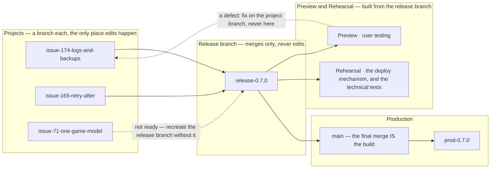

# The change lifecycle: from an issue raised to production

**What happens to a change**, from the moment somebody notices something to the
moment it is live and reviewed: how an issue is triaged, what a project is, where
the branches go, how a release is assembled, and what each step owes.

**Its sibling is [3.3 Testing, CI & Release](3.3-testing-ci-and-release.md)**,
which holds the *machinery* — the environments, continuous integration, the
deploy script, rollback, and the runbook of what to type. This document holds the
**rules**; that one holds the **mechanisms** they run on.

Split out of `docs/3.3` on 2026-08-21. Owner: *"3.3 has become a lifecycle
document from requirement being raised to production delivery. Which is fine, but
perhaps the lifecycle rules and the environmental technical stuff should be
separated."* They were already different sections; this makes them different
documents, so a reader looking for *"what happens when I raise an issue?"* is not
reading a document about testing.

**Three parts**, the same shape 3.3 uses:

| | |
| --- | --- |
| **[1 The flow](#1-the-flow-how-a-change-reaches-production)** | the levels, the three stages, and how a release is shaped |
| **[2 The rules](#2-the-rules)** | one subsection per rule, each carrying the case that produced it |
| **[3 Notes](#3-notes-on-releases-and-branches)** | what was learned the hard way |

## 1 The flow: how a change reaches production

**The levels, first, because every rule below is stated at one of them.**

| level | what it is | ends |
| --- | --- | --- |
| **programme** | the application *and everything we maintain to keep it going* — production, the dev, preview and rehearsal environments, the documents, the process | never |
| **workstream** | one capability, worked on indefinitely: the game model, the process, production operations | never |
| **project** | a bounded piece of work with fixed scope. **Any issue may become one**, and a project is often a single issue | when its scope is complete |
| **work package** | one unit of build inside a project. It delivers into the project and manages itself | when it merges |
| **delivery** | one act of putting change in front of whoever consumes it | when it is done |
| **release** | a delivery that **changes the application's build id and version** | when `deploy.sh` exits 0 |

*Delivery* is the general word and *release* is the specific one: a firewall rule
applied on the host is a delivery and is not a release.

**The flow, in three stages.**

**1 · The project branch is where everything happens.** Apart from pre-approved
documentation and tooling changes, every project has one. All of the project's
changes are made there until the **whole project** is delivered — including its
documents, the design and the test design specification in the project's folder.
A project with two overlapping deliveries may have a branch each, the later based
on the earlier.

**2 · The release branch is made by merging, and edited never.** A release is a
new version of the application forming some or all of a delivery, and it has its
own application version and its own branch — created by merging the branches of
the contributing projects.

**No change is ever made in it.** A defect found while testing is developed and
tested **on its project's branch**, and merged in. That is what keeps the release
branch reproducible, and reproducibility is what makes descoping possible:
**dropping a project from a release means recreating the branch from the others.**
A fix committed directly would be lost by that rebuild, silently.

The release branch is what preview and rehearsal are built from — preview for
user testing, rehearsal for the technical tests and for the deploy mechanism.

### One round of preview and rehearsal, or two?

**Two only when the merge changes the tree.** The rule underneath is *test the
artefact you will ship*, and a second round exists to catch a merge that made
something new — so when there is nothing new, it proves nothing.

| | |
| --- | --- |
| **`main` has moved**, and the merge combines work | **two rounds.** The combination has never existed before and is what ships |
| **a fast-forward** — the branch already contains `main` | **one round.** The tested commit and the shipped commit are the same object |

**Use `--ff-only` where it is available**, in place of the usual written merge
commit: a merge commit changes the sha, and the commit tested stops being the
commit shipped. The branch's own messages carry the story.

**Preview from the branch before merging is still worth it**, and is not part of
either round: it is a cheap look for whatever would otherwise reach `main`, and
it costs one command.

**The trade, stated because it is real**: a problem found in rehearsal after
merging means fixing on the branch, re-merging and re-testing. Accepted because
preview from the branch has already exercised the same tree.

**3 · The final merge into `main` is the build.** As part of the production
deployment the release branch merges into `main`, and **that merge is the
artefact**: the basis for the final CI run, for a preview deployment for any last
user tests, and for a rehearsal deployment that tests the deployment process and
runs any last technical tests. The build used for rehearsal is then what goes to
production.

**Rolling an application change back is undoing that merge** — see [Rolling
back](3.3-testing-ci-and-release.md#211-rolling-back), which is the same operation described from the other
end.

**Where a project delivers by more than one route**, the ordering between them
lives in the project's own delivery runbook, not here: a step applied on a host
usually assumes the artifact is already deployed, and only the project knows
which way round.

**A branch per project**, named for its issue — and **a second branch where a
project's next delivery would otherwise be swept into a release being prepared
from the first**, based on it and named for the delivery
(`issue-174-logs-and-backups`, then `issue-174-d2-backups`). Not a judgement call each time —
the judgement is only whether two pieces of work belong to the same project, and
[2.9.11](#211-what-a-project-is-and-what-its-issue-carries) is the test for
that. A lone issue still gets a branch; it is simply a project with one
requirement.



### 1.0 The shape of a release

Three queues, named for the version slot each one releases into, so the answer and a
version number are the same word. The first thing to settle about any change is
which queue it is in.

| | **fasttrack** | **minor** | **major** |
| --- | --- | --- | --- |
| what | a change that can go live quickly without needing to be grouped: an urgent defect fix, or something small like a cosmetic change | minor functional changes, normally released as a group; some of a group may be connected to each other | a major functional or architectural change with a large impact |
| chosen because | **either** it is low risk **or** it is urgent | it is ready, and worth releasing alongside whatever else is | its impact is large enough that it wants its own release |
| lives on | `main` | a version branch, `0.5.0` | a version branch of its own |
| released as | a patch, if it goes alone — otherwise it takes the version of whatever it rides with | a minor | a major |
| released with | nothing, if it is urgent; otherwise the next release going | whatever else is in the group | the changes it affects, and nothing else |
| owes | user testing | user testing per change, then again for the whole group | a design note in `docs/2.x` **first**, then all of the above |
| pull request | no | draft, from day one | draft, from day one |

**Low risk *or* urgent, not both.** A production fire is often not a low-risk
change, and it goes out today anyway, because waiting is worse than the risk.
A rule demanding both would push exactly the changes that need speed into the
slowest queue.

**A group need not be connected.** Three unrelated small changes can share a
release simply because all three are ready. Grouping is usually about the cost
of releasing rather than about dependency — and where a group *is* connected,
that is a reason to test it together, not a condition of forming one.

**A major release carries what it affects, and nothing else.** Not "ships
alone": the work a large change drags with it belongs in the same release,
because it exists to keep up with it. What must not ride along is anything
*unrelated* — the reason a major change wants its own release is that its blast
radius is hard to predict, and if something breaks there should be one
candidate rather than several.

### 1.1 The release attribute is a milestone, and so is a release

**Read [2.9.14](#215-classifying-a-change-type-release-route) first.** This
section was written when one word — *lane* — answered three questions at once,
and it has been re-worded rather than rewritten: the reasoning below is about the
**release** attribute, which is the question *does this need a release, and how
big?* Where it says *release attribute*, the original said *lane*.

An issue carries exactly one milestone, which makes the milestone field say
where the issue is in the pipeline:

| milestone | meaning |
| --- | --- |
| `merge` | docs and tooling — no release to wait for |
| `fasttrack`, `minor`, `major` | queued — the release attribute is decided, the release is not |
| `0.4.26`, `0.5.0`, `1.0.0` | scheduled — this is the release it goes in |

**What makes a change need no release is the artifact, not the audience.**
Documentation and scripts are compiled into nothing, so there is nothing to
ship and they are live the moment they land. Client and server code is in the
image whether or not its effect can be seen in production — it travels through
preview, rehearsal and production like everything else, and it can break
production while its feature is dev-only: a stray fetch, a render that panics
on a `None` only production produces.

So the question is not "will a user see this?" but **"does this get built into
what we deploy?"**. A change that only shows itself in dev is still a release
change if it ships in the binary.

**`merge` is a fourth queue, and the odd one out.** Documentation and
non-production tooling are live the moment they reach `main` — there is no
deploy, so no version to wait for and nothing to schedule. Putting them in
`fasttrack` was wrong in a way that mattered: it implied they were waiting for
a release, when the thing they were waiting for had already happened.

That also explains why they accumulate. Every other queue has a release that
ends it, and a release closes its milestone and its issues. Nothing closes a
`merge` issue except somebody noticing it is done — which is how the game
lifecycle tests sat finished and open for a fortnight. **A `merge` issue has to
be closed by whoever merges it**, in the same act, because nothing later will.

**Scheduling is moving an issue from its queue to a version.** Nothing is lost
in the move, because the version implies the queue: a patch came from
`fasttrack`, a minor from `minor`, a major from `major`. One slot per queue is
what makes that true.

**Fasttrack means a change *can* go out on its own, not that it must.** It
records a property of the change — small enough, independent enough, safe
enough to release by itself — and that property is what makes a fast release
available when one is wanted. It is not a commitment to make one.

**So the default is to batch**, and the reason is attention rather than
mechanics. A release costs the same attention whether it carries one change or
six, so batching is cheaper per change — but the larger gain is that one scope
can be *learned*. Reading a single release's worth of changes, holding them
together, and testing them as a set is easier than doing the same thing four
times a fortnight apart, and it lets everything not in the scope be ignored
until its turn.

A patch release of its own is then for the two cases that earn it: something
urgent enough that waiting is worse, or something you simply want live now.
`0.4.24` was the second kind — one appearance fix, released alone because it
was wanted.

**Which means the scope closes when it is set.** The familiarity being bought
here comes from a scope that stops moving; a release that keeps accepting one
more change never gives it, because the thing being held in mind changes under
you. A fasttrack change arriving after the scope is fixed goes to the *next*
release unless it is urgent — and if it is urgent it goes out on its own, which
is what the queue is for.

The draft pull request is where a fixed scope is read: one page carrying every
commit and the whole diff of what the release will be.

The asymmetry still holds and is what keeps this honest: **scheduling can
always go slower than the release attribute says, never faster.** Wanting to go
faster means it was decided wrong, which is a decision to revisit rather than an exception
to make.

**A release takes the version of the highest release attribute in it.** Four patch-alone
changes together are a patch; add one minor-function change and the release is
a minor, because that is what it now contains. `check-release-version.sh`
already enforces exactly this — it refuses a patch release whose milestone
carries functional change — so the rule is in the tooling and this is the
document catching up with it.

**Patch-alone also asks that the change can be done *well* quickly.** Not merely
that it is small: a change worth thinking carefully about belongs in a slower
queue even when it is a few lines, because the answer sets how much deliberation
it will get. #82 went to `minor` on exactly that ground — not urgent, and
complex enough to deserve more time than fasttrack implies.

**And how many changes there are decides it too, not only what kind they
are.** A patch-alone release is one or two changes; that is its shape. Ten
changes is a minor release whatever their labels say, because the question a
version answers is "how much of this service just moved" — and ten of anything
is a different answer from one, however small each was.

This matters because the highest-release rule can only ever be triggered by a
*type*. A release of ten defect fixes carries no functional change at all, so
nothing in the labels would stop it going out as a patch — and it would still
be a release nobody could sensibly reason about afterwards, or roll back one
piece of. 0.6.0 was scoped that way: five `minor-function` issues settle it on
the type rule, but the count alone would have.

**One larger change per release, though — not several.** A larger change has to
be released eventually; holding it back does not reduce how much there is to
reason about, it moves the question to whichever release finally carries it, by
which time more has piled up around it. So the workable shape is one
substantial change with smaller ones bundled around it. Two or three
substantial ones together is where a release stops being reviewable, and where
a version number stops meaning anything useful.

The client-bundle refresh stayed in 0.6.0 on exactly that ground. It is the
largest thing in the scope — a response-handling seam that touches every request path in the client
— and taking it out would only have asked the same question of a later release,
with less around it to justify the trip.

Neither rule is a threshold to compute, and only the first is in tooling.
`check-release-version.sh` can see a functional label; it cannot see that
fourteen small things are more than a patch's worth. That asymmetry is
deliberate — a script that refused a release for having too many issues in it
would be guessing at a judgement — so the count is yours to apply when the
scope is fixed, which is the moment you are looking at the whole list anyway.

Both rules are the same instinct: a version should tell somebody how much
changed, applied to the two things that vary.

The release attribute needs deciding when the issue is raised, which is when the
person raising it knows most about the risk. A release cannot be decided then,
because
it depends on what else turns out to be ready — which is why committing an
issue to `0.4.26` months ahead is a guess dressed as a plan.

Both scripts that read milestones match the title exactly — `deploy.sh` closes
the one named for the released version, `check-release-version.sh` looks up the
same name — so a queue milestone is simply invisible to them.

**The point of the three is that a slower one never blocks a faster one.** An
urgent fix can always go out today as a patch, whatever else is in flight —
that property is the reason for the split, and every rule below exists to keep
it true.

**Within one queue, changes are sequenced.** Two grouped releases do not run at
once; the second starts when the first has shipped. It is across the three that
work runs in parallel.

**Isolated changes go to `main` as soon as they pass user testing, and ship.**
`main` stays permanently releasable, which is what makes "release the fix now"
a two-minute answer rather than a negotiation.

**Which holds only while `main` carries one change at a time.** Batch two
patch-alone changes there and you have made a small grouped release that happens
to live on `main` — and an emergency arriving now cannot go out without taking
them along. The fast path is only as fast as the shortest thing between `main`
and production.

So the question before batching on `main` is *would an emergency have to wait
for this?* If it would sit there for days, give the batch a version branch like
any other group. If it is going out this afternoon, the exposure is an
afternoon and a branch is ceremony. `0.4.25` was the second kind, deliberately.

**Grouped and structural changes get a branch named for the version they will
ship**, with feature branches merging into it rather than into `main`. The
branch is somewhere several changes become one thing and can be seen and tested
together, which is the only thing it buys — a single change does not need it.

**A structural change ships alone.** Not because the tooling stops you, but
because the reason it is structural is that its blast radius is hard to
predict, and a release that goes wrong should leave exactly one candidate for
what did it.

**Three questions, kept apart.** Conflating them is the mistake this table
exists to prevent:

- *How risky, and how long?* decides the **release attribute**.
- *Does anything behave differently?* decides the **version** — see
  [the seven types](#26-the-seven-types-of-change), whose table now states the
  version each implies.
- *Does the wire contract change?* decides the **api version**, which moves
  independently of both.

### 1.2 Keeping a version branch current

The rule that keeps the three queues independent, and the one that will be
skipped if it is not written down.

**Merges flow one way: from the faster queue into the slower ones, after every
release.** `main` releases a patch, so `main` goes into `0.5.0`. `0.5.0`
releases and merges to `main`, so `main` — now carrying it — goes into the
structural branch. Never the other way: a slower queue's work reaching `main`
early is exactly what the three queues exist to prevent.

**And once more when the release's scope closes**, as the first step of
preparing it. Merge every change the release is taking, then merge `main`,
then rebuild preview from the result — so what is tested is what ships.

Not continuously, which is the tempting version. `main` moves throughout, so
merging as it does means re-merging repeatedly and resolving the version-line
conflict below every time; doing it once at scope-close is one resolution
against final content. It also matters that repository-route changes land on `main`
the whole time a release branch is open, so a branch cut weeks earlier is
carrying stale documentation and tooling until this step. And until scope
closes, the branch's history reads as the release's own — which is when
somebody most wants to see what it contains.

Skip it and the slower release quietly reverts a fix that is already live, and
the person who reported the bug is the one who finds out.

```text
main ──patch──▶ 0.5.0 ──▶ 1.0.0        after every release, forward only
```

```bash
git checkout 0.5.0
git merge main
git push
```

**That merge conflicts on the version line every single time**, because `main`
says `0.4.27` and the branch says `0.5.0`. The answer is always the branch's:

```text
<<<<<<< HEAD
version = "0.5.0"
=======
version = "0.4.27"
>>>>>>> main
```

Keep `0.5.0`. Taking `main`'s would silently turn the release you are building
into a patch, and the first thing to notice would be
`check-release-version.sh` refusing to ship it.

Nothing else fights: `check-commit-stamp.sh` reads each commit's version from
*its own* tree, so `0.4.27` commits sitting in a `0.5.0` branch are all correct
about themselves, and merge commits are skipped entirely.

### 1.3 Releasing a version branch: merge first, and fast-forward

**The merge comes before the deploy, not after.** `main` is what is live, so
merging into it is the act of releasing — and `deploy.sh` pushes back when the
sequence is wrong: a production deploy run from tooling that is **not on `main`,
or has uncommitted changes under `scripts/`**, warns and asks for confirmation
before going on.

It is a confirmation, not a refusal, and the distinction matters. Without a
terminal it *does* refuse, so nothing scripted can slip past it; with one, a
person who knows why can proceed. The check is on the **tooling** you are
running, not on the commit being shipped — that is always a clean worktree
checkout.

**Fast-forward if you can, and you usually can.** A version branch that has
been kept current has `main` as an ancestor, so the merge can be a
fast-forward — and then **the commit that was tested is the commit that is
released**, byte for byte.

```bash
git checkout main
git merge --ff-only 0.5.0
```

A `--no-ff` merge commit is right for a feature branch, where the commit marks
the change. It is wrong here, and not merely stylistically: it creates a new
commit that **nothing has previewed, rehearsed or checked**, and the release
gates then quite correctly refuse it — so the whole preview-and-rehearse lap
has to be run again against a commit whose only difference is the merge itself.
The tag records the release; the merge commit adds nothing but work.

If a fast-forward is not possible, `main` has moved and the version branch owes
it a forward-merge — after which it is possible again.

**And the forward-merge costs a lap.** It creates a merge commit, and that
commit has been previewed by nothing, rehearsed by nothing and tested by
nothing — so it needs its own CI run, its own preview and its own rehearsal
before production, exactly as any other new commit would. Budget for it: the
release is not "already tested" once the forward-merge lands, because the thing
that was tested is no longer the thing being shipped.

The way to avoid paying it is to keep the version branch current while the
release is being prepared, rather than discovering at the end that `main` has
moved. Repository-route work continues on `main` throughout a release, so `main`
moving is the normal case, not the exception — 0.6.0 collected eleven such
commits during its testing.

### 1.4 Delete the branch once its change is live

A merged branch that outlives its release is not harmless. `status.sh` calls an
issue "in progress" when a `Refs #N` commit exists that `origin/main` does not
have, so a branch left behind after its merge is mostly quiet — but one holding
a commit that never landed reports finished work as in progress, and the next
person to look has to open it to find out which.

Worse is a branch whose name and contents disagree. One survived here called
`issue-42-retention-sweep` whose only commit said `Refs #54`, holding a
superseded fix for a defect that had already shipped by another route. It cost
a real investigation to establish that it meant nothing.

**A branch merged through a pull request cleans up its own remote.**
*Automatically delete head branches* is on (set 2026-08-17), so a feature branch
disappears from GitHub the moment its PR merges. Only the local one is left:

```bash
git branch -d issue-79-last-move-highlight    # -d, not -D: refuses if unmerged
```

**A version branch does not**, because it never becomes a pull request — it is
merged locally with `git merge --ff-only` (above), which GitHub never sees. Both
halves stay manual there:

```bash
git push origin --delete 0.5.0
git branch -d 0.5.0
```

**"Live" means merged into whatever it will ship from, not deployed.** A
feature branch that has gone into a version branch is done, months before that
version releases — and until it is deleted it is a second copy of the same
document diverging from the one that will ship. That is not hypothetical: a
design note was read from a merged feature branch and found to be missing three
days of work, because the branch had stopped moving and the URL had not.

`git branch --merged main` lists the candidates. The lowercase `-d` is the
safety: it will not delete a branch holding work that is not in `main`, which
is the one mistake worth being stopped from making.

**`verify.sh` reports any that were missed**, as a `note` rather than a
failure — this is housekeeping, and it must not colour an exit status that
otherwise means something is wrong. It names only branches that are both merged
into `origin/main` and have had their remote deleted, which is the unambiguous
set; a branch that never had a remote might be work in progress.

**Why the local half can never be automatic**: nothing server-side reaches your
machine, and `git fetch --prune` removes the remote-tracking ref while leaving
the branch behind with its upstream marked `[gone]`. That is exactly how
`issue-33` and `issue-50` outlived their own releases — the remotes had been
deleted, so nothing on GitHub still showed them, and only the local copies
remained.

## 2 The rules

[2.8](#1-the-flow-how-a-change-reaches-production) is the flow. These are the rules that
govern it, each with a subsection carrying the reasoning and the case that
produced it — so you can find the one you need without reading the rest.

**A project issue carries five headings**, each holding either text or a link to
a document — never absent, never empty. See
[2.9.11](#211-what-a-project-is-and-what-its-issue-carries).

| heading | |
| --- | --- |
| **requirements** | what must be true when this is done |
| **design** | how it will be done |
| **impacted artefacts** | what it touches, each marked **new** or **modified** |
| **test approach** | environment, tools, and what is measured against what criteria |
| **deliveries** | a **runbook** per delivery: the steps in order, the route each takes, and — filled in afterwards — which version carried it, and when |

| | rule |
| --- | --- |
| [merging](#21-when-to-merge-and-what-to-hold-back) | Testing does not require merging. A project branch merges into a **release branch** when it is going in a release, and the release branch into `main` as part of the deploy. |
| [branching](#22-when-to-branch) | Branch when something **else** is ready to ship, or when a change looks likely to need more than one round of feedback. |
| [living documents](#23-living-documents-and-the-standing-issue-that-carries-them) | A document that is never finished gets a **standing issue**, which closes when its *subject* concludes rather than when an edit lands. It lives wherever its issue's changes live — `main`, or the project's branch. |
| [where a document lives](#24-where-a-document-lives-about-the-work-or-a-product-of-it) | A document lives wherever its issue's changes live. Testing documents belong to the release; design and test documents to the project, in its folder. |
| [tracking](#25-tracking-a-change-to-production) | `Refs #N` in the commit — **except where the change never leaves the repository, where `Closes #N` is correct**, because nothing else will ever close it. |
| [types](#26-the-seven-types-of-change) | Every issue carries exactly one type label. |
| [evidence](#27-evidence-follows-what-the-change-does-not-its-type) | Evidence follows what the change **does**, not the label it carries. |
| [closing](#28-closing-an-issue-use-the-reason-not-a-label) | Use `stateReason`, not a label. |
| [documentation](#29-documentation-is-owed-by-every-type-not-just-its-own) | Every type owes documentation; the `documentation` label means the *whole* change is documentation. |
| [splitting](#210-one-change-one-type--split-the-issue-otherwise) | One change, one type. An issue touching both tooling and the app is two issues. |
| [gate or check](#216-a-gate-refuses-a-check-reports) | A **gate** refuses and the work stops. A **check** reports and a person decides. |
| [who typed it](#217-who-typed-it-the-typed-by-footer) | Every comment ends `Typed by Claude` or `Typed by Steve`. Two scripts read it. |
| [classifying](#215-classifying-a-change-type-release-route) | Three questions, three answers: **type** and **release** on the issue, **route** on the delivery. *Lane* answered all three at once. |
| [triage](#218-triage-what-happens-to-an-issue-when-it-is-raised) | Four outcomes for an issue that is not rejected: straight to `main`, a fasttrack project, a project of its own, or folded into one. |
| [projects](#211-what-a-project-is-and-what-its-issue-carries) | Issues group into a **project**, which owns the requirements from that moment. The sources are **folded** and closed. |
| [branches](#212-a-branch-belongs-to-a-project) | **One branch per project**, and it is the only place edits happen until the project is live. |
| [runbooks](#214-the-delivery-runbook) | Each delivery has a runbook: the steps before, and which version carried them, when, afterwards. |
| [artefacts](#213-the-impacted-artefacts-and-why-they-are-listed-early) | List what a change touches as early as possible, even wrongly — it is how two projects discover they collide. |

**Preview is not a step towards production.** It is where you look at
something. `./scripts/deploy-preview.sh at <branch>` builds any ref with no
merge, so "show me this on my phone" and "stand up the release for user testing"
are separate acts that happen to use the same environment. Most preview deploys
are the first kind.

### 2.1 When to merge, and what to hold back

Testing does not require merging — `./scripts/deploy-preview.sh at <branch>`
builds any ref. Merging is only needed to test changes *together*. So there
are two questions, with two deploys:

| | asks |
| --- | --- |
| `deploy-preview.sh at <project-branch>` | does this one change work? |
| `deploy-preview.sh at <release-branch>` | does the release candidate hold together? |

> Preview a **project branch** to test a change. Preview the **release branch**
> to test the release candidate. Merge when you have decided a change ships —
> not to look at it.

*This said "preview `main`" until 2026-08-21, when the release candidate stopped
living on `main`: it is assembled on the release branch and reaches `main` only
as the final act of deploying.*

**Small, uncontroversial changes** merge as they are finished, ready for the
next release. **Larger or controversial ones are held back** — where
*controversial* means **the change might change following review**, not that
it is risky. That is the sharper test: it is about likely rework, not
severity.

The reason the bar sits there is asymmetry. Before merge, removing a change
is `git branch -D` and `main` never saw it. After merge it is a revert —
history keeps both, which is correct but permanent. Merge is the point of no
easy return, so the bar is "confident this ships", not "want to look at it".

On 2026-08-03 six changes merged as they were finished: a tile-return fix, an
admin CLI argument, and four documentation changes — all small and
independent, so holding any back would have bought nothing. #9 and #26 are
the opposite: substantial, and likely to change following review, so they
belong on branches and previewed alone until settled.

**Merge by rebase and fast-forward, never a merge commit.** `deploy.sh`
requires preview to be running the *exact* commit being deployed. A merge
commit is a new commit that preview has never run, so it forces a rebuild
before you can ship. Fast-forward keeps the commit you tested and the commit
you release identical.

Then stage the merged result and follow the runbook. The gate enforces that
last step whether or not you remember it.

### 2.2 When to branch

> Branch when something **else** is ready to ship, or when a change looks
> likely to need more than one round of feedback.

On 2026-08-01 five finished issues sat unreleased for hours while a sixth —
the mobile scores row — iterated on top of them on `main`. Six rounds of
feedback from a phone, each a fresh commit, each invalidating preview and
re-running CI for five changes that were already done. That change met both
halves of the trigger within ten minutes of starting.

A doc typo does not need a branch. Anything you would want user-tested does.

### 2.3 Living documents, and the standing issue that carries them

"Nothing unfinished on `main`" and "every change has an issue" both assume a
document is written once and done. Some are not. A user testing status report
is rewritten every time a change is judged; a runbook grows as its procedure
is exercised. Neither is ever finished, and neither belongs on a branch.

The resolution is that **finished means accurate, not complete**. A living
document is finished whenever it correctly describes the state it reports on, so
"nothing unfinished on `main`" does not keep it off `main`.

**Where it lives follows its issue, not its livingness.** An issue with no branch
keeps its documents on `main`. **An issue or project with a branch keeps them on
the branch**, living or not, and they merge with everything else — because the
one-place rule outranks this one: no issue has changes in `main` and changes in a
branch. See [2.9.12](#212-a-branch-belongs-to-a-project).

*This reversed on 2026-08-21.* It used to say a living document belongs on `main`
without qualification, and the argument was readability — a testing report on a
branch is one nobody can read while the testing happens. That assumed reading
happens in a working tree, where one checkout shows one branch. **Documents are
read in GitHub**, where a branch is as readable as `main` and shows the version
the work is actually producing, so the argument had already gone. What is left is
the confusion of two current copies, which is the thing worth avoiding.

**Deciding to branch is therefore a decision to move the documents**, in the same
commit that creates the branch.

**A workstream's design note is one of these, and its parent issue is the
standing issue.** The note describes a state the code is not in until the last
work package lands, so it cannot belong to any one branch; and the parent
closes when the *subject* concludes rather than when an edit does. That close is
also the moment the note is deleted and what survives it moves into the numbered
documents — by hand, deliberately, which is why it is worth doing rather than
letting the parent close itself when its sub-issues run out.

So they get a **standing issue** rather than one per update:

- The issue names the document and stays open for as long as it is being
  maintained — through many commits, each `Refs #N`.
- It closes when the *subject* concludes, not when an edit lands. A release's
  testing report closes when that release ships.
- Updates need no issue of their own. Requiring one would mean a dozen issues
  saying "updated the report", which is bookkeeping rather than tracking.

The test for whether something qualifies: **would a reader be misled by the
current version?** If yes it is unfinished and wants a branch. If it is
accurate today and will simply say something different tomorrow, it is living,
and `main` is where it is useful.

`docs/changes/0.6.0-user-testing.md` is the first of these.

### 2.4 Where a document lives: about the work, or a product of it

Two kinds of document attach to a release or an issue, and they belong in
different places.

**About the work** — a testing report, an impact assessment, a decision note.
It has the same lifetime as the release or issue it describes, and it lives on
`main` from the moment it exists. A testing report kept on a branch is one
nobody can read while the testing it tracks is happening, which is the whole
point of it.

**A product of the work** — documentation the change itself delivers: a new
runbook, an updated section of this file, API reference for something being
built. It lives on the branch and lands with the change, because it describes
behaviour that is not true yet.

The test is the same one that decides whether something is finished: **is this
true now, or true only once the change ships?** A document saying "here is what
we are testing and how far it has got" is true now. A document saying "the
server accepts this new field" is not true until the server does.

So a release's own folder of notes is on `main` throughout, while the
documentation that release delivers arrives with it.

**Which owns it: the release, or an issue?**

- **Testing documents belong to the release. Always.** A test report, a testing
  status, an assessment of whether a release did what was wanted — release
  level, with no exceptions, so there is never a question where to look. A rule
  with a case-by-case judgement in it produces documents filed in two places and
  found in neither.
- **Technical design documents belong to the issue** that produced them — which
  may be a **parent issue**, and then the note lives on `main` for the life of
  the workstream. A note for a single change outlives no release; a workstream's
  note outlives several by design, because its work packages are separate
  branches and a note on one of them is invisible to the others.
- **One document has exactly one owner.** Where a document appears to belong to
  several issues, that is the signal those issues should be one issue: several
  issues collaborating on one product get a **parent issue** that owns the
  product and its documents, and the others become its sub-issues.

#### 2.9.4.1 Which document goes where

The two rules above cover most of it and disagree about the rest, because "test
plan" and "test report" are both testing documents and do not belong in the same
place. In full:

| document | owner | lives | ends |
| --- | --- | --- | --- |
| **design note** | the issue, or the workstream's parent issue | `docs/changes/issues/<n>-<name>/`, on `main` | deleted when the parent closes, its conclusions promoted into the numbered documents |
| **test design specification** | the **project**, or the issue where there is none | the project's folder — `docs/changes/projects/<name>/` — else the issue folder. It **stays**: it is the documentation for the regression tests it produced | never; it outlives the change |
| **test report, testing status** | the **project** | `docs/changes/projects/<name>/` | stays |
| **the deliverables** — edits to 1.x, 2.x, 4.x, the rules, the schema | the change that makes them true | the **branch**, landing with the code | permanent |

**The folder is named for the project, not for a version.** A project is called
`<workstream><letter>` — `71A`, `179B` — because its release version is not known
until it is scheduled, and a release is *"too volatile and imprecise"* to file
by (owner, 2026-08-20). A release is an attribute of a project: the mechanism by
which it puts changes live, and a project may have several. Where part of a
project ships early as a patch, that patch earns a release log entry rather than
a folder of its own. This keeps the rule *"testing documents are never filed by
judgement"* while admitting that a project and a release are not the same
thing.

**Where the release or the workstream does not exist yet**, a document is filed
under the issue that initiated it and moved later — including when an issue
*becomes* a sub-issue, at which point its documents move into the parent's
folder. Moving early is cheap, which is the argument for doing it promptly; the
five files already flat in `docs/changes/` stay where they are, because GitHub
does not follow a rename and several issue comments point at them.

**A folder appears when its first document does** — never by anticipation, never
empty. `scripts/check-docs.sh` refuses a change document that is in neither an
issue folder nor a release folder, so this is a gate rather than a hope.

The last rule is what stops the question "which branch does this go on?" from
having several defensible answers. If it has more than one, the issues are drawn
wrongly, not the document.

### 2.5 Tracking a change to production

`Refs #N` in the commit, never `Closes #N`. `Closes` fires when a commit
reaches the default branch — which, committing straight to `main`, is the
moment the code is *written*. Issues went green while still unreleased,
which is the one thing this tracking exists to distinguish.

**Except where the change never leaves the repository, where `Closes #N` is correct.** A documentation
or tooling change is live the moment it reaches `main`, so "reached the
default branch" and "reached users" are the same event and the objection
above dissolves.

**The commit carries the keyword**, not a pull request body. That works
whichever way the change reaches `main`, since GitHub acts when the commit
lands on the default branch — pushed directly or merged. Without it nothing
ever closes the issue, because `deploy.sh` closes issues in the milestone of
a *deployed version* and `merge` is never one.

**A branch is optional here, and that is the point.** What this route rules
out is the *obligation* — a branch and a pull request for every typo — not
the option. Two things call for one, and either is enough:

- **Risk.** A branch buys CI's verdict before the change is live, which
  counts for more on this route than elsewhere: such a change has no
  preview or rehearsal stage behind it, so landing it is the whole release. A
  doc typo does not need that; a tooling change that could break a deploy
  might.
- **Duration.** `main`'s tip has to stay releasable, because a fasttrack or
  emergency change deploys from it. Anything sitting there unfinished either
  ships alongside them or forces the release to reach back to an earlier
  commit. A substantial new document with a review cycle measured in days
  cannot sit in `main` half-written while an urgent fix needs to go out.

**The route records when a change goes live, not how big it is.** Tooling never
leaves the repository and can still carry a lot of functionality and testing —
rebuilding the release gate around named CI runs was that route, and so was the `status.sh`
rework. A substantial new document is the same shape. Neither belongs in a
slower queue, because neither reaches users through a release: there is
nothing to group them with and nothing to deploy.

So merge does not imply small, and it does not imply quick. The large ones
are precisely the changes that want a branch on both counts.

Label these `documentation`, `non-prod-tooling` or `prod-tooling` as well.
`status.sh` decides "live at merge" from the label, not the milestone, so an
unlabelled one is filed as reaching users and waits in "done, not yet
released" for a release that is never coming.

| | means |
| --- | --- |
| **issue** open/closed | is the work done |
| **milestone** open/closed | has it reached production |

Issues are assigned to a milestone named for the release. `deploy.sh` closes
that milestone and its issues on a successful deploy, and opens the next
one, so a closed issue means live rather than merged. `git tag --contains
<sha>` answers the same question at commit level.

**A milestone is a shipping list, and the deploy closes everything in it.**
Every open issue in the milestone is closed with a "Released in prod-X.Y.Z"
comment — built or not, tested or not, deliberately deferred or not. Nothing
checks. So **anything in the milestone that is not shipping has to be moved out
before the deploy**, not after: reopening afterwards leaves an issue that has
already announced a release it was not in.

```bash
gh issue list --milestone X.Y.Z --state open    # read this before deploying
```

This is not hypothetical in either direction. #67 was closed by 0.6.0's release
while the testing report listed it as *Deferred* — the only one of twelve not
verified — and it turned out to be genuinely broken, needing its own release.
Issue #151 was caught sitting unbuilt in 0.6.1 with an hour to spare.

The trap is that the milestone asserts a scope completed, and shipping is then
taken as evidence that each item in it worked — which is *evidence inherited
from a label*, and evidence inherited from a label cannot fail.

Version-bump commits need no issue.

**Removing a change that fails**: before merge, delete the branch — main
never saw it, and there is nothing to undo. After release, `git revert`;
history keeps both, which is correct, because production ran that code.

### 2.6 The seven types of change

Every issue carries exactly one type label. The type is descriptive, so a
change classifies itself rather than needing a test applied to it, and it
says what the change *owes* before it can ship.

**The first three do not change the app; the last four do.** That single
line settles the awkward cases: fixing a bug in `deploy.sh` is a tooling
change, not a defect fix, because the app is untouched.

| type | label | how it ships | version |
| --- | --- | --- | --- |
| documentation | `documentation` | merge — no deployment exists for `docs/**` | — |
| non-production tooling | `non-prod-tooling` | deploy to the non-production environments, smoke-test them | — |
| production tooling | `prod-tooling` | the full release path — see below | patch |
| appearance | `appearance` | the full release path | patch |
| defect fix | `bug` | the full release path | patch |
| minor functional change | `minor-function` | the full release path | **minor** |
| major functional change | `major-function` | a design note in `docs/2.x` *first*, then the full release path | **minor or major** |

**Appearance is the type for a change with only a visual impact** — nothing
behaves differently, nothing on the wire moves, and no test would notice. It
still ships the full release path, because it is in the image and a person has
to look at it; it is a patch, because a version number describes what the
software *does*.

It was added late, for the last-move highlight. That change was labelled
`minor-function` because it touched the UI, which made the release gate refuse
a patch bump — correctly, given the label, and wrongly, given the change.
Neither `bug` nor `minor-function` was honest: it fixed no defect and altered
no behaviour. A taxonomy that forces a wrong answer produces wrong answers.

### 2.7 Evidence follows what the change does, not its type

The type decides **how a change ships** — which environments, which gates,
whether a design note comes first. It does not decide **what would convince
you the change works**. Name that in the issue when you raise it.

| a change that… | owes |
| --- | --- |
| alters a layout | eyes on it, at the sizes that matter |
| alters concurrency or capacity | load, in the rehearsal environment |
| fixes a defect | a test that fails before the fix and passes after |
| changes the schema | a migration applied to production's data, not an empty volume |
| changes the wire contract | a client built against the old version, still working |

The table above used to say a `minor-function` change owes "user testing on
the real artifact", and #11 showed why that is wrong. It bounded password
hashing and moved it off the async runtime — a person clicking through the UI
sees **identical behaviour whether it works or not**, because the difference
only appears under concurrency. User testing there would have produced a tick
against a box while proving nothing. What it actually owed was load: sixty
simultaneous logins against the rehearsal host, checking that `/health` kept
answering and that a refusal arrived as `503` with `Retry-After` rather than
a stalled connection.

Inheriting evidence from a label is how a change gets verified in a way that
cannot fail. Naming it per change is how it gets verified in a way that can.

GitHub's own `documentation` and `bug` are reused rather than duplicated,
with their descriptions amended. Its `enhancement` is deliberately *not*
used: it occupies the same slot as `minor-function` and `major-function` and
collapses the distinction between them, which is the one that decides
whether a design note is owed. The remaining defaults — `good first issue`,
`help wanted`, `question` — are collaboration signals rather than types, so
they coexist with a type label instead of competing with one.

**Why production tooling takes the full path despite not changing the app.**
`deploy.sh`, `deploy-preview.sh` and `rollback.sh` are not in the image, and
they still get every gate. They do not run *in* production; they act *on*
it. A defect there does not break the site directly — it lets a bad change
reach production, or removes your ability to release or roll back at the
moment you need it. That is exactly the class of bug the 2026-08-01 drill
found, and exactly why finding it needed a real deploy rather than a smoke
test.

**The test is about behaviour, not delivery.** Ask:

> Does it change what production does **on its own** — or only what happens
> when somebody **runs** something?

The app is what runs unattended and serves users: `server-game`, `ui`, and
`Caddyfile`, which configures a web server that runs continuously. Everything
that does nothing until invoked is tooling: `deploy.sh`, `rollback.sh`,
`seed-rehearsal.sh`, `status.sh` — and `admin-cli`, **wherever its binary
happens to live**. A tool is a tool wherever it lives.

An earlier version of this asked whether something shipped in the image. That
is checkable, and wrong at the edge: `admin-cli` ships in the image and is
plainly tooling. Where a thing is *delivered* says nothing about whether it
*acts*.

The image contents are still worth knowing, as supporting evidence rather
than as the test — it copies `crates`, `Cargo.toml`, `Cargo.lock`, `.cargo`,
`old-crates` and `Caddyfile`, and nothing else, which is why `docs/` and
`scripts/` cannot possibly affect a running production.

**And the label decides evidence and process, not deployment.** `admin-cli`
is `prod-tooling` and still ships in the image, so it releases exactly as an
app change would. Type answers "what would convince me this works"; it does
not answer "does this need deploying".

### 2.8 Closing an issue: use the reason, not a label

GitHub has a native field for this — `stateReason`, carrying `COMPLETED`,
`NOT_PLANNED` or `DUPLICATE` — which is structured data attached to the
close event rather than a tag added and removed by hand.

The default labels that duplicated it (`duplicate`, `invalid`, `wontfix`)
were deleted for that reason: two mechanisms for one fact is how they drift
apart. `invalid` and `wontfix` both map to `not planned`, and the
distinction between them belongs in the closing comment, where it can say
something specific.

**One label survives beside the reason, and only because no reason fits.**
`folded` means *its requirement moved into a project and it was never delivered
as itself* — see [2.9.11](#211-what-a-project-is-and-what-its-issue-carries).
`duplicate` would be untrue, since a folded issue is not a second copy of
another; `completed` would be worse. So it closes as **not planned** *and*
carries the label, which is what keeps *closed* answerable in two ways:
delivered, or folded. Adding a label here is the exception, not a precedent —
the test it had to pass was that the fact is real, queryable, and unsayable in
the native field.

```bash
gh issue close <N> --reason completed        # the work shipped
gh issue close <N> --reason "not planned"    # decided against, superseded
```

`DUPLICATE` is set from the web UI's close button; the CLI does not offer it.

There is no third state field. An issue is open or closed, a closure carries
a reason, and a milestone says whether it reached production. Anything
richer would have to be *stored* — a Projects board's custom `Status` field
is the usual answer — and storing status is what `scripts/status.sh` exists
to avoid: a derived view cannot drift, a field you forget to update can.

GitHub's native **Issue Types** would replace the six type labels with a
first-class field, but it is an organization-level feature and this is a
personal repository, so labels are the mechanism available.

### 2.9 Documentation is owed by every type, not just its own

The `documentation` label means *the whole change is documentation*. It is
not how documentation normally gets written.

> A change is not done until the documentation it invalidated has been
> updated, **in the same commit**.

Never a follow-up issue. `docs/4.3-api-schema.md` sat declaring API 2.4 for
five bumps because each change left its own doc update for later, and later
never came for any of them.

Documentation-typed changes come in two shapes with the same process and
different delivery: anything under `docs/` ships nowhere, while a doc comment
in `crates/**` rides the next release and moves the build id like any other
source edit.

### 2.10 One change, one type — split the issue otherwise

An issue becomes two when it **touches both tooling and the app**, or when
it **will be two releases**. The second half is the one that gets missed:
two releases means two changes even when the type is identical.

**Deferred work is a second release, so it is a second issue.** If part of a
change cannot be finished and the rest should not wait, raise the new issue
**before merging** — not after the release has closed the old one.

> Never milestone an issue with outstanding work. The milestone means
> "reached production", and `deploy.sh` closes every issue in it on release.

The tell is a commit message or issue comment saying "left deliberately" or
"tracked as a follow-up" with no issue number beside it: a split that has
been described but not made. #35 shipped that way — its diagram render was
deferred, the automation closed it, and the published picture disagreed with
the prose beside it until #46 finished the job.

Issues #9 and #10 are the worked example. Moving the DTO conversions to where a
client can reach them is `major-function` and ships on its own; the bot
harness that then becomes possible is `non-prod-tooling`. One issue for
each, with the dependency recorded, rather than one issue that is half of
each.

### 2.11 What a project is, and what its issue carries

**A project is a state an issue enters, not a thing created up front.** Three
shapes, and they are one shape at different times:

- several issues are grouped, and a new issue becomes the project
- one issue is run as a project in its own right
- one issue accretes others later and becomes their project

So nothing has to be decided when an issue is raised, which is what keeps raising
one a five-second act. **Raise freely; consolidate deliberately** — the merging
happens in the *scope and design* phase, once, and visibly.

**The test for one project or two** is not how many issues went in. It is whether
one design can be written covering them without saying *"and separately"*.

#### The project owns the requirements, so its sources are folded

Once a project owns them, a source issue that is still live is a second place
requirements can change, and two sources drift silently.

**Folding an issue**: copy its content into the project **first**, then close it
with the `folded` label and a comment naming the project. Two rules keep the
freeze from becoming a trap — **fold before you freeze**, because closing an
issue whose requirement was never copied loses it; and **a frozen issue can be
thawed** if it turns out not to belong.

`folded` is a label rather than a close reason because GitHub offers only
*completed*, *not planned* and *duplicate*. The close reason is **not planned**,
which carries the one bit that matters: it was not delivered as itself. This is
the exception to [2.9.8](#28-closing-an-issue-use-the-reason-not-a-label) — the
reason is used *and* a label, because no native reason means "its requirement
moved".

#### One project, one design

A project does not accumulate a design per issue it absorbed. It has *a* design,
covering however many requirements it carries and however many deliveries it
takes to satisfy them. That is the fold seen from the other end: folding puts the
requirements in one place, and one design puts the answer there too.

#### Text or a link, decided per heading and driven by size

Owner, 2026-08-22: *"the project issue should either contain the content or point
to a project document. Although this is not a rule that each project will do one
or the other consistently. A small single issue project will have its
documentation within the project issue body, a larger project will have separate
documents and link to them. In the second case the project body should be kept
short to avoid duplicating the documents."*

**Per heading, not per project.** A project may hold its requirements as text and
link to a design; nothing has to be consistent across the five, because the five
are different sizes for different projects.

| | |
| --- | --- |
| **a small, single-issue project** | all five headings are text in the issue. There is nothing to link to, and creating documents for three lines each is the ceremony this process keeps refusing |
| **a larger project** | separate documents, and the heading is a link — **and the body is kept short** |

**The second half of that is the operative one.** A body that links *and*
restates is worse than either, because the two copies drift and the reader cannot
tell which is current. So a linked heading says what the document is and where it
is, and stops.

**The exception is the artefact names**, and it is deliberate rather than an
oversight. They stay in the issue even when a design document lists them again,
because a design lives on the project's branch until the project is live and the
issue is the part that is always visible — see
[2.13](#213-the-impacted-artefacts-and-why-they-are-listed-early). What must
*not* be repeated is the per-artefact detail: the names are an index, the
summaries are the content.

#### Why five headings and not four paragraphs

**An empty heading and a missing heading look identical in prose and mean
completely different things** — one says *nobody has decided*, the other says
*nobody thought to ask*. Headings make the difference visible, and a script can
check they are present.

A heading with three lines under it is a complete answer. The size of a project
changes how long each one is, never whether it exists.

### 2.12 A branch belongs to a project

| | |
| --- | --- |
| **created** | when the project starts |
| **during** | **the only place edits happen** — code, documents, everything |
| **merges out** | into a release branch, and to `main` as part of testing and deploying. More than once, if the project takes more than one release |
| **deleted** | when the project is **live** and closed |

**The one-place rule is about where a change can be made, not where content
exists.** A project's content reaches `main` every time it delivers while the
branch runs on; what is forbidden is editing in two places, which is what
produces a file whose two versions each look current.

**Deleting the branch only when the project is live is required, not tidy.** A
release branch is always rebuildable from the project branches — cut from `main`,
merge the projects named in the release, stamp the version — and **you cannot
rebuild from a branch that has been deleted**. Keeping it is what lets a project
be dropped from a release right up to the last release it needs.

**Nothing is ever committed directly to a release branch.** A fix made there is
lost at the next rebuild, silently, and the release then ships without a change
everybody watched being made. A defect found in preview goes to **its project's
branch**.

**A project branch is kept current with `main`.** A branch that has not seen
`main` for three weeks makes the rebuild a conflict resolution rather than a
mechanical step, and a conflict resolution is a change nobody reviewed.

### 2.13 The impacted artefacts, and why they are listed early

**The shape, first.** A project has **deliveries**; each delivery has
**artefacts**; each artefact has a **route**, which is a property of the artefact
and never stated. So the project's artefact list is the union of its deliveries'.

```text
project
  └── delivery            one act of putting change in front of its consumer
        └── artefact      what that act touches
              └── route   how it reaches its consumer — derived, not written
```

**The list carries a delivery column**, and that is not tidiness: three things
need the per-delivery set and cannot use the union. The **runbook** is written
per delivery and has to know which artefacts *this* act touches, in what order.
**Rollback** — *"what does undoing this delivery touch?"* — gets the wrong answer
from the union, which names artefacts a different delivery put there. And *"is it
delivered?"* has no answer at all for a project that is half-delivered, which is
every project with two deliveries for as long as it takes.

The union still does what the list was invented for: the collision test between
two projects works on the whole table.

Every project lists what it touches, each marked **new** or **modified**. The
list is a guess when the issue is raised, argued through design, and **accurate
once the design is agreed** — and once the test approach is agreed too, if the
testing builds anything, because **test tooling is an artefact** and the one most
often forgotten.

**Attempt it early even though it will be wrong**, because a wrong list naming
the right file finds a collision just as well as a right one. Three things an
overlap between two projects can mean:

| | |
| --- | --- |
| they are the same work seen twice | one project |
| one needs the other's change first | sequence them, and say so — a dependency found at merge time is found too late |
| they touch different parts of one file | do it once, or accept a conflict somebody resolves under pressure |

**An artefact is not only a file.** A change reaches production five different
ways, and a list that quietly means *files changed* describes only one of them. A
project may touch a host file, a bucket, an alarm and a GitHub label without
changing a line of code.

#### Derived does not mean hidden — show the route

Owner, 2026-08-22: *"in the artefact tables I think we should include the routes
as a column. They are derived from the artefact registry, but it is useful to see
them rather than having to look them up."*

**So the artefact table carries a route column**, and the distinction worth
keeping is between *stored* and *shown*:

| | |
| --- | --- |
| **not stored** | nobody decides a route, and nobody maintains it as an independent fact. It follows from what the artefact **is** |
| **shown** | because a reader asking *"what does delivering this involve?"* should not have to hold the convention in their head and translate each row |

Same shape as `status.sh` and `actions.py`, which display things nothing stores —
where a change is, what a release would ship. **Deriving a value is a reason not
to ask for it, never a reason to withhold it.**

**And the naming convention makes the column checkable.** A repository path, a
`production:` prefix, `OCI`, `github:` — the name already says which kind the
artefact is, so a row whose route disagrees with its name is a **typo, not a
decision**, and a script could say so. Not built; worth knowing it could be.

#### Naming, so two lists can be compared

| kind | canonical name |
| --- | --- |
| in the repository | its path from the repository root |
| on a host | the host role, then the absolute path — `production:/etc/…` |
| a cloud resource | provider, type, and the provider's own name — `OCI bucket tile-lite-elite-backups` |
| a GitHub object | `github:label folded` · `github:ruleset main` |

**A repository artefact is self-naming** — the path is the name and the file
either exists or it does not. Everything else is registered in
[4.8 Artefacts](4.8-artefacts.md), which holds exactly what git does not, and is
therefore also the answer to *"what else was on that box?"*

**Mark a provisional list provisional.** A guess that looks settled is worse than
no list, for the same reason a missing heading differs from an empty one.

#### A new artefact says whether it outlives the project, and when it runs

**Test tooling is the case that needs this**, because it is the only kind of
artefact that can look like coverage while being dead.

**The test for permanence is not how useful the script was during the project —
it is whether the claim it asserts is permanent.** *"The migration converted all
412 rows"* is true once, and the script that proved it is finished. *"No address
reaches the log"* must hold for as long as the service runs, so the script that
proves it has to keep running.

**A kept script with no trigger is worse than no script.** It becomes something
nobody has run since the release it was written for, and the repository then
shows a test for a property that is no longer being checked — coverage on paper
and none in fact. So every permanent test artefact records **when it runs**: in
CI on every push, in the release path when a release touches a named area, or on
a stated interval.

**Four categories, and the entry names which one it is:**

| | the claim | where it lives | when it runs |
| --- | --- | --- | --- |
| **1 · not relevant after the project** | was true once — *"the migration converted all 412 rows"* | **the project's folder** under `docs/changes/…`, not `scripts/` | during the project, and never again |
| **2 · part of regression testing** | must hold for as long as the service runs, and can be checked automatically | wherever the suite lives — `crates/*/tests/`, `e2e/` | **every time**, without anybody deciding to |
| **3 · triggered** | must hold, but cannot be checked on every push | `scripts/`, listed in [3.0 Tools](3.0-tools.md) | **on a schedule, or after a particular kind of change** |
| **4 · ad-hoc** | worth checking sometimes; nothing decides when | `scripts/`, listed in [3.0 Tools](3.0-tools.md) | when somebody chooses to |

**The line between 3 and 4 is the one that matters**, and it is not how important
the test is. It is whether **something other than memory** can fire it. A
schedule, a deploy gate, a condition on the changed files — all of those can be
made to happen. *"We should run this every few months"* cannot.

**So category 3 owes one more thing than the others: what fires it.** Not *when
it ought to run* — what makes it run. A quarterly drill with nothing scheduling
it is category 4 wearing category 3's clothes, and the difference only shows up
the year nobody notices it has not run.

**Category 4 is where tests go to be forgotten**, which is fine as long as it is
chosen rather than defaulted into. An entry there says **why it cannot be
triggered** — *"it needs a person to judge the result"* is a real answer;
*"nobody has set up the cron"* is category 3 with work outstanding.

**Where it lives is part of the answer, not an afterthought.** `scripts/` is the
toolkit: every entry is documented in `docs/3.0` and is expected to work. A
one-off left there is a permanent-looking thing nobody will ever delete, because
deleting somebody else's script always feels like the wrong call. In the
project's folder it is unmistakably part of finished work.

**A test in category 3 or 4 says why it is not in category 2.** *"It needs a
running stack"* and *"it takes eleven minutes"* are reasons that can stop being
true — and when the reason goes, the test should be promoted rather than staying
where it is out of habit. Without the reason written down, nobody can tell later
whether the placement was a judgement or an accident.

#### What the design owes on top

The design lists **the same artefacts and what changes in each** — the names are
deliberately in both places and nothing else is, because the issue is the part
that stays visible while the design sits on a branch.

The summary is **what the artefact does afterwards that it did not before**, not
what lines changed. *"Modified: added a function"* is what the table looks like
when it has died.

**And the depth owed is inverse to how well git records it**: least for a
repository file, where the diff is the detail and the summary is the intent above
it; most for a host file or a cloud resource, where there is no diff anywhere, so
that entry **is** the record and must be enough to do it again.

### 2.14 The delivery runbook

A project's *deliveries* heading holds **one runbook per delivery** — written
before as a procedure, completed afterwards as a record.

| written before | filled in after |
| --- | --- |
| the steps, in order, and the route each takes | which app version or build carried it, and **when** |

#### It is filled in three times, not written once

Owner, 2026-08-21: *"the delivery runbook should be more detailed, giving all the
information necessary to do the delivery, even the commands to type. But that
detail may come later, when it is known, in time for the actual delivery."*

| when | what the runbook holds |
| --- | --- |
| **scope and design** | the **outline** — which artefacts, in what order, by which route. Enough to see the shape and to argue with it |
| **before the delivery** | the **commands**. The actual lines to type, the console pages to open, the file to write. This is the gate: **a delivery does not start until its runbook is executable** |
| **after** | which version or build carried it, and when |

**Writing the commands out in advance is a design check, not clerical work.** It
is where *"apply the drop-in on the host"* turns into a path, a `sudo`, and a
`systemctl` — and where you discover the step needs something nobody had
mentioned. A step that cannot be written down yet is a step that is not
understood yet, and finding that out at the keyboard at eleven at night is how
production incidents start.

**And for the host and service routes it is the only record that will exist.**
Nothing else says what was typed. A runbook written *afterwards* is a memory of
what somebody thinks they did; written before and ticked off as it goes, it is
what happened.

**The second column is the part with no substitute**, and it earns its place
three times over:

- **host and service steps leave no other trace.** A firewall rule applied on a
  Tuesday is in no diff anywhere; the runbook line is the whole history
- **a delivery may span more than one release**, so *"is this delivered?"* is only
  answerable by knowing which release carried which step
- **rollback.** If a host change went out alongside `0.7.0` and production rolls
  back to `0.6.3`, **is the host change still valid?** A journald drop-in
  survives; a script calling an endpoint that no longer exists does not. Only the
  runbook recorded the pairing, so only the runbook can answer

**It is not a second copy of the delivery log.** The log holds one row per
delivery across the whole programme — version, date, kind, where, what, outcome —
for somebody asking *what changed in production, and when.* The runbook holds
every step for somebody doing it, or undoing it. The version and the date appear
in both, deliberately, and the log is **derivable** from the runbooks and the
tags — which is the direction to generate it, if it is ever generated.

### 2.15 Classifying a change: type, release, route

**Three questions, and one word used to answer all of them.** *Lane* named a
milestone, an authorisation level and a shipping mechanism at once, which is why
mapping a real change onto it took an argument every time. Each question now has
its own answer.

| question | attribute | where it is recorded |
| --- | --- | --- |
| **what kind of change is this?** | **type** | a label on the issue — [2.9.6](#26-the-seven-types-of-change) |
| **does it need a release, and how big?** | **release** | the issue |
| **how does it reach whoever consumes it?** | **route** | the **delivery**, not the issue |

#### Release

| value | means |
| --- | --- |
| **nothing** | no release is needed. Its consumer has it when it merges, or when it is applied |
| **patch alone** | ships on its own as `X.Y.Z+1`, without waiting for anything |
| **minor** | rides a grouped release |
| **major** | ships alone, because its blast radius is hard to predict |
| **not decided yet** | nobody has scheduled it. **The honest answer for most of the backlog** |

#### Route is derived from the artefact list

**Nobody writes route down.** It is a property of the **artefact**: a path in the
repository never leaves it, or is built into the image; a file under
`production:/etc/` is applied on the host; a bucket or an alarm is applied to a
service we use. Nothing about a change alters that.

**So a delivery's routes are the union of the routes of the artefacts it
touches**, and the artefact list a project already keeps is the only thing
recorded. A project may have several deliveries, a delivery may involve several
routes, and where there are several **they are ordered** — a step applied on the
host usually assumes the artifact is already deployed. None of that fits a single
field on an issue, which is why route is not asked when an issue is raised.

**One route has two moments.** A repository artefact is delivered **on save**
when it is edited on `main`, and **on merge** when it comes from a branch. Which
of the two is not a separate question:
[2.12](#212-a-branch-belongs-to-a-project) already decides it — an issue with no
branch edits on `main`, an issue with a branch edits on the branch. The variant
follows the branch, so nothing extra is written down. Worth naming, because
*live* means different things on the two, but neither is a field anybody fills
in.

| route | how it arrives | when it is done |
| --- | --- | --- |
| **in the artifact** | built into the image | the release is live |
| **carried by the deploy** | `deploy.sh` puts it there | the deploy succeeds |
| **applied on the host** | typed on the machine | **when its documentation is** |
| **applied to a service we use** | a console or an API somewhere else | **when its documentation is** |
| **never leaves the repository** | the consumer reads it in git or GitHub | on merge, or on save where there is no branch |

The last two rows are why [4.8 Artefacts](4.8-artefacts.md) exists: those changes
leave no trace anywhere else, so writing them down **is** the delivery, not a
courtesy afterwards.

#### The old word, for anyone who knew it

| lane | is now |
| --- | --- |
| `merge` | route *never leaves the repository*, release **nothing** |
| `fasttrack` | release **patch alone** |
| `minor` | release **minor** |
| `major` | release **major** |
| `emergency` | not a classification at all — it is a **process**, see [2.12](3.3-testing-ci-and-release.md#212-emergency-changes) |

#### What a change must go through is derived, not asked

Type plus route plus the standard-change criteria already decide it, so asking
for it as well would be asking a question whose answer is in the answers.

| category | when | what it owes |
| --- | --- | --- |
| **pre-approved** | meets the standard-change criteria | nothing beyond the commit. Straight to `main` |
| **document, reviewed** | a document stating a rule, or a major revision | a branch, a pull request, a review checklist, the owner's tick |
| **non-production tooling** | `non-prod-tooling` | **the design and test approach agreed before it is built**, then a branch and a review |
| **production tooling** | `prod-tooling` | the same, plus rehearsal wherever the change can be rehearsed |
| **application change** | `bug` · `appearance` · `minor-function` · `major-function` | the full release path: CI, preview, user testing, rehearsal, the deploy gates. `major-function` owes a design note first |
| **emergency** | production is broken now | the rollback first; two gates skipped, and a retrospective owed |

**The design-and-test-approach gate on the two tooling rows is the newest part**,
and it exists because a tooling change used to go straight from *"good idea"* to a
branch. That is how `check-docs.sh` acquired a second copy of CI's markdown lint,
and how `actions.py` was rewritten three times in a morning against a moving
target.

**The gate is on the test approach, not on a test plan.** A paragraph saying how
we will know it works clears it; a test design specification satisfies it by
containing one.

### 2.16 A gate refuses; a check reports

Two words for two different things, used strictly from 2026-08-21. They had been
interchangeable, and #137's audit found `docs/3.3` describing one as the other —
which is what a word doing two jobs eventually does to a reader.

| | it | example |
| --- | --- | --- |
| **gate** | **refuses.** The work stops and there is nothing to decide | `deploy.sh`'s nine gates; CI's `check` job on a protected branch; the review checklist while a box is unticked |
| **check** | **reports.** A person reads it and decides | `verify.sh` after a deploy; `status.sh`; the warning when tooling lands on `main` |

The distinction is not about severity but about **who acts next**. A gate has
already decided; a check has handed you something to decide with.

### 2.17 Who typed it: the `Typed by` footer

**Every comment on an issue or pull request ends with `Typed by Claude` or
`Typed by Steve`.** One GitHub account is shared, so the author field says
`SteveStyle` whoever wrote it, and nothing else distinguishes them.

**This is read by tooling, not merely good manners.** `scripts/inbox.sh` uses the
string to decide which comments are marked as the owner's — the ones worth
reading — and Claude's session hook uses it to exclude its own comments from *new
since you last looked*. **A comment without the footer is attributed to the owner
and reported back to Claude as the owner's activity**, both halves wrong at once,
and silently.

Twenty comments over two days were missing it before the rule was written down,
which is the argument for writing it down: it lived inside two scripts, one of
them not in the repository, so nothing a reader could open said it existed.

### 2.18 Triage: what happens to an issue when it is raised

**Five stages, and each has a name outside this project.** Owner, 2026-08-21,
listing the phrases he has used before: *demand management, pipeline management,
impact assessment, project onboarding, release management.* They are the standard
names for what this document describes, and worth adopting for the same reason as
every other term here — a reader who knows them can map what we do onto what they
already know.

| stage | the standard name | where it is here |
| --- | --- | --- |
| something is noticed, and assessed | **demand management** | below, questions 1 and 2 |
| what would it touch? | **impact assessment** | below, question 3 — and [2.13](#213-the-impacted-artefacts-and-why-they-are-listed-early) |
| it becomes, or joins, a project | **project onboarding** | below, questions 4 and 5 — and [2.11](#211-what-a-project-is-and-what-its-issue-carries) |
| what is in flight, in what order, and what waits on what | **pipeline management** | **thinly** — see below |
| projects are assembled into a release and shipped | **release management** | [Part 1](#1-the-flow-how-a-change-reaches-production) |

**Four of the five are written down. Pipeline management is the thin one**, and
naming it is how the gap became visible.

The tools exist. `status.sh` says where every open change is; `roadmap.sh` says
what is in each release and what waits on what; an overlap between two artefact
lists says two projects are related. **What is missing is a rule**: nothing says
when the pipeline is looked at, who decides the order, or where a dependency is
recorded once it has been found. With one developer that lives in his head, which
works exactly until it does not.

**And the tooling is honest about being evidence rather than a graph.**
`roadmap.sh` derives *what waits on what* from `#N` references in issue bodies,
and deliberately calls the column **mentioned by** rather than *depends on* —
because the text is unstructured, so it is *"evidence to read rather than a graph
to trust."* Which is the right call, and it is also exactly where the gap sits: a
dependency somebody has actually decided has nowhere structured to live, so it is
inferred from prose every time somebody looks.

Left as a gap deliberately rather than invented here — but this is the one to
watch, because it is the first thing that stops working when the backlog outgrows
one person's memory.

**Raising an issue stays a five-second act.** Nothing downstream assumes it is
well-formed, which is what keeps the cost of noticing something near zero. Triage
is the separate, deliberate pass that turns it into work — and it happens in
*scope and design*, once, visibly.

#### The order the questions are asked, and why

| | question | why here |
| --- | --- | --- |
| 1 | **do we want it at all?** | otherwise it closes as *not planned*, with the reason in a comment. Everything below costs effort that a rejected issue should not spend |
| 2 | **what kind of change is it?** — the **type** label | it is the cheapest question, it is answerable from the issue alone, and the release attribute and the process both follow from it |
| 3 | **what would it touch?** — the first guess at the **impacted artefacts** | wrong at this stage and worth writing anyway: **this is the step that discovers the issue overlaps work already in flight**, which changes the answer to question 5 |
| 4 | **which capability?** — the **workstream** | every issue has one. An issue without a workstream is an issue not yet filed |
| 5 | **does it belong to work that already exists, or start its own?** | answerable only after 3 and 4, which is why they come first |

**Impact is not asked**, because it is derived: *care scales with who a defect
reaches, and how soon*, and that follows from route and environment. A change in
the artifact reaches users when it goes live; one applied on a rehearsal host
reaches developers next time somebody uses it. Triage **states** the impact where
it is not obvious; it does not collect it as a field.

#### The four outcomes

Question 5 has four answers, and every issue that is not rejected reaches one of
them:

| outcome | what it means | release |
| --- | --- | --- |
| **pre-approved** | meets the [standard-change criteria](#215-classifying-a-change-type-release-route). Implemented **directly on `main`**: no branch, no project, no review | **nothing**, or a patch it rides along with |
| **a fasttrack project** | small or urgent, and its own project with one requirement | **patch alone** |
| **a project of its own** | large enough to owe a design, a test approach and an artefact list | **minor** or **major** |
| **folded into another project** | its requirement moves into a project that already owns the subject. Closed as *not planned*, labelled `folded`, with a comment naming the project | none of its own — it ships inside the project's |

**And a fifth state, which is where most of the backlog sits**: *not decided
yet*. It is a real answer and not a failure to answer — question 5 is the one it
is honest to defer, because it depends on what else turns out to be ready.

#### What the four have in common, which is the point

**None of them is new machinery.** Each is a combination of things already
recorded: the type label, the release attribute, and whether the issue owns a
project or joins one. Triage is not a fifth axis — it is the moment those
attributes get their first answers.

**Two of the four end with the issue closed** and its work still to come, which
is why `folded` exists and why *closed* has to stay answerable in two ways:
**delivered**, or **its requirement moved**.

## 3 Notes on releases and branches

### 3.1 What closing a release's scope does not freeze

Closing scope stops **new issues and new functionality** entering a release. It
does not freeze the issues already in it.

The reason is what user testing is for. It does not only check the build against
the requirement — it checks the **requirement**, which is the part nobody can
verify from a description. So a requirement can shift under testing, and usually
becomes more precise rather than larger. If closing scope froze the issues
inside it, testing could only ever observe and never act, and the release would
ship the version nobody had yet held.

The test for whether something has left the scope: **does it add an issue, or a
piece of functionality, that was not there when scope closed?** Size is not the
measure. 0.6.0's unread-message work was reshaped through a morning of testing —
eight files, a redesigned seen model, and an api minor — and stayed in scope,
because it made one issue's requirement sharper. A new issue would have been out
of scope however small.

What this does mean is that the release keeps moving while it is being judged,
so preview has to be rebuilt after each round rather than tested once and
trusted.

### 3.2 Two version numbers, counting different things

They are unrelated, and reading either as a comment on the other is the way to
get both wrong.

| | shape | counts | decided by |
| --- | --- | --- | --- |
| **app** | `major.minor.patch` | which queue the release came out of | risk and duration — the table above |
| **api** | `major.minor` | the contract with the client | whether the wire broke, or only grew |

**The app version numbers the queues, and a release takes the highest one it
contains.** Only fasttrack changes in it, and it is a patch; one minor-function
change among them and it is a minor; a major change and it is a major. That is
the whole rule, and it is the one `check-release-version.sh` checks.

**The api version answers a different question entirely** — see
[Decide whether the API version moves](3.3-testing-ci-and-release.md#273-decide-whether-the-api-version-moves).
Breaking is a major, additive a minor, invisible-on-the-wire is neither.

**So they move independently, and often only one of them moves.** An isolated
change that adds an optional field is an app patch and an api minor. A
structural refactor that never touches a DTO is an app major and no api change
at all. Neither number constrains the other, and a release that moves both is
a coincidence rather than a pattern.

### 3.3 The next structural release is 1.0.0

The version has been `0.4.x`, so the leading zero was inert and two slots were
carrying three queues — grouped and structural both landing on the minor. The
next structural change takes the major slot and the scheme becomes true.

**Nothing is being declared by that.** A leading zero conventionally means
"pre-release, may change without warning", and this project has never been
using it that way: it is deployed, people are playing on it, the wire contract
is documented and versioned, and clients are told to reload when it moves. The
zero was describing a state the service left long ago.

**And `1.0.0` is not a freeze.** It says breaking changes get a major bump — it
does not say there will not be any. Under the release mapping that is exactly what
is wanted: the number tells you what kind of release you are looking at, which
is only useful if every kind has a number to use.

### 3.4 Priority is the schedule

There is no priority field, and none is wanted. **The milestone an issue
carries is its priority** — which release it is in, and therefore what comes
before it. Ordering within a release is decided when the release is planned,
which is the only moment it can be decided honestly, because it depends on
what else is in it.

GitHub does offer a real Priority field, on a Projects board. Declined for the
same reason `status.sh` stores nothing: a board is a second record of what is
already true elsewhere, and two records of the same thing eventually disagree.
A separate priority would be exactly that — an opinion sitting next to a
commitment, free to contradict it.

The test for revisiting this: two issues in one milestone, and a real
disagreement about which comes first that the release plan cannot settle. That
has not happened.

### 3.5 Tooling is released by merging, so what tests it?

Documentation and tooling reach `main` and are immediately in use — there is no
deploy to gate them, and none of preview, rehearsal or user testing applies.
That removes every step that forces a change to be tried before it counts.

**What actually holds the line is CI, and only for what CI can reach.** So the
rule is: **a gate that can fail open gets a test in `scripts/tests/`, and CI
runs it.**

"Fails open" is the whole of the selection. A script that *shows* you something
— `status.sh` — is wrong visibly, and you find out by reading it. A script that
*permits* something — `check-commit-stamp.sh`, `ci-status.sh`,
`check-release-version.sh` — is wrong silently, because a gate that has stopped
checking looks exactly like a gate everything passed. That is enforceable, unlike a promise to
have run something. `read-api-version.sh` and `check-release-version.sh` both
have one; both were written after the logic they cover had already broken
something.

This is not theoretical. `check-release-version.test.sh` passed locally and
failed in CI on its first push, because it hid `gh` with `PATH=/usr/bin:/bin` —
true on the machine it was written on, where `gh` is in `~/.local/bin`, and
false on a runner, where `gh` **is** `/usr/bin/gh`. The tooling was one merge
away from being live and wrong, and the only thing between the two was a test
running somewhere other than where it was written.

**Where CI cannot reach, the tool's own use is the test, and it has to happen
before the merge.** A change to `deploy.sh` is tried by deploying to rehearsal;
a change to `status.sh` or a check script is tried by running it and reading
the output. Neither can be enforced, so both belong in the issue as what the
change owes — the same place [Evidence follows what the change
does](#27-evidence-follows-what-the-change-does-not-its-type) puts everything else.

**The trap to name plainly:** tooling is the only kind of change whose author
is also its only user, on the machine where it already works. That is precisely
the condition under which "it works for me" is worth nothing, and it is why the
test has to run somewhere else before the merge rather than after it.

### 3.6 Why `deploy.sh` needs no approval step of its own

It already gets one, as a side effect of two gates that exist for other
reasons — worth spelling out, because it is not obvious and it is the reason
not to build anything further.

`deploy-rehearsal.sh` is a twenty-line wrapper: **rehearsal and production run
the same `deploy.sh`, with a different environment.** So a rehearsal deploy is
not a rough approximation of the release path, it *is* the release path.

Now chain the gates. A production release of commit `X` refuses unless the
rehearsal host is already running `X`, and will not proceed unconfirmed unless
`scripts/` is clean and on `main` — a refusal outright when there is no terminal
to confirm at. If `X` is the change to `deploy.sh` itself, then `X` is main's
tip, the working tree is at `X`, and putting rehearsal on `X` means somebody
ran **that** `deploy.sh` end to end against a real host. The new tooling cannot
reach production without having succeeded once already.

The property is narrower than it looks and the edges are worth knowing:

- **Deploying an older ref** — a rollback — runs the *current* tooling against
  a commit rehearsal may already be holding, so the chain does not close.
- **`DEPLOY_SKIP_PREVIEW` or `DEPLOY_SKIP_BUMP`** step around parts of it, as
  they are meant to.

So it covers the ordinary forward release, which is where tooling changes go
out. An approved-hash file was considered and rejected for the reason it always
should be: it records an intention rather than a fact, and the failure being
guarded against — a check that silently stops checking, as
`check-commit-stamp.sh` once did — is exactly the kind a tick cannot catch and
a test can.

### 3.7 Reviewing the documents

Two different questions, and only one of them has ever had a mechanism.

**Is it still accurate?** The 4.x documents carry a freshness stamp — the
commit their contents were last checked against the code — because they make
falsifiable claims that go silently wrong when the code moves.

**Is it still worth reading?** Relevant, ordered, navigable, not a history of
how we got here. Nothing answers that but reading the whole thing, and nothing
prompts you to.

So the same shape, for the second question. After reading a document through,
stamp it near its title:

```text
*Reviewed whole at `dade865` (app 0.4.25, 2026-08-09).*
```

`status.sh` then reports any document that has changed by a quarter or more
since its stamp, and any that has never been read at all.

**The trigger is change, not the calendar.** A document nobody has touched
needs no re-reading; one that has grown by a quarter has become a different
document. This one went from 629 lines to 986 in two days with every addition
justified on its own, and was over 1,400 before anybody said so out loud —
which is the case the check exists to catch, and the reason a one-off review
issue was the wrong instrument.

### 3.8 Pull requests, and what they are for here

**They trigger and track human review, and nothing else.** Owner, 2026-08-22:
*"we are only using PRs to trigger and track human review, not to initiate merges
or CI. We have set up states and commands which allow PRs to be passed back and
forth between reviewer and developer as new changes are made."*

Which settles a question that otherwise recurs: **how many pull requests does a
project need?** One per delivery, on the delivery's branch, base `main`. Not one
per merge — a merge into a release branch has nothing for a person to judge, and
the release branch is rebuilt from the project branches rather than accumulating
them ([1.2](#12-keeping-a-version-branch-current)). And **not** one per *merge
route*: a pull request closes when it is merged and cannot be merged twice, so a
route used twice needs two of them.

**Merging is a separate act**, made locally with a written message rather than
with the button. GitHub still marks the pull request merged when the commits
arrive. A merge commit is a place to say *why* the merge happened, and a
generated *"Merge pull request #191 from …"* says nothing — which is the whole
reason, since `check-commit-stamp.sh` skips merge commits and the button would
pass CI perfectly well.

**So a pull request can be approved and stay open.** #177 is the standing
example: its design was agreed on Thursday and it merges when the project
delivers, because [2.12](#212-a-branch-belongs-to-a-project) keeps a project's
edits on its branch until the project is live.

A pull request is also a request to merge one branch into another, plus somewhere
to watch it. Two of the three usual reasons for one do not apply here — but the
third does, and one mechanical thing matters.

**It runs the tests that branch pushes do not.** CI's `check` job (fmt, clippy,
test, wasm) runs on every push to any branch. The `e2e` job — Playwright
against the preview stack — is gated to `main`, pull requests, and manual runs,
because it builds images. A version branch accumulating a month of work without
it is exactly the case e2e exists for.

**It is a running view of the release.** One page showing every commit and the
whole diff of what `0.5.0` will be, which no local command gives you as
readably.

**Open it as a draft** the day the branch is created, and mark it ready when
the scope is closed. A draft still runs CI; it just cannot be merged by
accident.

```bash
git checkout -b 0.5.0 main
# set Cargo.toml to 0.5.0, commit, push
gh pr create --draft --base main --head 0.5.0 \
  --title "0.5.0 — one game model, rate limiting, last-move highlight" \
  --body "Scope: #71, #25, #79"

gh pr ready          # when the scope is done
gh pr checks         # what CI says
gh pr merge --merge  # see the warning below
```

**Merge with a merge commit, not a squash.** Every commit here carries an
`app X.Y.Z api M.N:` stamp and CI checks it; a squash collapses them into one
commit whose subject GitHub generates, which has no stamp and fails the check.
`--merge` keeps the individual commits, and the merge commit itself is skipped
by the checker because its subject describes no change of its own.

**Closing keywords are for the pull request, not the commits.** Commits say
`Refs #71` so that a change is not marked done before it is live; the PR body
can say `Closes #71`, which GitHub acts on at merge — which is the moment it
becomes true.

That is the release queues. A repository-route change puts `Closes #N` in the commit
instead, whether or not it uses a branch — see [Tracking a change to
production](#25-tracking-a-change-to-production).

Worth reading once, if pull requests are new:

- [About pull requests](https://docs.github.com/en/pull-requests/reference/pull-requests)
- [About pull request merges](https://docs.github.com/en/pull-requests/reference/pull-request-merges) — the merge/squash/rebase difference, which matters here
- [Changing the stage of a pull request](https://docs.github.com/en/pull-requests/how-tos/create-pull-requests/changing-the-stage-of-a-pull-request) — drafts
- [`gh pr create`](https://cli.github.com/manual/gh_pr_create)
