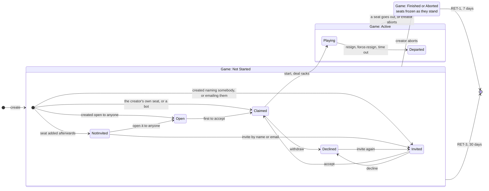
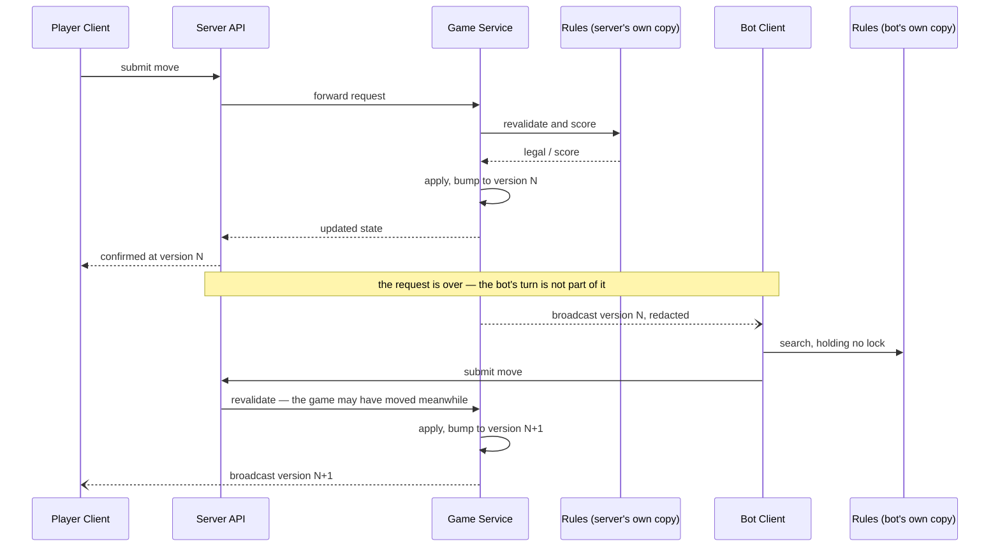
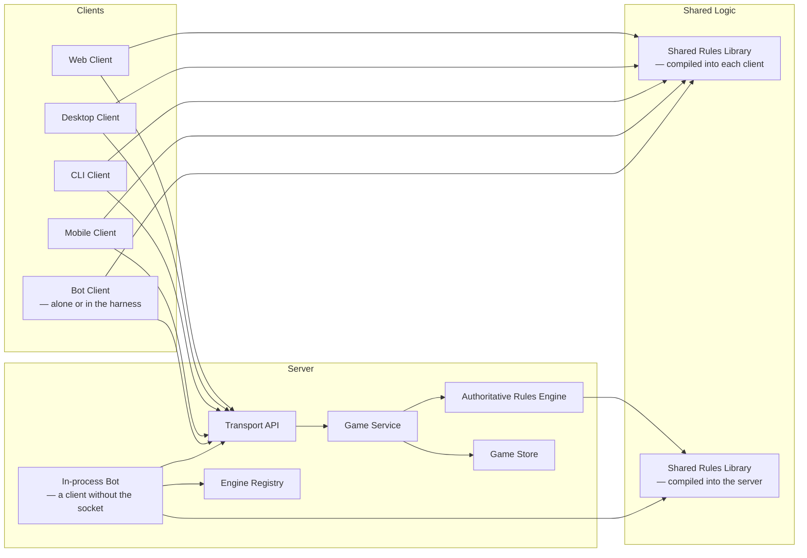

# One Game Model

Design note for issues #9, #10, #26, #71 and #75, and the undo work in #73
that depends on them. **Not yet implemented** — this records the shape agreed
before code, per docs/3.3's rule for a `major-function` change.

One goal, from which everything here follows:

> **Engine code cannot tell whether it is running in the server or in a
> client.**

Two things have to be true for that. The engine must be handed the same
objects wherever it runs, and it must be driven the same way. Neither is true
today, and the reasons turn out to be the same reasons a client sometimes
never hears that a game changed.

## What is wrong now

**The version does not move for everything a client can see.** `version` lives
on `GameSession` and is the only freshness signal a client has —
`should_apply_update` takes an incoming state only when its version is higher.
A seat's invitation status is rendered as part of the game but stored in
`game_invitations`, so writing a row changes what every tab should show and
moves nothing any tab can detect. Sending and declining an invitation both did
exactly that, and only a full page reload noticed.

**Seat state is derived from history.** `attach_invitation_status` folds a
seat's state out of the most recent invitation row on every read. The seat
holds nothing, which is why changing it touches no version.

**The wire and the domain disagree.** `ParticipantDto` carries
`invitation_status` and `ParticipantState` has no field for it, so
`DTO → domain → DTO` loses it. A client cannot build an object that sees what
the server sees, however carefully the conversion is written.

**Only the server can read the wire.** `board_from_dto`, `tile_from_dto` and
`move_candidate_from_dto` live in `server-game`, so any other client either
does without them or writes a second implementation.

**Bots are not clients.** `run_engine_turns` loops up to
`MAX_ENGINE_TURNS_PER_TRIGGER` inside whichever request triggered it, holding
the global games write lock across each engine search. An all-engine game
plays to completion inside one `/start`.

## One version, moved in one place

Every change to a game goes through a single handler taking an enum:

```rust
pub enum GameMessage {
    Place { seat: u8, candidate: MoveCandidate },
    Pass { seat: u8 },
    Exchange { seat: u8, tiles: Vec<Tile> },
    Resign { seat: u8 },
    ForceResign { seat: u8 },
    TimeOut { seat: u8 },
    Abort,
    AdminForceEnd,
    SeatAdded { .. },
    SeatRemoved { seat: u8 },
    SeatInvited { seat: u8, .. },
    InvitationAccepted { seat: u8, .. },
    InvitationDeclined { seat: u8 },
    SeatWithdrawn { seat: u8 },
    KeepRequested,
}
```

The handler applies the change, advances the version, records the event and
broadcasts — in that order, in one place. Nothing else writes to a game.

That is the whole of the fix for the freshness problem. There is no obligation
to remember, because there is nowhere else to write. The current stopgap,
`announce_invitation_change`, is a convention with nothing enforcing it, and
conventions of that kind have already been forgotten twice.

**The version is a counter, not a description.** A game can return to a state
it already held — a seat invited, declined, and invited again — so anything
derived from state repeats and a client comparing with `>` silently ignores
the update. A timestamp is the same counter with worse properties. This also
constrains undo: undo cannot set the version back, it produces a *new, higher*
version whose content is an earlier state.

**Locking is per game.** `AppState.games` becomes
`HashMap<String, Arc<RwLock<GameSession>>>`, so the map lock guards insertion
and removal and each game has its own. One game's work stops blocking every
other game, which is what makes an engine search off the request path
affordable.

**Ordering does not need more than that**, and the reason is not that
out-of-turn messages commute. It is that there is no order to preserve.

An in-turn move cannot be made until the previous one has been applied and
broadcast, because that is how a client learns it is its turn — so in-turn
moves arrive in an order the game itself created. Everything else is
independent action by separate clients, and which reaches the server first is
luck. **Any order the handler sees is a valid one**, because no other order
was ever the true one.

That is a weaker claim than commutativity and an easier one to keep: the
server owes nobody a reconstruction of what "really" happened first, since
nothing did.

The one place a real order exists is a single client sending two messages back
to back — a move, then resigning out of turn. Those were genuinely ordered by
the person, and two requests in flight together can be processed either way
round.

It costs little. Applied as sent, the move lands and then the seat goes.
Reversed, the seat goes first and the move is refused, because taking a turn
requires it to be your turn and that seat no longer has one. Either way the
player resigns and is ranked identically — a resigner's place depends on when
they left, not on what they scored. What differs is the board: one order plays
the tiles, the other returns them to the bag, and the other players draw from
a different bag as a result.

**Closed by the client waiting, and the server makes waiting worth doing.**
Every message is answered with the resulting state and its version, so a
client knows the change landed rather than merely that it was accepted. A
client that waits for that before sending its next message never has two in
flight, and the window above does not exist for it.

The same version then earns a second keep. The client sees each change twice —
once in the response to its own message, once in the broadcast that goes to
everybody — and the second is discarded as already held, because it carries a
version no higher than the one just applied. Without that the client would
apply its own move twice, or need to recognise its own echo some other way.

**Every update goes to every client.** Filtering by who a change affects would
be fragile and buys nothing — no change to a game is invisible to everybody,
and the cost of not filtering is a refetch nobody needed. Per-viewer concerns
stay where they are: redaction decides what each connection may see, and
hiding a game is a flag on a seat.

## Seat state belongs to the seat

A seat's invitation state moves onto the seat. `game_invitations` remains the
record of who was asked and when — accept and decline are addressed by
invitation id, and email links carry it — but the seat carries where it has
got to.

That single change removes the reason the version does not move: altering a
seat is altering the game.

**The whole state is composite.** The game has four states of its own — not
started, active, finished, aborted — and every seat has its own lifecycle,
running independently. A roster can hold a claimed seat, one asked and
waiting, one asked and refused, and one never asked, all at once. Nothing may
assume a game is in a single "invitation phase".

```rust
pub struct Seat {
    pub number: u8,
    pub name: String,          // a label until claimed, the player's name after
    pub state: SeatState,
}

pub enum SeatState {
    NotInvited,
    Open,                                                       // anyone signed in may claim it
    Invited  { invitee: Invitee, invitation: InvitationId },
    Declined { player: PlayerId },                              // declining needs a sign-in
    Claimed  { player: PlayerId },                              // taken, awaiting start
    Playing  { player: PlayerId, rack: SeatRack, score: i32 },  // dealt in
    Departed { player: PlayerId, score: i32, how: Departure },
}

pub enum Invitee {
    Player(PlayerId),   // asked by display name
    Email(String),      // emailed join link — no account need exist yet
}

pub enum Departure { Resigned, ForceResigned, TimedOut }

pub enum SeatRack {
    Visible(Rack),   // the viewer's own seat
    Hidden(u8),      // everyone else's: how many tiles, not which
}
```

**The state carries the data that only exists in that state**, so iterating
the roster yields the details and not merely a label. Three rules stop being
things to remember and become things the type will not let you write:

- `Departed` has no rack, because TIME-3 returns the tiles to the bag.
- `Claimed` has neither rack nor score, because the deal has not happened.
- `NotInvited` has no player.
- `Invited` has no `PlayerId`, because an emailed seat may be waiting for
  somebody who has not registered yet.

**An invitation names who may claim the seat, and that differs three ways.**
`SeatClaim` in the API already says so — `Creator`, `Named`, `Open`, `Emailed`
— and it is right where it is: it records *how a seat was set up*, which is a
separate question from where the seat has got to. What the state has to carry
is the consequence, because who may accept is a rule and not a label:

- **Named** — that player, and nobody else.
- **Emailed** — whoever holds the link, who need not have an account. This is
  why `Invited` cannot key on `PlayerId`.
- **Open** — any signed-in player, first to accept. It gets a state of its own
  rather than an `Invitee::Anyone`, because an open seat cannot be *declined*:
  nobody was asked. Keeping it separate means `Declined` is reachable only
  from `Invited`, which is true, instead of representable from both.

**An emailed invitation never becomes a named one.** The recipient does have
to register before they can accept, but registering is not accepting — they
may sign up and leave the seat alone for a week, and until they use the link
there is nothing to say which account is theirs. The **link is the credential,
not the address**: whoever holds it may accept, under whatever address they
registered with. Converting the invitation on registration would silently
narrow who may accept, and would lock out the intended person the moment they
signed up under a different address than the one that was written down.

What happens instead is that accepting moves the seat to `Claimed { player }`,
which carries the `PlayerId` because that is what a claimed seat *is*. The
`Invitee` only has to answer "who may take this seat", and once somebody has,
the question is over.

That removes a piece of the current schema rather than reshaping it. Accepting
today runs

```sql
invited_player_id = coalesce(invited_player_id, ?claimant)
```

backfilling the row, because one row has to serve as both *who we asked* and
*who took it*. Those are different states here, holding different data, so
there is nothing to backfill.

**And `Declined` carries a plain `PlayerId`, not an `Invitee`.** Declining
requires signing in, so whoever declined is always a known account — including
the person who followed an emailed link, registered, and then thought better
of it. An invitation nobody ever answers is not `Declined`; it stays
`Invited` until the game is swept.

This matters for DEL-2, which blocks deleting an account that a game still
refers to. `Declined { player }` refers to one, and so does every state after
it. `Invited { Email }` refers to no account at all, which is correct: there
is nothing to protect, and the link keeps working whether or not anybody has
registered.

Seat number and name stay on the struct rather than repeating through six
variants: they are true of every seat, and duplicating them would mean six
places to keep in step and a `match` to read either one.

**Whose turn it is stays an integer on the game**, not a flag on the seat.
Marking the seat would mean every seat changing on every turn, all of them
having to agree, and no fact recorded that `current_seat` does not already
hold. "Is it mine" is a comparison.

A game exposes an iterator over its seats, and the questions callers actually
ask are answered from it:

```rust
game.seats()                                   // Iterator<Item = &Seat>
game.any_seat_is(NotInvited)                   // → offer Invite
game.count_of(Declined)
game.can_start()                               // every seat Claimed
```

**Bots are users.** A bot has an account like anyone else, and a seat it holds
is `Claimed` then `Playing` — so `SeatKind::Engine`, `engine_id` on the seat,
and any separate "engine is ready" state all go. What engine a bot runs is a
fact about that user, not about the seat, and `can_start` stops special-casing
them.

One account per engine, so a rating stays what it is now: today the rated
subject is the `engine_id`, and "Greedy 1" and "Greedy 2" are seat labels
sharing one rating row. Keeping one account per engine preserves that meaning
exactly, and makes a bot-versus-bot game one account holding two seats — the
same shape as a person doing it, per GAME-3, rather than a case of its own.
`player_ratings.subject_kind` then has one kind and can go.

Without that, every caller writes `kind == Human && player_id.is_none()` and
remembers that engines are exempt.

### The two lifecycles together

Seat states are not free of the game's. Each one belongs inside a particular
game state, which is why they are drawn nested rather than side by side.



Two simplifications, both deliberate. **Finished and Aborted share a box**
because they do not differ in seat terms — either way the seats stop where
they are, and this diagram is about seats. Where they differ is rating, which
is below. And **removing a seat before the start is not drawn**: the seat
ceases to exist rather than reaching a state.

Aborting gives up every seat, so an aborted game's seats all end `Departed`;
a game also finishes when only one seat is left `Playing`.

Three things are worth reading off it.

**One arrow crosses the boundary.** `can_start` requires every seat `Claimed`,
so at the moment the game starts there is nothing else for a seat to be — no
half-invited roster to carry across. Starting deals the racks, which is the
same event as `Claimed → Playing`, and that is why the two are one arrow and
not two facts that have to agree.

**The invitation states exist only before the start**, and `Playing` and
`Departed` only after it. A seat cannot be invited into a game in progress:
adding a player mid-game is not a small extension of this model but a
different one, and the diagram is where that shows up.

**Finished and Aborted freeze the seats** rather than giving them states of
their own. Which seats are `Playing` and which are `Departed` when the game
ends is exactly what RATE-2 and RATE-3 turn on — who played to the end, and
who left early — so the final seat states are the game's result, not
bookkeeping to be cleared away.

### Do the arrows match the messages?

No, and it is worth being precise about how they fail to, because two of the
four mismatches are the reason this note exists.

**One command, several arrows.** Creating a game sets up every seat at once,
and each may land in a different state depending on its `SeatClaim`. Starting
moves every `Claimed` seat to `Playing`. Aborting departs every seat. A
command is not an arrow; it is a set of them.

**Several commands, one arrow.** Resigning through `/actions`, being
force-resigned through its own route, and timing out through no command at all
are one arrow, `Playing → Departed`. They differ only in `how`, which is
exactly why `Departure` is a field rather than three states.

**Commands with no arrow at all.** Placing, passing, exchanging, reordering
seats, chatting. These change the game — the board, the racks, the scores —
without moving any seat between states. **This is the class of change that was
invisible to clients**, because change was tied to writing a seat or
invitation row. It is the defect the whole note is about, and the diagram is
where it becomes obvious: most of what happens in a game is not on it.

**Arrows with no command.** Timing out and being swept away are the clock, not
a caller. Any design built on "state changes because somebody asked" gets
these wrong — which is why the sweeps have to bump the version and broadcast
through the same path a request does, rather than quietly writing a row.

So the alignment worth having is not arrow-to-message. It is one level up, and
it is the only invariant that covers all four cases:

> Everything that changes a game — command, sweep or clock — bumps the one
> version and publishes the result.

**One arrow does align exactly, and it is the one to watch.** `Invited →
Claimed` is a single command changing a single seat, and it is the case that
has been wrong in production twice: the seat changed, the game's version did
not, and nobody heard.

**State is derived from what is there, never from the history.** The log
exists for undo and audit; behaviour reads the current state. This is the rule
that keeps the seat enum honest: a seat's state is a field, not a fold over
rows.

It also disposes of a habit worth naming, because two documents currently
encode it. Both this note's predecessor in 2.4 and the user-deletion test plan
classify an unstarted game into one of four roster situations, ordered so that
exactly one applies. That was a convenience for arguing about retention and
for making a test partition clean. It is not a description of the system, and
nothing should be written against it.

## DTOs are invisible

The requirement is an identity:

```text
state → DTO → state'        state' == state
```

Not "the conversion is careful" — an equality, testable as a property, over
`GameState`, `Rack`, `Tile`, `MoveCandidate` and the seat and game state
described above. It fails today for anything the client cannot rebuild, which
is how the gap went unnoticed: the server converts one way, the client
reconstructs what it can and does without the rest, and nothing compares the
two ends.

**Redaction has to be expressible in the model, not applied by blanking.** A
client does not receive the whole game: other players' racks and chat it may
not read are removed. So the identity holds over *what the recipient is
entitled to see*, and the objects have to be able to say "not visible" —
distinctly from "empty".

They cannot today. `redact_game_state` replaces a rack it is hiding with
`counts: Vec::new(), blanks: 0`, which is an empty rack. A client cannot tell a
hidden rack from a seat that has run out of tiles, and neither can an engine
reading the same object.

Two variants are enough, because how many tiles a seat holds is public:

```rust
pub enum SeatRack {
    Visible(Rack),   // your own seat, or the server's own view
    Hidden(u8),      // somebody else's — the count, which is public
}
```

An engine still gets what it needs: the board, its own rack, the rules. What it
must not get is a confident wrong answer about somebody else's.

**The count is UI work, not just a data fix.** How many tiles each opponent
holds is public information in this game and players use it — it is how you
know the bag is empty, who is about to go out, and whether an endgame is worth
blocking. The board currently cannot show it because the server does not send
it. Once it does, the seat list has somewhere to put it, and the change is
worth listing as its own piece of work rather than assumed to fall out of the
type: a number nobody displays is the same as no number.

**Access is a set of seats, not a tier.** `ViewerAccess` is currently
`Rejected | Creator | Participant { seat_number }` — one seat, found with
`.find(...)`. A player holding two seats therefore sees one of their own racks
and has the other hidden from them, which is a live defect and the reason this
has to be modelled rather than patched.

GAME-3 says a player may hold more than one seat, so what a viewer may see is
the union of what their seats may see, plus whether they created the game.
Creator stops being a rank below participant: somebody can be the creator and
hold two seats at once.

Three units, easily blurred and worth keeping apart. A **seat** plays: it
holds tiles, takes turns, is invited. An **account** is entitled: what may be
seen is a function of which seats it holds. A **connection** is addressed: it
is where a message is delivered. An account may have several connections and
they all see the same thing — a client is always an account, never a seat.

**One message per recipient, carrying every seat they hold.** Not one message
per seat: a player with two seats would otherwise receive the same board
twice. The message names which seat is on turn, so "your turn" is unambiguous
without being addressed seat by seat.

**What a viewer may see depends on who they are, not on whose turn it is.**
Showing only the on-turn seat's rack would make redaction depend on game
progress — the same state redacting differently as the turn moves — and would
protect nothing, since the holder sees each rack on its own turn and can
simply remember it. Entitlement is a function of identity; which rack to *show*
is the client's choice, and showing the seat about to play is the sensible
default.

In practice a person who wants to play twice registers two accounts and runs
two clients, which keeps the seats genuinely independent. The multi-seat path
exists chiefly because a bot account holds every seat its engine plays, and
humans inherit it rather than being expected to use it.

Somebody who does hold two seats gets view-switching without it being built:
each client chooses which seat to show, so two windows on one account can show
one seat each.

**The conversion lives in an interface layer.** Not in `api`, which depends on
`serde` alone and should not acquire the rules engine for everyone who wants a
wire shape; and not by collapsing wire and domain into one crate. A layer that
depends on both presents the same internal objects on each side, and the DTOs
are the bridge it hides.

The client environment is then an extension of the server environment rather
than a translation of it. Our client already runs part of the rules engine to
validate and score a move before sending it; this makes that the normal case
rather than the exception, with the same objects reaching the same code.

**Third-party clients are not served by this and should not be.** They convert
the wire format into whatever objects suit them, as any HTTP client would. The
interface layer is for clients that share our Rust types — which is a smaller
claim than "the DTOs are a public model", and a more honest one.

## The engine is a client

An engine seat is told it is its turn and returns a move when ready. It is not
driven by a loop inside somebody else's request.

- The request that triggers a bot's turn returns as soon as the human's move
  is applied. `MAX_ENGINE_TURNS_PER_TRIGGER` stops being needed: it bounds a
  loop that no longer exists, and a bot that never answers is already handled
  by the move time limit, exactly as a silent human is.
- The search runs without holding anything. The engine takes the per-game lock
  only to submit its chosen move.
- **The submitted move is re-validated on arrival**, because the game may have
  moved while the engine was thinking — aborted, or its seat retired. A human
  gets that check today; a bot searching off the lock needs the same one. That
  is what makes it a client rather than a special case: it proposes a move and
  may be told no.

Notification goes through the same broadcast every other client uses, so an
in-process engine and an external one differ only by whether a socket sits in
the middle. That is what makes the external harness a plug-in rather than a
second way to play — and stops the two drifting, which is the real cost of
leaving the loop in place.

## What this makes possible

**Undo.** With one sequence covering every change, the history is keyed and
undo becomes "return the game to the state it held at version N", published as
a new higher version. The events already exist in substance; what they lack is
a key that orders *every* change rather than only the ones that write a row.
Undo is not in this change, but this change is what it waits for.

**A benchmark and a load generator over the real path**, once an engine can
run as an external client, and the option of running bots off the server
entirely — which is the largest CPU cost the server currently carries.

## Migration

The schema and the shape of `snapshot_json` both change. **Existing games are
deleted rather than migrated.** Users, ratings and rating history are kept:
they belong to the player rather than the game, and they are what makes
deleting games acceptable at all.

Before the migration runs, check that nobody else is mid-game:

```bash
./scripts/admin.sh games list --status active
```

It shows every game still in play with its seats and their players. Waiting
games matter less — nobody is mid-move — but they are visible the same way.

This is a **breaking wire change**, so the api major version moves: an old
client cannot read the new shapes, and should be told to update rather than
left to fail.

### So that this is the last deletion

`snapshot_json` gains a **schema version**: a small integer naming the shape
of the blob, written by whatever wrote it and read before anything tries to
interpret it.

It is deliberately not the `version` already in there. That one counts state
changes within a game and answers "is this snapshot newer than the one I am
showing". This one identifies the *shape*, changes only when we change it, and
answers "can this reader understand this blob at all".

Without it, a reader meeting an old blob has no way to know that is what
happened — it deserializes into something plausible and wrong, or fails with
an error about a missing field that says nothing about the real cause. With
it, a future change can branch on the number and convert, so the games survive
the change instead of being thrown away.

Which is the point: this deletion is licensed because nobody else is mid-game
today, and that will not be true forever. Adding the field costs a line now
and is impossible to add retrospectively — an unversioned blob stays
unversioned, and version 1 can only be declared while we are already
rewriting every row.

The habit exists in a weaker form already: 4.4 records `#[serde(default)]` on
fields added since, which recovers a single missing field but cannot express
a change of shape, and gives a reader no way to tell an old blob from a new
one with a field omitted.

## Open questions

**What does withdrawing from an open seat do?** Withdrawing from a seat you
accepted by name sends it to `Declined` — that person was asked and is now
out. A seat that was *open* was never offered to anybody in particular, so
`Declined` is wrong there: it should go back to `Open` and be claimable by the
next person. Today `withdraw_from_seat` marks the invitation rejected either
way, quietly closing a seat the creator meant to leave open.

The difficulty is a consequence of the model being right elsewhere. Once
accepted, a seat is about a `player_id` — the email, the link and the openness
have done their job and drop out. **`Claimed { player }` therefore forgets how
the seat was filled**, which is correct for everything except undoing it.

The answer is to keep the invitation id on the claimed seat:

```rust
Claimed { player: PlayerId, invitation: InvitationId },
```

The invitation record survives by design as the record of who was asked, and
it already says whether the seat was open, named or emailed. Withdrawal reads
it and returns the seat to `Open` or to `Declined` accordingly.

That is one field rather than a second copy of the seat's history, and it does
not reintroduce deriving state from the log — the invitation is a row that is
looked up, not a sequence that is folded. **Proposed rather than decided**: it
changes the enum, so it should be settled before the code.

**The log is for undo, and undo is parked.** Current state stays
authoritative; behaviour never reads the log. When it arrives it holds the
same serialised messages that go over the wire, so there is one serialisation
rather than a second format to keep in step.

**`move_number` becomes `game_version`.** It began as a turn count and has
already become a version moved by any change — a resignation, an abort and a
timeout each take one, and none is a move. There is one counter, and records
carry the version they happened at. Tracking the turn as well is likely useful
for undo, and waits with it.

**State fields and message fields are different things**, which resolves the
ratings. `rating_before` and `rating_after` describe what *this game did* to a
seat's rating, and are populated only once it is settled: they are facts about
an event, so they belong on the message, not in the state and not in the
identity. `current_rating` is neither — it is the player's standing now, read
from another table and joined in for display. That is a projection, and a game
object should not carry it at all.

**The harness runs the bots — there is no proxy.** An earlier draft of this
note put a "bot proxy" between the server and the bots. That was a mistake in
its own terms: if the DTOs are invisible and the environment is the same
wherever an engine runs, then nothing mediates, and naming a layer implies one
this design specifically removes. The harness is a process that runs one or
more bot clients, each a client in its own right.

Running several in one process is an operational convenience — one thing to
start, one place for logs — and not a tier in the architecture. A bot run
singly from somebody's laptop is the same bot.

It answers the reloaded-game question, though: a game whose bot is on turn is
picked up by the harness rather than by whoever happens to touch the game
next, which is what covers it today by accident.

It learns of a turn the way any client does — from the message carrying the
previous move, or the game starting. Polling is for starting up: a game left
waiting for a bot while the harness was down is picked up on the first sweep,
and not otherwise. Polling as the normal path would make bots slower than they
are today, since they currently move inside the triggering request.

**A bot plays as a bot account, wherever the engine runs.** The harness
authenticates as the bot, not as the person running it — so a bot's moves move
a bot's rating, and nothing has to declare after the fact which moves were
whose. A server-run bot's seat carries the same kind of account id; the server
writes it without authenticating, because it is the server.

That keeps where the engine runs out of the data model entirely, which is the
note's whole purpose. A bot playing from a client and a bot playing in the
server are the same game.

**A client authenticates as a person before it can assume a bot.** Everything
but `/health`, registering and logging in requires a session, and a bot
session is taken on top of a human one. Rating follows the bot; accountability
follows the person, so a bot behaving badly has an owner to disable.

It is worth being plain that this is revocation and not prevention:
registration is open, so anybody can create a throwaway account and a bot
beneath it. What it buys is a name against every bot session and something to
switch off — which is the point, because that is how bad behaviour is dealt
with. Shutting out an account is its own piece of work and this feeds it: a
bot has an owner, and the owner is who you stop.

Rate limiting is a separate concern and answers a different question. It
protects the service from load, not from anybody in particular, and there is
none in place today.

**Anybody may register a bot** and run it through the harness or their own
client. A bot account is an ordinary account with an owner and an engine, so
"my own bot with its own rating" needs no new concept — and the owner is who
you revoke.

Open: a session lasts ten days at most and ends after forty-eight hours unused
(ACC-1), so a long-running harness logs in again as routine, or bot accounts
are exempt. Worth deciding rather than discovering when the bots go quiet.

## Documents this changes

Each of these is edited on this branch, in the commit that makes it true, so
no commit describes a system that does not exist. The two diagrams below are
the exception the change-note convention allows: they are the agreed design
before there is code, and they move into 1.2 as it lands.

### 1.2 — the move sequence

Today's diagram has the engine's turn happening *inside* the human's request,
which is the arrangement this change exists to undo. The bot's move is no
longer part of anybody else's request:



The confirmation to `P` matters as much as the broadcast: a client that has
submitted a move waits for its own answer before submitting another, which is
what makes concurrent submissions from one client a non-question.

### 1.2 — the component diagram

`Engine Proxy` goes. An engine reaches the game through the API like anything
else, whether it is in the harness, on somebody's laptop, or in the server
process skipping the socket:



The registry stays, resolving which engine an account runs, but it is reached
from the in-process bot rather than sitting between the game and the engines.

### The reference documents

| Document | What changes |
| --- | --- |
| [4.2 Database Schema](../4.2-database-schema.md) | seat state columns; `game_invitations` reduced to the record of who was asked; `player_ratings.subject_kind` removed; `game_moves` |
| [4.3 API Schema](../4.3-api-schema.md) | the seat and rack DTOs, `ViewerAccess`, the api major version |
| [4.4 snapshot_json](../4.4-snapshot-json-schema.md) | the schema version field, seat shape, the event log |
| [4.5 Data Dictionary](../4.5-data-dictionary.md) | every game field that moves between snapshot, DB and DTO |

Each carries a freshness stamp, so each needs re-verifying against the code
rather than editing from this note — the note says what was agreed, and the
stamp claims what was checked.

Two design documents describe the current arrangement and will contradict this
one until they are revised: [2.4 Persistence](../2.4-persistence.md) on how
game state is written, and
[2.7 Authentication and Invitations](../2.7-authentication-and-invitations.md)
on invitations as their own lifecycle.

And [1.0 Rules](../1.0-rules.md) gains what this settles: bots hold accounts,
a client authenticates as a person before assuming a bot, and opponents' tile
counts are public. Undo's rules wait for the undo work itself.

## What does not change

The rules engine, the dictionaries, the scoring, the rating algorithm, and how
a move is validated. This note is about who holds the state, who is told when
it changes, and how a turn reaches the thing that takes it.

## How we will know

- **A round-trip property test** over every type crossing the wire. Written
  first: it states what "invisible" means precisely enough to know when the
  move is finished.
- **A mixed-roster test** — a game holding every seat state at once, which
  nothing exercised before this note was drafted.
- **An engine run both ways** against the same position, in the server and as
  a client, producing the same move.
- **The existing lifecycle suite**, which already walks a game from creation
  through resignation, abort, timeout and retention, and should pass unchanged
  except where it asserts a behaviour this note deliberately alters.
